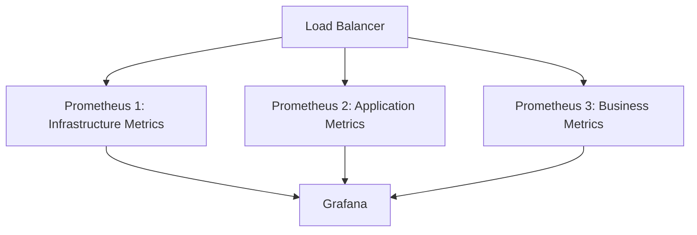

# Prometheus Performance Tuning

## Introduction

As your infrastructure grows, your monitoring needs grow with it. Prometheus is an excellent tool for monitoring and alerting, but without proper tuning, it can become a bottleneck in your observability stack. This guide focuses on performance tuning techniques to ensure Prometheus scales efficiently with your environment.

Performance tuning is essential when:
- You're monitoring thousands of targets
- You're collecting millions of time series
- Your queries are becoming slow
- Prometheus is consuming too much memory or CPU
- Your storage requirements are growing rapidly

## Understanding Prometheus Resource Usage

Before optimizing, it's important to understand how Prometheus uses resources:

1. **Memory Usage**: Prometheus keeps recent data points in memory for faster query performance.
2. **CPU Usage**: CPU is consumed during scraping, rule evaluation, and query processing.
3. **Disk I/O**: Prometheus continuously writes data to disk and reads historical data during queries.
4. **Storage**: The TSDB (Time Series Database) can grow significantly with high cardinality data.

## Key Performance Metrics to Monitor

First, let's learn how to monitor Prometheus itself:

```yaml
- job_name: 'prometheus'
  static_configs:
  - targets: ['localhost:9090']
```

Important metrics to track:

```promql
# Memory usage
process_resident_memory_bytes{job="prometheus"}

# CPU usage
rate(process_cpu_seconds_total{job="prometheus"}[5m])

# Ingestion rate
rate(prometheus_tsdb_head_samples_appended_total[5m])

# Time series count
prometheus_tsdb_head_series
```

## Storage Optimization

### Retention Settings

Control how long Prometheus stores data:

```yaml
# In prometheus.yml
storage:
  tsdb:
    retention.time: 15d    # How long to retain data
    retention.size: 100GB  # Max storage size (Prometheus 2.x)
```

### Compression

Prometheus 2.x applies compression by default, but you can adjust it:

```yaml
storage:
  tsdb:
    out_of_order_time_window: 30m  # Allows slight reordering of samples
    wal_compression: true          # Compress the write-ahead log
```

## Query Optimization

### Recording Rules

Pre-compute expensive queries to improve dashboard performance:

```yaml
# In prometheus.yml
rule_files:
  - "recording_rules.yml"
```

```yaml
# In recording_rules.yml
groups:
  - name: cpu_usage_rules
    interval: 1m
    rules:
      - record: job:node_cpu_utilization:avg_rate5m
        expr: avg by (job) (rate(node_cpu_seconds_total{mode!="idle"}[5m]))
```

This creates a new metric `job:node_cpu_utilization:avg_rate5m` that can be queried directly without recalculating.

### Query Efficiency Tips

1. Use appropriate time ranges in `rate()` functions
2. Limit label cardinality with `without` or `by`
3. Use `topk` to limit result sizes

```promql
# Inefficient
rate(http_requests_total[5m])

# More efficient (limits to top 10 services by request rate)
topk(10, sum by (service) (rate(http_requests_total[5m])))
```

## Cardinality Management

High cardinality (too many unique time series) is the #1 performance issue in Prometheus.

### Reducing Cardinality

1. **Limit labels**: Only use labels that provide meaningful dimensions for queries.
2. **Avoid high-cardinality labels**: Don't use user IDs, email addresses, or unique request IDs as labels.

```yaml
# Bad practice (high cardinality)
http_requests_total{user_id="12345", request_id="abc-123-def-456"}

# Good practice
http_requests_total{service="auth", endpoint="/login", status="200"}
```

3. **Use metric relabeling**: Filter unwanted labels before storage.

```yaml
scrape_configs:
  - job_name: 'webapp'
    metric_relabel_configs:
      # Drop high-cardinality metrics
      - source_labels: [__name__]
        regex: 'test_metric_with_high_cardinality'
        action: drop
      # Remove a label
      - regex: 'session_id'
        action: labeldrop
```

## Memory Tuning

### Memory Management

Prometheus memory usage is primarily influenced by:
1. Number of active time series
2. Scrape interval and sample rate
3. Query complexity

Memory settings:

```shell
# Start Prometheus with memory flags
prometheus --storage.tsdb.retention.time=15d \
  --storage.tsdb.min-block-duration=2h \
  --storage.tsdb.max-block-duration=2h \
  --web.enable-lifecycle
```

For production, configure at least:

```shell
# Depending on your workload, adjust these values
GOMAXPROCS=16
prometheus --storage.tsdb.retention.time=15d
```

## Scaling Techniques

When a single Prometheus instance isn't enough:

### Functional Sharding

Split monitoring responsibilities across multiple Prometheus instances:



### Hierarchical Federation

Set up Prometheus in a hierarchical pattern:

```yaml
# In the global Prometheus instance
scrape_configs:
  - job_name: 'prometheus-federate'
    scrape_interval: 15s
    honor_labels: true
    metrics_path: '/federate'
    params:
      'match[]':
        - '{job="prometheus"}'
        - 'job:node_cpu_utilization:avg_rate5m'
    static_configs:
      - targets:
        - 'prometheus-1:9090'
        - 'prometheus-2:9090'
```

## Rate Limiting and Sample Dropping

Protect Prometheus from overload:

```yaml
global:
  scrape_interval: 15s
  evaluation_interval: 15s
  scrape_timeout: 10s
  # Limit scrape frequency for targets
  # Limit the size of scraped targets
  sample_limit: 1000
```

## Networking Optimization

Improve scrape performance:

```yaml
scrape_configs:
  - job_name: 'node'
    scrape_interval: 15s
    scrape_timeout: 10s  # Lower than interval
    metrics_path: '/metrics'
    scheme: 'https'
    tls_config:
      insecure_skip_verify: false
    static_configs:
      - targets: ['node-exporter:9100']
```

## Practical Example: Tuning a Production Prometheus

Let's work through a complete example of tuning Prometheus for a medium-sized environment with about 500 nodes:

1. Hardware allocation:
   - 16 CPU cores
   - 64GB RAM
   - SSD storage with at least 500GB free space

2. Prometheus configuration file:

```yaml
global:
  scrape_interval: 30s  # Increased from 15s default
  evaluation_interval: 30s
  scrape_timeout: 10s
  external_labels:
    region: 'us-east'
    environment: 'production'

storage:
  tsdb:
    path: "/prometheus"
    retention.time: 30d
    retention.size: 400GB
    wal_compression: true
    min-block-duration: 2h
    max-block-duration: 2h

scrape_configs:
  - job_name: 'prometheus'
    static_configs:
      - targets: ['localhost:9090']

  - job_name: 'node_exporters'
    scrape_interval: 1m  # Less frequent scraping for less-critical metrics
    metric_relabel_configs:
      # Drop noisy metrics that we don't use
      - source_labels: [__name__]
        regex: 'node_cpu_guest_seconds_total'
        action: drop
      # Keep only necessary labels
      - regex: '(id|path|device)'
        action: labeldrop
    file_sd_configs:
      - files:
        - '/etc/prometheus/targets/*.json'
        refresh_interval: 5m

  # High-priority application monitoring
  - job_name: 'critical-apps'
    scrape_interval: 15s  # More frequent for important metrics
    static_configs:
      - targets: 
        - 'app1:9100'
        - 'app2:9100'
```

3. Recording rules for common queries:

```yaml
groups:
  - name: cpu_and_memory_rules
    interval: 1m
    rules:
      - record: instance:node_cpu_utilization:avg_rate5m
        expr: 100 - (avg by (instance) (rate(node_cpu_seconds_total{mode="idle"}[5m])) * 100)
      
      - record: instance:node_memory_utilization:percent
        expr: 100 * (1 - ((node_memory_MemFree_bytes + node_memory_Cached_bytes + node_memory_Buffers_bytes) / node_memory_MemTotal_bytes))
  
  - name: service_rules
    interval: 30s
    rules:
      - record: service:request_latency:p99
        expr: histogram_quantile(0.99, sum(rate(http_request_duration_seconds_bucket[5m])) by (le, service))
```

4. Startup script with performance flags:

```bash
#!/bin/bash
GOMAXPROCS=16 prometheus \
  --config.file=/etc/prometheus/prometheus.yml \
  --storage.tsdb.path=/prometheus \
  --storage.tsdb.retention.time=30d \
  --storage.tsdb.retention.size=400GB \
  --storage.tsdb.wal-compression=true \
  --web.enable-lifecycle \
  --web.enable-admin-api \
  --query.max-samples=50000000 \
  --query.timeout=2m
```

## Performance Testing

After implementing optimizations, use these techniques to verify improvements:

1. **Load Testing**: Use tools like [prom-load-generator](https://github.com/prometheus-community/prom-loadtest) to simulate high loads.

2. **Query Performance**: Test the performance of your most common queries:

```shell
time curl -s 'http://localhost:9090/api/v1/query?query=up'
time curl -s 'http://localhost:9090/api/v1/query?query=sum(rate(http_requests_total[5m])) by (job)'
```

3. **Monitor Prometheus itself**:

```promql
# Check memory usage over time
rate(go_memstats_alloc_bytes_total{job="prometheus"}[5m])

# Check CPU utilization
rate(process_cpu_seconds_total{job="prometheus"}[5m])

# Disk I/O operations
rate(process_io_storage_read_bytes_total{job="prometheus"}[5m])
rate(process_io_storage_written_bytes_total{job="prometheus"}[5m])
```

## Common Performance Issues and Solutions

| Issue | Symptoms | Solution |
|-------|----------|----------|
| High cardinality | Memory spikes, slow queries | Use metric relabeling, reduce label sets |
| Slow queries | Dashboard timeouts | Create recording rules, optimize query patterns |
| Excessive disk I/O | High disk utilization | Tune retention, use faster storage |
| CPU bottlenecks | High CPU usage | Increase scrape intervals, use function sharding |
| Out of memory | Process restarts | Increase memory allocation, reduce cardinality |

## Summary

Prometheus performance tuning is a balancing act between monitoring coverage and resource usage. Key points to remember:

- Start by monitoring Prometheus itself
- Control cardinality through careful labeling and metric relabeling
- Use recording rules to optimize frequent queries
- Scale horizontally when a single instance isn't enough
- Tune storage retention based on your actual needs
- Regularly review and optimize your configuration

By following these best practices, you can maintain a high-performance Prometheus deployment even as your infrastructure grows.

## Additional Resources

- [Prometheus Documentation on Storage](https://prometheus.io/docs/prometheus/latest/storage/)
- [Understanding and Solving Prometheus Scaling Problems](https://www.robustperception.io/scaling-and-federating-prometheus/)
- [PromCon Talks on Performance](https://promcon.io/talks/)

## Exercises

1. Analyze your current Prometheus metrics to identify the highest cardinality metrics.
2. Create recording rules for your 5 most frequently used queries.
3. Set up a second Prometheus instance with federation to distribute monitoring load.
4. Implement metric relabeling to drop unnecessary high-cardinality metrics.
5. Set up alerts for Prometheus's own resource usage to detect performance issues early.