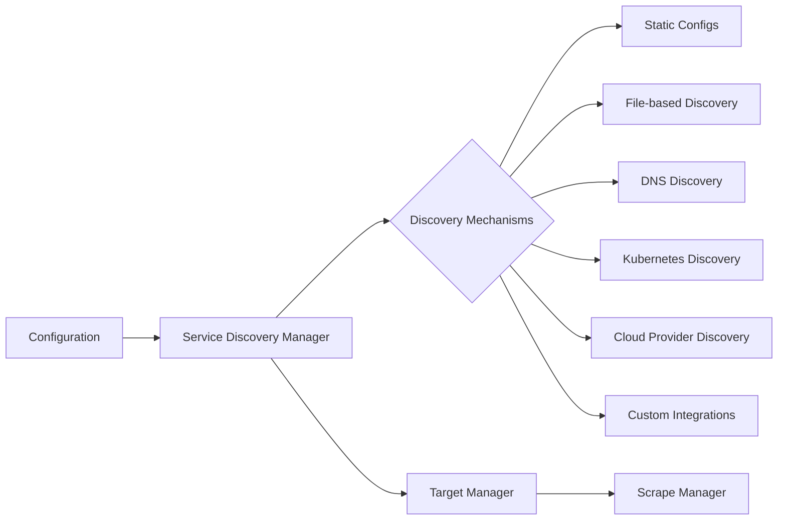
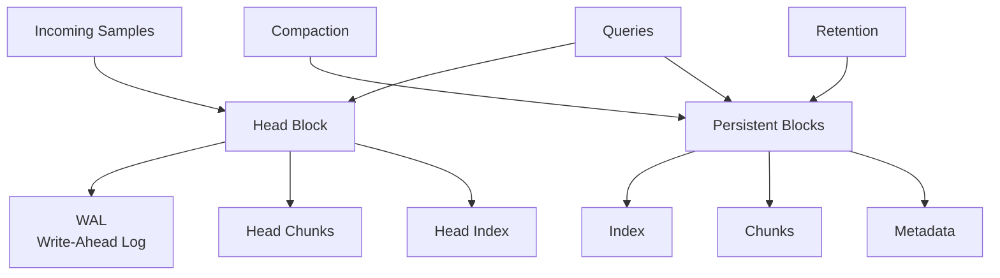
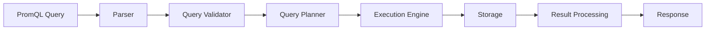
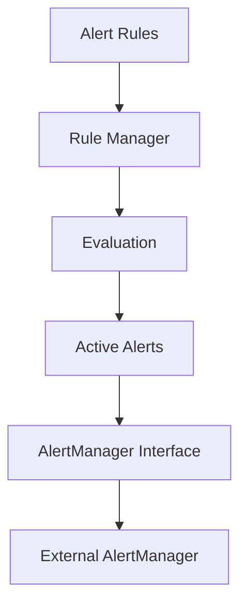

# Prometheus Internals

## Introduction

When you're using Prometheus for monitoring, understanding its internal architecture can help you optimize your setup, troubleshoot issues more effectively, and make better decisions about scaling your monitoring infrastructure. In this guide, we'll take a deep dive into how Prometheus works under the hood, exploring its core components, data flow, and storage mechanisms.

Prometheus is not just a single binary but a sophisticated system with several interacting components that handle everything from scraping metrics to storing time series data and serving queries. By understanding these internals, you'll gain insights into how Prometheus achieves its reliability, efficiency, and scalability.

## Core Components

Prometheus consists of several key internal components that work together to provide its monitoring capabilities:

1. **Service Discovery** - Finds targets to monitor
2. **Scraping Engine** - Collects metrics from targets 
3. **Storage Subsystem** - Manages the time-series database (TSDB)
4. **PromQL Engine** - Processes queries against stored data
5. **Alert Manager Interface** - Handles alert evaluation and routing
6. **HTTP Server** - Serves the UI and API endpoints

Let's explore each of these components in detail:

## Service Discovery

Before Prometheus can collect metrics, it needs to know what to monitor. This is where service discovery comes in.

### How Service Discovery Works



Prometheus supports multiple service discovery mechanisms:

```yaml
scrape_configs:
  - job_name: 'node'
    static_configs:
      - targets: ['localhost:9100']
  
  - job_name: 'kubernetes-pods'
    kubernetes_sd_configs:
      - role: pod
```

The service discovery process:

1. Prometheus reads configuration from the config file
2. The service discovery manager initializes the configured discovery mechanisms
3. Discovery mechanisms provide target information (endpoints to scrape)
4. Targets are processed and relabeled according to configured rules
5. The final list of targets is passed to the scrape manager

## Scraping Engine

The scraping engine is responsible for collecting metrics from the discovered targets at configured intervals.

### Scrape Process

For each target, Prometheus:

1. Initiates an HTTP request to the `/metrics` endpoint
2. Receives a text-based response with metrics
3. Parses the response in the Prometheus exposition format
4. Applies relabeling rules (if configured)
5. Adds internal labels like `job` and `instance`
6. Sends the processed samples to the storage subsystem

Here's a code example showing a basic scraper implementation:

```go
func (s *scraper) scrape(ctx context.Context) {
    start := time.Now()
    
    // Make the HTTP request to the target
    req, err := http.NewRequest("GET", s.url.String(), nil)
    if err != nil {
        // Handle error
        return
    }
    
    resp, err := s.client.Do(req.WithContext(ctx))
    if err != nil {
        // Handle error
        return
    }
    defer resp.Body.Close()
    
    // Parse the response
    var (
        metricFamilies map[string]*dto.MetricFamily
        err           error
    )
    
    if resp.Header.Get("Content-Type") == "application/vnd.google.protobuf" {
        metricFamilies, err = parseProtobufResponse(resp.Body)
    } else {
        metricFamilies, err = parseTextResponse(resp.Body)
    }
    
    // Process and store metrics
    // ...
    
    duration := time.Since(start)
    s.metrics.duration.Observe(duration.Seconds())
}
```

## Storage Subsystem (TSDB)

The storage subsystem is the heart of Prometheus, managing how time-series data is written, stored, and accessed.

### TSDB Architecture



The storage layer consists of:

1. **Write-Ahead Log (WAL)** - Ensures durability of recent data
2. **Head Block** - In-memory storage for recent samples
3. **Persistent Blocks** - Immutable blocks of older data on disk
4. **Indexes** - For efficient query execution
5. **Compaction** - Process that optimizes storage

### Data Flow Through Storage

When metrics are collected:

1. New samples are written to the write-ahead log (WAL) for durability
2. Samples are stored in the in-memory head block
3. Periodically (every 2 hours by default), the head block is compacted into a persistent block
4. Persistent blocks are further compacted to optimize storage
5. Old blocks are deleted according to retention settings

Here's an example of the directory structure of a Prometheus TSDB:

```
data/
├── 01BKGV7JC0RY8A6MACW02A2PJD/
│   ├── chunks/
│   │   ├── 000001
│   │   └── 000002
│   ├── index
│   └── meta.json
├── 01BKGTZQ1SYQJTR4PB43C8PD98/
│   ├── chunks/
│   │   ├── 000001
│   │   └── 000002
│   ├── index
│   └── meta.json
├── chunks_head/
├── wal/
│   ├── 000000001
│   └── 000000002
└── queries.active
```

Each block contains:
- Chunks: The actual metric data
- Index: For fast lookups
- Meta.json: Block metadata including time range

## PromQL Engine

The query engine processes PromQL expressions and retrieves data from the storage subsystem.

### Query Execution Flow



When a PromQL query is executed:

1. The query string is parsed into an abstract syntax tree (AST)
2. The query is validated for correctness
3. A query plan is created to optimize execution
4. The execution engine retrieves data from storage components
5. Results are processed according to query operators
6. The formatted results are returned to the client

Let's look at a simple PromQL query and how it's processed:

```
rate(http_requests_total{job="api-server"}[5m])
```

1. This query is parsed into an AST with a `rate()` function containing a matrix selector
2. The engine identifies that it needs 5 minutes of data for the `http_requests_total` metric with the label `job="api-server"`
3. It retrieves the raw samples from the storage
4. It calculates the per-second rate of increase for each time series
5. The results are returned as instant vector

## Alert Manager Interface

Prometheus evaluates alert rules internally but delegates alert management to the AlertManager.

### Alert Evaluation Process



For each alert rule:

1. The rule manager schedules evaluations at regular intervals
2. PromQL expressions in the rule are executed against the database
3. Results are compared against the defined thresholds
4. If conditions are met, an alert is fired
5. Alert data is sent to the configured AlertManager

Example of an alert rule configuration:

```yaml
groups:
  - name: example
    rules:
    - alert: HighRequestLatency
      expr: job:request_latency_seconds:mean5m{job="myjob"} > 0.5
      for: 10m
      labels:
        severity: page
      annotations:
        summary: High request latency
```

## HTTP Server

The HTTP server provides several interfaces for interacting with Prometheus:

1. **Web UI** - For visualizing metrics and alerts
2. **HTTP API** - For programmatic access
3. **Metrics endpoint** - Prometheus itself exposes metrics about its operation

### Key API Endpoints

- `/api/v1/query` - Execute instant queries
- `/api/v1/query_range` - Execute range queries
- `/api/v1/series` - Find time series matching a label set
- `/api/v1/labels` - Get all label names
- `/api/v1/targets` - Get target information
- `/metrics` - Prometheus' own metrics

Example request to query API:

```bash
curl 'http://localhost:9090/api/v1/query?query=up'
```

Response:

```json
{
  "status": "success",
  "data": {
    "resultType": "vector",
    "result": [
      {
        "metric": {
          "__name__": "up",
          "job": "prometheus",
          "instance": "localhost:9090"
        },
        "value": [1607533730.610, "1"]
      }
    ]
  }
}
```

## Performance Considerations

Understanding Prometheus internals helps optimize performance:

### Memory Usage

Memory is primarily consumed by:
- The head block for recent samples
- Query execution
- Series cardinality (unique time series)

To control memory usage:
- Limit series cardinality by avoiding high-cardinality labels
- Adjust `--storage.tsdb.max-block-duration` and `--storage.tsdb.min-block-duration`
- Consider federation or sharding for large deployments

### Disk Usage

Disk usage is affected by:
- Retention period
- Scrape interval
- Number of metrics
- Cardinality of metrics

To optimize disk usage:
- Set appropriate retention with `--storage.tsdb.retention.time`
- Use recording rules to pre-aggregate data you query frequently
- Consider external storage solutions for long-term data

### Scaling Prometheus

Knowledge of internals helps with scaling strategies:
- **Vertical scaling**: Larger machines for single instances
- **Functional sharding**: Different Prometheus servers for different services
- **Hierarchical federation**: Higher-level Prometheus instances collect from lower-level ones
- **Remote storage**: Offloading data to external systems

## Real-world Example: Troubleshooting High Cardinality

Let's walk through a common issue: a Prometheus instance experiencing memory pressure due to high cardinality.

### Problem Identification

Symptoms:
- Increasing memory usage
- Slow query performance
- Potential OOM (Out of Memory) crashes

### Analysis

1. Check the number of time series:

```bash
curl http://prometheus:9090/api/v1/status/tsdb | jq '.data.numSeries'
```

2. Identify high-cardinality metrics:

```
topk(10, count by (__name__)({__name__=~".+"}))
```

3. For a specific metric, find high-cardinality labels:

```
topk(10, count by (some_suspected_label) (your_metric_name))
```

### Solution

After identifying that an application was adding unique request IDs as labels:

1. Relabel to drop the high-cardinality labels:

```yaml
scrape_configs:
  - job_name: 'problem-app'
    static_configs:
      - targets: ['problem-app:8080']
    metric_relabel_configs:
      - source_labels: [request_id]
        action: labeldrop
```

2. Restart Prometheus to apply changes
3. Monitor series count to verify improvement

## Summary

In this guide, we've explored the internal architecture of Prometheus:

- **Service Discovery**: How Prometheus finds targets to monitor
- **Scraping Engine**: How metrics are collected from targets
- **Storage Subsystem**: How time-series data is stored and managed
- **PromQL Engine**: How queries are processed
- **Alert Manager Interface**: How alerts are evaluated
- **HTTP Server**: How the API and UI are exposed

Understanding these internals gives you deeper insight into how Prometheus works, helping you:
- Set up more efficient monitoring
- Troubleshoot performance issues
- Make better decisions about scaling
- Optimize storage and memory usage

## Additional Resources

- [Prometheus Storage documentation](https://prometheus.io/docs/prometheus/latest/storage/)
- [Prometheus Configuration documentation](https://prometheus.io/docs/prometheus/latest/configuration/configuration/)
- [PromQL documentation](https://prometheus.io/docs/prometheus/latest/querying/basics/)
- [Prometheus GitHub repository](https://github.com/prometheus/prometheus)

## Exercises

1. Set up a local Prometheus instance and examine the directory structure of its data folder.
2. Write PromQL queries to investigate the internal metrics of Prometheus (hint: look at metrics starting with `prometheus_`).
3. Experiment with different retention settings and observe the impact on disk usage.
4. Introduce a high-cardinality metric and observe its impact on Prometheus memory usage.
5. Configure Prometheus to use remote write and analyze how this affects its performance.