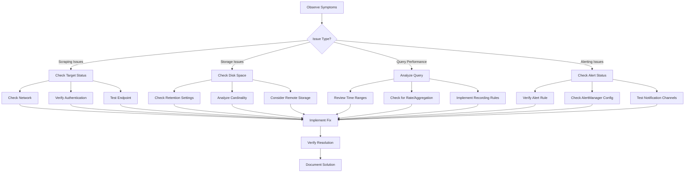

# Common Prometheus Issues

## Introduction

When working with Prometheus as your monitoring solution, you may encounter various challenges that can affect your metrics collection, storage, and querying capabilities. This guide explores the most common issues faced by Prometheus users and provides practical solutions to resolve them efficiently. Whether you're experiencing issues with scraping targets, query performance, or storage limitations, this comprehensive troubleshooting guide will help you maintain a healthy Prometheus environment.

## Issue 1: Target Scraping Failures

One of the most common issues in Prometheus is failing to scrape metrics from targets.

### Symptoms
- Targets showing as "down" in the Prometheus targets page
- Missing metrics for specific services
- Error messages in Prometheus logs related to scraping

### Common Causes and Solutions

#### Network Connectivity Issues

If Prometheus cannot reach your targets due to network problems:

```bash
# Check connectivity from Prometheus server to target
curl -v http://target-host:port/metrics
```

If the curl command fails, check for:
- Firewall rules blocking connections
- Network segmentation issues
- Incorrect target URL configuration

#### Authentication Failures

For targets requiring authentication:

```yaml
scrape_configs:
  - job_name: 'secured-endpoint'
    basic_auth:
      username: 'prometheus'
      password: 'secret_password'
    static_configs:
      - targets: ['localhost:8080']
```

#### TLS Certificate Issues

When connecting to HTTPS endpoints:

```yaml
scrape_configs:
  - job_name: 'https-endpoint'
    scheme: https
    tls_config:
      ca_file: /path/to/ca.crt
      cert_file: /path/to/client.crt
      key_file: /path/to/client.key
      insecure_skip_verify: false
    static_configs:
      - targets: ['secure-host:443']
```

#### Timeouts During Scraping

Adjust timeout settings for slow endpoints:

```yaml
scrape_configs:
  - job_name: 'slow-endpoint'
    scrape_interval: 30s
    scrape_timeout: 15s
    static_configs:
      - targets: ['slow-host:8080']
```

## Issue 2: High Cardinality Problems

High cardinality occurs when a metric has a large number of label combinations, leading to performance issues.

### Symptoms
- Slow query performance
- High memory usage
- Storage size growing rapidly
- "scrape_samples_exceeded" errors

### Analyzing Cardinality

Check the cardinality of your metrics:

```promql
count by (__name__)({__name__=~".+"})
```

For a specific metric:

```promql
count by (__name__) ({__name__="http_requests_total"})
```

### Solutions

#### Reduce Label Usage

Before:
```go
httpRequestsTotal := prometheus.NewCounterVec(
    prometheus.CounterOpts{
        Name: "http_requests_total",
        Help: "Total HTTP requests",
    },
    []string{"method", "path", "status", "user_id", "session_id"}, // Too many labels
)
```

After:
```go
httpRequestsTotal := prometheus.NewCounterVec(
    prometheus.CounterOpts{
        Name: "http_requests_total",
        Help: "Total HTTP requests",
    },
    []string{"method", "status_code"}, // Reduced labels
)
```

#### Use label_replace in Queries Instead

```promql
sum by (job, instance, method) (
  label_replace(http_request_duration_seconds_count, "method", "$1", "path", ".*/api/(.*)/.*")
)
```

#### Configure Metric Relabeling

```yaml
scrape_configs:
  - job_name: 'high-cardinality-service'
    static_configs:
      - targets: ['service:8080']
    metric_relabel_configs:
      - source_labels: [__name__]
        regex: 'http_requests_total'
        action: drop
      - source_labels: [user_id]
        action: labeldrop
```

## Issue 3: Storage and Retention Issues

Managing Prometheus's storage efficiently is crucial for long-term operation.

### Symptoms
- Disk space alerts
- Gaps in historical data
- Slow startup time
- Queries for older data failing

### Managing Storage Space

#### Configure Storage Retention

In prometheus.yml:

```yaml
global:
  scrape_interval: 15s
  evaluation_interval: 15s

storage:
  tsdb:
    path: /data
    retention.time: 15d
    retention.size: 50GB
```

Or using command-line flags:

```bash
prometheus --storage.tsdb.path=/data \
           --storage.tsdb.retention.time=15d \
           --storage.tsdb.retention.size=50GB
```

#### Storage Optimization

When running out of space, you can:

1. Reduce scrape frequency for less critical targets
2. Implement downsampling with recording rules:

```yaml
groups:
  - name: downsampling
    interval: 5m
    rules:
      - record: job:http_requests_total:rate5m
        expr: sum by (job) (rate(http_requests_total[5m]))
```

3. Consider using remote storage for long-term data retention:

```yaml
remote_write:
  - url: "http://remote-storage-server:9201/write"
    
remote_read:
  - url: "http://remote-storage-server:9201/read"
```

## Issue 4: Query Performance Problems

Slow PromQL queries can impact the usability of your dashboards and alerting.

### Symptoms
- Dashboards loading slowly
- Query timeouts
- High CPU usage during queries

### Query Optimization Techniques

#### Avoid Using Large Time Ranges

Instead of:
```promql
rate(http_requests_total[30d])
```

Use:
```promql
rate(http_requests_total[5m])
```

#### Use Subqueries Carefully

Inefficient:
```promql
max_over_time(rate(http_requests_total[5m])[1h:])
```

#### Use Recording Rules for Complex Queries

In prometheus.yml:

```yaml
rule_files:
  - "recording_rules.yml"
```

In recording_rules.yml:

```yaml
groups:
  - name: http_requests
    interval: 1m
    rules:
      - record: job:http_request_errors:rate5m
        expr: sum by (job) (rate(http_request_errors_total[5m]))
```

Then query the pre-computed value:

```promql
job:http_request_errors:rate5m{job="api-server"}
```

## Issue 5: Alert Manager Configuration Problems

Common issues with Prometheus Alert Manager that lead to missed or incorrect alerts.

### Symptoms
- Missing alerts
- Duplicate alerts
- Incorrect alert routing
- Silent alerts

### Common Alert Manager Issues

#### Alert Not Firing

Check if the alert rule is correctly defined:

```yaml
groups:
  - name: example
    rules:
    - alert: HighErrorRate
      expr: job:http_error_rate:5m > 0.5
      for: 10m
      labels:
        severity: critical
      annotations:
        summary: "High error rate detected"
        description: "Error rate is {{ $value }} for {{ $labels.job }}"
```

Verify the alert is in Prometheus's "Alerts" tab and check its status.

#### Alert Manager Not Receiving Alerts

Check Prometheus configuration:

```yaml
alerting:
  alertmanagers:
  - static_configs:
    - targets:
      - alertmanager:9093
```

#### Incorrect Alert Routing

Review your alertmanager.yml configuration:

```yaml
route:
  group_by: ['alertname', 'job']
  group_wait: 30s
  group_interval: 5m
  repeat_interval: 12h
  receiver: 'team-emails'
  routes:
  - match:
      severity: critical
    receiver: 'pager'
    continue: true

receivers:
- name: 'team-emails'
  email_configs:
  - to: 'team@example.org'
- name: 'pager'
  pagerduty_configs:
  - service_key: '<key>'
```

Use the AlertManager API to debug routing issues:

```bash
curl -X POST -H "Content-Type: application/json" -d '{
  "status": "firing",
  "labels": {
    "alertname": "TestAlert",
    "service": "test-service",
    "severity": "critical",
    "instance": "test-instance"
  },
  "annotations": {
    "summary": "Test alert"
  }
}' http://localhost:9093/api/v1/alerts
```

## Issue 6: Federation and Remote Storage Problems

Issues related to scaling Prometheus with federation or remote storage.

### Symptoms
- Missing data in federated Prometheus
- Errors in remote_write or remote_read
- Performance degradation
- Increased network traffic

### Federation Issues

#### Configuration for Federation

On the federated Prometheus:

```yaml
scrape_configs:
  - job_name: 'federate'
    scrape_interval: 15s
    honor_labels: true
    metrics_path: '/federate'
    params:
      'match[]':
        - '{job="prometheus"}'
        - '{__name__=~"job:.*"}'
    static_configs:
      - targets:
        - 'source-prometheus-1:9090'
        - 'source-prometheus-2:9090'
```

Common issues include:
- Firewall blocking federation connections
- Source Prometheus unavailable
- Match parameters not correctly defined

### Remote Storage Issues

In prometheus.yml:

```yaml
remote_write:
  - url: "http://remote-write-endpoint/api/v1/write"
    name: remote_storage
    write_relabel_configs:
      - source_labels: [__name__]
        regex: 'temp.*'
        action: drop
```

Troubleshoot with:

```bash
# Check if remote endpoint is reachable
curl -v http://remote-write-endpoint/api/v1/write

# Check Prometheus logs for remote_write errors
grep "remote_write" /path/to/prometheus/logs
```

## Issue 7: Service Discovery Problems

Issues related to dynamic target discovery.

### Symptoms
- Missing targets
- Stale targets not being removed
- Too many targets being discovered
- Inconsistent labeling of targets

### Common Service Discovery Issues

#### File-based SD Issues

Check your file_sd_configs file format:

```json
[
  {
    "targets": ["host1:9100", "host2:9100"],
    "labels": {
      "env": "production",
      "job": "node"
    }
  }
]
```

#### Kubernetes SD Issues

For Kubernetes service discovery:

```yaml
scrape_configs:
  - job_name: 'kubernetes-pods'
    kubernetes_sd_configs:
      - role: pod
    relabel_configs:
      - source_labels: [__meta_kubernetes_pod_annotation_prometheus_io_scrape]
        action: keep
        regex: true
      - source_labels: [__meta_kubernetes_pod_annotation_prometheus_io_path]
        action: replace
        target_label: __metrics_path__
        regex: (.+)
```

Verify RBAC permissions:

```yaml
apiVersion: rbac.authorization.k8s.io/v1
kind: ClusterRole
metadata:
  name: prometheus
rules:
- apiGroups: [""]
  resources:
  - nodes
  - nodes/proxy
  - services
  - endpoints
  - pods
  verbs: ["get", "list", "watch"]
```

## Debugging Techniques

### Using Prometheus Debug Endpoints

Prometheus exposes several debug endpoints:

- `/debug/pprof`: Runtime profiling data
- `/debug/flags`: Command-line flag information
- `/metrics`: Prometheus's own metrics

```bash
# Check Prometheus's own metrics
curl http://localhost:9090/metrics | grep scrape_duration_seconds
```

### Log Analysis

Check Prometheus logs for errors:

```bash
# For systemd-based systems
journalctl -u prometheus.service -f

# For container deployments
kubectl logs -f prometheus-pod
# or
docker logs -f prometheus-container
```

Look for common error patterns like:
- "error scraping target"
- "failed to evaluate rule"
- "WAL corruption"

### Analyzing Prometheus Configuration

Validate your configuration:

```bash
promtool check config prometheus.yml
```

Test alert rules:

```bash
promtool check rules alerts.yml
```

Test metrics:

```bash
promtool query instant http://localhost:9090 'up'
```

## Advanced Troubleshooting Workflows

### Process for Diagnosing Prometheus Issues

The following diagram illustrates a systematic approach to troubleshooting Prometheus issues:



## Summary

This guide has covered the most common issues encountered when working with Prometheus:

1. **Target Scraping Failures**: Network, authentication, and timeout issues
2. **High Cardinality Problems**: Identifying and mitigating excessive label combinations
3. **Storage and Retention Issues**: Managing disk space and implementing retention policies
4. **Query Performance Problems**: Optimizing PromQL queries and using recording rules
5. **Alert Manager Configuration Problems**: Ensuring alerts are correctly defined and routed
6. **Federation and Remote Storage Problems**: Scaling Prometheus effectively
7. **Service Discovery Problems**: Ensuring dynamic targets are correctly discovered

By systematically addressing these issues using the techniques and solutions provided, you can maintain a reliable and efficient Prometheus monitoring system.

## Additional Resources

- [Official Prometheus Troubleshooting Guide](https://prometheus.io/docs/prometheus/latest/troubleshooting/)
- [Prometheus Best Practices Documentation](https://prometheus.io/docs/practices/instrumentation/)
- [Prometheus Storage Documentation](https://prometheus.io/docs/prometheus/latest/storage/)

## Exercises

1. **Target Discovery Debugging**:
   Set up a Prometheus instance with file-based service discovery, intentionally introduce an error in the configuration, and practice debugging the issue.

2. **Cardinality Analysis**:
   Write a PromQL query to identify the metrics with the highest cardinality in your Prometheus instance and develop a plan to mitigate potential issues.

3. **Alert Rule Testing**:
   Create an alert rule with the following conditions: trigger when any instance has been down for more than 5 minutes, but only during business hours (9 AM to 5 PM). Test the rule using `promtool`.

4. **Storage Optimization**:
   Analyze your current Prometheus storage usage and implement a retention strategy that balances historical data availability with storage constraints.