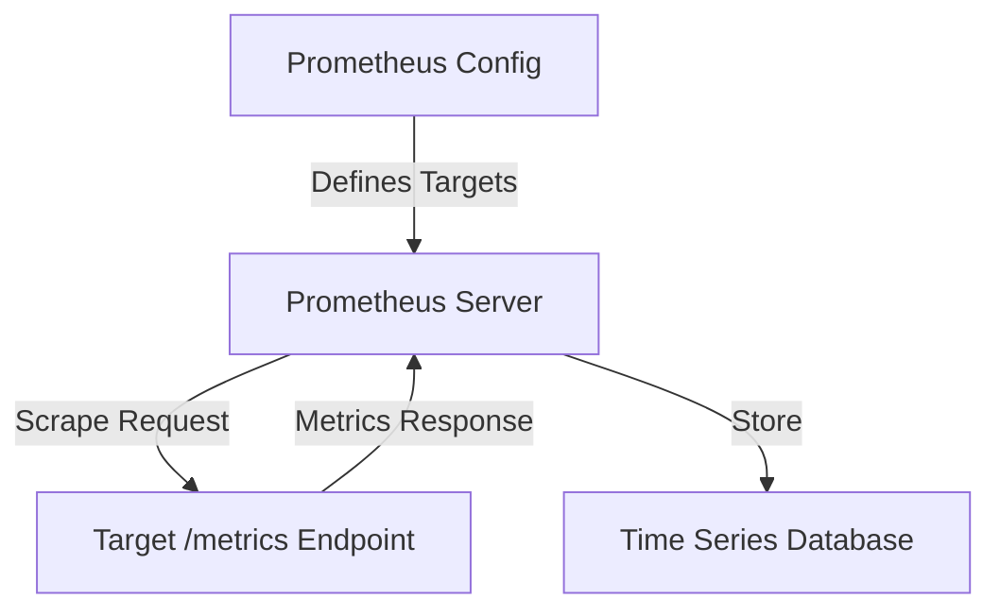

# Metric Collection Issues

## Introduction

When working with Prometheus, one of the most common categories of issues you might encounter relates to metric collection. Prometheus works by scraping metrics from HTTP endpoints exposed by your applications and services. When this process breaks down, your monitoring system becomes unreliable or incomplete. This guide will help you identify, understand, and resolve the most common metric collection issues in Prometheus.

## Understanding the Metric Collection Flow

Before diving into specific issues, let's understand how Prometheus collects metrics:



When this flow breaks down, you need to systematically identify where the problem occurs.

## Common Metric Collection Issues

### 1. Target Down Issues

One of the most basic issues is when Prometheus cannot reach a target at all.

#### Symptoms
- `up` metric for a target shows `0` in Prometheus
- Errors like "connection refused" in Prometheus logs

#### Troubleshooting Steps

1. **Check if the target service is running**:

```bash
# For a service running on a host
systemctl status my-service

# For containerized applications
docker ps | grep my-container
```

2. **Verify network connectivity**:

```bash
# Test basic connectivity
ping target-host

# Test specific endpoint connectivity
curl http://target-host:9090/metrics
```

3. **Check firewall rules**:
   
```bash
# Example of checking firewall status on Linux
sudo iptables -L
```

### 2. Scrape Configuration Issues

Sometimes the target is healthy, but Prometheus is not properly configured to scrape it.

#### Symptoms
- Target doesn't appear in Prometheus targets list
- No errors, but no metrics from certain services

#### Troubleshooting

1. **Verify your `prometheus.yml` configuration**:

```yaml
scrape_configs:
  - job_name: 'my-service'
    metrics_path: '/metrics'
    static_configs:
      - targets: ['localhost:9090']
```

2. **Check for syntax errors with promtool**:

```bash
promtool check config prometheus.yml
```

3. **Verify service discovery is working**:
   - Navigate to Prometheus UI at `/targets`
   - Check if all expected targets are listed

### 3. Metric Format Issues

Sometimes Prometheus can reach the target, but the metrics format is incorrect.

#### Symptoms
- Scrape errors in Prometheus logs
- Incomplete metrics collection

#### Troubleshooting

1. **Check the metrics endpoint directly**:

```bash
curl http://target-host:9090/metrics
```

2. **Look for invalid metric lines**:
   - Missing or duplicate labels
   - Invalid characters in metric names
   - Inconsistent metric types

Example of proper metric format:

```
# HELP http_requests_total Total number of HTTP requests
# TYPE http_requests_total counter
http_requests_total{method="post",code="200"} 1027
http_requests_total{method="post",code="400"} 3
```

3. **Validate metrics with promtool**:

```bash
curl -s http://target-host:9090/metrics | promtool check metrics
```

### 4. Timeout Issues

Scrape operations may time out if the target takes too long to respond.

#### Symptoms
- `scrape_timeout_seconds` errors in logs
- Inconsistent metric collection

#### Troubleshooting

1. **Increase the scrape timeout in your configuration**:

```yaml
scrape_configs:
  - job_name: 'slow-service'
    scrape_timeout: 30s  # Default is 10s
    static_configs:
      - targets: ['slow-service:9090']
```

2. **Optimize the exporter or service**:
   - Consider implementing caching in custom exporters
   - Reduce the amount of work done during scrape requests

### 5. Authentication and Authorization Issues

Many production environments require authentication for accessing metrics.

#### Symptoms
- 401 (Unauthorized) or 403 (Forbidden) errors in Prometheus logs
- No metrics from secured endpoints

#### Configuration Example

```yaml
scrape_configs:
  - job_name: 'secured-service'
    scheme: https
    basic_auth:
      username: 'prometheus'
      password: 'secret-password'
    static_configs:
      - targets: ['secured-service:9090']
```

For bearer token authentication:

```yaml
scrape_configs:
  - job_name: 'k8s-service'
    kubernetes_sd_configs:
      - role: pod
    bearer_token_file: /path/to/token
```

### 6. Resource Constraint Issues

Sometimes Prometheus or the targets may experience resource constraints.

#### Symptoms
- Sporadic scrape failures
- Incomplete data collection

#### Troubleshooting

1. **Check resource usage**:

```bash
# On Prometheus server
top
df -h  # Check disk space
```

2. **Adjust Prometheus resource allocation**:

```yaml
# Example Docker Compose configuration
services:
  prometheus:
    image: prom/prometheus
    deploy:
      resources:
        limits:
          cpus: '2'
          memory: 4G
```

3. **Configure storage retention**:

```bash
# Prometheus startup flags
prometheus --storage.tsdb.retention.time=15d
```

## Real-World Example: Troubleshooting a Microservice Architecture

Let's walk through a real-world scenario where multiple metric collection issues occur in a microservice architecture.

### Scenario

You have a system with:
- 3 frontend services
- 5 backend APIs
- 2 database services
- All being monitored by Prometheus

Suddenly, you notice gaps in your dashboards and alerts firing inappropriately.

### Systematic Troubleshooting Approach

1. **Check the Prometheus UI targets page**:
   
   Here you might see:
   ```
   - frontend-1: UP
   - frontend-2: DOWN (connection refused)
   - frontend-3: UP
   - backend-api-1: UP
   - backend-api-2: UNKNOWN (not found in targets list)
   - backend-api-3: UP
   - backend-api-4: UP (but with scrape_timeout errors)
   - backend-api-5: UP
   - db-service-1: UP
   - db-service-2: UP (but with authentication errors)
   ```

2. **Resolve each issue methodically**:

   - For `frontend-2`: Check if the service is running, restart if needed
   - For `backend-api-2`: Check Prometheus configuration to ensure it's included
   - For `backend-api-4`: Increase scrape timeout or optimize the exporter
   - For `db-service-2`: Update authentication credentials in Prometheus config

3. **Verify fixes**:

   After implementing fixes, manually perform test scrapes:
   
   ```bash
   curl http://frontend-2:9090/metrics
   curl http://backend-api-2:9090/metrics
   curl http://backend-api-4:9090/metrics
   curl -u prometheus:new-password http://db-service-2:9090/metrics
   ```

## Preventing Metric Collection Issues

### Implement Monitoring for Your Monitoring

Use Prometheus to monitor itself:

```yaml
scrape_configs:
  - job_name: 'prometheus'
    static_configs:
      - targets: ['localhost:9090']
```

Set up alerts for meta-monitoring:

```yaml
groups:
- name: prometheus_self_monitoring
  rules:
  - alert: PrometheusTargetMissing
    expr: up == 0
    for: 5m
    labels:
      severity: critical
    annotations:
      summary: "Target {{ $labels.instance }} is down"
      description: "{{ $labels.job }} instance {{ $labels.instance }} has been down for more than 5 minutes."
```

### Regular Configuration Testing

Before deploying changes to your Prometheus configuration:

```bash
# Validate configuration syntax
promtool check config prometheus.yml

# Test rule files
promtool check rules rules.yml

# Trial run a configuration
prometheus --config.file=prometheus.yml --enable-feature=agent --storage.agent.path=data-agent/ --config.test
```

## Summary

Metric collection issues in Prometheus typically fall into a few categories:

1. Connectivity problems (target down, network issues)
2. Configuration errors (incorrect scrape configs, service discovery problems)
3. Metric format problems (malformed metrics, inconsistent labels)
4. Performance issues (timeouts, resource constraints)
5. Authentication problems (invalid credentials, missing tokens)

By following a systematic debugging approach and implementing preventive measures, you can maintain a reliable monitoring system that provides accurate and complete metrics.

## Additional Resources

- [Prometheus Configuration Documentation](https://prometheus.io/docs/prometheus/latest/configuration/configuration/)
- [Prometheus Troubleshooting Guide](https://prometheus.io/docs/prometheus/latest/troubleshooting/)
- [Service Discovery in Prometheus](https://prometheus.io/docs/prometheus/latest/configuration/configuration/#scrape_config)

## Exercises

1. Intentionally introduce different metric collection issues in a test environment and practice troubleshooting them.
2. Set up a multi-service environment with Prometheus and implement a comprehensive meta-monitoring system.
3. Create a troubleshooting checklist for your specific environment to quickly identify and resolve metric collection issues.