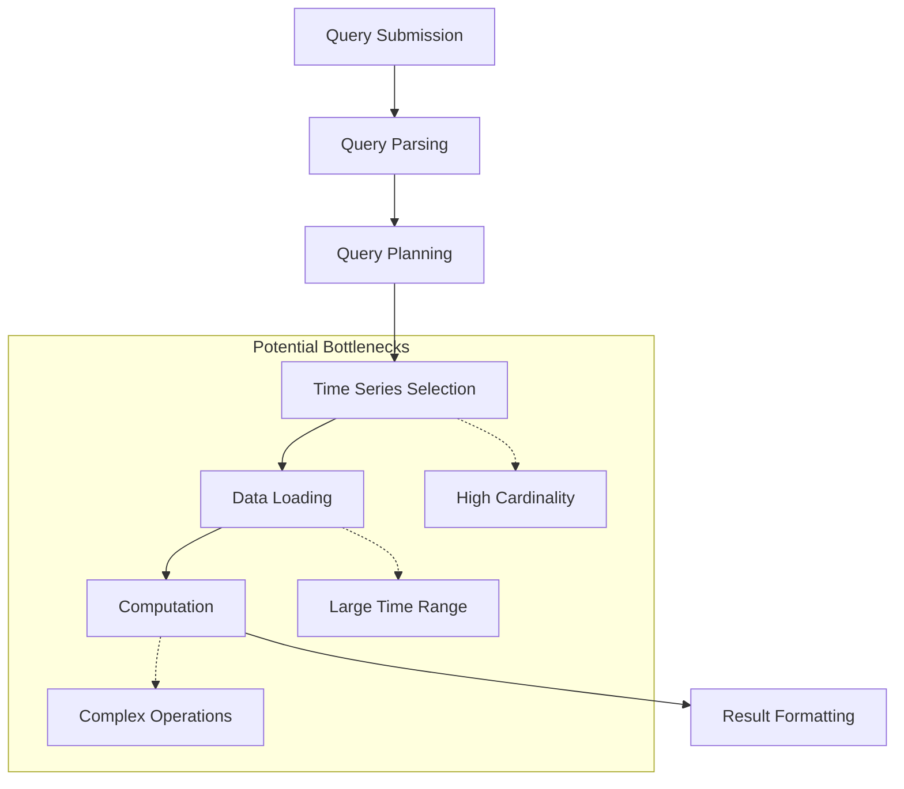

# Query Performance Analysis

## Introduction

Query performance analysis is a critical skill when working with Prometheus, especially as your monitoring system scales. In this guide, we'll explore how to identify, analyze, and optimize slow-performing queries in Prometheus. Understanding these concepts will help you build efficient dashboards and alerts while reducing the load on your Prometheus server.

When your monitoring system grows with more metrics, longer retention periods, and complex queries, performance bottlenecks can emerge. This guide will equip you with the knowledge to diagnose and address these issues.

## Understanding Query Performance Metrics

Prometheus provides several key metrics to help you understand query performance:

### Key Performance Indicators

- **Query execution time**: How long your query takes to complete
- **Memory usage**: How much memory is allocated during query execution
- **Number of samples processed**: How many data points Prometheus needs to analyze
- **Series cardinality**: The number of unique time series involved in the query

Let's look at how to access these metrics.

## Examining Query Performance Stats

Prometheus exposes internal metrics about query performance that you can monitor.

### Using the Query Stats API

The API endpoint `/api/v1/stats/query` provides detailed information about recent queries.

```bash
curl http://localhost:9090/api/v1/stats/query
```

Example output:

```json
{
  "status": "success",
  "data": {
    "numSamples": 42007,
    "queryTime": 0.03282,
    "totalQueryableSamples": 84001524,
    "timings": {
      "evalTotalTime": 0.032778034,
      "resultSortTime": 4.2126e-06,
      "queryPreparationTime": 9.1389e-05,
      "innerEvalTime": 0.032686895,
      "execQueueTime": 4.101e-05
    }
  }
}
```

### Using the /metrics Endpoint

Prometheus exposes internal metrics that you can query to analyze performance:

```promql
# Query execution time
prometheus_engine_query_duration_seconds{quantile="0.9"}

# Total queries being executed
prometheus_engine_queries
```

## Common Performance Issues and Solutions

### 1. High Cardinality Problems

High cardinality occurs when a metric has many unique label combinations, leading to thousands or millions of time series.

#### Example of a high cardinality issue:

```promql
http_requests_total{path="/api/v1/endpoint"}
```

If `path` has unique values for every user ID or session, you might have thousands of time series for this single metric.

#### Solutions:

```promql
# Instead of tracking every unique path, use a label with fewer values
http_requests_total{path_group="api"}

# Or aggregate to reduce cardinality
sum(http_requests_total) by (status_code, method)
```

### 2. Inefficient Regular Expressions

Regular expressions can be computationally expensive, especially with large datasets.

#### Example of an inefficient regex query:

```promql
{job=~".*api.*"}
```

#### Optimized alternative:

```promql
{job=~"api|backend-api|user-api"}
```

### 3. Range Queries with Long Time Windows

Queries that analyze long time ranges can be very expensive.

#### Example of a resource-intensive range query:

```promql
rate(http_requests_total[30d])
```

#### Optimized alternatives:

```promql
# Use a shorter time window
rate(http_requests_total[5m])

# Use recording rules for common patterns
job:http_requests:rate5m
```

## Query Optimization Techniques

### 1. Using Recording Rules

Recording rules pre-compute expensive expressions and save results as new time series, significantly improving dashboard performance.

In your `prometheus.yml` configuration:

```yaml
rule_files:
  - "recording_rules.yml"
```

And in `recording_rules.yml`:

```yaml
groups:
  - name: http_requests
    interval: 5m
    rules:
      - record: job:http_requests_total:rate5m
        expr: sum(rate(http_requests_total[5m])) by (job)
```

Then use the pre-computed metric in your dashboards:

```promql
job:http_requests_total:rate5m{job="api"}
```

### 2. Limiting Time Range and Resolution

Adjust the time range and step parameters to match your visualization needs:

```promql
# For a dashboard showing the last hour, use a 5m resolution
rate(http_requests_total[5m])[1h:5m]
```

### 3. Avoiding Suboptimal Functions

Some functions require more resources than others:

```promql
# More expensive
quantile_over_time(0.95, http_request_duration_seconds[1h])

# Less expensive alternative
histogram_quantile(0.95, sum(rate(http_request_duration_bucket[1h])) by (le))
```

## Visualizing Query Performance

You can create a dashboard to monitor your Prometheus query performance using these queries:

```promql
# Query execution duration
prometheus_engine_query_duration_seconds{quantile="0.9"}

# Number of concurrent queries
prometheus_engine_queries

# Memory usage
process_resident_memory_bytes{job="prometheus"}
```

Here's a simple diagram showing the query execution flow and potential bottlenecks:



## Practical Example: Optimizing a Dashboard

Let's walk through a complete example of optimizing a dashboard with slow queries.

### Original Dashboard Queries

```promql
# Original query - slow and resource-intensive
sum(rate(http_requests_total[1h])) by (service, endpoint, status_code)
```

### Step 1: Identify the Problem

Using the Query Stats API, we see this query processes millions of samples and takes over 10 seconds.

### Step 2: Analyze and Optimize

We can see that the high cardinality comes from having too many dimensions and a long lookback window.

### Step 3: Implement Solutions

1. Create a recording rule:

```yaml
groups:
  - name: http
    interval: 5m
    rules:
      - record: service:http_requests:rate5m
        expr: sum(rate(http_requests_total[5m])) by (service, status_code)
```

2. Use the recording rule in your dashboard:

```promql
# Optimized query
service:http_requests:rate5m
```

3. Results:
   - Query time reduced from 10s to 0.1s
   - Memory usage reduced by 80%
   - Dashboard load time improved significantly

## Performance Testing Tool - promtool

Prometheus ships with a tool called `promtool` that can help evaluate query performance.

```bash
promtool query stats http://localhost:9090 'rate(http_requests_total[5m])'
```

Example output:

```
Query: rate(http_requests_total[5m])
Instant query statistics:
Samples: 1427
Wall time: 0.029s
```

## Summary

In this guide, we've covered the fundamentals of query performance analysis in Prometheus:

- Understanding query performance metrics and how to access them
- Identifying common performance issues like high cardinality and inefficient expressions
- Implementing optimization techniques using recording rules and query refinement
- Tools and methods for ongoing performance monitoring

Mastering query performance analysis is essential for maintaining a healthy and responsive monitoring system as your infrastructure grows. By applying these techniques, you can ensure your Prometheus queries remain efficient and your dashboards load quickly.

## Additional Resources

Here are some exercises to further your understanding:

1. Set up a dashboard to monitor your Prometheus server's query performance
2. Identify the top 5 slowest queries in your environment
3. Create recording rules for common dashboard queries
4. Analyze a slow query and optimize it to improve performance

## Further Reading

- Prometheus documentation on [Query Optimization](https://prometheus.io/docs/prometheus/latest/querying/optimization/)
- Prometheus documentation on [Recording Rules](https://prometheus.io/docs/prometheus/latest/configuration/recording_rules/)
- Prometheus documentation on [Storage](https://prometheus.io/docs/prometheus/latest/storage/)