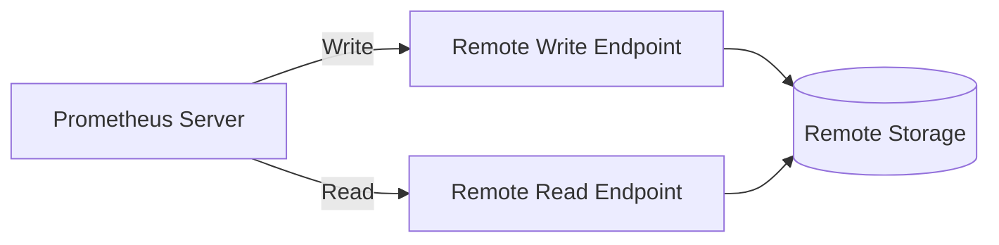

# Remote Storage Troubleshooting

## Introduction

Prometheus excels at collecting and storing metrics, but its local storage is designed to be operational rather than long-term archival. For extended data retention, higher availability, or to build a more scalable monitoring infrastructure, Prometheus offers remote storage integration. However, these integrations can sometimes encounter issues that require troubleshooting.

This guide will help you understand, diagnose, and resolve common problems with Prometheus remote storage configurations, helping ensure your metrics are properly stored and accessible for the long term.

## Understanding Remote Storage in Prometheus

Before diving into troubleshooting, let's understand how remote storage works in Prometheus.

Prometheus can be configured to write samples to remote storage systems and read from them using remote read and write endpoints. This allows Prometheus to:

1. Store data long-term in external systems
2. Scale horizontally beyond a single Prometheus server
3. Integrate with existing data infrastructure



## Common Remote Storage Issues and Solutions

### Connection Problems

**Symptoms:**
- Error logs showing connection failures
- Missing data in remote storage
- Error messages like `connection refused` or `timeout`

**Troubleshooting Steps:**

1. Verify network connectivity:

```bash
# Test basic connectivity
curl -v http://remote-storage-endpoint:port/api/v1/write

# Check if the endpoint is reachable from the Prometheus server
telnet remote-storage-endpoint port
```

2. Check firewall settings:
   - Ensure firewall rules allow communication between Prometheus and the remote storage
   - Verify any network policies in container environments like Kubernetes

3. Validate TLS configuration:
   - If using HTTPS, ensure certificates are valid and trusted
   - Check for TLS handshake errors in logs

**Solution Example:**

If your Prometheus server is failing to connect to a remote endpoint, first check the configuration:

```yaml
remote_write:
  - url: "https://remote-write-endpoint/api/v1/write"
    tls_config:
      ca_file: /path/to/ca.crt
      insecure_skip_verify: false
    basic_auth:
      username: "prometheus"
      password: "secret"
```

Verify that:
- The URL is correct
- Certificate paths exist and are readable by Prometheus
- Authentication credentials are valid

### Queue Management Issues

**Symptoms:**
- Logs showing `queue is full, discarding samples`
- Growing queue size metrics
- High memory usage on Prometheus

**Troubleshooting Steps:**

1. Monitor queue metrics:

```
rate(prometheus_remote_storage_samples_pending[5m])
prometheus_remote_storage_queue_highest_sent_timestamp_seconds
prometheus_remote_storage_samples_dropped_total
```

2. Check remote write configuration parameters:

```yaml
remote_write:
  - url: "https://remote-write-endpoint/api/v1/write"
    queue_config:
      capacity: 10000
      max_shards: 200
      max_samples_per_send: 500
      batch_send_deadline: 5s
      min_backoff: 30ms
      max_backoff: 5s
```

**Solution:**

If the queue is consistently full:

1. Increase queue capacity:
   ```yaml
   queue_config:
     capacity: 50000  # Increased from default
   ```

2. Adjust sharding to process more samples in parallel:
   ```yaml
   queue_config:
     max_shards: 300  # Increased based on available CPUs
   ```

3. Balance the batch size and send deadline:
   ```yaml
   queue_config:
     max_samples_per_send: 1000
     batch_send_deadline: 10s
   ```

### Performance and Capacity Issues

**Symptoms:**
- High CPU and memory usage
- Slow query performance
- Increasing backlog of samples

**Troubleshooting with Prometheus Metrics:**

Monitor these metrics to identify bottlenecks:

```
# Remote storage operation latency
rate(prometheus_remote_storage_sent_batch_duration_seconds_sum[5m]) / rate(prometheus_remote_storage_sent_batch_duration_seconds_count[5m])

# Number of samples sent/failed
rate(prometheus_remote_storage_samples_in_total[5m])
rate(prometheus_remote_storage_samples_failed_total[5m])

# Queue length
prometheus_remote_storage_shards
prometheus_remote_storage_samples_pending
```

**Solutions:**

1. Implement request rate limiting:

```yaml
remote_write:
  - url: "https://remote-write-endpoint/api/v1/write"
    remote_timeout: 30s
    queue_config:
      capacity: 100000
    write_relabel_configs:
      # Drop high-cardinality metrics
      - source_labels: [__name__]
        regex: 'test_metric_to_drop.*'
        action: drop
```

2. Use `write_relabel_configs` to reduce data volume:

```yaml
write_relabel_configs:
  # Keep only important metrics for long-term storage
  - source_labels: [__name__]
    regex: 'node_cpu.*|node_memory.*|http_requests_total'
    action: keep
```

### Authentication and Authorization Issues

**Symptoms:**
- HTTP 401 or 403 errors in logs
- Remote storage rejecting writes
- Authentication-related error messages

**Troubleshooting Steps:**

1. Check credentials in Prometheus configuration:

```yaml
remote_write:
  - url: "https://remote-write-endpoint/api/v1/write"
    basic_auth:
      username: "prometheus"
      password_file: /etc/prometheus/remote_storage_password
```

2. Verify token-based authentication:

```yaml
remote_write:
  - url: "https://remote-write-endpoint/api/v1/write"
    bearer_token_file: /path/to/bearer/token
```

3. Test authentication manually:

```bash
# Using basic auth
curl -v -u username:password https://remote-write-endpoint/api/v1/write

# Using bearer token
curl -v -H "Authorization: Bearer $(cat /path/to/token)" https://remote-write-endpoint/api/v1/write
```

**Solution Example:**

If using an OAuth2 token that needs regular refresh:

```yaml
remote_write:
  - url: "https://remote-write-endpoint/api/v1/write"
    oauth2:
      client_id: "prometheus"
      client_secret: "secret"
      token_url: "https://auth-provider/token"
      scopes: ["write:metrics"]
```

### Inconsistent Data or Missing Samples

**Symptoms:**
- Gaps in graphs when querying from remote storage
- Different results when querying local vs. remote data
- Missing recent data

**Troubleshooting Steps:**

1. Check for sample filtering and relabeling:
   - Review `write_relabel_configs` to ensure metrics aren't being dropped

2. Verify time synchronization:
   - Ensure NTP is properly configured on all systems
   - Check timestamp-related metrics

3. Check read preferences:

```yaml
remote_read:
  - url: "https://remote-read-endpoint/api/v1/read"
    read_recent: true  # Controls whether to read recent data from remote storage
```

**Practical Example:**

To diagnose data inconsistency between local and remote storage:

```promql
# Compare metric values from local and remote storage
prometheus_remote_storage_samples_in_total - prometheus_remote_storage_succeeded_samples_total

# Check for failures
rate(prometheus_remote_storage_failed_samples_total[5m])
```

### Debugging with Log Analysis

For many remote storage issues, logs are your best diagnostic tool. Configure verbose logging when troubleshooting:

```yaml
# In prometheus.yml
log_level: debug
```

Key log patterns to look for:

- `level=error ts=... component="remote storage" err="..."`
- `level=warn ts=... component="remote storage" msg="Remote storage..."`

## End-to-End Testing

When troubleshooting complex remote storage setups, create a simple end-to-end test:

1. Configure a simple Prometheus instance with remote storage
2. Generate predictable metrics using a tool like `prometheus-cli`
3. Verify the full path - from collection to remote storage and query

Example testing script:

```bash
#!/bin/bash
# Generate test metrics
echo 'test_metric{label="value"} 123.4' | curl --data-binary @- http://localhost:9091/metrics/job/test

# Wait for scrape and remote_write
sleep 15

# Query local Prometheus
LOCAL_VALUE=$(curl -s 'http://localhost:9090/api/v1/query?query=test_metric' | jq '.data.result[0].value[1]')

# Query remote storage directly (if API compatible)
REMOTE_VALUE=$(curl -s 'http://remote-storage:9090/api/v1/query?query=test_metric' | jq '.data.result[0].value[1]')

echo "Local value: $LOCAL_VALUE"
echo "Remote value: $REMOTE_VALUE"

if [ "$LOCAL_VALUE" = "$REMOTE_VALUE" ]; then
  echo "✅ Values match"
else
  echo "❌ Values don't match"
fi
```

## Best Practices for Remote Storage

1. **Implement Redundancy**: Configure multiple remote storage endpoints for critical metrics
2. **Monitor the Monitoring**: Set up alerting for remote storage issues
3. **Rate Limiting**: Implement client-side rate limiting to avoid overwhelming remote endpoints
4. **Data Reduction**: Use relabeling to reduce data volume sent to remote storage
5. **Regular Testing**: Periodically validate that data can be successfully queried from remote storage

## Summary

Troubleshooting Prometheus remote storage requires understanding how the remote write and read protocols work, monitoring key metrics, and systematically testing connectivity, authentication, and data consistency.

Remember these key points:

- Monitor queue metrics to spot bottlenecks early
- Use relabeling to control what data gets sent to remote storage
- Configure appropriate retry and backoff settings
- Keep authentication credentials secure and regularly updated
- Test the complete path from collection to remote query

By following the structured approach in this guide, you'll be able to identify and resolve most common remote storage issues, ensuring your Prometheus metrics are preserved and accessible for the long term.

## Additional Resources

- [Prometheus Remote Storage Documentation](https://prometheus.io/docs/prometheus/latest/storage/)
- [Remote Write Tuning Guide](https://prometheus.io/docs/practices/remote_write/)
- Common Remote Storage Solutions:
  - Thanos
  - Cortex
  - Victoria Metrics
  - Grafana Mimir
  - Prometheus TSDB

## Practice Exercises

1. Configure Prometheus with a local remote storage endpoint (like VictoriaMetrics) and troubleshoot connection issues
2. Experiment with different queue settings and observe their impact on performance
3. Implement write relabeling to selectively store only specific metrics remotely
4. Set up a multi-remote-write configuration for redundancy and compare behavior during failures
5. Create a dashboard to monitor the health of your remote storage integration