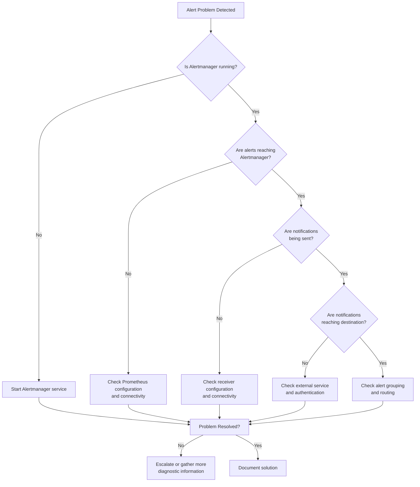

# Alert Manager Problems

## Introduction

Alertmanager is a critical component in the Prometheus ecosystem, responsible for handling alerts sent by client applications such as the Prometheus server. It takes care of deduplicating, grouping, and routing alerts to the correct receiver integration such as email, Slack, or PagerDuty. However, like any complex system, Alertmanager can encounter various problems that affect its functionality.

In this guide, we'll explore common Alertmanager issues, their root causes, and practical solutions to resolve them. Whether you're experiencing notification failures, configuration errors, or performance problems, this troubleshooting guide will help you diagnose and fix these issues efficiently.

## Common Alertmanager Problems

### 1. Configuration Issues

One of the most frequent sources of problems with Alertmanager is misconfiguration.

#### Syntax Errors

```yaml
# Incorrect configuration (missing colon after route)
route
  receiver: 'team-X'
  
# Correct configuration
route:
  receiver: 'team-X'
```

**How to diagnose:**

Run the configuration check command to validate your configuration:

```bash
amtool check-config /path/to/alertmanager.yml
```

If you're running Alertmanager in a container:

```bash
docker run --rm -v /path/to/alertmanager.yml:/etc/alertmanager/alertmanager.yml prom/alertmanager:latest check-config /etc/alertmanager/alertmanager.yml
```

#### Undefined Receivers

A common issue is referencing a receiver in the routing tree that hasn't been defined.

```yaml
# Problematic configuration - references undefined receiver
route:
  receiver: 'team-ops'  # This receiver is not defined below
  
receivers:
- name: 'team-dev'
  webhook_configs:
  - url: 'http://dev-alerts:5001/'
```

**Solution:**
Ensure all receivers referenced in routing are properly defined.

### 2. Notification Problems

#### Failed Notifications

When alerts aren't being delivered, there could be several causes:

1. **Network connectivity issues** between Alertmanager and notification services
2. **Authentication problems** with third-party services
3. **Rate limiting** by notification providers

**Diagnosing notification issues:**

Check Alertmanager logs for errors:

```bash
# View logs for Alertmanager
kubectl logs -l app=alertmanager -c alertmanager
# or if running locally
journalctl -u alertmanager
```

Look for specific errors like:

```
level=error msg="Notify for alerts failed" num_alerts=1 err="Post \"https://api.pagerduty.com/v2/enqueue\": dial tcp: lookup api.pagerduty.com: no such host"
```

**Solution examples:**

For webhook notification failures:

```yaml
receivers:
- name: 'webhook-receiver'
  webhook_configs:
  - url: 'http://webhook-service:9090/alert'
    send_resolved: true
    http_config:
      # Add timeout to prevent hanging
      timeout: 5s
      # If using basic auth
      basic_auth:
        username: 'user'
        password: 'password'
```

For email notification issues:

```yaml
receivers:
- name: 'email-alerts'
  email_configs:
  - to: 'team@example.com'
    from: 'alertmanager@example.com'
    smarthost: 'smtp.example.com:587'
    auth_username: 'alertmanager'
    auth_password: 'password'
    require_tls: true
```

### 3. Silencing and Inhibition Problems

#### Unexpected Alert Behavior

Sometimes alerts might not be silenced as expected or inhibition rules don't work correctly.

**Common causes:**

1. **Matchers configuration** - Labels in the silencing rule don't exactly match the alert labels
2. **Expired silences** - Silences have a default end time that may have passed
3. **Precedence issues** - Multiple routing or inhibition rules conflicting with each other

**Example of correct silencing rule:**

```yaml
# Silence alerts with these exact label matches
match:
  severity: warning
  instance: server-1:9090
```

**Diagnosing silencing issues:**

Use `amtool` to list and inspect current silences:

```bash
amtool silence query --alertmanager.url=http://alertmanager:9093
```

### 4. High Availability Setup Problems

When running Alertmanager in high availability mode (multiple instances), you might encounter:

1. **Inconsistent alert notifications** - Some alerts might be sent multiple times or not at all
2. **Cluster synchronization issues** - Silences and alert state not properly synced between instances

```yaml
# Example of proper HA configuration
alertmanager.yml:
  cluster:
    peers:
    - alertmanager-1:9094
    - alertmanager-2:9094
    - alertmanager-3:9094
```

**Diagnosing HA issues:**

Check cluster status:

```bash
curl -s http://alertmanager:9093/api/v2/status | jq .cluster
```

Look for cluster members and their status:

```json
{
  "name": "01FZ6QETNJMD5XPFYRM2RD4YY4",
  "status": "ready",
  "peers": [
    {
      "name": "01FZ6QETNVMD5XPFYRT7RD4Y12",
      "address": "172.17.0.7:9094",
      "status": "ready"
    }
  ]
}
```

### 5. Performance and Resource Issues

Alertmanager might experience performance degradation due to:

1. **High alert volume** - Too many alerts being processed simultaneously
2. **Insufficient resources** - Not enough CPU or memory allocated
3. **Inefficient grouping** - Poorly configured grouping causing excess processing

**Diagnosing performance issues:**

Check resource usage:

```bash
# If running in Kubernetes
kubectl top pod -l app=alertmanager
```

Review metrics exposed by Alertmanager:

```bash
curl -s http://alertmanager:9093/metrics | grep alertmanager_
```

Key metrics to watch:
- `alertmanager_alerts` - Current number of alerts
- `alertmanager_notifications_failed_total` - Counter of failed notifications
- `alertmanager_nflog_gc_duration_seconds` - Time spent garbage collecting the notification log

## Diagnosing Alertmanager Problems

Let's explore a structured approach to diagnosing Alertmanager problems:



## Troubleshooting Steps in Practice

Let's walk through a real-world example of diagnosing and fixing an Alertmanager problem:

### Scenario: Alerts Not Being Sent to Slack

1. **Verify Alertmanager is processing the alerts**

   Check if alerts are reaching Alertmanager:

   ```bash
   curl -s http://alertmanager:9093/api/v2/alerts | jq
   ```

   If you see your alerts listed, they are reaching Alertmanager.

2. **Check Alertmanager logs for errors**

   ```bash
   kubectl logs deployment/alertmanager -n monitoring
   ```

   You might see an error like:

   ```
   level=error msg="Notify for alerts failed" integration=slack err="Post \"https://hooks.slack.com/services/T00000000/B00000000/XXXXXXXX\": dial tcp: lookup hooks.slack.com: no such host"
   ```

3. **Verify the Slack webhook configuration**

   Check if your Slack webhook URL is correct and if Alertmanager can reach the Slack API:

   ```yaml
   receivers:
   - name: 'slack-notifications'
     slack_configs:
     - api_url: 'https://hooks.slack.com/services/T00000000/B00000000/XXXXXXXX'
       channel: '#alerts'
       send_resolved: true
   ```

4. **Test network connectivity**

   From the Alertmanager container or pod:

   ```bash
   wget -O- --timeout=5 https://hooks.slack.com/services/T00000000/B00000000/XXXXXXXX
   ```

   If this fails, you may have a network connectivity issue.

5. **Fix and verify**

   After fixing the network issue (e.g., configuring proper DNS or proxy settings), test again:

   ```bash
   # Manually send a test alert
   curl -H "Content-Type: application/json" -d '[{"labels":{"alertname":"TestAlert"}}]' http://alertmanager:9093/api/v2/alerts
   ```

   Then check if it appears in your Slack channel.

## Practical Debugging Examples

### Example 1: Debugging Alert Routing

Let's say you have multiple teams and want to ensure alerts are routed correctly:

```yaml
route:
  receiver: 'default-receiver'
  group_by: ['alertname', 'job']
  group_wait: 30s
  group_interval: 5m
  repeat_interval: 4h
  routes:
  - match:
      team: database
    receiver: 'database-team'
  - match_re:
      service: api|backend|auth
    receiver: 'backend-team'

receivers:
- name: 'default-receiver'
  email_configs:
  - to: 'default@example.com'
- name: 'database-team'
  email_configs:
  - to: 'db-team@example.com'
- name: 'backend-team'
  email_configs:
  - to: 'backend-team@example.com'
```

To debug routing issues, use `amtool`:

```bash
# Test which receiver will get a specific alert
amtool config routes test --config.file=alertmanager.yml team=database service=mysql

# Output would show:
# database-team
```

This helps verify that your routing configuration works as expected.

### Example 2: Fixing Template Rendering Issues

Alert templates can cause problems if not properly formatted:

```yaml
templates:
- '/etc/alertmanager/template/*.tmpl'

receivers:
- name: 'slack-notifications'
  slack_configs:
  - api_url: 'https://hooks.slack.com/services/T00000000/B00000000/XXXXXXXX'
    channel: '#alerts'
    title: '{{ template "slack.default.title" . }}'
    text: '{{ template "slack.default.text" . }}'
```

If templates aren't rendering, check for syntax errors in your template files:

```
# Example template file: /etc/alertmanager/template/slack.tmpl
{{ define "slack.default.title" }}
  [{{ .Status | toUpper }}{{ if eq .Status "firing" }}:{{ .Alerts.Firing | len }}{{ end }}] {{ .CommonLabels.alertname }}
{{ end }}
```

Common template errors include:
- Missing closing tags
- Referencing non-existent variables
- Improper syntax for functions

Test template rendering with:

```bash
amtool alert --template="/etc/alertmanager/template/slack.tmpl" --template-string="slack.default.title"
```

## Summary

In this guide, we've covered common Alertmanager problems and their solutions:

1. **Configuration Issues** - Syntax errors, undefined receivers, and validation techniques
2. **Notification Problems** - Troubleshooting failed deliveries to various channels
3. **Silencing and Inhibition** - Ensuring alerts are properly managed
4. **High Availability Concerns** - Maintaining consistency across Alertmanager instances
5. **Performance Optimization** - Handling high alert volumes efficiently

Remember that successful alert management requires both proper configuration and ongoing maintenance. Regularly test your alerting pipeline and keep documentation updated with any changes to ensure reliable alert delivery.

## Additional Resources

Here are some resources to deepen your understanding of Alertmanager:

- [Official Alertmanager Documentation](https://prometheus.io/docs/alerting/latest/alertmanager/)
- [Alertmanager Configuration](https://prometheus.io/docs/alerting/latest/configuration/)
- [amtool Documentation](https://github.com/prometheus/alertmanager#amtool)

## Exercises

1. Set up a test Alertmanager instance and deliberately introduce a configuration error. Use `amtool` to identify and fix the issue.

2. Create a test environment with multiple routing rules and verify the routing logic works as expected.

3. Implement a template for notifications and test it with different alert scenarios.

4. Set up a high availability Alertmanager cluster with three nodes and verify that alerts are deduplicated properly.

5. Create a dashboard to monitor your Alertmanager's performance metrics using Prometheus and Grafana.