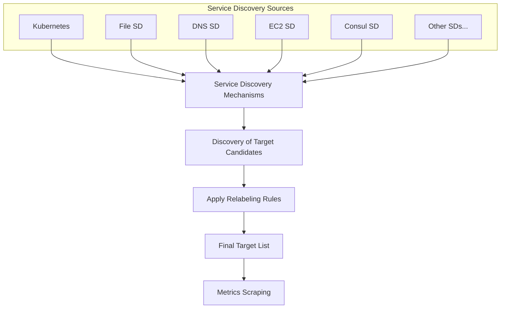

# Service Discovery Debugging

## Introduction

Service discovery is a critical component of Prometheus that allows it to dynamically find and monitor targets without manual configuration. However, when targets don't appear in Prometheus or metrics aren't being scraped as expected, debugging service discovery issues can be challenging. This guide will walk you through common service discovery problems and provide practical troubleshooting techniques to resolve them.

Service discovery in Prometheus works by:
1. Discovering targets through various mechanisms (Kubernetes, file-based, DNS, etc.)
2. Applying relabeling rules to filter or modify targets
3. Attempting to scrape metrics from the discovered endpoints

When this process breaks down, you need systematic debugging approaches to identify and fix the issues.

## Understanding Service Discovery in Prometheus

Before diving into debugging, let's understand how service discovery works in Prometheus:



When something goes wrong, the issue could be in any of these stages.

## Common Service Discovery Issues

### 1. Missing Targets

One of the most common issues is that expected targets aren't showing up in Prometheus.

#### Debugging Steps:

1. **Check Service Discovery Status in the Prometheus UI**

Navigate to Status > Service Discovery in the Prometheus UI to see all discovered targets and their states.

```bash
# Access Prometheus UI
curl http://localhost:9090/service-discovery
```

2. **Verify Configuration**

Check your `prometheus.yml` file for correct service discovery configuration:

```yaml
scrape_configs:
  - job_name: 'example'
    kubernetes_sd_configs:
      - role: pod
```

3. **Enable Debug Logging**

Run Prometheus with increased log verbosity to see service discovery details:

```bash
./prometheus --config.file=prometheus.yml --log.level=debug
```

Output example:
```
level=debug ts=2025-03-15T14:05:12.764Z caller=kubernetes.go:120 component=discovery msg="discovered pods" count=15
```

### 2. Relabeling Issues

Relabeling can filter out targets unintentionally if misconfigured.

#### Example of Problematic Relabeling:

```yaml
scrape_configs:
  - job_name: 'kubernetes-pods'
    kubernetes_sd_configs:
      - role: pod
    relabel_configs:
      - source_labels: [__meta_kubernetes_pod_annotation_prometheus_io_scrape]
        action: keep
        regex: true  # This will only match the literal string "true", not "True" or other variations
```

#### Solution:

Fix the regex to be more inclusive:

```yaml
relabel_configs:
  - source_labels: [__meta_kubernetes_pod_annotation_prometheus_io_scrape]
    action: keep
    regex: "true|True|TRUE"  # Now matches various capitalization
```

### 3. Authentication and Authorization Issues

If your service discovery requires authentication (e.g., Kubernetes API), check for permission problems.

#### Debugging Kubernetes SD Authentication:

```bash
# Check if Prometheus can access the Kubernetes API
kubectl auth can-i list pods --as=system:serviceaccount:monitoring:prometheus
```

Expected output:
```
yes
```

If the output is "no", you need to set up proper RBAC:

```yaml
apiVersion: rbac.authorization.k8s.io/v1
kind: ClusterRole
metadata:
  name: prometheus
rules:
- apiGroups: [""]
  resources: ["nodes", "nodes/proxy", "services", "endpoints", "pods"]
  verbs: ["get", "list", "watch"]

---
apiVersion: rbac.authorization.k8s.io/v1
kind: ClusterRoleBinding
metadata:
  name: prometheus
roleRef:
  apiGroup: rbac.authorization.k8s.io
  kind: ClusterRole
  name: prometheus
subjects:
- kind: ServiceAccount
  name: prometheus
  namespace: monitoring
```

## Debugging File-Based Service Discovery

File-based service discovery is often the simplest to debug.

### Example Configuration:

```yaml
scrape_configs:
  - job_name: 'file-sd-targets'
    file_sd_configs:
      - files:
        - '/etc/prometheus/file_sd/*.json'
```

### Example Target File (`/etc/prometheus/file_sd/targets.json`):

```json
[
  {
    "targets": ["host1:9100", "host2:9100"],
    "labels": {
      "env": "production",
      "job": "node-exporter"
    }
  }
]
```

### Debugging Steps:

1. **Check File Permissions**

```bash
ls -la /etc/prometheus/file_sd/
```

Output example:
```
-rw-r--r-- 1 prometheus prometheus 142 Mar 15 12:34 targets.json
```

2. **Verify File Content and Format**

```bash
cat /etc/prometheus/file_sd/targets.json | jq
```

3. **Watch Prometheus Logs for File SD Events**

```bash
grep "file_sd" /var/log/prometheus/prometheus.log
```

## Debugging DNS Service Discovery

DNS service discovery issues often relate to DNS resolution problems.

### Example Configuration:

```yaml
scrape_configs:
  - job_name: 'dns-sd'
    dns_sd_configs:
      - names:
        - 'service.consul'
        type: 'A'
        port: 9100
```

### Debugging Steps:

1. **Verify DNS Resolution**

```bash
dig service.consul
```

Expected output:
```
;; ANSWER SECTION:
service.consul.      0       IN      A       10.0.0.1
service.consul.      0       IN      A       10.0.0.2
```

2. **Test Target Connectivity**

```bash
curl -v http://10.0.0.1:9100/metrics
```

## Debugging Kubernetes Service Discovery

Kubernetes service discovery is powerful but can be complex to debug.

### Example Configuration:

```yaml
scrape_configs:
  - job_name: 'kubernetes-pods'
    kubernetes_sd_configs:
      - role: pod
    relabel_configs:
      - source_labels: [__meta_kubernetes_pod_annotation_prometheus_io_scrape]
        action: keep
        regex: true
      - source_labels: [__meta_kubernetes_pod_annotation_prometheus_io_path]
        action: replace
        target_label: __metrics_path__
        regex: (.+)
      - source_labels: [__meta_kubernetes_pod_ip, __meta_kubernetes_pod_annotation_prometheus_io_port]
        action: replace
        regex: (.+);(.+)
        replacement: $1:$2
        target_label: __address__
```

### Debugging Steps:

1. **Verify Pod Annotations**

```bash
kubectl get pods -n your-namespace -o jsonpath='{.items[*].metadata.name}{"\t"}{.items[*].metadata.annotations.prometheus\.io/scrape}{"
"}'
```

2. **Check Network Policies**

Ensure Prometheus can access your targets:

```bash
kubectl describe networkpolicy -n your-namespace
```

3. **Inspect Kubernetes Events**

```bash
kubectl get events -n monitoring
```

4. **Verify Service Account Permissions**

```bash
kubectl describe clusterrolebinding prometheus
```

## Practical Example: Debugging a Complete Setup

Let's walk through a real-world example of debugging a common issue where Kubernetes pods aren't being discovered.

### Scenario

You've set up Prometheus with Kubernetes service discovery, but no pods are showing up in the targets list.

### Step 1: Check Prometheus Configuration

First, examine your Prometheus configuration:

```yaml
global:
  scrape_interval: 15s

scrape_configs:
  - job_name: 'kubernetes-pods'
    kubernetes_sd_configs:
      - role: pod
    relabel_configs:
      - source_labels: [__meta_kubernetes_pod_annotation_prometheus_io_scrape]
        action: keep
        regex: true
```

### Step 2: Check Service Discovery Status in UI

Navigate to Status > Service Discovery in the Prometheus UI. If you see no pods listed, it indicates Prometheus can't connect to the Kubernetes API.

### Step 3: Check Prometheus Logs

```bash
kubectl logs -n monitoring deploy/prometheus -c prometheus
```

Look for errors like:
```
level=error ts=2025-03-15T15:32:18.512Z caller=klog.go:116 component=k8s_client_runtime func=ErrorDepth msg="Unexpected error resolving Kubernetes config" err="unable to load in-cluster configuration, KUBERNETES_SERVICE_HOST and KUBERNETES_SERVICE_PORT must be defined"
```

### Step 4: Fix the Issue

If Prometheus is running outside Kubernetes, provide kubeconfig:

```yaml
kubernetes_sd_configs:
  - role: pod
    kubeconfig_file: /etc/prometheus/kubeconfig
```

If running inside Kubernetes, verify the service account:

```bash
kubectl get serviceaccount prometheus -n monitoring
kubectl get clusterrolebinding prometheus
```

Create or fix the service account and role binding:

```bash
kubectl apply -f - <<EOF
apiVersion: v1
kind: ServiceAccount
metadata:
  name: prometheus
  namespace: monitoring
---
apiVersion: rbac.authorization.k8s.io/v1
kind: ClusterRole
metadata:
  name: prometheus
rules:
- apiGroups: [""]
  resources: ["nodes", "services", "endpoints", "pods"]
  verbs: ["get", "list", "watch"]
---
apiVersion: rbac.authorization.k8s.io/v1
kind: ClusterRoleBinding
metadata:
  name: prometheus
roleRef:
  apiGroup: rbac.authorization.k8s.io
  kind: ClusterRole
  name: prometheus
subjects:
- kind: ServiceAccount
  name: prometheus
  namespace: monitoring
EOF
```

### Step 5: Verify Target Applications Are Properly Annotated

If using pod annotations for discovery, ensure your pods have the right annotations:

```bash
kubectl patch deployment myapp -p '{"spec":{"template":{"metadata":{"annotations":{"prometheus.io/scrape":"true","prometheus.io/port":"8080"}}}}}'
```

### Step 6: Reload or Restart Prometheus

```bash
curl -X POST http://localhost:9090/-/reload
```

## Additional Troubleshooting Commands

### Checking Target Health

```bash
curl http://localhost:9090/api/v1/targets | jq
```

Example output:
```json
{
  "status": "success",
  "data": {
    "activeTargets": [
      {
        "discoveredLabels": {
          "__address__": "10.0.0.1:9100",
          "__meta_kubernetes_pod_name": "node-exporter-a1b2c",
          "job": "kubernetes-pods"
        },
        "labels": {
          "instance": "10.0.0.1:9100",
          "job": "node-exporter"
        },
        "scrapeUrl": "http://10.0.0.1:9100/metrics",
        "lastError": "",
        "lastScrape": "2025-03-15T16:43:01.123456789Z",
        "health": "up"
      }
    ]
  }
}
```

### Testing Target Connectivity

```bash
# First, identify the IP and port of the target
kubectl get pod -o wide

# Then test connectivity
kubectl exec -it prometheus-0 -n monitoring -- wget -O- 10.0.0.1:9100/metrics
```

## Summary

Debugging service discovery in Prometheus requires a systematic approach:

1. **Understand how service discovery works** in Prometheus
2. **Check configuration** for syntax errors or misconfigurations
3. **Verify target accessibility** by testing connectivity
4. **Enable debug logging** to get more visibility
5. **Inspect service discovery status** in the Prometheus UI
6. **Verify authentication and authorization** for your service discovery mechanism
7. **Test the target endpoints directly** to ensure they're working

By following these steps methodically, you can identify and resolve most service discovery issues in Prometheus.

## Additional Resources

- [Prometheus Service Discovery Documentation](https://prometheus.io/docs/prometheus/latest/configuration/configuration/#scrape_config)
- [Kubernetes Service Discovery in Prometheus](https://prometheus.io/docs/prometheus/latest/configuration/configuration/#kubernetes_sd_config)
- [Prometheus Relabeling Documentation](https://prometheus.io/docs/prometheus/latest/configuration/configuration/#relabel_config)

## Exercises

1. Configure file-based service discovery with several targets and intentionally introduce an error. Use the debugging techniques from this guide to find and fix the issue.

2. Set up Kubernetes service discovery in a test environment and debug why certain pods are not being discovered.

3. Create a DNS-based service discovery configuration and troubleshoot connectivity issues between Prometheus and the targets.

4. Implement a complex relabeling configuration and debug why certain targets are being dropped during the relabeling process.