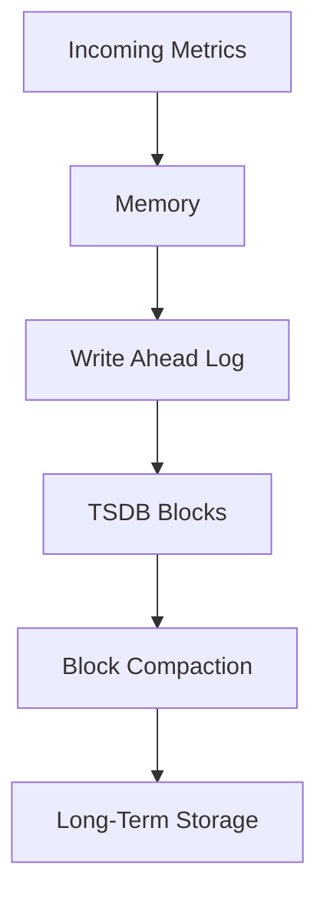
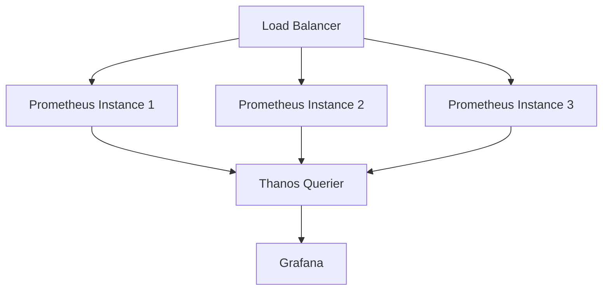

# Storage Issues in Prometheus

## Introduction

Prometheus stores its time-series data on disk in a custom format called the Time Series Database (TSDB). While this storage engine is optimized for metrics data and performs well in most situations, you may encounter various storage-related issues that can affect your Prometheus deployment. This guide will help you understand, identify, and resolve common storage problems in Prometheus.

## Understanding Prometheus Storage

Before diving into troubleshooting, it's important to understand how Prometheus stores data:

- Prometheus uses a local time-series database (TSDB) to store all its metrics
- Data is stored in blocks (typically 2-hour chunks by default)
- Each block contains all time series for that time window
- Older blocks get compacted into larger blocks over time
- A write-ahead log (WAL) protects against crashes



## Common Storage Issues

### Disk Space Exhaustion

One of the most frequent issues is running out of disk space. Prometheus continuously collects metrics, and without proper retention settings, your disk can fill up quickly.

#### Symptoms
- Prometheus service crashes or fails to start
- Log entries indicating "no space left on device"
- Increasing latency in queries as the disk gets fuller

#### Troubleshooting Steps

1. Check available disk space:

```bash
df -h /path/to/prometheus/data
```

2. Review the current storage usage by Prometheus:

```bash
du -sh /path/to/prometheus/data/*
```

3. Examine Prometheus storage metrics:

```
prometheus_tsdb_storage_blocks_bytes
prometheus_tsdb_wal_segment_current
```

#### Solutions

1. Configure appropriate retention periods in your `prometheus.yml`:

```yaml
global:
  scrape_interval: 15s
  evaluation_interval: 15s
  # Configure how long to retain data
  retention_time: 15d
```

2. Set up disk space alerts before it becomes critical:

```yaml
- alert: PrometheusStorageAlmostFull
  expr: (1 - (node_filesystem_avail_bytes / node_filesystem_size_bytes)) * 100 > 85
  for: 10m
  labels:
    severity: warning
  annotations:
    summary: "Prometheus storage almost full"
    description: "Prometheus storage is {{ $value }}% full and will fill up within the next 24h."
```

3. Consider implementing external storage solutions:

```yaml
# prometheus.yml
remote_write:
  - url: "https://remote-storage-endpoint/api/v1/write"
    
remote_read:
  - url: "https://remote-storage-endpoint/api/v1/read"
```

### Data Corruption

Data corruption can occur due to unexpected shutdowns, hardware failures, or filesystem issues.

#### Symptoms
- Error messages about blocks being corrupted
- Missing metrics or incomplete data
- Prometheus failing to start with TSDB errors

#### Troubleshooting

1. Check Prometheus logs for corruption-related errors:

```bash
grep -i "corrupt\|invalid\|error" /path/to/prometheus/log
```

2. Use Prometheus TSDB tools to verify the database:

```bash
promtool tsdb verify /path/to/prometheus/data
```

#### Solutions

1. If corruption is detected, you may need to delete the corrupted blocks:

```bash
# First, stop Prometheus
systemctl stop prometheus

# Then, remove the corrupted block (example block ID)
rm -rf /path/to/prometheus/data/01FCXYZ123456789

# Restart Prometheus
systemctl start prometheus
```

2. Implement regular backups of your Prometheus data:

```bash
# Example backup script
#!/bin/bash
BACKUP_DIR="/backup/prometheus"
DATA_DIR="/path/to/prometheus/data"

systemctl stop prometheus
tar -czf $BACKUP_DIR/prometheus-data-$(date +%Y%m%d).tar.gz $DATA_DIR
systemctl start prometheus
```

### Storage Performance Issues

As your metrics volume grows, you might notice performance degradation.

#### Symptoms
- Slow query responses
- High CPU/disk I/O during compaction
- Increasing WAL replay time during restarts

#### Troubleshooting

1. Monitor disk I/O performance:

```bash
iostat -xd 5
```

2. Check Prometheus performance metrics:

```
rate(prometheus_tsdb_head_active_appenders[5m])
rate(prometheus_tsdb_compactions_total[5m])
prometheus_tsdb_head_chunks
```

#### Solutions

1. Use faster storage (SSDs instead of HDDs):

```yaml
# In systemd unit file
[Service]
ExecStart=/usr/local/bin/prometheus --storage.tsdb.path=/fast/ssd/path
```

2. Adjust block duration and retention periods:

```yaml
# prometheus.yml
storage:
  tsdb:
    path: "/path/to/prometheus/data"
    retention.time: 15d
    min_block_duration: 2h
    max_block_duration: 24h
```

3. Shard your Prometheus deployment for better performance:



## Out of Memory During Compaction

Compaction processes consolidate blocks of time-series data, which can be memory-intensive.

#### Symptoms
- Out of memory errors during compaction
- Prometheus crashing with memory-related errors
- High memory usage spikes

#### Troubleshooting

1. Monitor memory usage during compactions:

```bash
watch -n 1 "free -m"
```

2. Check the relevant Prometheus metrics:

```
process_resident_memory_bytes{job="prometheus"}
prometheus_tsdb_compactions_total
prometheus_tsdb_compaction_duration_seconds
```

#### Solutions

1. Increase available memory or limit Prometheus memory usage:

```yaml
# In systemd unit file
[Service]
ExecStart=/usr/local/bin/prometheus
MemoryMax=8G
```

2. Use `--storage.tsdb.max-block-duration` to control block sizes:

```bash
prometheus --storage.tsdb.path=/path/to/data --storage.tsdb.max-block-duration=2h
```

## WAL Corruption

The Write-Ahead Log (WAL) is critical for Prometheus data integrity, but it can become corrupted.

#### Symptoms
- Errors mentioning WAL corruption or truncation
- Prometheus failing to start after a crash
- Messages about invalid segment or checkpoint markers

#### Troubleshooting

1. Examine WAL-specific errors in logs:

```bash
grep -i "wal" /path/to/prometheus/log
```

2. Check the WAL directory structure:

```bash
ls -la /path/to/prometheus/data/wal
```

#### Solutions

1. In cases of WAL corruption, you might need to remove the WAL directory:

```bash
# Warning: This will lose recent data that hasn't been compacted yet
systemctl stop prometheus
rm -rf /path/to/prometheus/data/wal
systemctl start prometheus
```

2. Configure WAL settings for better durability:

```yaml
storage:
  tsdb:
    wal_segment_size: 128MB
    wal_compression: true
```

## Best Practices for Prometheus Storage

### 1. Calculate Your Storage Requirements

Before deploying Prometheus, estimate your storage needs:

```
storage_size = retention_time_seconds * ingested_samples_per_second * bytes_per_sample
```

For example, with:
- 10,000 time series
- 1 sample every 15s per time series
- 2 bytes per sample (approximate)
- 15-day retention

```
10,000 * (1/15) * 2 * 15 * 86400 ≈ 1.73 GB
```

### 2. Implement Proper Retention Policies

Balance retention with storage constraints:

```yaml
# prometheus.yml
global:
  scrape_interval: 15s
  evaluation_interval: 15s
  retention_time: 15d  # For time-based retention
  # OR
  retention_size: 500GB  # For size-based retention
```

### 3. Use Efficient Labels

Excessive label cardinality can bloat your storage:

```yaml
# Avoid high cardinality labels like this
- job_name: 'api'
  static_configs:
    - targets: ['api.example.com:8080']
      labels:
        user_id: "12345"  # Bad: high cardinality
        request_id: "abc123"  # Bad: high cardinality
        
# Instead, use lower cardinality labels
- job_name: 'api'
  static_configs:
    - targets: ['api.example.com:8080']
      labels:
        service: "api"
        environment: "production"
```

### 4. Consider External Storage

For long-term storage, consider remote write/read:

```yaml
# prometheus.yml
remote_write:
  - url: "https://thanos-receive.example.com/api/v1/receive"
    
remote_read:
  - url: "https://thanos-store.example.com/api/v1/read"
```

## Troubleshooting Tools

### Promtool

`promtool` provides utilities for working with Prometheus data:

```bash
# Verify TSDB integrity
promtool tsdb verify /path/to/prometheus/data

# Dump samples from a TSDB
promtool tsdb dump /path/to/prometheus/data

# List all series for a label
promtool tsdb series /path/to/prometheus/data '{job="prometheus"}'
```

### prometheus-storage-migrator

For migrating between storage formats:

```bash
# Example migrating data
./prometheus-storage-migrator \
  --input.storage-path=/old/prometheus/data \
  --output.storage-path=/new/prometheus/data
```

## Summary

Storage issues in Prometheus typically fall into a few categories:
- Disk space exhaustion
- Data corruption
- Performance degradation
- Memory issues during compaction
- WAL problems

By understanding the underlying storage architecture and implementing best practices, you can maintain a healthy Prometheus deployment with minimal storage-related issues.

## Additional Resources

1. [Prometheus TSDB Documentation](https://prometheus.io/docs/prometheus/latest/storage/)
2. [Prometheus Storage Operational Guide](https://prometheus.io/docs/prometheus/latest/storage/#operational-aspects)
3. [Remote Storage Integration](https://prometheus.io/docs/operating/integrations/#remote-endpoints-and-storage)

## Exercises

1. Calculate the storage requirements for your specific environment based on the formula provided.
2. Set up alerts for detecting storage issues before they become critical.
3. Practice simulating and recovering from a corrupted block using a test Prometheus instance.
4. Experiment with different retention settings and measure their impact on query performance.
5. Implement a backup strategy for your Prometheus data directory.