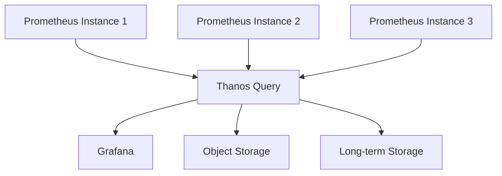

# Performance Problems

## Introduction

Performance problems in Prometheus can manifest in various ways, from high resource consumption to slow query response times. As your monitoring infrastructure grows, understanding and addressing these performance challenges becomes critical to maintaining a reliable monitoring system. This guide will help you identify common Prometheus performance bottlenecks and provide practical approaches to resolve them.

## Common Performance Issues

### 1. High CPU Usage

Prometheus can experience high CPU usage due to several factors, which can impact the overall system performance.

#### Symptoms:
- Consistently high CPU utilization
- Slow query responses
- Delayed alert notifications

#### Causes:

**Complex PromQL Queries**

Complex queries with many operations, especially those using `count`, `sum`, `rate`, and other aggregation functions across large datasets, can consume significant CPU resources.

Example of a resource-intensive query:

```promql
sum(rate(http_requests_total{job=~".+"}[5m])) by (job)
```

**High Cardinality**

High cardinality occurs when a label has a large number of possible values, causing Prometheus to track many individual time series.

```promql
# This query might produce high cardinality if 'instance' has many values
sum(rate(node_cpu_seconds_total{mode="idle"}[5m])) by (instance)
```

### 2. High Memory Usage

Prometheus stores all its data in memory before writing to disk, which can lead to high memory consumption.

#### Symptoms:
- Memory usage increasing over time
- Out-of-memory (OOM) errors
- System crashes or Prometheus restarts

#### Causes:

**Retention Period Too Long**

```yaml
# prometheus.yml with excessive retention
global:
  scrape_interval: 15s
  evaluation_interval: 15s
  # This is likely too high for most setups
  retention_time: 90d
```

**Too Many Metrics**

```yaml
# Example of a job that might collect too many metrics
scrape_configs:
  - job_name: 'node'
    static_configs:
      - targets: ['localhost:9100', 'server2:9100', 'server3:9100', '...hundreds more...']
```

### 3. Slow Query Performance

Slow queries can impact dashboards, alerts, and API responses.

#### Symptoms:
- Dashboard panels loading slowly
- Query timeouts in Grafana
- API calls returning after long delays

#### Causes:

**Inefficient Queries**

```promql
# Inefficient query - searching across all metrics
{__name__=~".+"}

# Better approach - specify the metric name
http_requests_total
```

**Large Time Ranges**

```promql
# Query over a very large time range
rate(http_requests_total[30d])

# More efficient approach for long-term analysis
avg_over_time(rate(http_requests_total[5m])[30d:1h])
```

## Diagnosing Performance Problems

### Using Prometheus' Own Metrics

Prometheus exports internal metrics that you can use to diagnose performance issues:

```promql
# CPU usage by Prometheus itself
rate(process_cpu_seconds_total{job="prometheus"}[5m])

# Memory usage
process_resident_memory_bytes{job="prometheus"}

# Number of time series
prometheus_tsdb_head_series
```

### Analyzing Query Performance

The `/metrics` endpoint of Prometheus reveals information about query performance:

```promql
# Average query execution time
prometheus_engine_query_duration_seconds{quantile="0.9"}

# Query errors
rate(prometheus_engine_query_failures_total[5m])
```

## Solutions to Common Performance Problems

### 1. Optimizing Prometheus Configuration

```yaml
global:
  scrape_interval: 15s
  evaluation_interval: 15s
  scrape_timeout: 10s
  # Reasonable retention period
  retention_time: 15d

# Consider the storage options for better performance
storage:
  tsdb:
    # Increase for more TSDB blocks
    min_block_duration: 2h
    # Decrease for faster compaction cycles
    max_block_duration: 24h
    # Limit disk usage
    retention_size: 500GB
```

### 2. Managing Cardinality

```yaml
# Example of relabeling to reduce cardinality
scrape_configs:
  - job_name: 'high_cardinality_job'
    static_configs:
      - targets: ['app1:9100', 'app2:9100']
    relabel_configs:
      # Keep only the labels we need
      - source_labels: [__name__]
        regex: 'node_.*'
        action: keep
      # Drop high cardinality labels
      - regex: 'id|uuid|session_id|request_id'
        action: labeldrop
```

### 3. Implementing Prometheus Federation

For large-scale deployments, consider implementing federation to distribute the load:

```yaml
# Example of a federation job in the global Prometheus
scrape_configs:
  - job_name: 'federate'
    scrape_interval: 15s
    honor_labels: true
    metrics_path: '/federate'
    params:
      'match[]':
        - '{job="prometheus"}'
        - '{__name__=~"job:.*"}'
    static_configs:
      - targets:
        - 'prometheus-data-center-1:9090'
        - 'prometheus-data-center-2:9090'
```

### 4. Query Optimization Techniques

**Use Subqueries for Long-Term Analysis**

```promql
# Instead of this over a long range
rate(http_requests_total[5m])

# Use this for long-term analysis
rate(http_requests_total[5m])[1d:1h]
```

**Limit the Labels in Your Queries**

```promql
# Instead of
sum(rate(http_requests_total[5m])) by (job, instance, handler, code, method)

# Use only necessary labels
sum(rate(http_requests_total[5m])) by (job, code)
```

### 5. Horizontal Scaling with Thanos or Cortex

For very large deployments, consider using Thanos or Cortex to scale Prometheus horizontally:



## Real-World Example: E-commerce Site Optimization

Let's walk through a real-world example of optimizing Prometheus for an e-commerce platform experiencing performance issues during peak shopping periods.

### Initial State

```yaml
# Original prometheus.yml
global:
  scrape_interval: 10s
  evaluation_interval: 10s
  retention_time: 45d

scrape_configs:
  - job_name: 'web_servers'
    static_configs:
      - targets: ['web1:9100', 'web2:9100', ..., 'web50:9100']
  - job_name: 'api_servers'
    static_configs:
      - targets: ['api1:9100', 'api2:9100', ..., 'api30:9100']
  - job_name: 'databases'
    static_configs:
      - targets: ['db1:9100', 'db2:9100', ..., 'db10:9100']
```

Dashboard queries were taking 20+ seconds, and Prometheus was consuming 24GB of memory.

### Optimization Steps

1. **Reduced the retention period**

```yaml
global:
  retention_time: 15d
```

2. **Implemented recording rules for common queries**

```yaml
rules:
  - name: recording_rules
    interval: 1m
    rules:
      - record: job:http_requests_total:rate5m
        expr: sum(rate(http_requests_total[5m])) by (job)
      - record: job:http_errors_total:rate5m
        expr: sum(rate(http_requests_total{status=~"5.."}[5m])) by (job)
```

3. **Added relabeling to reduce cardinality**

```yaml
scrape_configs:
  - job_name: 'web_servers'
    static_configs:
      - targets: ['web1:9100', 'web2:9100', ..., 'web50:9100']
    relabel_configs:
      # Keep only metrics we actually use
      - source_labels: [__name__]
        regex: 'node_cpu_.*|node_memory_.*|http_.*'
        action: keep
      # Replace detailed URL paths with placeholders
      - source_labels: [path]
        regex: '/api/products/[0-9]+'
        replacement: '/api/products/:id'
        target_label: path
```

4. **Implemented federation for different data centers**

Split the monitoring into regional Prometheus instances with a global aggregator.

### Results

- Query time reduced from 20+ seconds to `<1 second`
- Memory usage decreased from 24GB to 8GB
- CPU usage dropped by 60%

## Performance Tuning Checklist

Use this checklist when troubleshooting Prometheus performance issues:

1. **Check resource usage**
   - Monitor Prometheus CPU, memory, and disk I/O
   - Review system logs for OOM events

2. **Analyze metric cardinality**
   - Identify high cardinality metrics using `topk(10, count by (__name__)({__name__=~".+"}))` 
   - Implement relabeling to reduce cardinality

3. **Review query performance**
   - Use the `/api/v1/query_stats` endpoint (if available in your version)
   - Optimize complex queries with recording rules

4. **Adjust retention settings**
   - Set appropriate `retention_time` based on your needs and resources
   - Consider external storage solutions for long-term data

5. **Scale horizontally** 
   - Implement federation for large environments
   - Consider Thanos or Cortex for truly massive deployments

## Summary

Performance problems in Prometheus typically stem from configuration issues, high cardinality metrics, inefficient queries, or simply from trying to scale beyond what a single Prometheus instance can handle. By applying the techniques outlined in this guide—optimizing configuration, managing cardinality, implementing recording rules, and considering federation or horizontal scaling solutions—you can significantly improve Prometheus performance and reliability.

As your monitoring needs grow, remember that addressing performance issues is an ongoing process that requires regular review and adjustment.

## Additional Resources

- [Prometheus Documentation on Storage](https://prometheus.io/docs/prometheus/latest/storage/)
- [PromQL Optimization Techniques](https://prometheus.io/docs/prometheus/latest/querying/basics/)
- [Thanos Project](https://thanos.io/) for horizontal scaling
- [Cortex Project](https://cortexmetrics.io/) for horizontally scalable Prometheus
- [Prometheus Operator](https://github.com/prometheus-operator/prometheus-operator) for Kubernetes