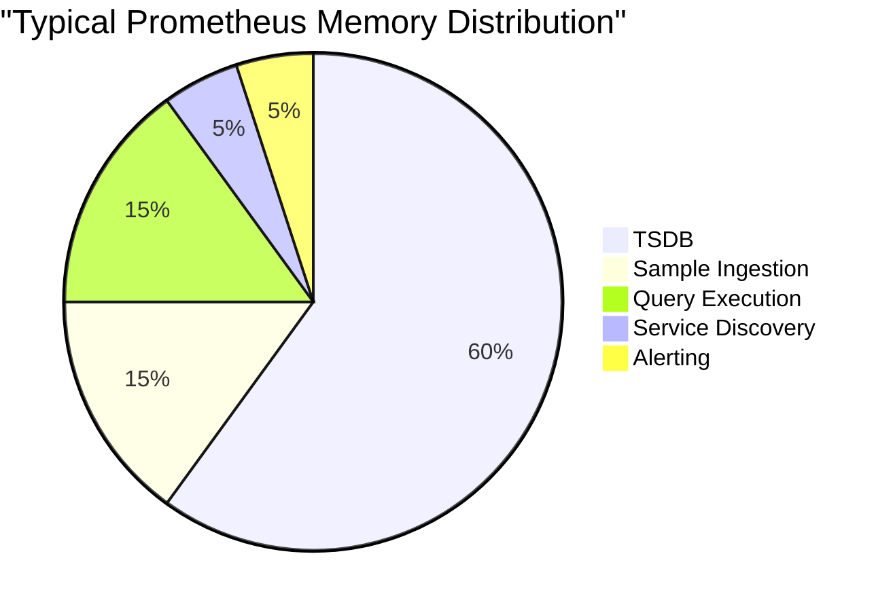

# Memory Usage Optimization

## Introduction

Prometheus is a powerful monitoring and alerting toolkit, but as your monitoring infrastructure grows, memory usage can become a critical concern. Unoptimized Prometheus instances may consume excessive memory, leading to performance degradation, OOM (Out of Memory) errors, or even complete system crashes.

In this guide, we'll explore how to identify memory issues in Prometheus, understand the main factors that affect memory consumption, and implement effective strategies to optimize memory usage without sacrificing monitoring capabilities.

## Understanding Prometheus Memory Usage

Before diving into optimization techniques, it's important to understand what drives memory consumption in Prometheus.

### Key Memory Consumers in Prometheus

1. **Time Series Database (TSDB)**: Stores all the metric data
2. **Sample Ingestion**: Processing incoming metrics
3. **Query Execution**: Memory used during query operations
4. **Service Discovery**: Tracking targets to scrape
5. **Alerting Rules**: Evaluating alert conditions

Let's visualize the approximate memory distribution in a typical Prometheus instance:



## Identifying Memory Issues

Before optimizing, you need to determine if you have a memory problem and identify its root cause.

### Signs of Memory Issues

- Prometheus process crashes with OOM (Out of Memory) errors
- High and growing memory usage over time
- Slow query response times
- Metric collection delays

### Monitoring Prometheus Itself

Prometheus can monitor itself! Use these metrics to track memory usage:

```
# Memory usage of Prometheus
process_resident_memory_bytes{job="prometheus"}

# Memory usage breakdowns
prometheus_engine_queries_concurrent_max
prometheus_tsdb_head_chunks_created_total
```

Let's create a simple script to check Prometheus memory usage:

```bash
#!/bin/bash
# prometheus_memory_check.sh

PROMETHEUS_URL="http://localhost:9090"

# Get current memory usage
MEM_USAGE=$(curl -s $PROMETHEUS_URL/api/v1/query?query=process_resident_memory_bytes | jq '.data.result[0].value[1]')
MEM_USAGE_MB=$(echo "$MEM_USAGE / 1024 / 1024" | bc)

echo "Current Prometheus memory usage: ${MEM_USAGE_MB}MB"

# Check if it's above threshold
if (( $(echo "$MEM_USAGE_MB > 2000" | bc -l) )); then
  echo "WARNING: Memory usage is high (>2GB)"
fi
```

## Memory Optimization Strategies

Now let's explore the key strategies to optimize Prometheus memory usage:

### 1. Optimize Scrape Configuration

The more metrics you collect, the more memory you need. Be selective!

```yaml
scrape_configs:
  - job_name: 'node'
    scrape_interval: 15s
    scrape_timeout: 10s
    metrics_path: /metrics
    static_configs:
      - targets: ['localhost:9100']
    # Use relabeling to drop unnecessary metrics
    metric_relabel_configs:
      - source_labels: [__name__]
        regex: 'node_cpu_.*'
        action: keep
```

This configuration focuses on keeping only CPU-related metrics from the node exporter.

### 2. Use `metric_relabel_configs` to Filter Metrics

Relabeling allows you to filter metrics before they're stored:

```yaml
metric_relabel_configs:
  # Drop high-cardinality metrics
  - source_labels: [__name__]
    regex: 'http_requests_total'
    action: drop
  # Keep only metrics with specific labels
  - source_labels: [environment]
    regex: 'production'
    action: keep
```

### 3. Adjust Retention Time

By default, Prometheus stores data for 15 days. Reduce this for memory savings:

```yaml
# In prometheus.yml
global:
  scrape_interval: 15s
  evaluation_interval: 15s
  # Set a shorter retention period (e.g., 5 days)
  storage.tsdb.retention.time: 5d
```

### 4. Optimize Storage Block Size

The default block size is 2 hours. Adjusting this can help with memory usage:

```yaml
# In prometheus.yml
storage:
  tsdb:
    # Default is 2h, can be adjusted based on needs
    min_block_duration: 1h
    # Should be 10x min_block_duration
    max_block_duration: 10h
```

### 5. Vertical Scaling

Sometimes the simplest solution is to increase available memory:

```bash
# Run Prometheus with memory limits (using Docker)
docker run -d --name prometheus \
  --memory="4g" --memory-swap="4g" \
  -p 9090:9090 \
  prom/prometheus:v2.37.0
```

### 6. Horizontal Scaling (Federation)

Split your Prometheus setup into multiple instances:

```yaml
# In the aggregating Prometheus
scrape_configs:
  - job_name: 'prometheus-federate'
    scrape_interval: 15s
    honor_labels: true
    metrics_path: '/federate'
    params:
      'match[]':
        - '{job="node"}'
        - '{job="api"}'
    static_configs:
      - targets:
        - 'prometheus-app:9090'
        - 'prometheus-infra:9090'
```

## Practical Example: Reducing Memory in High-Cardinality Environments

Let's look at a real-world scenario where a Prometheus instance is monitoring a Kubernetes cluster with high-cardinality metrics.

### Problem:
- Prometheus using 8GB of memory and growing
- Many high-cardinality metrics from Kubernetes pod labels
- Query performance degrading

### Solution:

Step 1: Identify high-cardinality metrics:

```promql
topk(10, count by (__name__)({__name__=~".+"}))
```

Step 2: Create a more selective scrape configuration:

```yaml
scrape_configs:
  - job_name: 'kubernetes-pods'
    kubernetes_sd_configs:
      - role: pod
    relabel_configs:
      # Only scrape pods with prometheus.io/scrape=true annotation
      - source_labels: [__meta_kubernetes_pod_annotation_prometheus_io_scrape]
        action: keep
        regex: true
    metric_relabel_configs:
      # Drop high-cardinality metrics
      - source_labels: [__name__]
        regex: 'container_tasks_state|kube_pod_container_status_last_terminated_reason'
        action: drop
      # Limit label values to reduce cardinality
      - source_labels: [pod]
        regex: '.+'
        target_label: pod
        replacement: 'redacted'
        action: replace
```

Step 3: Implement recording rules to pre-aggregate data:

```yaml
# rules.yml
groups:
- name: k8s-aggregation
  rules:
  - record: job:container_cpu_usage_seconds_total:sum
    expr: sum by (job) (rate(container_cpu_usage_seconds_total[5m]))
```

### Results:

After implementing these changes:
- Memory usage reduced from 8GB to 2GB
- Query performance improved by 65%
- No loss of critical monitoring coverage

## Memory Management Tools

Here are some tools to help manage Prometheus memory:

### 1. prom-heap

A tool to analyze Prometheus heap profiles:

```bash
# Install prom-heap
go get github.com/prometheus/prom-heap

# Generate heap profile from Prometheus
curl -s http://localhost:9090/debug/pprof/heap > heap.prof

# Analyze with prom-heap
prom-heap analyze heap.prof
```

### 2. Prometheus Memory Control Script

Create a monitoring script that restarts Prometheus if memory exceeds threshold:

```bash
#!/bin/bash
# prom_memory_control.sh

MAX_MEMORY_MB=4000
PROMETHEUS_URL="http://localhost:9090"

while true; do
  MEM_USAGE=$(curl -s $PROMETHEUS_URL/api/v1/query?query=process_resident_memory_bytes | jq '.data.result[0].value[1]')
  MEM_USAGE_MB=$(echo "$MEM_USAGE / 1024 / 1024" | bc)
  
  echo "$(date): Prometheus memory usage: ${MEM_USAGE_MB}MB"
  
  if (( $(echo "$MEM_USAGE_MB > $MAX_MEMORY_MB" | bc -l) )); then
    echo "WARNING: Memory exceeds ${MAX_MEMORY_MB}MB threshold, restarting service"
    systemctl restart prometheus
  fi
  
  sleep 300
done
```

## Summary

Memory usage optimization is crucial for running Prometheus reliably in production environments. By implementing the strategies discussed in this guide, you can significantly reduce memory consumption while maintaining effective monitoring.

Key takeaways:
- Monitor Prometheus itself to understand memory usage patterns
- Focus on high-cardinality metrics, which are the biggest memory consumers
- Use relabeling to filter unnecessary metrics before storage
- Consider federation for horizontal scaling
- Regularly review and adjust retention policies based on actual needs

## Additional Resources

- **Official Documentation**: The [Prometheus storage documentation](https://prometheus.io/docs/prometheus/latest/storage/) provides detailed information about TSDB memory usage.
- **Cardinality Explorer**: Try [Cardinality Explorer](https://github.com/dgzlopes/cardinality-explorer) to find high-cardinality metrics in your setup.

## Exercises

1. Use `topk(10, count by (__name__)({__name__=~".+"}))` to identify the metrics with the highest cardinality in your environment.
2. Create a recording rule that pre-aggregates a high-cardinality metric in your system.
3. Implement a metric relabeling configuration to drop at least three non-essential high-cardinality metrics.
4. Set up a federated Prometheus architecture with one instance focused on application metrics and another on infrastructure metrics.