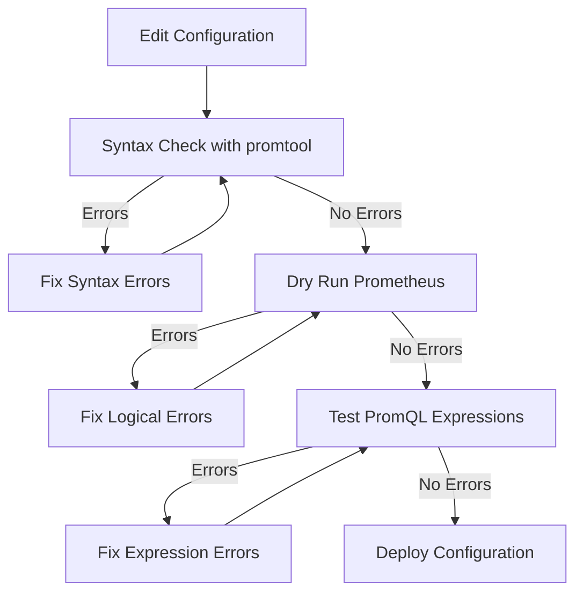

# Configuration Validation

## Introduction

One of the most common sources of problems with Prometheus is misconfiguration. Even small syntax errors or logical mistakes in your configuration files can prevent Prometheus from starting up properly or cause it to behave unexpectedly. In this guide, we'll explore how to validate your Prometheus configurations, identify common errors, and use built-in tools to ensure your monitoring setup is correct.

Configuration validation is an essential skill for anyone working with Prometheus. It helps you:

- Identify syntax errors before they cause downtime
- Verify that your scrape configurations will work as expected
- Ensure your alerting rules are properly formatted
- Catch logical errors in your recording rules

Let's dive into how you can validate your Prometheus configurations effectively.

## Basic Configuration Validation

Prometheus provides a built-in command to check the syntax of your configuration files without actually starting the service. This is incredibly useful for catching basic errors before deploying your changes.

### Using `promtool`

`promtool` is a utility that comes bundled with Prometheus and provides several helpful functions, including configuration validation.

To check your main Prometheus configuration file:

```bash
promtool check config prometheus.yml
```

If your configuration is valid, you'll see output similar to:

```
checking prometheus.yml
 SUCCESS: prometheus.yml is valid prometheus config file
```

If there are errors, `promtool` will provide specific information about what's wrong:

```
checking prometheus.yml
  FAILED: error parsing prometheus.yml: yaml: line 42: did not find expected key
```

### Validating Rules

Similarly, you can validate your alerting and recording rules:

```bash
promtool check rules rules.yml
```

A successful validation will show:

```
Checking rules.yml
  SUCCESS: 2 rules found
```

While an error might look like:

```
Checking rules.yml
  FAILED: error parsing rules.yml: yaml: line 15: did not find expected key
```

## Common Configuration Errors

Let's explore some of the most common configuration errors and how to identify and fix them.

### YAML Syntax Errors

YAML is sensitive to indentation and formatting. Common YAML errors include:

- Incorrect indentation
- Missing colons after keys
- Using tabs instead of spaces
- Unquoted strings containing special characters

**Example of incorrect YAML:**

```yaml
scrape_configs:
  - job_name: node
    static_configs
      - targets: ['localhost:9100']
```

**Corrected version:**

```yaml
scrape_configs:
  - job_name: node
    static_configs:
      - targets: ['localhost:9100']
```

Notice the missing colon after `static_configs` in the incorrect version.

### Invalid Relabeling Configurations

Relabeling is a powerful feature but is also a common source of errors.

**Example of incorrect relabeling:**

```yaml
relabel_configs:
  - source_labels: [__address__]
    regex: '(.*):(.*)'
    replacement: '${1}'
    target_label: instance
    action: unknown_action
```

**Corrected version:**

```yaml
relabel_configs:
  - source_labels: [__address__]
    regex: '(.*):(.*)'
    replacement: '${1}'
    target_label: instance
    action: replace
```

The `action` value must be one of the supported actions (`replace`, `keep`, `drop`, etc.).

### Prometheus Rule Syntax Errors

Alert and recording rules must follow specific syntax requirements.

**Example of incorrect rule:**

```yaml
groups:
  - name: example
    rules:
      - alert: HighErrorRate
        expr: job:request_errors:rate5m / job:requests:rate5m > 0.1
        for: 10m
        lables:
          severity: warning
```

**Corrected version:**

```yaml
groups:
  - name: example
    rules:
      - alert: HighErrorRate
        expr: job:request_errors:rate5m / job:requests:rate5m > 0.1
        for: 10m
        labels:
          severity: warning
```

Notice the typo in `lables` (should be `labels`).

## Advanced Configuration Validation

Beyond basic syntax checking, there are more sophisticated ways to validate your configuration.

### Dry Run Mode

You can start Prometheus in a "dry run" mode where it loads the configuration but exits immediately without starting all components:

```bash
prometheus --config.file=prometheus.yml --enable-feature=promql-at-modifier,promql-negative-offset --web.listen-address=0.0.0.0:9090
```

Watch the output for any warnings or errors. This will catch more subtle issues that the basic config check might miss.

### Validation of PromQL Expressions

Prometheus doesn't automatically validate the correctness of your PromQL expressions in rules. You can manually test these against your running Prometheus server:

```bash
promtool query instant http://localhost:9090 'job:request_errors:rate5m / job:requests:rate5m > 0.1'
```

This helps ensure that your alert and recording rule expressions are valid.

## Visual Configuration Validation

Let's visualize a typical configuration validation workflow:



## Configuration Validation Best Practices

Here are some best practices to ensure your Prometheus configurations remain valid:

1. **Use Version Control**: Keep your configurations in a version control system like Git.

2. **Implement CI/CD Validation**: Set up automated validation in your CI/CD pipeline:

```yaml
# Example GitLab CI configuration
validate_config:
  stage: test
  script:
    - promtool check config prometheus.yml
    - promtool check rules rules/*.yml
  only:
    changes:
      - prometheus.yml
      - rules/*.yml
```

3. **Incremental Changes**: Make small, incremental changes instead of large rewrites.

4. **Documentation**: Comment your configurations, especially complex relabeling or alerting rules.

5. **Testing Environment**: Test changes in a non-production environment first.

## Troubleshooting Configuration Errors

When you encounter configuration errors, follow these steps to troubleshoot:

1. **Read the Error Message**: Prometheus usually provides specific line numbers and descriptions.

2. **Isolate Changes**: If you've made multiple changes, try to apply them one at a time.

3. **Simplify**: Temporarily simplify complex configurations to isolate the problem.

4. **Check Logs**: Examine Prometheus logs for additional context:

```bash
journalctl -u prometheus -f
```

5. **Consult Documentation**: The official Prometheus documentation is comprehensive and regularly updated.

## Example: Complete Configuration Validation Workflow

Let's walk through a complete example of validating a Prometheus configuration:

1. **Start with a configuration file**:

```yaml
global:
  scrape_interval: 15s
  evaluation_interval: 15s

rule_files:
  - "rules/*.yml"

scrape_configs:
  - job_name: 'prometheus'
    static_configs:
      - targets: ['localhost:9090']

  - job_name: 'node_exporter'
    static_configs:
      - targets ['node1:9100', 'node2:9100']
```

2. **Run basic syntax check**:

```bash
$ promtool check config prometheus.yml
checking prometheus.yml
  FAILED: error parsing prometheus.yml: yaml: line 15: did not find expected key
```

3. **Fix the error** (missing colon after `targets`):

```yaml
  - job_name: 'node_exporter'
    static_configs:
      - targets: ['node1:9100', 'node2:9100']
```

4. **Run check again**:

```bash
$ promtool check config prometheus.yml
checking prometheus.yml
  SUCCESS: prometheus.yml is valid prometheus config file
```

5. **Try a dry run**:

```bash
$ prometheus --config.file=prometheus.yml --web.enable-lifecycle
level=info ts=2023-05-10T12:00:00.000Z caller=main.go:213 msg="Starting Prometheus" version="(version=2.44.0, branch=HEAD, revision=adc41a87b8a559e49903e92cef911be77656a392)"
...
level=info ts=2023-05-10T12:00:01.000Z caller=main.go:1177 msg="Server is ready to receive web requests."
```

## Summary

Configuration validation is a critical skill for successfully managing Prometheus. By using the built-in tools like `promtool`, understanding common errors, and following best practices, you can ensure your monitoring system remains reliable and effective.

Remember these key points:

- Always validate configuration files before deployment
- Understand the common sources of errors
- Use both basic syntax checking and more advanced validation techniques
- Implement configuration validation in your deployment workflow
- Build incremental changes and test thoroughly

## Additional Resources

- [Prometheus Configuration Documentation](https://prometheus.io/docs/prometheus/latest/configuration/configuration/)
- [promtool Documentation](https://prometheus.io/docs/prometheus/latest/command-line/promtool/)
- [Best Practices for Alerting](https://prometheus.io/docs/practices/alerting/)

## Exercises

1. Create a basic Prometheus configuration file and introduce some deliberate errors. Use `promtool` to identify and fix them.

2. Write a small shell script that validates all your Prometheus configuration files and rule files in a single command.

3. Set up a simple CI/CD pipeline that validates your Prometheus configuration before deployment.

4. Create a complex relabeling configuration and validate it using both `promtool` and a dry run.

5. Experiment with different alert rule expressions and validate them using `promtool query instant`.