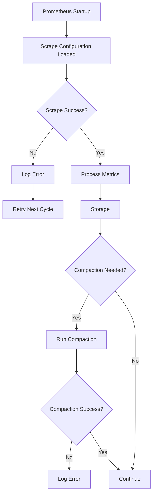

# Prometheus Logs Analysis

## Introduction

When running Prometheus in production environments, effectively analyzing logs is crucial for troubleshooting issues, understanding system behavior, and ensuring your monitoring infrastructure remains healthy. Prometheus generates various logs that provide insights into its internal operations, including scraping targets, rule evaluation, alert processing, and general system status.

In this guide, we'll explore how to locate, understand, and analyze Prometheus logs to identify and resolve common issues. Whether you're debugging failed scrapes, investigating performance problems, or trying to understand why certain alerts aren't firing correctly, mastering log analysis is an essential skill for any Prometheus administrator.

## Locating Prometheus Logs

Before diving into analysis, you first need to know where to find Prometheus logs. The location depends on how you've deployed Prometheus:

### Standard Deployment

When running Prometheus as a standalone binary, logs are written to standard output (stdout) by default. You can redirect these logs to a file using:

```bash
prometheus > prometheus.log 2>&1
```

### Container/Kubernetes Deployment

In containerized environments, logs can be accessed using:

```bash
# Docker
docker logs prometheus-container

# Kubernetes
kubectl logs -n monitoring pod/prometheus-pod
```

### Systemd Service

If running as a systemd service:

```bash
journalctl -u prometheus.service
```

## Log Verbosity Levels

Prometheus supports different log levels that control the amount of information logged:

- `debug`: Most verbose, includes detailed information useful for debugging
- `info`: Default level, logs general operational information
- `warn`: Only logs warning messages and above
- `error`: Only logs error messages

You can set the log level when starting Prometheus:

```bash
prometheus --log.level=debug
```

## Common Log Message Patterns

Understanding common log patterns helps quickly identify issues. Here are key patterns to recognize:

### Startup Messages

When Prometheus starts, it logs configuration details and loaded components:

```
level=info ts=2023-06-15T10:15:30.123Z caller=main.go:350 msg="Starting Prometheus" version="2.45.0"
level=info ts=2023-06-15T10:15:30.124Z caller=main.go:351 build_context="go=1.20.3 user=root date=20230512-11:34:05"
level=info ts=2023-06-15T10:15:30.124Z caller=main.go:352 host_details="linux amd64"
level=info ts=2023-06-15T10:15:30.125Z caller=main.go:353 fd_limits="soft=1024 hard=4096"
level=info ts=2023-06-15T10:15:30.125Z caller=main.go:354 vm_limits="address_space_unlimited=true"
```

### Scrape Logs

Scrape logs detail the process of collecting metrics from targets:

```
level=debug ts=2023-06-15T10:20:45.678Z caller=scrape.go:1373 component="scrape manager" scrape_pool=node target=http://node-exporter:9100/metrics msg="Scrape failed" err="Get \"http://node-exporter:9100/metrics\": dial tcp: lookup node-exporter: no such host"
```

### Storage Logs

These logs relate to the time-series database operations:

```
level=info ts=2023-06-15T11:05:12.345Z caller=compact.go:495 component=tsdb msg="Compaction completed" duration=13.456789s
```

### Rule Evaluation Logs

Logs related to recording rules and alert rules:

```
level=info ts=2023-06-15T12:30:25.678Z caller=manager.go:566 component="rule manager" group=node.rules msg="Evaluating rule" rule="NodeExporterDown"
```

## Analyzing Different Types of Issues

Let's examine common issues and how to identify them through log analysis:

### 1. Target Scrape Failures

Scrape failures are among the most common issues:

```
level=warn ts=2023-06-15T14:10:45.123Z caller=scrape.go:1373 component="scrape manager" scrape_pool=app target=http://app:8080/metrics msg="Scrape failed" err="context deadline exceeded"
```

This log indicates a timeout when trying to scrape the target. Possible causes:
- Target application is too slow to respond
- Network latency issues
- Target is under heavy load

**Troubleshooting steps:**
1. Check if the target is accessible from the Prometheus server
2. Examine the target's resource usage
3. Consider increasing the scrape timeout in your Prometheus configuration:

```yaml
scrape_configs:
  - job_name: 'app'
    scrape_timeout: 30s
    static_configs:
      - targets: ['app:8080']
```

### 2. Out of Memory Errors

When Prometheus encounters memory issues:

```
level=error ts=2023-06-15T15:30:12.456Z caller=main.go:747 msg="Error running Prometheus" err="runtime: out of memory"
```

**Troubleshooting steps:**
1. Increase available memory for Prometheus
2. Optimize storage by adjusting retention:

```yaml
# prometheus.yml
global:
  scrape_interval: 15s
  evaluation_interval: 15s
  # Reduce retention to 7 days to save memory
  retention_time: 7d
```

3. Consider implementing sharding or federation for larger deployments

### 3. Rule Evaluation Errors

Errors during rule evaluation:

```
level=error ts=2023-06-15T16:45:23.789Z caller=manager.go:254 component="rule manager" msg="Error evaluating rule" rule="instance:node_cpu:rate5m" err="many-to-many matching not allowed: grouping labels must ensure unique matches"
```

**Troubleshooting steps:**
1. Review the rule syntax
2. Ensure vector matching is correctly specified
3. Fix the rule definition:

```yaml
groups:
  - name: cpu_usage
    rules:
    - record: instance:node_cpu:rate5m
      expr: sum by (instance) (rate(node_cpu_seconds_total{mode!="idle"}[5m]))
```

### 4. TSDB Compaction Issues

Problems with time-series database compaction:

```
level=warn ts=2023-06-15T18:20:34.567Z caller=compact.go:495 component=tsdb msg="Compaction failed" err="open /data/01ABCDEF: no space left on device"
```

**Troubleshooting steps:**
1. Free up disk space
2. Adjust retention periods
3. Consider mounting larger volumes:

```bash
# Docker example
docker run -v /large_storage:/prometheus \
  -p 9090:9090 prom/prometheus
```

## Real-World Log Analysis Example

Let's walk through a complete troubleshooting scenario using log analysis:

### Scenario: Intermittent Alert Firing

You notice that a critical alert is firing inconsistently. Let's analyze the logs to identify the root cause:

1. **Check alert evaluation logs**:

```
level=debug ts=2023-06-15T20:15:45.123Z caller=manager.go:566 component="rule manager" group=alerts.rules msg="Evaluating rule" rule="HighErrorRate"
level=info ts=2023-06-15T20:15:45.125Z caller=manager.go:578 component="rule manager" group=alerts.rules msg="Rule evaluation completed" duration=2.05s
level=debug ts=2023-06-15T20:16:00.123Z caller=manager.go:566 component="rule manager" group=alerts.rules msg="Evaluating rule" rule="HighErrorRate"
level=error ts=2023-06-15T20:16:00.126Z caller=manager.go:568 component="rule manager" group=alerts.rules msg="Error evaluating rule" rule="HighErrorRate" err="query timed out"
```

2. **Investigate query performance**:

```
level=warn ts=2023-06-15T20:16:00.126Z caller=query_logger.go:95 component=query-logger msg="Query execution took longer than expected" query="sum(rate(http_requests_total{status=~\"5..\"}[5m])) / sum(rate(http_requests_total[5m])) > 0.05" duration=30.001s
```

3. **Check for resource constraints**:

```
level=warn ts=2023-06-15T20:15:59.789Z caller=memory.go:61 component=tsdb msg="Memory limit approaching" current=7.5GB limit=8GB percentage=93.75%
```

**Analysis and solution**:
1. The alert rule is timing out when evaluating because the query is too complex
2. High memory usage is causing performance degradation
3. Solution:
   - Optimize the query to be more efficient
   - Increase memory resources for Prometheus
   - Consider splitting complex rules into simpler ones

### Fixed Configuration

```yaml
# Updated rule
groups:
  - name: alerts
    rules:
      - alert: HighErrorRate
        # Optimized query with more specific selectors
        expr: sum by (job, instance) (rate(http_requests_total{status=~"5.."}[5m])) / sum by (job, instance) (rate(http_requests_total[5m])) > 0.05
        for: 5m
        labels:
          severity: warning
        annotations:
          summary: "High error rate detected"
          description: "Error rate is above 5% for 5m on {{ $labels.instance }}"
```

## Advanced Log Analysis Techniques

### 1. Using Log Timestamps for Correlation

When troubleshooting complex issues, correlate logs by timestamp across components:

```bash
grep "2023-06-15T20:15" prometheus.log | sort
```

This helps identify related events across different components.

### 2. Parsing Logs with jq

For JSON-formatted logs, use `jq` for advanced analysis:

```bash
cat prometheus.log | jq 'select(.level=="error")'
```

### 3. Visualizing Log Patterns

Sometimes visualizing log patterns can reveal issues:



## Integrating with Log Management Systems

For production environments, integrating Prometheus logs with centralized logging systems enhances troubleshooting capabilities:

### ELK Stack

```yaml
# filebeat.yml example
filebeat.inputs:
- type: log
  enabled: true
  paths:
    - /var/log/prometheus/*.log
  fields:
    application: prometheus
```

### Loki

```yaml
# promtail config
scrape_configs:
  - job_name: prometheus_logs
    static_configs:
    - targets:
        - localhost
      labels:
        job: prometheus
        __path__: /var/log/prometheus/*.log
```

## Best Practices for Prometheus Log Management

1. **Set appropriate log levels**:
   - Use `info` for normal operations
   - Use `debug` temporarily for troubleshooting

2. **Implement log rotation**:
   - Prevent logs from consuming too much disk space

```bash
# logrotate configuration example
/var/log/prometheus/*.log {
    daily
    rotate 7
    compress
    delaycompress
    missingok
    notifempty
    create 0640 prometheus prometheus
}
```

3. **Add context to your alerts**:
   - Include relevant log snippets in alert annotations

```yaml
annotations:
  summary: "Prometheus scrape failures"
  description: "Prometheus is experiencing scrape failures. Check logs with: 'grep \"scrape failed\" /var/log/prometheus/prometheus.log'"
```

4. **Document common log patterns**:
   - Create a team knowledge base of common log patterns and resolutions

## Summary

Effective Prometheus log analysis is essential for maintaining a healthy monitoring system. By understanding log locations, message patterns, and common issues, you can quickly identify and resolve problems before they impact your monitoring capabilities.

Remember these key points:
- Know where to find Prometheus logs based on your deployment method
- Understand different log levels and when to use them
- Recognize common log patterns for various components
- Use systematic troubleshooting approaches based on log evidence
- Implement best practices for log management in production

## Additional Resources and Exercises

### Resources

- [Prometheus Documentation: Operational Aspects](https://prometheus.io/docs/operating/storage/)
- [Prometheus GitHub Issues](https://github.com/prometheus/prometheus/issues) - Often contain valuable troubleshooting information
- [Prometheus Community Forums](https://community.prometheus.io/) - Where you can get help with specific problems

### Exercises

1. **Log Pattern Recognition**:
   - Examine a set of Prometheus logs and identify three different types of issues
   - Document the patterns you discovered

2. **Log Analysis Tool Development**:
   - Create a simple script that extracts and summarizes scrape failures from Prometheus logs
   - Example starting point:

```bash
grep "scrape failed" prometheus.log | awk '{print $10}' | sort | uniq -c | sort -nr
```

3. **Alert Integration**:
   - Design an AlertManager template that includes relevant log extraction commands in alert notifications
   - Test the alerts to ensure they provide actionable information

4. **Performance Correlation**:
   - Compare Prometheus logs with system metrics to identify correlations between resource usage and error patterns
   - Create a dashboard that shows both metrics and log-derived data