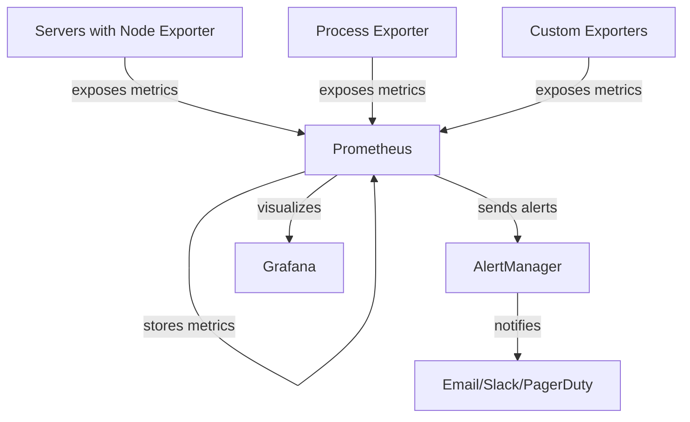

# Server Monitoring with Prometheus

## Introduction

Server monitoring is a critical aspect of maintaining a healthy and reliable infrastructure. It involves tracking various system metrics such as CPU usage, memory consumption, disk I/O, and network traffic to ensure optimal performance and early detection of potential issues. Prometheus, as a powerful monitoring and alerting toolkit, excels at server monitoring tasks by providing robust data collection, storage, and querying capabilities.

In this guide, we'll explore how to set up Prometheus for effective server monitoring, understand key metrics to track, and learn how to create meaningful dashboards and alerts for your infrastructure.

## Why Monitor Servers with Prometheus?

Before diving into the implementation details, let's understand why Prometheus is an excellent choice for server monitoring:

1. **Pull-based Architecture**: Prometheus pulls metrics from targets, simplifying firewall configurations and providing better control over monitoring.
2. **Time Series Database**: Built-in storage optimized for time-series data with efficient compression.
3. **Powerful Query Language (PromQL)**: Enables complex data analysis and aggregation.
4. **Service Discovery**: Automatically discovers and monitors new servers in dynamic environments.
5. **Alerting Capabilities**: Integrated alerting with AlertManager for proactive issue detection.
6. **Extensive Ecosystem**: Rich collection of exporters and integrations for various systems.

## Setting Up Node Exporter

The first step in server monitoring with Prometheus is to deploy Node Exporter on each server you want to monitor. Node Exporter is a Prometheus exporter that collects a wide range of hardware and OS metrics.

### Installing Node Exporter

On Linux systems, you can install Node Exporter as follows:

```bash
# Download Node Exporter
wget https://github.com/prometheus/node_exporter/releases/download/v1.5.0/node_exporter-1.5.0.linux-amd64.tar.gz

# Extract the archive
tar xvfz node_exporter-1.5.0.linux-amd64.tar.gz

# Move to /usr/local/bin
sudo mv node_exporter-1.5.0.linux-amd64/node_exporter /usr/local/bin/

# Create a Node Exporter service
sudo useradd -rs /bin/false node_exporter

# Create a systemd service file
sudo tee /etc/systemd/system/node_exporter.service > /dev/null << EOF
[Unit]
Description=Node Exporter
After=network.target

[Service]
User=node_exporter
Group=node_exporter
Type=simple
ExecStart=/usr/local/bin/node_exporter

[Install]
WantedBy=multi-user.target
EOF

# Enable and start the service
sudo systemctl daemon-reload
sudo systemctl enable node_exporter
sudo systemctl start node_exporter
```

Once installed, Node Exporter will expose metrics on port 9100 (by default) at the `/metrics` endpoint.

### Configuring Prometheus to Scrape Node Exporter

Add the following job to your `prometheus.yml` configuration file:

```yaml
scrape_configs:
  - job_name: 'node'
    scrape_interval: 15s
    static_configs:
      - targets: ['localhost:9100', 'server2:9100', 'server3:9100']
```

For dynamic environments, you might want to use service discovery instead:

```yaml
scrape_configs:
  - job_name: 'node'
    scrape_interval: 15s
    consul_sd_configs:
      - server: 'localhost:8500'
        services: ['node-exporter']
```

## Key Server Metrics to Monitor

Node Exporter provides hundreds of metrics. Here are some of the most important categories to focus on:

### CPU Metrics

```promql
# CPU usage percentage per mode (user, system, idle, etc.)
rate(node_cpu_seconds_total{mode!="idle"}[1m])

# Overall CPU usage (all modes except idle)
100 - (avg by (instance) (rate(node_cpu_seconds_total{mode="idle"}[1m])) * 100)

# CPU load averages
node_load1, node_load5, node_load15
```

### Memory Metrics

```promql
# Available memory
node_memory_MemAvailable_bytes

# Memory usage percentage
(1 - (node_memory_MemAvailable_bytes / node_memory_MemTotal_bytes)) * 100

# Swap usage
node_memory_SwapUsed_bytes / node_memory_SwapTotal_bytes
```

### Disk Metrics

```promql
# Disk space usage percentage
(node_filesystem_size_bytes - node_filesystem_free_bytes) / node_filesystem_size_bytes * 100

# Disk I/O operations
rate(node_disk_reads_completed_total[1m])
rate(node_disk_writes_completed_total[1m])

# Disk I/O bytes
rate(node_disk_read_bytes_total[1m])
rate(node_disk_written_bytes_total[1m])
```

### Network Metrics

```promql
# Network traffic
rate(node_network_receive_bytes_total[1m])
rate(node_network_transmit_bytes_total[1m])

# Network errors
rate(node_network_receive_errs_total[1m])
rate(node_network_transmit_errs_total[1m])
```

## Creating a Server Monitoring Dashboard

A well-designed dashboard helps visualize server performance at a glance. You can use Grafana to create dashboards for your Prometheus metrics.

Here's a basic dashboard structure:

1. **System Overview Panel**:
   - CPU, Memory, Disk, and Network usage at a glance
   - System uptime
   - Number of processes

2. **CPU Panel**:
   - CPU usage over time
   - CPU usage by mode (user, system, iowait)
   - Load average

3. **Memory Panel**:
   - Memory usage over time
   - Swap usage
   - Memory by type (used, cached, buffers)

4. **Disk Panel**:
   - Disk space usage by mount point
   - Disk I/O operations
   - Disk latency

5. **Network Panel**:
   - Network traffic in/out
   - Network packets in/out
   - Network errors

Here's a Grafana dashboard JSON example for a system overview panel:

```json
{
  "panels": [
    {
      "title": "CPU Usage",
      "type": "graph",
      "targets": [
        {
          "expr": "100 - (avg by (instance) (rate(node_cpu_seconds_total{mode=\"idle\"}[1m])) * 100)"
        }
      ]
    },
    {
      "title": "Memory Usage",
      "type": "graph",
      "targets": [
        {
          "expr": "(1 - (node_memory_MemAvailable_bytes / node_memory_MemTotal_bytes)) * 100"
        }
      ]
    }
  ]
}
```

## Setting Up Alerts

Prometheus allows you to set up alerts to proactively notify you of potential issues. Here are some common server monitoring alerts:

### Alert Rules Configuration

Create a file named `server_alerts.yml`:

```yaml
groups:
- name: server_alerts
  rules:
  - alert: HighCPULoad
    expr: 100 - (avg by(instance) (rate(node_cpu_seconds_total{mode="idle"}[5m])) * 100) > 80
    for: 5m
    labels:
      severity: warning
    annotations:
      summary: "High CPU load (instance {{ $labels.instance }})"
      description: "CPU load is above 80% for 5 minutes
  VALUE = {{ $value }}
  LABELS = {{ $labels }}"

  - alert: HighMemoryUsage
    expr: (1 - (node_memory_MemAvailable_bytes / node_memory_MemTotal_bytes)) * 100 > 90
    for: 5m
    labels:
      severity: warning
    annotations:
      summary: "High memory usage (instance {{ $labels.instance }})"
      description: "Memory usage is above 90% for 5 minutes
  VALUE = {{ $value }}
  LABELS = {{ $labels }}"

  - alert: DiskSpaceRunningOut
    expr: (node_filesystem_size_bytes - node_filesystem_free_bytes) / node_filesystem_size_bytes * 100 > 85
    for: 5m
    labels:
      severity: warning
    annotations:
      summary: "Disk space running out (instance {{ $labels.instance }})"
      description: "Disk usage is above 85%
  VALUE = {{ $value }}
  LABELS = {{ $labels }}"
```

Then, include this file in your `prometheus.yml`:

```yaml
rule_files:
  - "server_alerts.yml"

alerting:
  alertmanagers:
  - static_configs:
    - targets:
      - alertmanager:9093
```

## Advanced Server Monitoring with Prometheus

Beyond basic metrics, you can implement more advanced monitoring techniques:

### Process Monitoring

Monitor specific processes using the `process-exporter`:

```bash
# Install process-exporter
wget https://github.com/ncabatoff/process-exporter/releases/download/v0.7.10/process-exporter-0.7.10.linux-amd64.tar.gz
tar xvfz process-exporter-0.7.10.linux-amd64.tar.gz
sudo mv process-exporter-0.7.10.linux-amd64/process-exporter /usr/local/bin/
```

Create a configuration file:

```yaml
process_names:
  - name: "{{.Matches}}"
    cmdline:
    - 'nginx'
  - name: "{{.Matches}}"
    cmdline:
    - 'postgres'
```

Then configure Prometheus to scrape it.

### Hardware Monitoring

For hardware-level metrics, you can use various specialized exporters:

- **IPMI Exporter**: For server hardware metrics
- **SNMP Exporter**: For network devices
- **Nvidia DCGM Exporter**: For GPU metrics

### Log Monitoring

Combine Prometheus with tools like Loki for log monitoring:

```yaml
scrape_configs:
  - job_name: loki
    static_configs:
      - targets: ['loki:3100']
```

## Monitoring Architecture Visualization

Here's a diagram showing how the components fit together:



## Practical Example: Complete Monitoring Setup

Let's walk through a complete example of setting up server monitoring for a web application:

1. **Prerequisites**:
   - Multiple servers running Linux
   - Docker installed (optional, for containerized setup)

2. **Step 1**: Install Node Exporter on all servers (as shown earlier)

3. **Step 2**: Set up Prometheus with the following configuration:

```yaml
global:
  scrape_interval: 15s
  evaluation_interval: 15s

rule_files:
  - "server_alerts.yml"

alerting:
  alertmanagers:
  - static_configs:
    - targets:
      - alertmanager:9093

scrape_configs:
  - job_name: 'prometheus'
    static_configs:
      - targets: ['localhost:9090']

  - job_name: 'node'
    static_configs:
      - targets: ['server1:9100', 'server2:9100', 'server3:9100']
        labels:
          environment: production
      - targets: ['dev-server:9100']
        labels:
          environment: development
```

4. **Step 3**: Set up AlertManager:

```yaml
global:
  resolve_timeout: 5m
  slack_api_url: 'https://hooks.slack.com/services/YOUR_SLACK_WEBHOOK'

route:
  group_by: ['alertname', 'instance', 'severity']
  group_wait: 30s
  group_interval: 5m
  repeat_interval: 4h
  receiver: 'slack-notifications'
  routes:
  - match:
      severity: critical
    receiver: 'pagerduty-notifications'

receivers:
- name: 'slack-notifications'
  slack_configs:
  - channel: '#monitoring'
    send_resolved: true
    title: "{{ .GroupLabels.alertname }}"
    text: "{{ range .Alerts }}{{ .Annotations.description }}
{{ end }}"

- name: 'pagerduty-notifications'
  pagerduty_configs:
  - service_key: YOUR_PAGERDUTY_KEY
```

5. **Step 4**: Set up Grafana and create a dashboard

6. **Step 5**: Create custom recording rules for frequently used queries:

```yaml
groups:
- name: recording_rules
  rules:
  - record: instance:node_cpu_usage:rate5m
    expr: 100 - (avg by (instance) (rate(node_cpu_seconds_total{mode="idle"}[5m])) * 100)
  
  - record: instance:node_memory_usage:percent
    expr: (1 - (node_memory_MemAvailable_bytes / node_memory_MemTotal_bytes)) * 100
```

## Troubleshooting Common Issues

When setting up server monitoring with Prometheus, you might encounter these common issues:

1. **Node Exporter Not Accessible**:
   - Check if the Node Exporter service is running: `systemctl status node_exporter`
   - Verify firewall rules allow access to port 9100
   - Test the endpoint directly: `curl http://localhost:9100/metrics`

2. **Missing Metrics**:
   - Ensure the server's time is synchronized using NTP
   - Check if the Prometheus scrape job is correctly configured
   - Look for errors in Prometheus logs: `journalctl -u prometheus`

3. **High Cardinality Issues**:
   - Be cautious with metrics that have many unique label combinations
   - Use recording rules to pre-aggregate data
   - Consider using `topk` or `bottomk` in your queries

## Summary

Server monitoring with Prometheus provides a robust foundation for maintaining reliable infrastructure. By collecting and analyzing key metrics, you can:

- **Detect Issues Early**: Identify problems before they affect users
- **Optimize Performance**: Find bottlenecks and improve efficiency
- **Plan Capacity**: Make informed decisions about scaling resources
- **Enhance Security**: Detect unusual patterns that might indicate security issues

This guide covered the basics of setting up Node Exporter, configuring Prometheus, creating dashboards, and setting up alerts. As you become more comfortable with these concepts, you can extend your monitoring setup to include more specialized metrics and advanced analysis techniques.

## Additional Resources

To continue learning about server monitoring with Prometheus, check out these resources:

- [Official Prometheus Documentation](https://prometheus.io/docs/introduction/overview/)
- [Node Exporter Documentation](https://github.com/prometheus/node_exporter)
- [PromQL Cheat Sheet](https://promlabs.com/promql-cheat-sheet/)
- [Grafana Dashboard Examples](https://grafana.com/grafana/dashboards/)

## Exercises

1. **Basic Setup**: Install Node Exporter on a test server and configure Prometheus to scrape it.
2. **Dashboard Creation**: Create a Grafana dashboard showing the four golden signals (latency, traffic, errors, and saturation).
3. **Alert Configuration**: Set up alerts for high CPU, memory, disk usage, and unreachable targets.
4. **Custom Metrics**: Use the textfile collector to expose custom metrics from your application.
5. **Recording Rules**: Create recording rules for frequently used queries to improve performance.