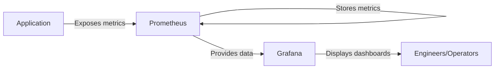

# Application Monitoring

## Introduction

Application monitoring is a critical practice in modern software development that involves tracking and analyzing the performance, health, and behavior of your applications. With Prometheus, you can implement powerful application monitoring to detect issues early, optimize performance, and understand user behavior patterns.

In this guide, we'll explore how Prometheus can be used to monitor applications, the instrumentation process, and how to extract meaningful insights from your application metrics.

## Why Monitor Applications with Prometheus?

Application monitoring with Prometheus offers several key advantages:

1. **Real-time visibility**: Get immediate insights into how your applications are performing
2. **Proactive issue detection**: Identify problems before they affect users
3. **Performance optimization**: Discover bottlenecks and optimization opportunities
4. **Business insights**: Understand usage patterns and feature adoption
5. **Data-driven decisions**: Base technical and product decisions on actual metrics

## Understanding Application Instrumentation

Instrumentation is the process of adding code to your application that exposes metrics for collection by monitoring systems like Prometheus.

### Types of Application Metrics

When monitoring applications, you typically collect four types of metrics:

1. **Counters**: Cumulative metrics that only increase (e.g., number of requests processed)
2. **Gauges**: Metrics that can increase or decrease (e.g., current memory usage)
3. **Histograms**: Sample observations distributed into configurable buckets (e.g., request duration)
4. **Summaries**: Similar to histograms but calculate percentiles server-side

## Instrumenting Your Application for Prometheus

Let's look at how to instrument applications in different languages:

### Node.js Application Example

First, install the Prometheus client library:

```bash
npm install prom-client
```

Then, implement instrumentation in your application:

```javascript
const express = require('express');
const promClient = require('prom-client');

// Create a Registry to register metrics
const register = new promClient.Registry();
promClient.collectDefaultMetrics({ register });

// Create custom metrics
const httpRequestCounter = new promClient.Counter({
  name: 'http_requests_total',
  help: 'Total number of HTTP requests',
  labelNames: ['method', 'route', 'status_code'],
  registers: [register]
});

const httpRequestDuration = new promClient.Histogram({
  name: 'http_request_duration_seconds',
  help: 'HTTP request duration in seconds',
  labelNames: ['method', 'route', 'status_code'],
  buckets: [0.1, 0.3, 0.5, 0.7, 1, 3, 5, 7, 10],
  registers: [register]
});

const app = express();

// Middleware to track requests
app.use((req, res, next) => {
  const start = Date.now();
  
  res.on('finish', () => {
    // Increment the request counter
    httpRequestCounter.inc({
      method: req.method,
      route: req.route ? req.route.path : req.path,
      status_code: res.statusCode
    });
    
    // Observe request duration
    const duration = (Date.now() - start) / 1000;
    httpRequestDuration.observe(
      {
        method: req.method,
        route: req.route ? req.route.path : req.path,
        status_code: res.statusCode
      },
      duration
    );
  });
  
  next();
});

// Expose metrics endpoint for Prometheus scraping
app.get('/metrics', async (req, res) => {
  res.set('Content-Type', register.contentType);
  res.end(await register.metrics());
});

app.get('/', (req, res) => {
  res.send('Hello World!');
});

app.listen(3000, () => {
  console.log('Server is running on port 3000');
});
```

### Java Application Example with Spring Boot

For Spring Boot applications, you can use the Micrometer library with Prometheus support:

First, add the dependencies to your `pom.xml`:

```xml
<dependency>
    <groupId>org.springframework.boot</groupId>
    <artifactId>spring-boot-starter-actuator</artifactId>
</dependency>
<dependency>
    <groupId>io.micrometer</groupId>
    <artifactId>micrometer-registry-prometheus</artifactId>
</dependency>
```

Configure your `application.properties` or `application.yml`:

```properties
# Enable Prometheus endpoint
management.endpoints.web.exposure.include=prometheus,health,info
management.endpoint.prometheus.enabled=true
```

Then create a custom metric in your service:

```java
import io.micrometer.core.instrument.Counter;
import io.micrometer.core.instrument.MeterRegistry;
import org.springframework.stereotype.Service;

@Service
public class UserService {
    private final Counter userRegistrationCounter;
    
    public UserService(MeterRegistry registry) {
        this.userRegistrationCounter = Counter.builder("app_user_registrations_total")
            .description("Total number of user registrations")
            .register(registry);
    }
    
    public void registerUser(User user) {
        // User registration logic
        
        // Increment the counter
        userRegistrationCounter.increment();
    }
}
```

## Prometheus Configuration for Application Monitoring

Once your application is instrumented, configure Prometheus to scrape the metrics:

```yaml
global:
  scrape_interval: 15s

scrape_configs:
  - job_name: 'my-app'
    metrics_path: '/metrics'
    static_configs:
      - targets: ['localhost:3000']
  
  - job_name: 'spring-boot-app'
    metrics_path: '/actuator/prometheus'
    static_configs:
      - targets: ['localhost:8080']
```

## Designing Effective Application Metrics

When designing metrics for your application, consider these best practices:

1. **Use clear naming conventions**: Follow the format `namespace_subsystem_name_unit`
2. **Label wisely**: Use labels to differentiate metrics but avoid high cardinality
3. **Focus on what matters**: Monitor what impacts users and business outcomes
4. **Include all request outcomes**: Track errors, not just successes
5. **Avoid exposing sensitive data**: Never include personal data or secrets in metrics

## Visualizing Application Metrics with Grafana

While Prometheus has a basic UI, Grafana provides better visualization capabilities:



A typical Grafana dashboard for application monitoring might include:

1. Request rate, errors, and duration (RED metrics)
2. Resource utilization (CPU, memory)
3. Business metrics (user signups, transactions)
4. System-level metrics (garbage collection, thread count)

## Common Application Monitoring Patterns

### The RED Pattern

The RED pattern focuses on three key metrics:

- **Rate**: Requests per second
- **Errors**: Failed requests per second
- **Duration**: Distribution of request latencies

Example PromQL queries for RED metrics:

```
# Rate of requests
sum(rate(http_requests_total[5m])) by (service)

# Error rate
sum(rate(http_requests_total{status_code=~"5.."}[5m])) by (service) / sum(rate(http_requests_total[5m])) by (service)

# 95th percentile latency
histogram_quantile(0.95, sum(rate(http_request_duration_seconds_bucket[5m])) by (service, le))
```

### The USE Pattern

The USE pattern focuses on resources:

- **Utilization**: Percentage of time the resource is busy
- **Saturation**: Amount of work the resource has to do
- **Errors**: Count of error events

## Setting Up Alerts for Application Monitoring

Create alert rules for application issues:

```yaml
groups:
- name: application-alerts
  rules:
  - alert: HighErrorRate
    expr: sum(rate(http_requests_total{status_code=~"5.."}[5m])) by (service) / sum(rate(http_requests_total[5m])) by (service) > 0.05
    for: 5m
    labels:
      severity: warning
    annotations:
      summary: "High error rate on {{ $labels.service }}"
      description: "Service {{ $labels.service }} has error rate above 5% (current value: {{ $value }})"

  - alert: SlowResponses
    expr: histogram_quantile(0.95, sum(rate(http_request_duration_seconds_bucket[5m])) by (service, le)) > 1
    for: 5m
    labels:
      severity: warning
    annotations:
      summary: "Slow responses on {{ $labels.service }}"
      description: "Service {{ $labels.service }} has 95th percentile latency above 1s (current value: {{ $value }}s)"
```

## Real-World Case Study: E-commerce Application Monitoring

Let's consider an e-commerce application with these components:

1. Frontend service
2. Product catalog service
3. Cart service
4. Payment service
5. Order service

Key metrics to monitor:

**Business Metrics:**
- Product page views
- Add-to-cart actions
- Checkout starts
- Completed purchases
- Cart abandonment rate

**Technical Metrics:**
- API endpoint latency
- Database query time
- Error rates by service
- Dependency health

Example dashboard structure:

1. **Overview Dashboard**: High-level health of all services
2. **User Journey Dashboard**: Conversion funnel metrics
3. **Service-Specific Dashboards**: Detailed metrics for each service
4. **Infrastructure Dashboard**: Underlying resource utilization

## Troubleshooting Common Issues

When troubleshooting application problems with Prometheus:

1. **High Latency**:
   - Check for slow database queries
   - Look for resource saturation
   - Examine external dependency performance

2. **Error Spikes**:
   - Check recent deployments
   - Look for dependency failures
   - Examine logs alongside metrics

3. **Memory Leaks**:
   - Track memory usage over time
   - Monitor garbage collection metrics
   - Look for increasing resource usage without corresponding traffic increase

## Summary

Application monitoring with Prometheus provides critical insights into your application's health, performance, and behavior. By properly instrumenting your code, configuring Prometheus, and setting up useful dashboards and alerts, you can:

- Detect and resolve issues quickly
- Optimize application performance
- Make data-driven decisions about improvements
- Understand how users interact with your application

Remember that effective monitoring is an ongoing process that evolves with your application, and the metrics you collect should always align with your business and technical objectives.

## Exercises

1. Instrument a simple application in your preferred language to expose Prometheus metrics
2. Configure Prometheus to scrape your application
3. Create a Grafana dashboard showing the RED metrics for your application
4. Set up an alert for high error rates
5. Add a custom business metric relevant to your application domain

## Additional Resources

- [Prometheus Documentation](https://prometheus.io/docs/)
- [Prometheus Client Libraries](https://prometheus.io/docs/instrumenting/clientlibs/)
- [Grafana Documentation](https://grafana.com/docs/)
- [RED Method Explained](https://www.weave.works/blog/the-red-method-key-metrics-for-microservices-architecture/)
- [USE Method Explained](http://www.brendangregg.com/usemethod.html)