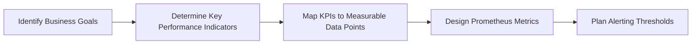
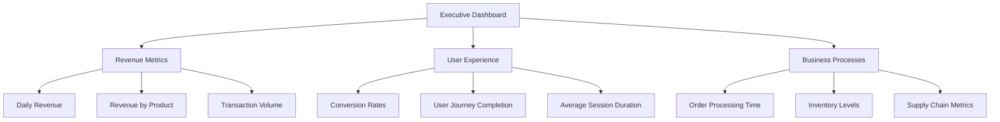

# Business Metrics

## Introduction

Business metrics are quantifiable measures used to track and assess the status of specific business processes. When integrated with Prometheus, these metrics become powerful tools for real-time monitoring, analysis, and decision-making. This guide explores how to implement business-oriented monitoring using Prometheus, helping you translate technical monitoring into valuable business insights.

## Why Monitor Business Metrics with Prometheus?

Prometheus is traditionally known for infrastructure and application monitoring, but its value extends far beyond technical metrics. By monitoring business metrics, you can:

- Create a direct link between technical performance and business outcomes
- Quantify the impact of technical issues on revenue or user experience
- Enable data-driven decision making across technical and non-technical teams
- Establish early warning systems for business-critical processes

## Key Business Metrics You Can Monitor

### 1. Revenue Metrics

Revenue metrics help you understand the financial impact of your systems:

- **Transaction Volume**: Number of purchases or orders
- **Revenue Per Second**: Rate of money flowing through your systems
- **Average Order Value**: Typical purchase amount
- **Revenue by Product/Category**: Financial performance of specific offerings

### 2. User Experience Metrics

User experience metrics help quantify customer satisfaction:

- **Conversion Rates**: Percentage of users completing key actions
- **Checkout Success Rate**: Percentage of successful purchases
- **User Journey Completion**: Success rates for multi-step processes
- **Session Duration**: Time users spend on your platform
- **Cart Abandonment Rate**: Percentage of users leaving without completing purchases

### 3. Business Process Metrics

Business process metrics track the health of operational workflows:

- **Order Processing Time**: Time from order to fulfillment
- **Inventory Turnover**: Rate at which inventory is sold and replaced
- **Supply Chain Metrics**: Lead times, fulfillment rates
- **Customer Service Response Time**: Time to resolve customer inquiries

## Implementing Business Metrics in Prometheus

### Step 1: Define Your Business Metric Requirements

Start by identifying which business metrics matter most to your organization:



### Step 2: Instrument Your Applications

Add instrumentation to your applications to expose business metrics:

```python
from prometheus_client import Counter, Histogram, Gauge

# Revenue metrics
transaction_counter = Counter('sales_transactions_total', 'Total number of completed sales')
revenue_counter = Counter('sales_revenue_dollars_total', 'Total revenue in dollars')
average_order_value = Gauge('sales_average_order_value_dollars', 'Average value of orders in dollars')

# User experience metrics
checkout_started = Counter('checkout_started_total', 'Number of checkout processes initiated')
checkout_completed = Counter('checkout_completed_total', 'Number of successful checkouts')
checkout_duration = Histogram('checkout_duration_seconds', 'Time taken to complete checkout',
                              buckets=[1, 5, 10, 30, 60, 120, 300, 600])

# Business process metrics
order_processing_time = Histogram('order_processing_duration_seconds', 'Time to process orders',
                                 buckets=[60, 300, 600, 1800, 3600, 7200, 14400, 28800, 86400])
inventory_level = Gauge('inventory_items_count', 'Current inventory level', ['product_id', 'warehouse'])
```

In your application code, update these metrics at appropriate points:

```python
def process_order(order):
    # Start timer for order processing
    start_time = time.time()
    
    # Update transaction count
    transaction_counter.inc()
    
    # Update revenue metrics
    order_total = calculate_order_total(order)
    revenue_counter.inc(order_total)
    
    # Process the order...
    # ...
    
    # Record order processing time
    processing_time = time.time() - start_time
    order_processing_time.observe(processing_time)
    
    # Update inventory levels
    for item in order.items:
        inventory_level.labels(product_id=item.product_id, warehouse=item.warehouse).dec(item.quantity)
    
    return order_confirmation
```

### Step 3: Create Business-Focused PromQL Queries

Once your metrics are collected, you can create PromQL queries to extract business insights:

#### Conversion Rate:

```
checkout_completed_total / checkout_started_total
```

#### Revenue Per Minute:

```
rate(sales_revenue_dollars_total[5m]) * 60
```

#### Average Order Processing Time:

```
rate(order_processing_duration_seconds_sum[1h]) / rate(order_processing_duration_seconds_count[1h])
```

#### Success Rate by Product Category:

```
sum(rate(checkout_completed_total[5m])) by (product_category) / sum(rate(checkout_started_total[5m])) by (product_category)
```

### Step 4: Create Business-Oriented Dashboards

Design Grafana dashboards that present business metrics in an accessible way:



### Step 5: Set Up Business-Focused Alerts

Configure alerts that trigger when business metrics indicate problems:

```yaml
groups:
- name: business_alerts
  rules:
  - alert: LowConversionRate
    expr: checkout_completed_total / checkout_started_total < 0.3
    for: 15m
    labels:
      severity: warning
      team: ecommerce
    annotations:
      summary: "Low conversion rate detected"
      description: "Checkout conversion rate has dropped below 30% for the past 15 minutes"

  - alert: HighOrderProcessingTime
    expr: rate(order_processing_duration_seconds_sum[10m]) / rate(order_processing_duration_seconds_count[10m]) > 300
    for: 5m
    labels:
      severity: warning
      team: fulfillment
    annotations:
      summary: "Order processing slowdown"
      description: "Average order processing time exceeds 5 minutes"

  - alert: LowInventoryLevel
    expr: inventory_items_count < 10
    for: 5m
    labels:
      severity: warning
      team: inventory
    annotations:
      summary: "Low inventory detected"
      description: "Inventory for {{ $labels.product_id }} in {{ $labels.warehouse }} is below 10 units"
```

## Real-World Example: E-commerce Monitoring

Let's build a comprehensive example for an e-commerce platform that wants to monitor its business performance using Prometheus.

First, we'll define key metrics for our online store:

```python
from prometheus_client import Counter, Histogram, Gauge, Summary

# Product page metrics
product_views = Counter('product_views_total', 'Number of product page views', ['product_id', 'category'])
add_to_cart = Counter('add_to_cart_total', 'Number of add-to-cart actions', ['product_id'])

# Checkout funnel
cart_views = Counter('cart_views_total', 'Number of cart views')
checkout_starts = Counter('checkout_starts_total', 'Number of checkout processes initiated')
checkout_completions = Counter('checkout_completions_total', 'Number of successful checkouts')
checkout_duration = Histogram('checkout_duration_seconds', 'Time to complete checkout process',
                             buckets=[5, 15, 30, 60, 120, 300, 600])

# Revenue metrics
sales_total = Counter('sales_dollars_total', 'Total sales in dollars')
sales_by_category = Counter('sales_dollars_by_category_total', 'Sales by product category', ['category']) 

# Customer metrics
new_accounts = Counter('new_customer_accounts_total', 'New customer registrations')
returning_customers = Counter('returning_customer_purchases_total', 'Purchases by returning customers')
```

Next, we'll implement a function to record a completed purchase:

```python
def record_purchase(order):
    # Record the sale amount
    order_total = sum(item.price * item.quantity for item in order.items)
    sales_total.inc(order_total)
    
    # Record sales by category
    for item in order.items:
        sales_by_category.labels(category=item.category).inc(item.price * item.quantity)
    
    # Record checkout completion
    checkout_completions.inc()
    
    # Record if this is a returning customer
    if order.customer.previous_orders > 0:
        returning_customers.inc()
    
    # Update inventory (simplified example)
    for item in order.items:
        inventory_gauge = Gauge(f'inventory_{item.product_id}', f'Inventory for product {item.product_id}')
        inventory_gauge.dec(item.quantity)
```

Now, let's create some PromQL queries to analyze our business:

### Conversion Funnel Analysis:

```
# View-to-Cart Conversion
sum(rate(add_to_cart_total[1h])) / sum(rate(product_views_total[1h]))

# Cart-to-Checkout Conversion
sum(rate(checkout_starts_total[1h])) / sum(rate(cart_views_total[1h]))

# Checkout-to-Purchase Conversion
sum(rate(checkout_completions_total[1h])) / sum(rate(checkout_starts_total[1h]))

# Overall Conversion Rate
sum(rate(checkout_completions_total[1h])) / sum(rate(product_views_total[1h]))
```

### Revenue Analysis:

```
# Hourly Revenue
rate(sales_dollars_total[1h]) * 3600

# Revenue by Category
topk(5, sum(rate(sales_dollars_by_category_total[24h])) by (category))

# Average Order Value
rate(sales_dollars_total[24h]) / rate(checkout_completions_total[24h])
```

### Customer Behavior Analysis:

```
# Percentage of Sales from Returning Customers
rate(returning_customer_purchases_total[7d]) / rate(checkout_completions_total[7d])

# New Customer Acquisition Rate
rate(new_customer_accounts_total[1d])
```

## Integration with Business Systems

To maximize the value of business metrics, integrate Prometheus with other business systems:

1. **Export data to BI tools** using Prometheus remote write or API endpoints
2. **Connect metrics to CRM systems** to understand customer impact
3. **Feed data into ML models** for predictive analytics
4. **Build automation based on metrics** (e.g., auto-reordering when inventory is low)

## Best Practices for Business Metrics

1. **Start with clear business objectives** before defining metrics
2. **Create a common language** between technical and business teams
3. **Focus on actionable metrics** that drive decisions
4. **Establish baselines and targets** for each metric
5. **Correlate technical and business metrics** to understand causation
6. **Review and refine metrics** regularly as business needs evolve

## Summary

Prometheus is a powerful tool for monitoring not just technical infrastructure but also business performance. By instrumenting your applications to expose business metrics, you can:

- Track revenue and financial performance in real-time
- Understand user behavior and conversion funnels
- Monitor business processes and operational efficiency
- Create a data-driven culture across technical and business teams

The key to success is identifying the metrics that matter most to your business, instrumenting your applications appropriately, and creating accessible dashboards and alerts that drive action.

## Additional Resources

- **Prometheus Documentation**: Learn more about metric types and best practices
- **Grafana Dashboard Templates**: Find pre-built dashboards for business metrics
- **PromQL Exercises**: Practice writing queries for business analysis

## Exercises

1. **Funnel Analysis**: Implement instrumentation for a multi-step user journey in your application and create a dashboard showing conversion at each step.

2. **Revenue Impact**: Create an alert that triggers when technical issues (like high latency) correlate with a drop in revenue.

3. **Custom Business Metric**: Define and implement a business metric specific to your organization that isn't covered in this guide.

4. **Executive Dashboard**: Design a high-level dashboard for non-technical stakeholders that shows key business metrics without technical details.