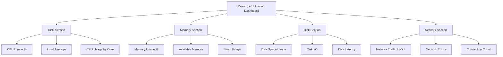

# Resource Utilization Analysis

## Introduction

Resource utilization analysis is a critical aspect of modern application monitoring and infrastructure management. It involves measuring, tracking, and optimizing how your systems use computational resources like CPU, memory, network bandwidth, and disk space. 

Prometheus excels at this use case, providing powerful capabilities to collect, store, and analyze resource metrics over time. By understanding resource utilization patterns, you can:

- Identify performance bottlenecks
- Plan capacity more effectively
- Detect anomalies that might indicate problems
- Make data-driven decisions about scaling
- Reduce infrastructure costs by eliminating waste

In this guide, we'll explore how to implement resource utilization analysis with Prometheus, from basic metric collection to advanced visualization and alerting.

## Basic Resource Metrics in Prometheus

Prometheus can collect various resource metrics, either directly or through exporters. The most common resource metrics include:

### CPU Metrics

CPU metrics help you understand processor usage across your systems:

- `node_cpu_seconds_total`: Counter of CPU time spent in different modes (user, system, idle)
- `process_cpu_seconds_total`: Total user and system CPU time spent in seconds
- `rate(node_cpu_seconds_total{mode="idle"}[1m])`: CPU idle rate over 1 minute

### Memory Metrics

Memory metrics track RAM usage:

- `node_memory_MemTotal_bytes`: Total memory available
- `node_memory_MemFree_bytes`: Free memory
- `node_memory_MemAvailable_bytes`: Available memory that can be allocated
- `process_resident_memory_bytes`: Resident memory size in bytes

### Disk Metrics

Disk metrics monitor storage usage:

- `node_filesystem_size_bytes`: Filesystem size in bytes
- `node_filesystem_free_bytes`: Filesystem free space in bytes
- `node_disk_io_time_seconds_total`: Total seconds spent doing I/Os
- `rate(node_disk_read_bytes_total[1m])`: Disk read rate

### Network Metrics

Network metrics track bandwidth and connections:

- `node_network_receive_bytes_total`: Network bytes received
- `node_network_transmit_bytes_total`: Network bytes transmitted
- `node_network_receive_packets_total`: Network packets received
- `node_network_transmit_packets_total`: Network packets transmitted

## Setting Up Resource Metrics Collection

To collect resource metrics with Prometheus, you'll typically use the Node Exporter for host-level metrics and application-specific exporters for service metrics.

### Installing Node Exporter

The Node Exporter is a Prometheus exporter that collects system-level metrics. Here's how to set it up:

```bash
# Download Node Exporter
wget https://github.com/prometheus/node_exporter/releases/download/v1.5.0/node_exporter-1.5.0.linux-amd64.tar.gz

# Extract the archive
tar xvfz node_exporter-1.5.0.linux-amd64.tar.gz

# Run Node Exporter
cd node_exporter-1.5.0.linux-amd64
./node_exporter
```

This starts the Node Exporter, which exposes metrics at http://localhost:9100/metrics.

### Configuring Prometheus to Scrape Node Exporter

Add the following to your `prometheus.yml` configuration file:

```yaml
scrape_configs:
  - job_name: 'node'
    static_configs:
      - targets: ['localhost:9100']
```

Restart Prometheus to apply the changes:

```bash
# Restart Prometheus
systemctl restart prometheus
```

## Analyzing CPU Utilization

CPU utilization is one of the most important metrics to track. Let's explore how to analyze it effectively with Prometheus.

### Basic CPU Usage Query

To calculate the percentage of CPU usage across all cores:

```
100 - (avg by (instance) (rate(node_cpu_seconds_total{mode="idle"}[5m])) * 100)
```

This PromQL query:
1. Takes the rate of idle CPU time over 5 minutes
2. Multiplies by 100 to get a percentage
3. Subtracts from 100 to get the usage percentage instead of idle percentage
4. Averages across all CPU cores by instance

### Visualizing CPU Usage Over Time

Here's an example of how to create a CPU utilization dashboard in Grafana:

1. Add a new panel
2. Use the query above
3. Set the panel type to "Graph" or "Time series"
4. Set appropriate thresholds (e.g., warning at 70%, critical at 90%)

### CPU Saturation Analysis

CPU saturation occurs when processes need more CPU time than is available. A common metric to track this is the system load average:

```
node_load1 / count without(cpu, mode) (node_cpu_seconds_total{mode="idle"})
```

This calculates the 1-minute load average per CPU core. Values consistently above 1.0 indicate potential CPU saturation.

## Memory Utilization Analysis

Memory is another critical resource to monitor. Let's see how to analyze memory usage with Prometheus.

### Memory Usage Percentage

To calculate the percentage of memory used:

```
100 * (1 - (node_memory_MemAvailable_bytes / node_memory_MemTotal_bytes))
```

### Memory Usage by Process

For containerized environments using cAdvisor:

```
container_memory_usage_bytes{name=~".+"}
```

### Detecting Memory Leaks

Memory leaks can be detected by looking for continuously increasing memory usage over time. This PromQL query helps identify potential leaks:

```
delta(process_resident_memory_bytes{job="my-application"}[24h]) > 0
```

This shows the change in resident memory over 24 hours for your application. Positive values that keep increasing might indicate a memory leak.

## Disk Utilization Analysis

Monitoring disk space and I/O is crucial for preventing application outages.

### Disk Space Usage

To calculate the percentage of disk space used:

```
100 - ((node_filesystem_avail_bytes{mountpoint="/"} / node_filesystem_size_bytes{mountpoint="/"}) * 100)
```

### Disk I/O Analysis

High disk I/O can lead to performance issues. To monitor disk I/O utilization:

```
rate(node_disk_io_time_seconds_total{device="sda"}[5m]) * 100
```

This gives the percentage of time the disk was busy over the last 5 minutes.

## Network Utilization Analysis

Network bandwidth can be a bottleneck for distributed applications.

### Network Traffic Rate

To monitor network traffic rate:

```
# Inbound traffic
rate(node_network_receive_bytes_total{device="eth0"}[5m])

# Outbound traffic
rate(node_network_transmit_bytes_total{device="eth0"}[5m])
```

### Network Errors

Network errors can indicate connectivity issues:

```
rate(node_network_receive_errs_total{device="eth0"}[5m])
```

## Creating a Resource Utilization Dashboard

A comprehensive resource utilization dashboard can help you monitor all key metrics in one place. Here's a diagram showing what a typical dashboard might include:



## Setting Up Resource Utilization Alerts

Alerts notify you when resource utilization exceeds acceptable thresholds. Here's how to set up basic resource alerts in Prometheus:

### High CPU Usage Alert

Add this to your `prometheus.rules.yml` file:

```yaml
groups:
- name: resource_alerts
  rules:
  - alert: HighCPUUsage
    expr: 100 - (avg by (instance) (rate(node_cpu_seconds_total{mode="idle"}[5m])) * 100) > 85
    for: 10m
    labels:
      severity: warning
    annotations:
      summary: "High CPU usage detected on {{ $labels.instance }}"
      description: "CPU usage is above 85% for more than 10 minutes. Current value: {{ $value }}%"
```

### Low Disk Space Alert

```yaml
  - alert: LowDiskSpace
    expr: 100 - ((node_filesystem_avail_bytes{mountpoint="/"} / node_filesystem_size_bytes{mountpoint="/"}) * 100) > 85
    for: 5m
    labels:
      severity: warning
    annotations:
      summary: "Low disk space on {{ $labels.instance }}:{{ $labels.mountpoint }}"
      description: "Disk usage is above 85%. Current value: {{ $value }}%"
```

### High Memory Usage Alert

```yaml
  - alert: HighMemoryUsage
    expr: 100 * (1 - (node_memory_MemAvailable_bytes / node_memory_MemTotal_bytes)) > 90
    for: 5m
    labels:
      severity: warning
    annotations:
      summary: "High memory usage on {{ $labels.instance }}"
      description: "Memory usage is above 90%. Current value: {{ $value }}%"
```

## Real-World Use Case: E-Commerce Platform Scaling

Let's look at a practical example of how resource utilization analysis with Prometheus helped an e-commerce platform scale effectively:

### The Challenge

An e-commerce company experienced slow response times during flash sales. They needed to understand their resource bottlenecks and implement auto-scaling based on actual demand patterns.

### The Solution

1. They deployed Prometheus with Node Exporter across all services
2. Created a comprehensive resource utilization dashboard
3. Set up recording rules to calculate resource utilization percentiles
4. Implemented the following PromQL queries to drive auto-scaling decisions:

```
# CPU demand metric for auto-scaling
avg_over_time(100 - (avg by (instance) (rate(node_cpu_seconds_total{mode="idle",job="api-servers"}[5m])) * 100)[30m:])

# Memory demand metric for auto-scaling
avg_over_time(100 * (1 - (node_memory_MemAvailable_bytes{job="api-servers"} / node_memory_MemTotal_bytes{job="api-servers"}))[30m:])
```

### The Results

- Identified that the product catalog service was CPU-bound during sales
- Discovered memory leaks in the shopping cart service
- Implemented auto-scaling based on 30-minute average CPU utilization
- Reduced infrastructure costs by 25% through better resource allocation
- Improved response times by 40% during peak sales events

## Advanced Resource Utilization Techniques

As you become more experienced with Prometheus, you can implement advanced resource utilization analysis techniques:

### Forecasting Resource Needs

Using `predict_linear()` for capacity planning:

```
predict_linear(node_filesystem_free_bytes{mountpoint="/"}[1h], 24 * 3600) < 0
```

This predicts if disk space will run out within 24 hours based on the current trend.

### Heatmaps for Resource Usage Patterns

Creating heatmaps in Grafana using Prometheus histogram metrics helps visualize resource usage patterns over time, making it easier to identify cyclical patterns and anomalies.

### Resource Saturation Analysis

Resource saturation occurs when a resource has more work than it can handle. For each resource type, you can monitor saturation:

- CPU: Load average > number of cores
- Memory: Swap usage > 0
- Disk: High I/O utilization with increased latency
- Network: Packet drops or retransmits

## Summary

Resource utilization analysis with Prometheus provides invaluable insights into your system's behavior and performance. By monitoring CPU, memory, disk, and network usage, you can:

1. Proactively identify performance issues before they impact users
2. Make informed decisions about scaling and infrastructure investments
3. Optimize resource allocation to reduce costs
4. Establish baseline metrics for normal operations
5. Detect anomalies that might indicate security issues or bugs

The power of Prometheus for resource utilization analysis comes from its:
- Flexible query language (PromQL)
- Time-series database optimized for metrics
- Wide range of exporters for different systems
- Integration with visualization tools like Grafana
- Robust alerting capabilities

## Exercises

1. Set up Node Exporter and configure Prometheus to scrape it
2. Create a basic dashboard showing CPU, memory, disk, and network usage
3. Write PromQL queries to answer:
   - Which hosts have the highest CPU usage?
   - Are there any hosts with less than 20% free disk space?
   - What is the inbound network traffic rate across all instances?
4. Create alerts for high resource utilization
5. Implement a recording rule to calculate 95th percentile CPU usage over 24 hours

## Additional Resources

- [Prometheus Documentation](https://prometheus.io/docs/)
- [Node Exporter Metrics](https://github.com/prometheus/node_exporter#enabled-by-default)
- [Grafana Dashboard Templates](https://grafana.com/grafana/dashboards/)
- [USE Method for Performance Analysis](http://www.brendangregg.com/usemethod.html)
- [PromQL Cheat Sheet](https://promlabs.com/promql-cheat-sheet/)