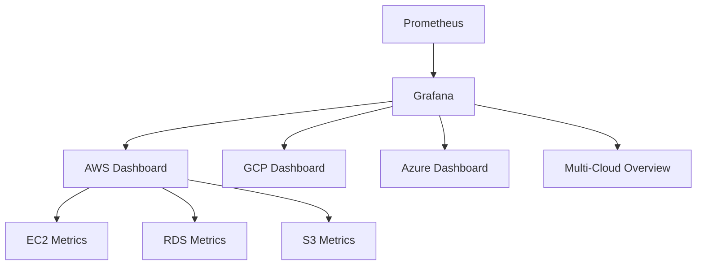

# Cloud Service Monitoring

## Introduction

Modern applications are increasingly deployed in cloud environments, making effective cloud service monitoring essential for maintaining reliability and performance. This guide explores how Prometheus can be used to monitor various cloud services across different providers, helping you gain visibility into your cloud infrastructure and applications.

Cloud service monitoring with Prometheus allows you to:

- Track the performance and health of cloud resources
- Create alerts for potential issues before they impact users
- Understand usage patterns to optimize costs
- Maintain compliance with service level agreements (SLAs)
- Make data-driven decisions about scaling and resource allocation

## Understanding Cloud Service Monitoring with Prometheus

### The Challenge of Cloud Monitoring

Cloud environments present unique monitoring challenges:

- **Dynamic Infrastructure**: Resources are created and destroyed frequently
- **Distributed Components**: Services span multiple regions and availability zones  
- **Multiple Abstraction Layers**: From virtual machines to managed services
- **Vendor-Specific Metrics**: Each cloud provider has its own metrics and monitoring approaches

Prometheus helps address these challenges with its pull-based architecture, service discovery mechanisms, and flexible data model.

## Cloud Provider Integrations

### AWS Monitoring with Prometheus

Amazon Web Services can be monitored with Prometheus using several approaches:

#### Option 1: AWS Exporter

The AWS exporter allows you to scrape metrics from AWS APIs.

```bash
# Install AWS exporter
docker run -d -p 9686:9686 \
  -e AWS_ACCESS_KEY_ID=your-access-key \
  -e AWS_SECRET_ACCESS_KEY=your-secret-key \
  -e AWS_REGION=us-west-1 \
  quay.io/prometheuscommunity/cloudwatch-exporter:latest
```

Configure Prometheus to scrape the exporter:

```yaml
scrape_configs:
  - job_name: 'aws-cloudwatch'
    static_configs:
      - targets: ['localhost:9686']
```

#### Option 2: EC2 Service Discovery

For EC2 instances, you can use Prometheus' built-in EC2 service discovery:

```yaml
scrape_configs:
  - job_name: 'ec2-instances'
    ec2_sd_configs:
      - region: us-west-1
        access_key: your-access-key
        secret_key: your-secret-key
        port: 9100
    relabel_configs:
      - source_labels: [__meta_ec2_tag_Name]
        target_label: instance
```

### GCP Monitoring with Prometheus

Google Cloud Platform offers several integration options:

#### Using GCE Service Discovery

```yaml
scrape_configs:
  - job_name: 'gce-instances'
    gce_sd_configs:
      - project: your-gcp-project
        zone: us-central1-a
        port: 9100
    relabel_configs:
      - source_labels: [__meta_gce_name]
        target_label: instance
```

#### Using Stackdriver Exporter

```bash
# Install Stackdriver exporter
docker run -d -p 9255:9255 \
  -e GOOGLE_APPLICATION_CREDENTIALS=/gcp-sa.json \
  -v /path/to/gcp-sa.json:/gcp-sa.json \
  gcr.io/stackdriver-prometheus/stackdriver-prometheus-sidecar:latest
```

### Azure Monitoring with Prometheus

Microsoft Azure can be monitored with:

#### Azure Exporter

```bash
# Install Azure exporter
docker run -d -p 9276:9276 \
  -e AZURE_SUBSCRIPTION_ID=your-subscription-id \
  -e AZURE_CLIENT_ID=your-client-id \
  -e AZURE_CLIENT_SECRET=your-client-secret \
  -e AZURE_TENANT_ID=your-tenant-id \
  webdevops/azure-metrics-exporter
```

## Setting Up Comprehensive Cloud Monitoring

A complete cloud monitoring solution typically involves:

1. **Infrastructure Metrics**: CPU, memory, disk and network usage
2. **Service Metrics**: Specific to managed services like databases, message queues, etc.
3. **Cost Metrics**: Usage that translates to billing
4. **Availability Metrics**: Uptime and regional availability

Let's create a monitoring setup that covers these aspects:

### Step 1: Deploy Node Exporters

For virtual machine metrics, deploy Node Exporter on each instance:

```bash
# Install Node Exporter on Linux instances
wget https://github.com/prometheus/node_exporter/releases/download/v1.3.1/node_exporter-1.3.1.linux-amd64.tar.gz
tar xvfz node_exporter-1.3.1.linux-amd64.tar.gz
cd node_exporter-1.3.1.linux-amd64
./node_exporter &
```

### Step 2: Configure Service Discovery

Use cloud-specific service discovery to automatically find and monitor instances:

```yaml
scrape_configs:
  - job_name: 'aws-ec2'
    ec2_sd_configs:
      - region: us-west-1
        port: 9100
    relabel_configs:
      - source_labels: [__meta_ec2_tag_Environment]
        regex: production
        action: keep
```

### Step 3: Monitor Managed Services

Use specialized exporters for managed services:

```yaml
scrape_configs:
  - job_name: 'aws-rds'
    static_configs:
      - targets: ['localhost:9042']
    metrics_path: '/metrics/rds'
```

### Step 4: Set Up Alerting

Create alerts for cloud-specific issues:

```yaml
groups:
- name: cloud-alerts
  rules:
  - alert: HighCloudSpend
    expr: sum(aws_billing_estimated_charges) > 1000
    for: 6h
    labels:
      severity: warning
    annotations:
      summary: "High AWS spend detected"
      description: "AWS charges have exceeded $1000 threshold"
      
  - alert: InstanceOutOfMemory
    expr: node_memory_MemAvailable_bytes / node_memory_MemTotal_bytes * 100 < 10
    for: 5m
    labels:
      severity: critical
    annotations:
      summary: "Instance {{ $labels.instance }} out of memory"
      description: "Instance has less than 10% available memory"
```

## Cloud Monitoring Best Practices

For effective cloud monitoring with Prometheus:

1. **Use Labels Effectively**: Include cloud-specific metadata as labels
   ```yaml
   relabel_configs:
     - source_labels: [__meta_ec2_availability_zone]
       target_label: zone
     - source_labels: [__meta_ec2_instance_type]
       target_label: instance_type
   ```

2. **Implement Hierarchical Service Discovery**: Discover different tiers of services
   ```yaml
   scrape_configs:
     - job_name: 'kubernetes-nodes'
       kubernetes_sd_configs:
         - role: node
     - job_name: 'kubernetes-pods'
       kubernetes_sd_configs:
         - role: pod
   ```

3. **Consider Using Remote Write**: For long-term storage of cloud metrics
   ```yaml
   remote_write:
     - url: "https://prometheus.example.org/api/v1/write"
       basic_auth:
         username: "username"
         password: "password"
   ```

4. **Implement Federation**: For multi-region or multi-cloud setups
   ```yaml
   scrape_configs:
     - job_name: 'federate'
       scrape_interval: 15s
       honor_labels: true
       metrics_path: '/federate'
       params:
         'match[]':
           - '{job="prometheus"}'
           - '{__name__=~"job:.*"}'
       static_configs:
         - targets:
           - 'prometheus.us-region.example.org:9090'
           - 'prometheus.eu-region.example.org:9090'
   ```

## Visualizing Cloud Metrics

Create effective Grafana dashboards for cloud metrics:



Example PromQL queries for cloud dashboards:

1. **EC2 CPU Utilization by Instance Type**:
   ```
   avg by (instance_type) (rate(node_cpu_seconds_total{mode!="idle"}[5m]) * 100)
   ```

2. **S3 Request Latency**:
   ```
   aws_s3_request_latency_seconds_sum / aws_s3_request_latency_seconds_count
   ```

3. **RDS Free Storage Space**:
   ```
   aws_rds_free_storage_space_average
   ```

4. **Cross-Cloud Comparison**:
   ```
   sum by (provider) (rate(http_requests_total[5m]))
   ```

## Practical Example: Multi-Cloud Monitoring

Let's implement a complete example for monitoring applications across AWS and GCP:

### 1. Set up exporters for each cloud

```bash
# AWS Exporter
docker run -d --name aws-exporter \
  -p 9686:9686 \
  -e AWS_ACCESS_KEY_ID=your-access-key \
  -e AWS_SECRET_ACCESS_KEY=your-secret-key \
  -e AWS_REGION=us-west-1 \
  quay.io/prometheuscommunity/cloudwatch-exporter:latest

# GCP Exporter  
docker run -d --name gcp-exporter \
  -p 9255:9255 \
  -e GOOGLE_APPLICATION_CREDENTIALS=/gcp-sa.json \
  -v /path/to/gcp-sa.json:/gcp-sa.json \
  gcr.io/stackdriver-prometheus/stackdriver-prometheus-sidecar:latest
```

### 2. Configure Prometheus to scrape both clouds

```yaml
global:
  scrape_interval: 15s
  evaluation_interval: 15s

scrape_configs:
  - job_name: 'aws-cloudwatch'
    static_configs:
      - targets: ['localhost:9686']
    metrics_path: '/metrics'
    
  - job_name: 'gcp-stackdriver'
    static_configs:
      - targets: ['localhost:9255']
    metrics_path: '/metrics'
    
  - job_name: 'aws-ec2'
    ec2_sd_configs:
      - region: us-west-1
        access_key: your-access-key
        secret_key: your-secret-key
        port: 9100
    relabel_configs:
      - source_labels: [__meta_ec2_tag_Name]
        target_label: instance
      - source_labels: [__meta_ec2_instance_type]
        target_label: instance_type
      - target_label: provider
        replacement: aws
        
  - job_name: 'gcp-instances'
    gce_sd_configs:
      - project: your-gcp-project
        zone: us-central1-a
        port: 9100
    relabel_configs:
      - source_labels: [__meta_gce_name]
        target_label: instance
      - source_labels: [__meta_gce_machine_type]
        target_label: instance_type
      - target_label: provider
        replacement: gcp
```

### 3. Create multi-cloud recording rules

```yaml
groups:
- name: cloud-resources
  rules:
  - record: job:node_cpu_utilization:avg
    expr: avg by (provider, job) (rate(node_cpu_seconds_total{mode!="idle"}[5m]) * 100)
  
  - record: job:node_memory_utilization:avg
    expr: avg by (provider, job) (100 - ((node_memory_MemAvailable_bytes / node_memory_MemTotal_bytes) * 100))
    
  - record: provider:request_errors:rate5m
    expr: sum by (provider) (rate(http_requests_total{status=~"5.."}[5m]))
```

### 4. Set up cross-cloud alerts

```yaml
groups:
- name: cloud-alerts
  rules:
  - alert: HighErrorRate
    expr: sum by (provider) (rate(http_requests_total{status=~"5.."}[5m])) / sum by (provider) (rate(http_requests_total[5m])) > 0.05
    for: 5m
    labels:
      severity: critical
    annotations:
      summary: "High error rate on {{ $labels.provider }}"
      description: "Error rate is above 5% on {{ $labels.provider }}"
      
  - alert: CloudCostSpike
    expr: sum by (provider) (rate(node_network_transmit_bytes_total[1d])) > 10 * avg_over_time(sum by (provider) (rate(node_network_transmit_bytes_total[1d]))[7d:1d])
    for: 6h
    labels:
      severity: warning
    annotations:
      summary: "Unusual egress traffic on {{ $labels.provider }}"
      description: "Network egress is 10x higher than weekly average, possible cost implications"
```

## Common Pitfalls and Solutions

When monitoring cloud services with Prometheus, watch out for:

1. **Credential Management**: Rotate cloud credentials regularly and use IAM roles when possible

2. **Rate Limiting**: Cloud APIs often have rate limits
   ```yaml
   scrape_configs:
     - job_name: 'aws-cloudwatch'
       scrape_interval: 5m  # Longer interval to avoid rate limits
   ```

3. **Cost Management**: Some cloud provider APIs charge per API call
   ```yaml
   scrape_configs:
     - job_name: 'expensive-metrics'
       scrape_interval: 30m  # Longer interval to reduce costs
   ```

4. **Missing Instances**: Ensure your service discovery configuration is comprehensive
   ```yaml
   ec2_sd_configs:
     - region: us-west-1
     - region: us-east-1
     - region: eu-west-1
   ```

## Summary

Cloud service monitoring with Prometheus provides a unified approach to observing your infrastructure and applications across multiple cloud providers. By leveraging Prometheus' service discovery capabilities, exporters, and powerful query language, you can gain comprehensive visibility into your cloud resources.

Key takeaways:

- Use cloud-specific exporters to collect metrics from managed services
- Configure service discovery to automatically monitor dynamic cloud resources
- Apply consistent labeling to enable cross-cloud comparisons
- Implement appropriate recording rules and alerts for cloud-specific concerns
- Consider federation and remote storage for large-scale deployments

## Further Learning

To deepen your knowledge about cloud service monitoring with Prometheus:

1. Explore cloud-specific exporters in the Prometheus community
2. Learn about optimization techniques for high-cardinality cloud metrics
3. Experiment with multi-region and multi-cloud federation
4. Practice building comprehensive cloud dashboards in Grafana

## Exercises

1. Set up Prometheus to monitor AWS EC2 instances using service discovery
2. Create a Grafana dashboard showing comparative metrics between two cloud providers
3. Implement alerts for unusual cloud spending patterns
4. Configure a federated setup for multiple regions in the same cloud provider