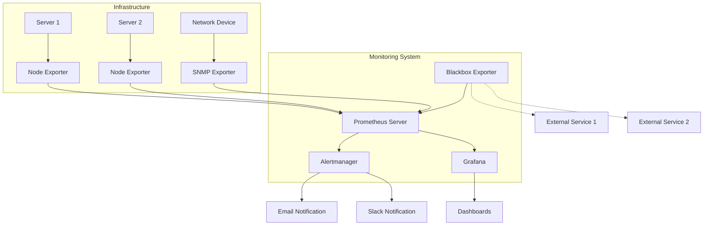

# Network Monitoring with Prometheus

Network monitoring is a critical aspect of infrastructure management that ensures your systems are operating efficiently and reliably. Prometheus excels in this area by providing robust tools to collect, analyze, and alert on network performance metrics.

## Introduction to Network Monitoring

Network monitoring involves tracking the health, performance, and availability of network infrastructure components such as:

- Network devices (routers, switches, firewalls)
- Network interfaces
- Traffic volumes
- Latency and packet loss
- Connection states
- Protocol-specific metrics

Prometheus offers a powerful solution for network monitoring with its pull-based architecture, flexible query language, and alerting capabilities.

## Why Use Prometheus for Network Monitoring?

Prometheus provides several advantages for network monitoring:

1. **Scalable metric collection** - handles thousands of targets efficiently
2. **Time-series data model** - perfect for tracking network metrics over time
3. **Powerful query language (PromQL)** - enables complex analysis of network behavior
4. **Alerting capabilities** - detects and notifies about network issues proactively
5. **Integration with visualization tools** - creates comprehensive network dashboards
6. **Support for service discovery** - automatically finds network devices to monitor

## Setting Up Network Monitoring with Prometheus

Let's walk through the process of setting up Prometheus for network monitoring:

### 1. Exporter Selection

First, you'll need appropriate exporters for collecting network metrics. The most common ones include:

- **Node Exporter** - Collects host-level network metrics
- **Blackbox Exporter** - Probes endpoints for availability and performance
- **SNMP Exporter** - Gathers metrics from devices supporting SNMP

### 2. Installing the Node Exporter

The Node Exporter provides basic network interface metrics for Linux hosts:

```bash
# Download Node Exporter
wget https://github.com/prometheus/node_exporter/releases/download/v1.3.1/node_exporter-1.3.1.linux-amd64.tar.gz

# Extract the files
tar xvfz node_exporter-1.3.1.linux-amd64.tar.gz

# Move to the binary directory
cd node_exporter-1.3.1.linux-amd64
sudo cp node_exporter /usr/local/bin/

# Create a Node Exporter service
sudo useradd -rs /bin/false node_exporter
sudo tee /etc/systemd/system/node_exporter.service > /dev/null << EOF
[Unit]
Description=Node Exporter
After=network.target

[Service]
User=node_exporter
Group=node_exporter
Type=simple
ExecStart=/usr/local/bin/node_exporter

[Install]
WantedBy=multi-user.target
EOF

# Start the service
sudo systemctl daemon-reload
sudo systemctl start node_exporter
sudo systemctl enable node_exporter
```

### 3. Configuring Prometheus for Network Monitoring

Add the following job to your `prometheus.yml` file:

```yaml
scrape_configs:
  - job_name: 'node'
    scrape_interval: 15s
    static_configs:
      - targets: ['localhost:9100']
        labels:
          instance: 'my-server'
          
  - job_name: 'network_probes'
    scrape_interval: 30s
    metrics_path: /probe
    params:
      module: [http_2xx]  # Use the HTTP probe module
    static_configs:
      - targets:
        - https://example.com    # Target to probe
        - https://api.example.org
    relabel_configs:
      - source_labels: [__address__]
        target_label: __param_target
      - source_labels: [__param_target]
        target_label: instance
      - target_label: __address__
        replacement: localhost:9115  # Blackbox exporter address
```

### 4. Installing the Blackbox Exporter

The Blackbox Exporter is essential for active network probing:

```bash
# Download Blackbox Exporter
wget https://github.com/prometheus/blackbox_exporter/releases/download/v0.20.0/blackbox_exporter-0.20.0.linux-amd64.tar.gz

# Extract files
tar xvfz blackbox_exporter-0.20.0.linux-amd64.tar.gz

# Move to binary directory
cd blackbox_exporter-0.20.0.linux-amd64
sudo cp blackbox_exporter /usr/local/bin/

# Create configuration file
sudo mkdir -p /etc/blackbox_exporter
sudo tee /etc/blackbox_exporter/blackbox.yml > /dev/null << EOF
modules:
  http_2xx:
    prober: http
    http:
      preferred_ip_protocol: ip4
  icmp:
    prober: icmp
    icmp:
      preferred_ip_protocol: ip4
  tcp_connect:
    prober: tcp
    tcp:
      preferred_ip_protocol: ip4
EOF

# Create Blackbox Exporter service
sudo useradd -rs /bin/false blackbox_exporter
sudo tee /etc/systemd/system/blackbox_exporter.service > /dev/null << EOF
[Unit]
Description=Blackbox Exporter
After=network.target

[Service]
User=blackbox_exporter
Group=blackbox_exporter
Type=simple
ExecStart=/usr/local/bin/blackbox_exporter --config.file=/etc/blackbox_exporter/blackbox.yml

[Install]
WantedBy=multi-user.target
EOF

# Start the service
sudo systemctl daemon-reload
sudo systemctl start blackbox_exporter
sudo systemctl enable blackbox_exporter
```

## Essential Network Metrics to Monitor

When setting up your network monitoring, focus on these key metrics:

### Interface Metrics

```promql
# Network throughput (bytes received per second)
rate(node_network_receive_bytes_total{device="eth0"}[5m])

# Network throughput (bytes transmitted per second)
rate(node_network_transmit_bytes_total{device="eth0"}[5m])

# Network errors
rate(node_network_receive_errs_total{device="eth0"}[5m])
rate(node_network_transmit_errs_total{device="eth0"}[5m])

# Dropped packets
rate(node_network_receive_drop_total{device="eth0"}[5m])
rate(node_network_transmit_drop_total{device="eth0"}[5m])
```

### Network Connectivity and Latency

```promql
# HTTP probe success rate (percentage)
sum(probe_success{job="network_probes"}) by (instance) * 100

# DNS lookup time
probe_dns_lookup_time_seconds{job="network_probes"}

# HTTP request duration
probe_http_duration_seconds{job="network_probes"}

# SSL certificate expiration time (in days)
(probe_ssl_earliest_cert_expiry{job="network_probes"} - time()) / 86400
```

### TCP Connection States

```promql
# Number of TCP connections in established state
node_netstat_Tcp_CurrEstab

# TCP connection statistics
node_netstat_Tcp_ActiveOpens
node_netstat_Tcp_PassiveOpens
node_netstat_Tcp_RetransSegs
```

## Building a Network Monitoring Dashboard

A well-designed dashboard helps you visualize network performance at a glance. Here's a sample Grafana dashboard configuration for basic network monitoring:

```json
{
  "panels": [
    {
      "title": "Network Traffic",
      "type": "graph",
      "targets": [
        {
          "expr": "rate(node_network_receive_bytes_total{device=\"eth0\"}[5m])",
          "legendFormat": "Received"
        },
        {
          "expr": "rate(node_network_transmit_bytes_total{device=\"eth0\"}[5m])",
          "legendFormat": "Transmitted"
        }
      ],
      "yaxes": [
        {
          "format": "bytes"
        }
      ],
      "description": "Network traffic for interface eth0"
    },
    {
      "title": "HTTP Probe Success Rate",
      "type": "gauge",
      "targets": [
        {
          "expr": "avg(probe_success{job=\"network_probes\"}) * 100"
        }
      ],
      "thresholds": [
        {
          "value": 90,
          "color": "green"
        },
        {
          "value": 75,
          "color": "yellow"
        },
        {
          "value": 0,
          "color": "red"
        }
      ]
    }
  ]
}
```

## Setting Up Network Monitoring Alerts

Create alerts to notify you when network issues arise:

```yaml
groups:
- name: network_alerts
  rules:
  - alert: HighNetworkTraffic
    expr: rate(node_network_receive_bytes_total{device="eth0"}[5m]) > 100000000
    for: 5m
    labels:
      severity: warning
    annotations:
      summary: "High network traffic detected"
      description: "Network receive traffic on {{ $labels.instance }} is above 100MB/s for 5 minutes"
      
  - alert: NetworkInterfaceErrors
    expr: rate(node_network_receive_errs_total{device="eth0"}[5m]) > 0
    for: 5m
    labels:
      severity: warning
    annotations:
      summary: "Network interface errors detected"
      description: "Network interface {{ $labels.device }} on {{ $labels.instance }} is experiencing errors"
      
  - alert: EndpointDown
    expr: probe_success{job="network_probes"} == 0
    for: 5m
    labels:
      severity: critical
    annotations:
      summary: "Endpoint down"
      description: "Endpoint {{ $labels.instance }} is down"
      
  - alert: SSLCertificateExpiringSoon
    expr: probe_ssl_earliest_cert_expiry{job="network_probes"} - time() < 86400 * 14
    for: 1h
    labels:
      severity: warning
    annotations:
      summary: "SSL Certificate expiring soon"
      description: "SSL certificate for {{ $labels.instance }} will expire in less than 14 days"
```

## Network Monitoring Architecture

The following diagram illustrates a typical network monitoring architecture with Prometheus:



## Real-World Example: Multi-Site Network Monitoring

Let's look at a practical example for monitoring network connectivity between multiple data centers:

1. Deploy Blackbox Exporters in each data center
2. Configure ping checks between all data centers
3. Measure latency and packet loss
4. Create alerts for connectivity issues

```yaml
# prometheus.yml for multi-site monitoring
global:
  scrape_interval: 15s

scrape_configs:
  - job_name: 'icmp_dc_connectivity'
    metrics_path: /probe
    params:
      module: [icmp]
    static_configs:
      - targets:
        - 10.0.1.1  # DC1 Router IP
        - 10.0.2.1  # DC2 Router IP
        - 10.0.3.1  # DC3 Router IP
    relabel_configs:
      - source_labels: [__address__]
        target_label: __param_target
      - source_labels: [__param_target]
        target_label: instance
      - target_label: __address__
        replacement: localhost:9115  # Blackbox exporter address
      - source_labels: [__param_target]
        regex: '10\.0\.1\..*'
        target_label: datacenter
        replacement: 'dc1'
      - source_labels: [__param_target]
        regex: '10\.0\.2\..*'
        target_label: datacenter
        replacement: 'dc2'
      - source_labels: [__param_target]
        regex: '10\.0\.3\..*'
        target_label: datacenter
        replacement: 'dc3'
```

Corresponding PromQL queries:

```promql
# Inter-datacenter ping latency matrix
avg by (datacenter, instance) (probe_icmp_duration_seconds{job="icmp_dc_connectivity"})

# Packet loss detection
probe_success{job="icmp_dc_connectivity"} == 0
```

## Best Practices for Network Monitoring with Prometheus

1. **Use meaningful labels** - Add labels for region, datacenter, environment, and device type
2. **Implement hierarchical monitoring** - Monitor from both inside and outside your network
3. **Set appropriate scrape intervals** - Balance between data granularity and system load
4. **Use recording rules** for frequently used queries to improve performance
5. **Implement alerting with proper thresholds** - Avoid alert fatigue with well-tuned thresholds
6. **Correlate metrics** - Examine relationships between different metrics for better insights
7. **Plan for scaling** - Use federation or remote storage for large-scale deployments

## Troubleshooting Network Issues with Prometheus

Here's how to use Prometheus for network troubleshooting:

1. **Identify spikes in traffic**:
   ```promql
   max_over_time(rate(node_network_receive_bytes_total[5m])[1h:])
   ```

2. **Find hosts with connection problems**:
   ```promql
   increase(node_netstat_Tcp_RetransSegs[5m]) > 0
   ```

3. **Check for network saturation**:
   ```promql
   rate(node_network_receive_bytes_total[5m]) / (node_network_speed_bytes * on(instance, device) group_left())
   ```

4. **Analyze network error patterns**:
   ```promql
   rate(node_network_receive_errs_total[5m]) / rate(node_network_receive_packets_total[5m])
   ```

## Summary

Network monitoring with Prometheus provides a powerful way to ensure the health and performance of your infrastructure. By collecting key metrics from network devices and interfaces, you can:

- Proactively detect and resolve issues before they impact users
- Track performance trends over time
- Create comprehensive dashboards for visibility
- Set up automated alerts for critical problems
- Gain insights into network behavior and patterns

The flexibility and scalability of Prometheus make it an excellent choice for network monitoring, from small deployments to complex multi-site infrastructures.

## Additional Resources

- **Further Learning**
  - [Prometheus Documentation](https://prometheus.io/docs/introduction/overview/)
  - [Blackbox Exporter GitHub Repository](https://github.com/prometheus/blackbox_exporter)
  - [SNMP Exporter Documentation](https://github.com/prometheus/snmp_exporter)
  - [PromQL Cheat Sheet](https://promlabs.com/promql-cheat-sheet/)

## Exercises

1. Set up a Blackbox Exporter to monitor the availability of three different websites.
2. Create a Grafana dashboard showing network throughput, errors, and latency for your server.
3. Write alerting rules to notify you when network latency exceeds 100ms to critical services.
4. Configure Prometheus to discover and monitor all network interfaces on your servers automatically.
5. Develop a recording rule that tracks the 95th percentile of network traffic over the past week.