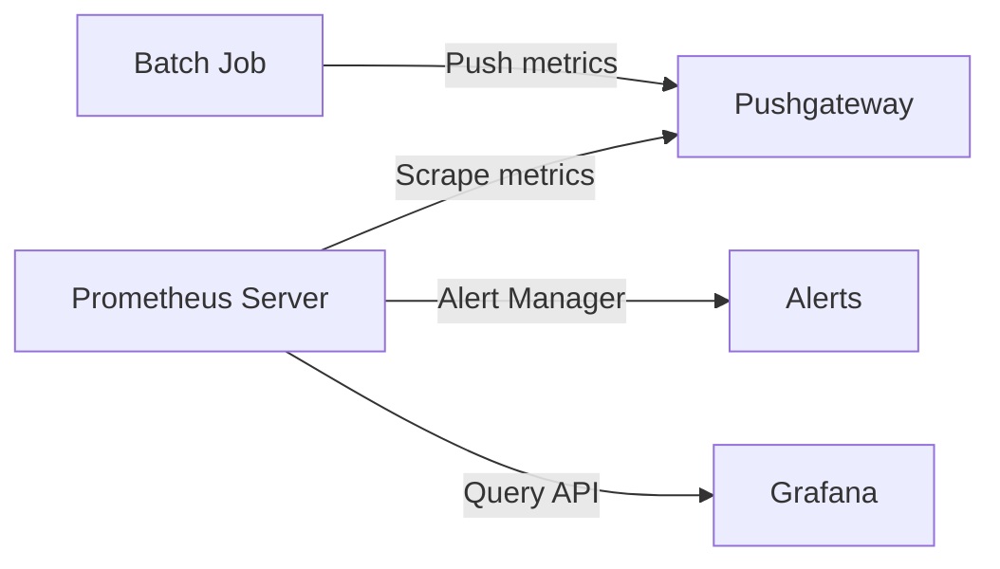

# Batch Job Monitoring

## Introduction

Batch jobs are programs that run at scheduled intervals without user interaction. Examples include data processing tasks, backup scripts, log rotations, and scheduled cleanups. Unlike long-running services, batch jobs execute for a limited time and then terminate, creating unique monitoring challenges.

In this guide, we'll explore how to effectively monitor batch jobs using Prometheus, addressing common challenges like:

- Detecting job failures
- Measuring execution time
- Tracking success/failure rates
- Alerting when jobs don't run on schedule
- Monitoring resource consumption

## Why Batch Job Monitoring is Challenging

Traditional monitoring approaches often focus on long-running services where metrics are continuously available. Batch jobs present several challenges:

1. **Intermittent execution**: Jobs only emit metrics while running
2. **Ephemeral nature**: Once a job completes, its process (and metrics) disappear
3. **Schedule adherence**: Need to detect if a job didn't run at all
4. **Binary success/failure**: Often need to track outcomes rather than states

## Prometheus Approach to Batch Job Monitoring

Prometheus offers several patterns for effectively monitoring batch jobs:

### 1. The Pushgateway Pattern

The Prometheus Pushgateway is a component that allows ephemeral jobs to push their metrics to an intermediate service where Prometheus can scrape them later.



#### Setting Up the Pushgateway

First, install and run the Pushgateway:

```bash
# Using Docker
docker run -d -p 9091:9091 prom/pushgateway
```

Configure Prometheus to scrape metrics from the Pushgateway:

```yaml
scrape_configs:
  - job_name: 'pushgateway'
    scrape_interval: 10s
    honor_labels: true  # Important: Preserves job labels from pushed metrics
    static_configs:
      - targets: ['localhost:9091']
```

### 2. Key Metrics for Batch Jobs

#### Success/Failure Counters

For tracking job outcomes:

```python
from prometheus_client import Counter, push_to_gateway

# Create counters
success_counter = Counter('batch_job_success_total', 'Number of successful job runs', ['job_name'])
failure_counter = Counter('batch_job_failure_total', 'Number of failed job runs', ['job_name'])

# Example batch job
job_name = 'data_processor'
try:
    # Job logic here
    # ...
    
    # If successful
    success_counter.labels(job_name=job_name).inc()
    push_to_gateway('localhost:9091', job='batch-jobs', registry=None)
except Exception as e:
    # If failed
    failure_counter.labels(job_name=job_name).inc()
    push_to_gateway('localhost:9091', job='batch-jobs', registry=None)
    raise e
```

#### Execution Time

Measure how long your jobs take to run:

```python
from prometheus_client import Gauge, push_to_gateway
import time

# Create a gauge for execution time
execution_time = Gauge('batch_job_duration_seconds', 'Duration of batch job execution', ['job_name'])

# Example batch job with timing
job_name = 'nightly_backup'
start_time = time.time()

try:
    # Job logic here
    # ...
    
    # Record execution time
    duration = time.time() - start_time
    execution_time.labels(job_name=job_name).set(duration)
    push_to_gateway('localhost:9091', job='batch-jobs', registry=None)
except Exception as e:
    # Still record execution time on failure
    duration = time.time() - start_time
    execution_time.labels(job_name=job_name).set(duration)
    push_to_gateway('localhost:9091', job='batch-jobs', registry=None)
    raise e
```

#### Last Execution Timestamp

Track when the job last ran:

```python
from prometheus_client import Gauge, push_to_gateway
import time

# Create a gauge for last execution timestamp
last_execution = Gauge('batch_job_last_execution_timestamp', 'Timestamp of last execution', ['job_name'])

job_name = 'hourly_data_sync'
# Set to current UNIX timestamp
last_execution.labels(job_name=job_name).set_to_current_time()
push_to_gateway('localhost:9091', job='batch-jobs', registry=None)
```

### 3. Monitoring Batch Jobs with Cron Exporter

For cron-based jobs, you can use a dedicated exporter like `prometheus-cron-exporter` or the Node Exporter's textfile collector.

Example using textfile collector:

1. Create a script that runs alongside your job:

```bash
#!/bin/bash

JOB_NAME="database_backup"
METRICS_DIR="/var/lib/node_exporter/textfile_collector"

# Run before the job
echo "# HELP batch_job_start_time_seconds Timestamp when the job started" > $METRICS_DIR/${JOB_NAME}.prom.tmp
echo "# TYPE batch_job_start_time_seconds gauge" >> $METRICS_DIR/${JOB_NAME}.prom.tmp
echo "batch_job_start_time_seconds{job_name=\"${JOB_NAME}\"} $(date +%s)" >> $METRICS_DIR/${JOB_NAME}.prom.tmp

# Run the actual job
START_TIME=$(date +%s)
if /path/to/your/batch/job; then
  EXIT_CODE=0
else
  EXIT_CODE=$?
fi
END_TIME=$(date +%s)
DURATION=$((END_TIME - START_TIME))

# After the job completes, record metrics
echo "# HELP batch_job_duration_seconds Duration of the job" > $METRICS_DIR/${JOB_NAME}.prom.tmp
echo "# TYPE batch_job_duration_seconds gauge" >> $METRICS_DIR/${JOB_NAME}.prom.tmp
echo "batch_job_duration_seconds{job_name=\"${JOB_NAME}\"} ${DURATION}" >> $METRICS_DIR/${JOB_NAME}.prom.tmp

echo "# HELP batch_job_last_execution_timestamp_seconds Timestamp of the last execution" >> $METRICS_DIR/${JOB_NAME}.prom.tmp
echo "# TYPE batch_job_last_execution_timestamp_seconds gauge" >> $METRICS_DIR/${JOB_NAME}.prom.tmp
echo "batch_job_last_execution_timestamp_seconds{job_name=\"${JOB_NAME}\"} ${END_TIME}" >> $METRICS_DIR/${JOB_NAME}.prom.tmp

echo "# HELP batch_job_exit_code Exit code of the last execution" >> $METRICS_DIR/${JOB_NAME}.prom.tmp
echo "# TYPE batch_job_exit_code gauge" >> $METRICS_DIR/${JOB_NAME}.prom.tmp
echo "batch_job_exit_code{job_name=\"${JOB_NAME}\"} ${EXIT_CODE}" >> $METRICS_DIR/${JOB_NAME}.prom.tmp

mv $METRICS_DIR/${JOB_NAME}.prom.tmp $METRICS_DIR/${JOB_NAME}.prom
```

Configure Node Exporter to read these metrics:

```bash
node_exporter --collector.textfile.directory=/var/lib/node_exporter/textfile_collector
```

## Creating Effective Alerts for Batch Jobs

### 1. Alert on Job Failures

```yaml
groups:
- name: batch-jobs
  rules:
  - alert: BatchJobFailed
    expr: increase(batch_job_failure_total{job_name=~".*"}[1h]) > 0
    for: 5m
    labels:
      severity: warning
    annotations:
      summary: "Batch job {{ $labels.job_name }} failed"
      description: "The batch job {{ $labels.job_name }} has failed at least once in the last hour."
```

### 2. Alert on Missing Jobs

```yaml
groups:
- name: batch-jobs
  rules:
  - alert: BatchJobMissed
    expr: time() - batch_job_last_execution_timestamp{job_name="hourly_data_sync"} > 3600 * 1.5
    for: 5m
    labels:
      severity: warning
    annotations:
      summary: "Batch job {{ $labels.job_name }} missed its schedule"
      description: "The batch job {{ $labels.job_name }} hasn't run in the last 1.5x its expected interval."
```

### 3. Alert on Unusually Long Execution Times

```yaml
groups:
- name: batch-jobs
  rules:
  - alert: BatchJobTooSlow
    expr: batch_job_duration_seconds{job_name="nightly_backup"} > 3600
    for: 5m
    labels:
      severity: warning
    annotations:
      summary: "Batch job {{ $labels.job_name }} running too slow"
      description: "The batch job {{ $labels.job_name }} took longer than expected to complete."
```

## Real-World Example: Database Backup Monitoring

Let's implement a complete example for monitoring database backups:

```python
#!/usr/bin/env python3
import time
import subprocess
import sys
from prometheus_client import Counter, Gauge, push_to_gateway

# Define metrics
success = Counter('db_backup_success_total', 'Successful DB backups', ['database'])
failure = Counter('db_backup_failure_total', 'Failed DB backups', ['database', 'error_type'])
duration = Gauge('db_backup_duration_seconds', 'Time taken for backup', ['database'])
size = Gauge('db_backup_size_bytes', 'Size of the backup file', ['database'])
last_run = Gauge('db_backup_last_run_timestamp', 'When the backup last ran', ['database'])

# Database to back up
db_name = 'production_db'

# Record start time and last run timestamp
start_time = time.time()
last_run.labels(database=db_name).set_to_current_time()

try:
    # Run the backup command
    process = subprocess.run(
        ['pg_dump', '-U', 'postgres', '-d', db_name, '-f', f'/backups/{db_name}.sql'],
        check=True,
        capture_output=True
    )
    
    # Get backup file size
    file_size = subprocess.run(
        ['stat', '-c', '%s', f'/backups/{db_name}.sql'],
        check=True,
        capture_output=True,
        text=True
    )
    
    # Record metrics for success
    backup_size = int(file_size.stdout.strip())
    success.labels(database=db_name).inc()
    size.labels(database=db_name).set(backup_size)
    
    print(f"Backup completed successfully. Size: {backup_size} bytes")
    
except subprocess.CalledProcessError as e:
    # Determine error type
    if 'connection' in e.stderr.lower():
        error_type = 'connection_error'
    elif 'permission' in e.stderr.lower():
        error_type = 'permission_error'
    else:
        error_type = 'unknown_error'
    
    # Record failure
    failure.labels(database=db_name, error_type=error_type).inc()
    print(f"Backup failed: {e}", file=sys.stderr)
    sys.exit(1)
    
finally:
    # Always record duration
    backup_duration = time.time() - start_time
    duration.labels(database=db_name).set(backup_duration)
    
    # Push all metrics to Pushgateway
    push_to_gateway('localhost:9091', job='database_backup', registry=None)
```

## Creating a Grafana Dashboard for Batch Jobs

Here's a sample Grafana dashboard query to visualize batch job performance:

```
# Success rate over time
sum(increase(batch_job_success_total{job_name="data_processor"}[1d])) / 
(sum(increase(batch_job_success_total{job_name="data_processor"}[1d])) + 
sum(increase(batch_job_failure_total{job_name="data_processor"}[1d])))

# Execution time trends
batch_job_duration_seconds{job_name="nightly_backup"}

# Job execution heatmap
batch_job_last_execution_timestamp_seconds{job_name="hourly_data_sync"}
```

## Advanced Techniques

### 1. Using the Textfile Collector with Synthetic Metrics

For extremely simple batch jobs, you can generate "event-based" metrics using timestamps:

```bash
#!/bin/bash
echo "batch_job_completed{job=\"log_rotation\",status=\"success\"} $(date +%s)" > /var/lib/node_exporter/textfile_collector/log_rotation.prom
```

Then in Prometheus, you can use time-based functions:

```
# Alert if no successful completions in the last day
time() - batch_job_completed{job="log_rotation",status="success"} > 86400
```

### 2. Multi-Instance Batch Job Monitoring

When running the same batch job across multiple servers:

```python
from prometheus_client import Counter, Gauge, push_to_gateway
import socket

# Include hostname in labels
hostname = socket.gethostname()
job_name = 'daily_report_generation'

success_counter = Counter(
    'batch_job_success_total', 
    'Number of successful job runs', 
    ['job_name', 'hostname']
)

# Increment with hostname
success_counter.labels(job_name=job_name, hostname=hostname).inc()
push_to_gateway('central-pushgateway:9091', job='batch-jobs', registry=None)
```

## Summary

Monitoring batch jobs with Prometheus requires different approaches than monitoring long-running services. By using the Pushgateway, appropriate metrics, and well-crafted alerts, you can gain visibility into job health, performance, and reliability.

Key takeaways:
- Use Pushgateway for ephemeral batch job metrics
- Track success/failure counters, execution time, and last run time
- Create alerts for failures, missed schedules, and performance issues
- Consider using the textfile collector for simple use cases
- Design dashboards that visualize job performance over time

## Exercises

1. Set up a Pushgateway and monitor a simple batch job that counts files in a directory
2. Create a PromQL query to calculate the success rate of a batch job over the last 7 days
3. Implement monitoring for a cron job using the textfile collector approach
4. Create a Grafana dashboard showing batch job performance metrics
5. Set up alerts for batch jobs that fail more than twice in a row

## Additional Resources

- [Prometheus Pushgateway documentation](https://prometheus.io/docs/practices/pushing/)
- [Node Exporter textfile collector](https://github.com/prometheus/node_exporter#textfile-collector)
- [Grafana dashboard examples](https://grafana.com/grafana/dashboards/)
- [PromQL for batch job monitoring patterns](https://prometheus.io/docs/prometheus/latest/querying/basics/)