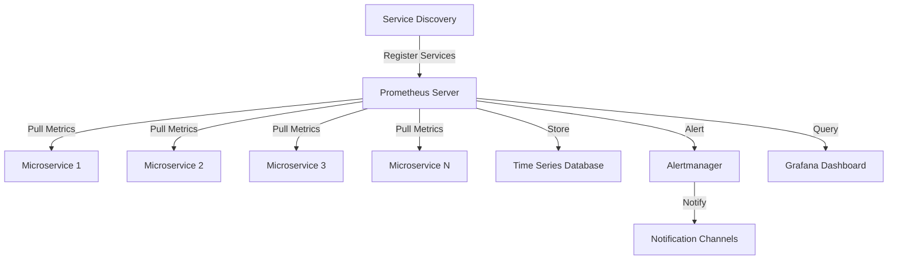
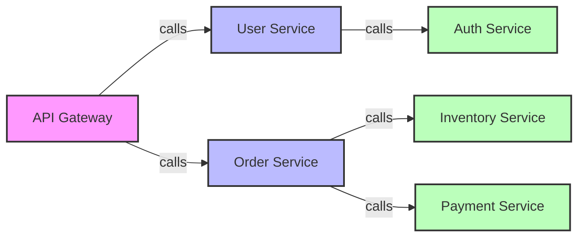
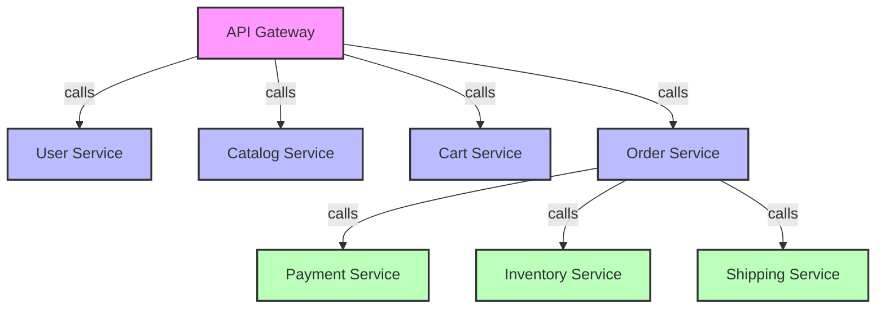

# Microservices Monitoring

## Introduction

Microservices architecture has become increasingly popular for building complex applications, breaking monolithic systems into smaller, independent services that work together. While this approach offers benefits like scalability and flexibility, it introduces monitoring challenges. With many services running across different environments, traditional monitoring approaches often fall short.

This is where Prometheus shines as a powerful monitoring solution for microservices. In this guide, we'll explore how to effectively monitor microservices architectures with Prometheus, covering everything from basic concepts to advanced implementation strategies.

## Understanding the Monitoring Challenges in Microservices

Before diving into Prometheus-specific implementations, let's understand the unique monitoring challenges that microservices present:

1. **Distributed Nature**: With services running on multiple hosts, containers, or cloud environments, there's no single point for collecting data.

2. **Service Interdependencies**: When one service fails, it can affect others in ways that are difficult to track without proper monitoring.

3. **Dynamic Scaling**: Services may scale up or down automatically, requiring monitoring that can adapt to changing environments.

4. **Increased Complexity**: More services mean more components to monitor, more metrics to track, and more potential failure points.

5. **Polyglot Implementations**: Microservices often use different programming languages and technologies, complicating consistent monitoring approaches.

## Prometheus Architecture for Microservices Monitoring

Prometheus offers a robust solution for monitoring microservice architectures thanks to its pull-based model, flexible service discovery, and dimensional data model.



### Key Components for Microservices Monitoring

1. **Prometheus Server**: Central component that scrapes and stores time series data.
2. **Service Discovery**: Automatically finds services to monitor as they are created or destroyed.
3. **Exporters**: Expose metrics from services that don't natively support Prometheus metrics.
4. **Alertmanager**: Handles alerts, including deduplication, grouping, and routing to notification channels.
5. **Grafana**: Visualization platform for creating dashboards from Prometheus data.

## Setting Up Basic Microservices Monitoring

Let's start with a basic example of setting up Prometheus to monitor a simple microservice architecture.

### 1. Configuring Prometheus for Microservices

Here's a sample `prometheus.yml` configuration file that includes service discovery for a Kubernetes environment:

```yaml
global:
  scrape_interval: 15s
  evaluation_interval: 15s

rule_files:
  - "alerts.yml"

scrape_configs:
  - job_name: 'kubernetes-pods'
    kubernetes_sd_configs:
      - role: pod
    relabel_configs:
      - source_labels: [__meta_kubernetes_pod_annotation_prometheus_io_scrape]
        action: keep
        regex: true
      - source_labels: [__meta_kubernetes_pod_annotation_prometheus_io_path]
        action: replace
        target_label: __metrics_path__
        regex: (.+)
      - source_labels: [__address__, __meta_kubernetes_pod_annotation_prometheus_io_port]
        action: replace
        regex: ([^:]+)(?::\d+)?;(\d+)
        replacement: $1:$2
        target_label: __address__
      - action: labelmap
        regex: __meta_kubernetes_pod_label_(.+)
      - source_labels: [__meta_kubernetes_namespace]
        action: replace
        target_label: kubernetes_namespace
      - source_labels: [__meta_kubernetes_pod_name]
        action: replace
        target_label: kubernetes_pod_name
```

This configuration uses Kubernetes service discovery to automatically find pods that have been annotated with `prometheus.io/scrape: "true"`. When new services are deployed with this annotation, Prometheus will automatically discover and start scraping them.

### 2. Instrumenting Microservices

For a microservice to be monitored by Prometheus, it needs to expose metrics in Prometheus format. Here's how to instrument a simple Node.js microservice:

```javascript
const express = require('express');
const client = require('prom-client');
const app = express();

// Create a Registry to register metrics
const register = new client.Registry();

// Enable the default metrics collection
client.collectDefaultMetrics({ register });

// Create a custom counter for HTTP requests
const httpRequestsTotal = new client.Counter({
  name: 'http_requests_total',
  help: 'Total number of HTTP requests',
  labelNames: ['method', 'endpoint', 'status'],
  registers: [register]
});

// Create a custom histogram for HTTP request duration
const httpRequestDurationMicroseconds = new client.Histogram({
  name: 'http_request_duration_ms',
  help: 'Duration of HTTP requests in ms',
  labelNames: ['method', 'endpoint', 'status'],
  buckets: [0.1, 5, 15, 50, 100, 500],
  registers: [register]
});

// Middleware to measure request duration
app.use((req, res, next) => {
  const end = httpRequestDurationMicroseconds.startTimer();
  res.on('finish', () => {
    httpRequestsTotal.inc({
      method: req.method,
      endpoint: req.path,
      status: res.statusCode
    });
    end({
      method: req.method,
      endpoint: req.path,
      status: res.statusCode
    });
  });
  next();
});

// Business logic endpoints
app.get('/api/users', (req, res) => {
  // Simulate some work
  setTimeout(() => {
    res.json({ users: ['user1', 'user2'] });
  }, Math.random() * 100);
});

// Expose metrics endpoint for Prometheus
app.get('/metrics', async (req, res) => {
  res.set('Content-Type', register.contentType);
  res.end(await register.metrics());
});

const port = process.env.PORT || 3000;
app.listen(port, () => {
  console.log(`User service listening on port ${port}`);
});
```

When deployed, this service would expose metrics at the `/metrics` endpoint, which Prometheus would scrape to collect data about HTTP requests, including their count and duration.

### 3. Implementing Kubernetes Annotations

To make your microservice discoverable by Prometheus in Kubernetes, add the following annotations to your deployment:

```yaml
apiVersion: apps/v1
kind: Deployment
metadata:
  name: user-service
spec:
  replicas: 3
  selector:
    matchLabels:
      app: user-service
  template:
    metadata:
      labels:
        app: user-service
      annotations:
        prometheus.io/scrape: "true"
        prometheus.io/port: "3000"
        prometheus.io/path: "/metrics"
    spec:
      containers:
      - name: user-service
        image: user-service:1.0.0
        ports:
        - containerPort: 3000
```

With these annotations, Prometheus will automatically discover and monitor your user-service instances as they are created or destroyed.

## Advanced Microservices Monitoring Techniques

Now that we've covered the basics, let's explore more advanced techniques for comprehensive microservices monitoring.

### The RED Method for Microservices

The RED method focuses on three key metrics for each service:

- **Rate**: Number of requests per second
- **Errors**: Number of failed requests per second
- **Duration**: Distribution of response times

Let's implement the RED method using Prometheus and PromQL:

```javascript
// Rate: Requests per second for a service
rate(http_requests_total{job="user-service"}[5m])

// Errors: Error rate for a service
rate(http_requests_total{job="user-service", status=~"5.."}[5m]) / 
rate(http_requests_total{job="user-service"}[5m])

// Duration: 95th percentile response time
histogram_quantile(0.95, sum(rate(http_request_duration_ms_bucket{job="user-service"}[5m])) by (le))
```

These queries can be used in Grafana dashboards to visualize the health of each microservice.

### Service Dependency Monitoring

Monitoring service dependencies is crucial for understanding the impact of one service on others. Here's how to implement it:

1. First, instrument your service to track dependency calls:

```javascript
const httpRequestClient = new client.Histogram({
  name: 'http_client_request_duration_ms',
  help: 'Duration of HTTP client requests in ms',
  labelNames: ['method', 'target_service', 'endpoint', 'status'],
  buckets: [0.1, 5, 15, 50, 100, 500],
  registers: [register]
});

// Function to make HTTP requests to other services
async function callService(serviceName, endpoint, method = 'GET') {
  const end = httpRequestClient.startTimer();
  try {
    const response = await axios({
      method,
      url: `http://${serviceName}/${endpoint}`
    });
    end({
      method,
      target_service: serviceName,
      endpoint,
      status: response.status
    });
    return response.data;
  } catch (error) {
    end({
      method,
      target_service: serviceName,
      endpoint,
      status: error.response ? error.response.status : 500
    });
    throw error;
  }
}
```

2. Create a service dependency visualization using Grafana:



3. Create alerting rules for service dependencies:

```yaml
groups:
- name: service-dependencies
  rules:
  - alert: ServiceDependencyHighLatency
    expr: histogram_quantile(0.95, sum(rate(http_client_request_duration_ms_bucket[5m])) by (target_service, le)) > 200
    for: 5m
    labels:
      severity: warning
    annotations:
      summary: "High latency calling {{ $labels.target_service }}"
      description: "95th percentile latency for calls to {{ $labels.target_service }} is above 200ms"
```

### Implementing SLOs with Prometheus

Service Level Objectives (SLOs) help you define and track service reliability goals. Here's how to implement SLOs using Prometheus:

1. Define your SLO metrics (e.g., 99% of requests should complete in under 300ms)

2. Create recording rules to track SLO compliance:

```yaml
groups:
- name: slo-rules
  rules:
  - record: job:http_request_duration_ms:99percentile
    expr: histogram_quantile(0.99, sum(rate(http_request_duration_ms_bucket[5m])) by (job, le))
  
  - record: job:slo_requests_total
    expr: sum(increase(http_requests_total[5m])) by (job)
  
  - record: job:slo_violations_total
    expr: sum(increase(http_request_duration_ms_count{le="300"}[5m])) by (job)
  
  - record: job:slo_compliance_ratio
    expr: job:slo_violations_total / job:slo_requests_total
```

3. Create an alert when SLO compliance is at risk:

```yaml
groups:
- name: slo-alerts
  rules:
  - alert: SLOComplianceRisk
    expr: job:slo_compliance_ratio{job="user-service"} < 0.99
    for: 15m
    labels:
      severity: critical
    annotations:
      summary: "SLO Compliance at Risk for {{ $labels.job }}"
      description: "Service {{ $labels.job }} is not meeting its 99% latency SLO"
```

## Real-world Example: E-commerce Microservices Monitoring

Let's apply these concepts to a real-world e-commerce platform with multiple microservices:



### Comprehensive Monitoring Strategy

1. **Infrastructure-level metrics**: Monitor CPU, memory, network across all services

```yaml
- job_name: 'node-exporter'
  kubernetes_sd_configs:
    - role: node
  relabel_configs:
    - source_labels: [__meta_kubernetes_node_name]
      regex: (.+)
      target_label: __metrics_path__
      replacement: /metrics
```

2. **Business-level metrics**: Track key business indicators

```javascript
// Track successful orders
const orderCompleted = new client.Counter({
  name: 'business_orders_completed_total',
  help: 'Total number of successfully completed orders',
  labelNames: ['payment_method', 'customer_type'],
  registers: [register]
});

// Track cart abandonment
const cartAbandoned = new client.Counter({
  name: 'business_carts_abandoned_total',
  help: 'Total number of abandoned shopping carts',
  labelNames: ['user_type', 'item_count_range'],
  registers: [register]
});
```

3. **Service inter-dependencies**: Track how services interact

```yaml
- record: service:dependency:error_rate
  expr: sum(rate(http_client_request_duration_ms_count{status=~"5.."}[5m])) by (target_service) / 
        sum(rate(http_client_request_duration_ms_count[5m])) by (target_service)
```

4. **Custom Grafana dashboard** for the e-commerce platform:

The dashboard would include:
- Service health overview (RED metrics)
- Business KPIs (orders per hour, revenue, cart abandonment)
- Service dependencies and response times
- Resource utilization across services
- SLO compliance tracking

### Multi-Stage Alerting Strategy

Define different alert severity levels based on impact:

```yaml
groups:
- name: e-commerce-alerts
  rules:
  - alert: HighErrorRate
    expr: rate(http_requests_total{status=~"5.."}[5m]) / rate(http_requests_total[5m]) > 0.05
    for: 2m
    labels:
      severity: warning
    annotations:
      summary: "High error rate for {{ $labels.job }}"
      description: "Error rate is above 5% for {{ $labels.job }}"

  - alert: CriticalServiceDown
    expr: up{job=~"order-service|payment-service"} == 0
    for: 1m
    labels:
      severity: critical
    annotations:
      summary: "Critical service {{ $labels.job }} is down"
      description: "Service {{ $labels.job }} has been down for more than 1 minute"

  - alert: OrderProcessingLatency
    expr: histogram_quantile(0.95, sum(rate(http_request_duration_ms_bucket{endpoint=~"/api/orders/process"}[5m])) by (le)) > 2000
    for: 5m
    labels:
      severity: critical
    annotations:
      summary: "Order processing is slow"
      description: "95th percentile of order processing time is above 2 seconds"
```

## Best Practices for Microservices Monitoring

Based on our examples, here are some best practices for effective microservices monitoring:

1. **Implement consistent instrumentation** across all services by using libraries appropriate for each language (e.g., Prometheus client libraries).

2. **Use service discovery** to automatically find and monitor new services as they're deployed.

3. **Follow the RED method** (Rate, Errors, Duration) for essential service health monitoring.

4. **Monitor both technical and business metrics** to get a complete picture of your system.

5. **Implement multi-level alerting** with different severity levels based on business impact.

6. **Track service dependencies** to understand how failures propagate through your system.

7. **Define and monitor SLOs** to ensure you're meeting reliability goals.

8. **Use recording rules** for frequently used or complex queries to improve performance.

9. **Create comprehensive dashboards** that give both high-level and detailed views of your system.

10. **Implement context-aware alerts** that include actionable information for faster resolution.

## Troubleshooting Common Issues

When monitoring microservices with Prometheus, you might encounter these common issues:

1. **Target scrape failures**: Verify network connectivity and that services expose the `/metrics` endpoint.

2. **Cardinality explosions**: Limit the number of label values to prevent overwhelming Prometheus.

3. **Missing metrics**: Ensure all services are properly instrumented and registered with service discovery.

4. **Alert storms**: Use proper grouping in Alertmanager to avoid overwhelming notification channels.

5. **Resource constraints**: Monitor Prometheus itself and scale resources as your service count grows.

## Summary

Monitoring microservices effectively with Prometheus requires a comprehensive approach that covers:

- Service discovery to automatically find and monitor services
- Consistent instrumentation across all services
- Tracking of RED metrics (Rate, Errors, Duration)
- Service dependency monitoring
- Implementation of SLOs and alerting
- Custom dashboards for visibility into both technical and business metrics

By following the practices outlined in this guide, you can build a robust monitoring system that provides visibility into your microservices architecture, helps detect issues before they impact users, and enables faster troubleshooting when problems occur.

## Additional Resources

Here are some resources to further explore microservices monitoring with Prometheus:

- Experiment with the provided code examples in your own environment
- Practice creating custom metrics for your specific business needs
- Try implementing RED method dashboards for your services
- Set up service dependency tracking and visualization
- Define SLOs for your most critical services and track compliance

## Exercises

1. Set up a basic microservice with Prometheus instrumentation using the example code provided.

2. Create a Grafana dashboard that visualizes the RED metrics for your service.

3. Implement service dependency tracking between two microservices and visualize the relationship.

4. Define an SLO for a critical service endpoint and create alerts when compliance is at risk.

5. Extend the basic instrumentation with custom business metrics relevant to your application.