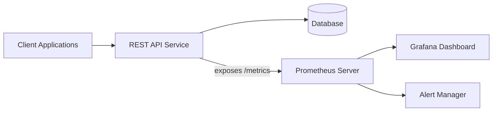

# API Monitoring with Prometheus

## Introduction

API monitoring is a critical part of modern application observability. As applications increasingly rely on microservices and distributed architectures, APIs serve as the communication channels between services. Effective API monitoring helps ensure that these channels remain healthy, performant, and reliable.

In this guide, we'll explore how Prometheus can be used to implement comprehensive API monitoring strategies. You'll learn about key metrics to track, how to configure Prometheus for API monitoring, and practical examples that demonstrate real-world applications.

## Why Monitor APIs?

Before diving into the implementation details, let's understand why API monitoring is essential:

1. **Service Health**: APIs are the lifelines of your applications. If they fail, your entire system may become unavailable.
2. **Performance Insights**: Monitoring provides data about response times, helping you identify and address bottlenecks.
3. **Usage Patterns**: Understanding how your APIs are used helps in capacity planning and resource allocation.
4. **Error Detection**: Monitoring helps detect errors and failures quickly, minimizing impact on users.
5. **SLA Compliance**: Many organizations have Service Level Agreements (SLAs) that require tracking API performance metrics.

## Key API Metrics to Monitor

When monitoring APIs with Prometheus, consider tracking these essential metrics:

### 1. Request Rate

The number of requests your API receives over time.

```prometheus
rate(http_requests_total[5m])
```

### 2. Error Rate

The percentage of requests that result in errors.

```prometheus
rate(http_requests_total{status=~"5.."}[5m]) / rate(http_requests_total[5m])
```

### 3. Response Time

How long it takes your API to respond to requests.

```prometheus
histogram_quantile(0.95, sum(rate(http_request_duration_seconds_bucket[5m])) by (le))
```

### 4. Resource Utilization

CPU, memory, and network usage associated with your API service.

```prometheus
sum(rate(process_cpu_seconds_total{job="api-service"}[5m])) by (instance)
```

### 5. Availability

Whether your API is up and responding.

```prometheus
up{job="api-service"}
```

## Setting Up API Monitoring with Prometheus

Let's walk through the process of configuring Prometheus to monitor an API:

### Step 1: Instrument Your API

First, you need to instrument your API code to expose metrics. Here's an example using a Node.js Express application with the `prom-client` library:

```javascript
const express = require('express');
const promClient = require('prom-client');

// Create a Registry to register metrics
const register = new promClient.Registry();
promClient.collectDefaultMetrics({ register });

// Create custom metrics
const httpRequestDurationMicroseconds = new promClient.Histogram({
  name: 'http_request_duration_seconds',
  help: 'Duration of HTTP requests in seconds',
  labelNames: ['method', 'route', 'status_code'],
  buckets: [0.1, 0.3, 0.5, 0.7, 1, 3, 5, 7, 10]
});

const httpRequestsTotal = new promClient.Counter({
  name: 'http_requests_total',
  help: 'Total number of HTTP requests',
  labelNames: ['method', 'route', 'status_code']
});

// Register the metrics
register.registerMetric(httpRequestDurationMicroseconds);
register.registerMetric(httpRequestsTotal);

const app = express();

// Middleware to collect metrics
app.use((req, res, next) => {
  const start = Date.now();
  
  res.on('finish', () => {
    const duration = Date.now() - start;
    httpRequestDurationMicroseconds
      .labels(req.method, req.path, res.statusCode)
      .observe(duration / 1000); // Convert to seconds
    
    httpRequestsTotal
      .labels(req.method, req.path, res.statusCode)
      .inc();
  });
  
  next();
});

// Endpoint to expose metrics
app.get('/metrics', async (req, res) => {
  res.set('Content-Type', register.contentType);
  res.end(await register.metrics());
});

// API endpoints
app.get('/api/users', (req, res) => {
  res.json({ users: ['Alice', 'Bob', 'Charlie'] });
});

app.listen(3000, () => {
  console.log('Server is running on port 3000');
});
```

### Step 2: Configure Prometheus to Scrape Your API

Create or update your `prometheus.yml` configuration file to include your API service:

```yaml
global:
  scrape_interval: 15s

scrape_configs:
  - job_name: 'api-service'
    static_configs:
      - targets: ['localhost:3000']
```

### Step 3: Visualize and Alert on API Metrics

After collecting metrics, you can create dashboards in Grafana to visualize them. Here's a simple Prometheus query to monitor API request rates by endpoint:

```prometheus
sum(rate(http_requests_total[5m])) by (route)
```

## Practical Example: Monitoring a RESTful API

Let's walk through a complete example of monitoring a RESTful API that provides user data.

### Architecture Diagram



### Key Components:

1. **REST API Service**: Exposes endpoints for user data and a `/metrics` endpoint
2. **Prometheus Server**: Scrapes metrics from the API service
3. **Grafana**: Provides visualization of API metrics
4. **Alert Manager**: Sends alerts when API metrics exceed thresholds

### Alert Rules Example

Create `api_alerts.yml` to define alert rules:

```yaml
groups:
- name: api_alerts
  rules:
  - alert: HighErrorRate
    expr: sum(rate(http_requests_total{status=~"5.."}[5m])) / sum(rate(http_requests_total[5m])) > 0.05
    for: 5m
    labels:
      severity: critical
    annotations:
      summary: "High API Error Rate"
      description: "Error rate is above 5% for the last 5 minutes ({{ $value | printf \"%.2f\" }})"
  
  - alert: SlowResponseTime
    expr: histogram_quantile(0.95, sum(rate(http_request_duration_seconds_bucket[5m])) by (le)) > 1
    for: 5m
    labels:
      severity: warning
    annotations:
      summary: "Slow API Response Time"
      description: "95th percentile of API response time is above 1 second ({{ $value | printf \"%.2f\" }}s)"
  
  - alert: HighRequestRate
    expr: sum(rate(http_requests_total[5m])) > 100
    for: 5m
    labels:
      severity: warning
    annotations:
      summary: "High API Request Rate"
      description: "API is receiving more than 100 requests per second ({{ $value | printf \"%.2f\" }})"
```

Add this to your Prometheus configuration:

```yaml
rule_files:
  - "api_alerts.yml"
```

## Recording Rules for API Metrics

Recording rules can pre-compute frequently used or complex queries. Create `api_recording_rules.yml`:

```yaml
groups:
- name: api_recording_rules
  rules:
  - record: api:request_rate:5m
    expr: sum(rate(http_requests_total[5m])) by (route)
  
  - record: api:error_rate:5m
    expr: sum(rate(http_requests_total{status=~"5.."}[5m])) by (route) / sum(rate(http_requests_total[5m])) by (route)
  
  - record: api:request_duration_p95:5m
    expr: histogram_quantile(0.95, sum(rate(http_request_duration_seconds_bucket[5m])) by (le, route))
```

## Red Flags and Common Issues

When monitoring APIs with Prometheus, watch out for:

1. **High Cardinality**: Be careful with label combinations that can create too many time series. For example, avoid using user IDs or session IDs as labels.
2. **Missing Instrumentation**: Ensure all critical API endpoints are instrumented.
3. **Misleading Averages**: Don't rely solely on average response times; use percentiles (histogram_quantile) for a more accurate picture.
4. **Blind Spots**: Make sure to monitor both successful requests and failures.
5. **Alert Fatigue**: Configure meaningful alert thresholds to avoid unnecessary notifications.

## Advanced API Monitoring Techniques

### Circuit Breaker Metrics

If your API implements circuit breakers, monitor their states:

```javascript
const circuitBreakerState = new promClient.Gauge({
  name: 'circuit_breaker_state',
  help: 'Circuit breaker state (0=open, 1=half-open, 2=closed)',
  labelNames: ['service']
});

// Register and update the metric when circuit breaker state changes
register.registerMetric(circuitBreakerState);
circuitBreakerState.set({ service: 'database' }, 2); // Closed
```

### Rate Limiting Metrics

Monitor rate limiting to understand API usage patterns:

```javascript
const rateLimitHits = new promClient.Counter({
  name: 'rate_limit_hits_total',
  help: 'Total number of rate limit hits',
  labelNames: ['client_id', 'endpoint']
});

register.registerMetric(rateLimitHits);
// Increment when a client hits rate limit
rateLimitHits.inc({ client_id: 'client123', endpoint: '/api/users' });
```

## Summary

Effective API monitoring with Prometheus involves:

1. **Instrumenting your API code** to expose relevant metrics
2. **Configuring Prometheus** to scrape these metrics
3. **Setting up dashboards** to visualize API performance
4. **Creating alert rules** to notify when issues occur
5. **Using recording rules** to optimize query performance

By implementing these practices, you can ensure your APIs remain reliable, performant, and meet your service level objectives.

## Exercises

1. **Basic Setup**: Instrument a simple API with Prometheus metrics and set up a scrape configuration.
2. **Dashboard Creation**: Create a Grafana dashboard showing key API metrics.
3. **Alert Configuration**: Configure alerts for high error rates and slow response times.
4. **Custom Metric**: Implement a custom metric for tracking business-specific API information.
5. **High-Cardinality Challenge**: Solve a high-cardinality problem by reconsidering label usage.

## Additional Resources

- [Prometheus Documentation](https://prometheus.io/docs/introduction/overview/)
- [RED Method for Monitoring](https://grafana.com/blog/2018/08/02/the-red-method-how-to-instrument-your-services/)
- [Google's Four Golden Signals](https://sre.google/sre-book/monitoring-distributed-systems/)
- [Grafana Dashboard Examples for APIs](https://grafana.com/grafana/dashboards/)