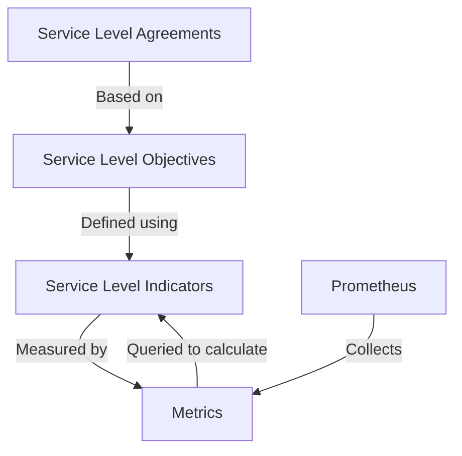

# SLA/SLO Monitoring with Prometheus

## Introduction

In today's reliability-focused software landscape, measuring and maintaining service quality is crucial. Two key concepts guide this process: Service Level Agreements (SLAs) and Service Level Objectives (SLOs).

An **SLA** is a formal agreement between a service provider and customer that defines the expected level of service. It typically includes financial penalties if commitments aren't met.

An **SLO** is a specific, measurable target for service performance that a team aims to achieve, usually defined in terms of availability or performance metrics.

Prometheus, with its powerful querying capabilities and time-series database, provides an excellent foundation for implementing SLA/SLO monitoring. In this guide, we'll explore how to establish, measure, and alert on SLOs using Prometheus.

## Understanding Service Level Indicators (SLIs)

Before diving into SLOs, we need to understand Service Level Indicators (SLIs). An SLI is a quantitative measure of some aspect of the provided service.

Common SLIs include:

- **Availability**: Percentage of successful requests
- **Latency**: Response time for requests
- **Error rate**: Percentage of failed requests
- **Throughput**: Number of requests handled per second
- **Saturation**: How "full" your service is (e.g., CPU usage)

Let's create a basic diagram showing the relationship between these concepts:



## Implementing SLO Monitoring with Prometheus

### Step 1: Define Your SLIs

First, identify which metrics will serve as your SLIs. For a web service, these might include:

```prometheus
# Request success rate (as a ratio)
sum(rate(http_requests_total{code=~"2.."}[5m])) / sum(rate(http_requests_total[5m]))

# Latency (90th percentile in seconds)
histogram_quantile(0.9, sum(rate(http_request_duration_seconds_bucket[5m])) by (le))
```

### Step 2: Set SLO Targets

Next, define your SLO targets. For example:

- 99.9% availability over 30 days (allowing for ~43 minutes of downtime)
- 95% of requests complete in under 200ms

### Step 3: Implement Error Budgets

Error budgets are a powerful concept that goes hand-in-hand with SLOs. An error budget represents the amount of unreliability you can tolerate within your SLO.

For example, if your availability SLO is 99.9% over 30 days, your error budget is 0.1% of requests over that period. Once you've used up this budget, you might want to freeze new deployments until reliability improves.

Let's calculate an error budget using Prometheus:

```prometheus
# Define the SLO target
slo_target = 0.999

# Calculate the error budget (allowed errors)
total_requests = sum(increase(http_requests_total[30d]))
error_budget = (1 - slo_target) * total_requests

# Calculate budget consumption (actual errors)
actual_errors = sum(increase(http_requests_total{code=~"5.."}[30d]))

# Error budget remaining
error_budget - actual_errors
```

### Step 4: Create Burn Rate Alerts

Rather than just alerting when you've violated an SLO, which might be too late, implement "burn rate" alerts. These notify you when you're consuming your error budget too quickly.

Here's how to create a burn rate alert in Prometheus:

```yaml
groups:
- name: SLO_alerts
  rules:
  - alert: ErrorBudgetBurnRate
    expr: |
      sum(rate(http_requests_total{code=~"5.."}[1h]))
      /
      sum(rate(http_requests_total[1h]))
      >
      (1 - 0.999) * 24 # Burning 24x faster than allowed
    for: 5m
    labels:
      severity: warning
    annotations:
      summary: "Error budget burning too fast"
      description: "Service is consuming error budget at an accelerated rate"
```

## Practical Example: Monitoring API Availability

Let's implement a complete example for monitoring an API service:

1. First, we'll instrument our API to expose Prometheus metrics:

```javascript
const express = require('express');
const client = require('prom-client');
const app = express();

// Create a Registry to register metrics to
const register = new client.Registry();

// Define a counter for HTTP requests
const httpRequestsTotal = new client.Counter({
  name: 'http_requests_total',
  help: 'Total number of HTTP requests',
  labelNames: ['method', 'route', 'code'],
  registers: [register]
});

// Define a histogram for request duration
const httpRequestDurationSeconds = new client.Histogram({
  name: 'http_request_duration_seconds',
  help: 'HTTP request duration in seconds',
  labelNames: ['method', 'route', 'code'],
  buckets: [0.01, 0.05, 0.1, 0.2, 0.5, 1, 2, 5],
  registers: [register]
});

// Middleware to measure request duration
app.use((req, res, next) => {
  const start = Date.now();
  
  res.on('finish', () => {
    const duration = (Date.now() - start) / 1000;
    httpRequestsTotal.inc({
      method: req.method,
      route: req.path,
      code: res.statusCode
    });
    httpRequestDurationSeconds.observe(
      {
        method: req.method,
        route: req.path,
        code: res.statusCode
      },
      duration
    );
  });
  
  next();
});

// Expose metrics endpoint
app.get('/metrics', async (req, res) => {
  res.set('Content-Type', register.contentType);
  res.end(await register.metrics());
});

// Example API endpoint
app.get('/api/data', (req, res) => {
  res.json({ message: 'Success' });
});

app.listen(3000, () => {
  console.log('Server listening on port 3000');
});
```

2. Configure Prometheus to scrape these metrics:

```yaml
scrape_configs:
  - job_name: 'api'
    scrape_interval: 5s
    static_configs:
      - targets: ['api-server:3000']
```

3. Define PromQL queries for our SLIs:

```prometheus
# Availability SLI (success rate as a percentage)
(
  sum(rate(http_requests_total{job="api",code=~"2.."}[5m]))
  /
  sum(rate(http_requests_total{job="api"}[5m]))
) * 100

# Latency SLI (95th percentile)
histogram_quantile(0.95, sum(rate(http_request_duration_seconds_bucket{job="api"}[5m])) by (le))
```

4. Create recording rules to calculate SLO compliance:

```yaml
groups:
- name: slo_rules
  rules:
  - record: job:slo_availability:ratio_rate5m
    expr: |
      sum(rate(http_requests_total{job="api",code=~"2.."}[5m]))
      /
      sum(rate(http_requests_total{job="api"}[5m]))
      
  - record: job:slo_latency:95percentile_rate5m
    expr: histogram_quantile(0.95, sum(rate(http_request_duration_seconds_bucket{job="api"}[5m])) by (le))
```

5. Set up alert rules for SLO violations:

```yaml
groups:
- name: slo_alerts
  rules:
  - alert: AvailabilitySLOViolation
    expr: job:slo_availability:ratio_rate5m < 0.999
    for: 15m
    labels:
      severity: critical
    annotations:
      summary: "Availability SLO violation"
      description: "Service availability is below 99.9% over the last 15 minutes"
      
  - alert: LatencySLOViolation
    expr: job:slo_latency:95percentile_rate5m > 0.2
    for: 15m
    labels:
      severity: critical
    annotations:
      summary: "Latency SLO violation"
      description: "95th percentile latency is above 200ms over the last 15 minutes"
```

## Multi-Window, Multi-Burn-Rate Alerts

For more sophisticated SLO monitoring, you can implement multi-window, multi-burn-rate alerts. This approach uses different time windows to detect issues at various speeds:

```yaml
groups:
- name: slo_burn_rate_alerts
  rules:
  - alert: ErrorBudgetBurningFast
    expr: |
      sum(rate(http_requests_total{job="api",code=~"5.."}[1h]))
      /
      sum(rate(http_requests_total{job="api"}[1h]))
      > 14.4 * (1 - 0.999) # 14.4x burn rate = depleting 30-day budget in ~2 days
    for: 1h
    labels:
      severity: critical
    annotations:
      summary: "Error budget burning too fast"
      description: "Service is burning 2-week error budget in ~2 days"
      
  - alert: ErrorBudgetBurningSlow
    expr: |
      sum(rate(http_requests_total{job="api",code=~"5.."}[6h]))
      /
      sum(rate(http_requests_total{job="api"}[6h]))
      > 6 * (1 - 0.999) # 6x burn rate = depleting 30-day budget in ~5 days
    for: 6h
    labels:
      severity: warning
    annotations:
      summary: "Error budget burning steadily"
      description: "Service is burning 30-day error budget in ~5 days"
```

## Visualizing SLOs in Grafana

To complete your SLO monitoring setup, create a dedicated SLO dashboard in Grafana:

```javascript
// Sample SLO dashboard configuration in Grafana
{
  "panels": [
    {
      "title": "API Availability SLO",
      "type": "gauge",
      "datasource": "Prometheus",
      "targets": [
        {
          "expr": "job:slo_availability:ratio_rate5m * 100",
          "legendFormat": "Current"
        }
      ],
      "options": {
        "thresholds": [
          { "value": 99.5, "color": "red" },
          { "value": 99.9, "color": "green" }
        ],
        "min": 99,
        "max": 100
      }
    },
    {
      "title": "API Latency SLO",
      "type": "gauge",
      "datasource": "Prometheus",
      "targets": [
        {
          "expr": "job:slo_latency:95percentile_rate5m * 1000",
          "legendFormat": "95th percentile (ms)"
        }
      ],
      "options": {
        "thresholds": [
          { "value": 0, "color": "green" },
          { "value": 200, "color": "red" }
        ],
        "min": 0,
        "max": 500
      }
    },
    {
      "title": "Error Budget Remaining",
      "type": "stat",
      "datasource": "Prometheus",
      "targets": [
        {
          "expr": "100 - (sum(increase(http_requests_total{job=\"api\",code=~\"5..\"}[30d])) / sum(increase(http_requests_total{job=\"api\"}[30d])) * 100) / (100 - 99.9) * 100",
          "legendFormat": "% Remaining"
        }
      ],
      "options": {
        "colorMode": "value",
        "thresholds": {
          "mode": "absolute",
          "steps": [
            { "value": 0, "color": "red" },
            { "value": 20, "color": "orange" },
            { "value": 50, "color": "green" }
          ]
        }
      }
    }
  ]
}
```

## Best Practices for SLO Implementation

1. **Start simple**: Begin with 1-3 key SLOs that directly impact user experience
2. **Use percentiles, not averages**: Averages hide outliers that affect user experience
3. **Set realistic targets**: Aim for realistic SLOs based on historical performance
4. **Implement error budgets**: Convert SLOs into error budgets to make tradeoffs clear
5. **Use multi-burn-rate alerts**: Alert on varying consumption rates to catch both fast and slow degradations
6. **Review and adjust**: Regularly review your SLOs and adjust as needed

## Summary

Implementing SLA/SLO monitoring with Prometheus provides a powerful way to:

- Quantify service reliability in terms users care about
- Set clear, measurable targets for service performance
- Create a balance between reliability and innovation through error budgets
- Detect and respond to reliability issues before they impact users

By following the steps outlined in this guide, you can establish a comprehensive SLO monitoring system that helps maintain reliable services while providing the necessary data to make informed decisions about reliability investments.

## Additional Resources

- [Site Reliability Engineering book](https://sre.google/sre-book/service-level-objectives/)
- [Prometheus documentation](https://prometheus.io/docs/introduction/overview/)
- [Grafana SLO panel plugin](https://grafana.com/grafana/plugins/grafana-slo-panel/)
- [Alerting on SLOs with Prometheus](https://promtools.dev/alerts/error-budget-burn-rate)

## Exercises

1. Define SLIs and SLOs for a service you're familiar with.
2. Implement basic availability and latency monitoring using Prometheus.
3. Create an error budget based on your SLOs and set up burn rate alerts.
4. Build a Grafana dashboard that visualizes your SLOs and error budget consumption.
5. Design a multi-window, multi-burn-rate alerting strategy for a critical service.