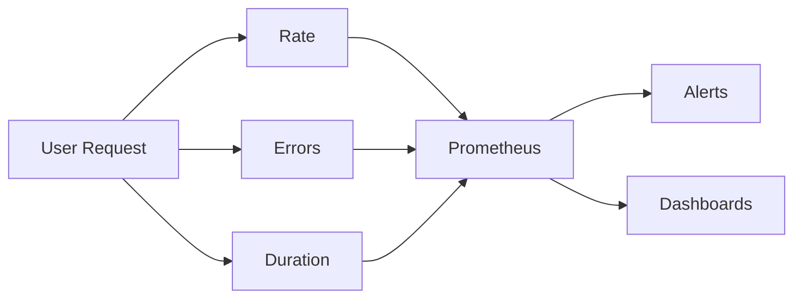

# User Experience Monitoring with Prometheus

## Introduction

User Experience Monitoring (UX Monitoring) is a critical aspect of observability that focuses on how your applications and services perform from the end-user's perspective. While traditional monitoring might tell you that your servers are running properly, UX monitoring answers the more important question: "Are users having a good experience?"

In this guide, we'll explore how to implement User Experience Monitoring using Prometheus, allowing you to collect, analyze, and alert on metrics that directly impact user satisfaction.

## Why Monitor User Experience?

User experience metrics provide valuable insights that server-side metrics alone cannot capture:

- **Response times** as experienced by actual users
- **Error rates** encountered by users
- **Application availability** from the user's perspective
- **User journey completion rates**
- **Client-side performance** issues

## The RED Method for User Experience

A popular framework for UX monitoring is the RED method:

- **R**ate - The number of requests per second
- **E**rrors - The number of failed requests
- **D**uration - The amount of time it takes to process requests



## Setting Up User Experience Monitoring

### Step 1: Instrumenting Your Frontend Applications

First, you need to instrument your frontend applications to collect user experience metrics. Let's look at a simple example using the Prometheus JavaScript client:

```javascript
import { Registry, Counter, Histogram } from 'prom-client';

// Create a registry
const register = new Registry();

// Create metrics
const pageLoadTime = new Histogram({
  name: 'page_load_time_seconds',
  help: 'Time taken for page to load completely',
  buckets: [0.1, 0.3, 0.5, 0.7, 1, 3, 5, 7, 10],
  registers: [register]
});

const userErrors = new Counter({
  name: 'frontend_error_total',
  help: 'Count of frontend errors encountered by users',
  labelNames: ['error_type', 'page'],
  registers: [register]
});

// Record page load time when page finishes loading
window.addEventListener('load', () => {
  const loadTime = performance.now() / 1000;
  pageLoadTime.observe(loadTime);
});

// Capture JavaScript errors
window.addEventListener('error', (event) => {
  userErrors.inc({ error_type: 'js_error', page: window.location.pathname });
});
```

### Step 2: Setting Up a Metrics Collection Endpoint

Since Prometheus typically can't scrape metrics directly from user browsers, you need to set up a backend endpoint that collects and exposes these metrics:

```javascript
// Example using Express.js
import express from 'express';
import { Registry } from 'prom-client';

const app = express();
const register = new Registry();

// Endpoint to receive metrics from clients
app.post('/collect-metrics', express.json(), (req, res) => {
  const { metricName, value, labels } = req.body;
  
  // Process and store the received metrics
  if (metrics[metricName]) {
    if (metricName.includes('_time_')) {
      // It's a histogram
      metrics[metricName].observe(labels || {}, value);
    } else {
      // It's a counter
      metrics[metricName].inc(labels || {}, value);
    }
  }
  
  res.status(200).send('Metrics received');
});

// Prometheus scrape endpoint
app.get('/metrics', async (req, res) => {
  res.set('Content-Type', register.contentType);
  res.end(await register.metrics());
});

app.listen(3000, () => {
  console.log('Metrics server listening on port 3000');
});
```

### Step 3: Configuring Prometheus to Scrape UX Metrics

Add the metrics endpoint to your `prometheus.yml` configuration:

```yaml
scrape_configs:
  - job_name: 'frontend_metrics'
    scrape_interval: 15s
    static_configs:
      - targets: ['metrics-server:3000']
```

## Real-World Implementation Examples

### Example 1: Monitoring API Request Performance

This example shows how to track API requests from a user's browser:

```javascript
// API request monitoring in the browser
const apiRequestDuration = new Histogram({
  name: 'api_request_duration_seconds',
  help: 'Duration of API requests from the client side',
  buckets: [0.05, 0.1, 0.5, 1, 2, 5, 10],
  labelNames: ['endpoint', 'status'],
  registers: [register]
});

// Wrapper for fetch API
async function instrumentedFetch(url, options = {}) {
  const endpoint = new URL(url).pathname;
  const startTime = performance.now();
  let status = 'unknown';
  
  try {
    const response = await fetch(url, options);
    status = response.status;
    return response;
  } catch (error) {
    status = 'error';
    throw error;
  } finally {
    const duration = (performance.now() - startTime) / 1000;
    apiRequestDuration.observe({ endpoint, status }, duration);
    
    // Send to collection endpoint
    try {
      await fetch('/collect-metrics', {
        method: 'POST',
        headers: { 'Content-Type': 'application/json' },
        body: JSON.stringify({
          metricName: 'api_request_duration_seconds',
          value: duration,
          labels: { endpoint, status }
        })
      });
    } catch (e) {
      console.error('Failed to send metrics', e);
    }
  }
}
```

### Example 2: Monitoring Core Web Vitals

Modern web performance often focuses on Core Web Vitals. Here's how to monitor them with Prometheus:

```javascript
// Initialize metrics for Core Web Vitals
const lcpMetric = new Histogram({
  name: 'web_vital_lcp_seconds',
  help: 'Largest Contentful Paint time in seconds',
  buckets: [1, 1.5, 2, 2.5, 3, 4, 5, 6, 8, 10],
  registers: [register]
});

const fidMetric = new Histogram({
  name: 'web_vital_fid_seconds',
  help: 'First Input Delay time in seconds',
  buckets: [0.01, 0.05, 0.1, 0.2, 0.3, 0.4, 0.5, 0.6, 0.7, 0.8],
  registers: [register]
});

const clsMetric = new Histogram({
  name: 'web_vital_cls_score',
  help: 'Cumulative Layout Shift score',
  buckets: [0.01, 0.05, 0.1, 0.15, 0.2, 0.25, 0.3, 0.4, 0.5],
  registers: [register]
});

// Use web-vitals library to measure
import { getLCP, getFID, getCLS } from 'web-vitals';

getLCP((metric) => {
  const valueInSeconds = metric.value / 1000;
  lcpMetric.observe(valueInSeconds);
  sendMetricToServer('web_vital_lcp_seconds', valueInSeconds);
});

getFID((metric) => {
  const valueInSeconds = metric.value / 1000;
  fidMetric.observe(valueInSeconds);
  sendMetricToServer('web_vital_fid_seconds', valueInSeconds);
});

getCLS((metric) => {
  clsMetric.observe(metric.value);
  sendMetricToServer('web_vital_cls_score', metric.value);
});

function sendMetricToServer(name, value) {
  fetch('/collect-metrics', {
    method: 'POST',
    headers: { 'Content-Type': 'application/json' },
    body: JSON.stringify({ metricName: name, value })
  }).catch(e => console.error('Failed to send metrics', e));
}
```

## Creating Useful Dashboards

After collecting UX metrics, create dashboards that highlight the user experience. Here's a sample Grafana dashboard configuration:

```json
{
  "panels": [
    {
      "title": "Page Load Time",
      "type": "graph",
      "gridPos": { "h": 8, "w": 12, "x": 0, "y": 0 },
      "targets": [
        {
          "expr": "histogram_quantile(0.95, sum(rate(page_load_time_seconds_bucket[5m])) by (le))",
          "legendFormat": "95th Percentile"
        },
        {
          "expr": "histogram_quantile(0.5, sum(rate(page_load_time_seconds_bucket[5m])) by (le))",
          "legendFormat": "Median"
        }
      ]
    },
    {
      "title": "API Request Duration",
      "type": "graph",
      "gridPos": { "h": 8, "w": 12, "x": 12, "y": 0 },
      "targets": [
        {
          "expr": "histogram_quantile(0.95, sum(rate(api_request_duration_seconds_bucket[5m])) by (le, endpoint))",
          "legendFormat": "{{endpoint}} - 95th Percentile"
        }
      ]
    },
    {
      "title": "Frontend Errors",
      "type": "graph",
      "gridPos": { "h": 8, "w": 24, "x": 0, "y": 8 },
      "targets": [
        {
          "expr": "sum(rate(frontend_error_total[5m])) by (error_type, page)",
          "legendFormat": "{{error_type}} on {{page}}"
        }
      ]
    }
  ]
}
```

## Setting Up Alerts

Configure Prometheus alerts to notify you when the user experience degrades:

```yaml
groups:
- name: user-experience-alerts
  rules:
  - alert: HighPageLoadTime
    expr: histogram_quantile(0.95, sum(rate(page_load_time_seconds_bucket[5m])) by (le)) > 3
    for: 5m
    labels:
      severity: warning
    annotations:
      summary: "High page load times detected"
      description: "95th percentile of page load time is above 3 seconds for the last 5 minutes"

  - alert: IncreasedFrontendErrors
    expr: sum(rate(frontend_error_total[5m])) > 0.1
    for: 5m
    labels:
      severity: warning
    annotations:
      summary: "Increased frontend errors"
      description: "Frontend is experiencing more than 0.1 errors per second"
      
  - alert: PoorCoreWebVitals
    expr: histogram_quantile(0.75, sum(rate(web_vital_lcp_seconds_bucket[5m])) by (le)) > 2.5
    for: 10m
    labels:
      severity: warning
    annotations:
      summary: "Poor LCP performance"
      description: "75% of users are experiencing LCP times greater than 2.5 seconds"
```

## Challenges and Considerations

When implementing UX monitoring with Prometheus, be aware of these challenges:

1. **Data Volume**: Browsers can generate a lot of metrics data. Consider sampling or aggregating client-side before sending to the server.

2. **Privacy Concerns**: Ensure you're compliant with privacy regulations when collecting user metrics. Avoid collecting personally identifiable information.

3. **Connectivity Issues**: Users might experience connectivity problems when sending metrics. Implement a retry mechanism or batch sending.

4. **Browser Compatibility**: Not all metrics are available in all browsers. Check compatibility or provide fallbacks.

5. **Security Considerations**: The metrics collection endpoint needs proper authentication to prevent abuse.

## Summary

User Experience Monitoring with Prometheus provides valuable insights into how your applications perform from the end-user's perspective. By implementing the RED method and monitoring key performance indicators, you can:

- Detect user-facing issues before they significantly impact your business
- Understand the real performance your users experience
- Set meaningful SLOs based on user experience
- Make data-driven decisions about performance improvements

Remember that good user experience monitoring combines both technical metrics (load times, error rates) and business metrics (conversion rates, session duration) for a complete picture of application health.

## Exercises

1. Set up a basic web application with JavaScript UX monitoring that reports to Prometheus.

2. Create a Grafana dashboard that displays the 95th percentile, median, and average page load time.

3. Implement an alert that triggers when your frontend error rate exceeds a threshold.

4. Add monitoring for a custom user journey (e.g., checkout process) and track how long it takes users to complete.

5. Research and implement Real User Monitoring (RUM) with Prometheus for a specific framework (React, Angular, Vue, etc.).

## Additional Resources

- [Prometheus Client Libraries](https://prometheus.io/docs/instrumenting/clientlibs/)
- [Google Web Vitals](https://web.dev/vitals/)
- [RED Method Overview by Peter Bourgon](https://peter.bourgon.org/blog/2016/02/07/logging-v-instrumentation.html)
- [Grafana Dashboard Examples](https://grafana.com/grafana/dashboards/)
- [SRE Book: Implementing SLOs](https://sre.google/sre-book/implementing-slos/)