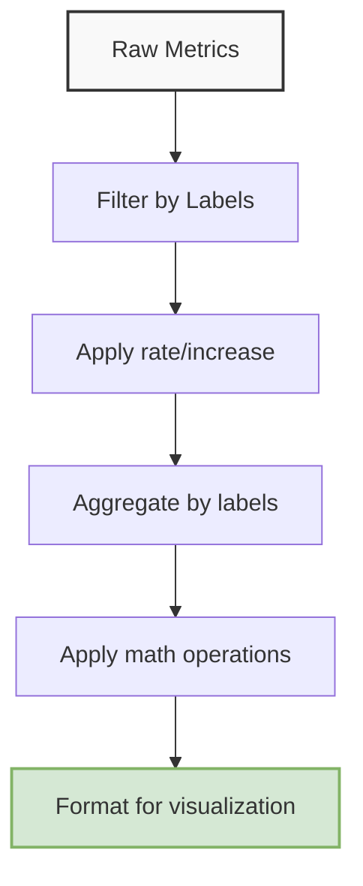

# PromQL Best Practices

## Introduction

PromQL (Prometheus Query Language) is the powerful query language that makes Prometheus such an effective monitoring system. While the basics of PromQL are straightforward, writing efficient, maintainable, and accurate queries requires understanding some key principles and patterns. This guide covers essential best practices that will help you write better PromQL queries, avoid common pitfalls, and get the most value from your monitoring data.

## Optimize for Query Efficiency

### Use Rate() Correctly

When calculating rates from counters, use the `rate()` function appropriately:

```promql
# Good practice: rate() with a range that is 4x the scrape interval
rate(http_requests_total[5m])

# Not ideal: too short a range can lead to inaccurate or empty results
rate(http_requests_total[10s])
```

The general guideline is to use a range at least 4 times the scrape interval to ensure enough samples for accurate calculations.

### Prefer rate() over irate() for Dashboards

While `irate()` gives the instant rate between the last two data points, `rate()` provides a more stable view by averaging over a time window:

```promql
# Better for dashboards - smoother, less sensitive to outliers
rate(http_requests_total[5m])

# More variable, can show spikes that rate() smooths out
irate(http_requests_total[5m])
```

Use `irate()` when you need to see immediate changes in rates, particularly for alerting on sudden spikes. Use `rate()` for most dashboard visualizations.

### Avoid Expensive Operations

Minimize the use of expensive operations, especially on large result sets:

```promql
# Expensive: sort(topk(1000, sum by(instance) (rate(node_cpu_seconds_total{mode="idle"}[5m]))))

# Better: Narrow down before applying expensive operations
topk(10, sum by(instance) (rate(node_cpu_seconds_total{mode="idle"}[5m])))
```

Functions like `sort()`, `topk()` with large values, and `*_over_time()` functions with long ranges can significantly impact query performance.

## Improve Query Readability and Maintainability

### Use Labels Effectively

Leverage meaningful labels to make your queries more specific and easier to understand:

```promql
# Too broad
http_requests_total

# Better: filtered by specific service and environment
http_requests_total{service="auth-api", env="production"}
```

Well-structured labels make your queries more precise and easier to debug.

### Write Clear Multi-step Queries with Comments

For complex queries, use comments and split logic into clear steps:

```promql
# Get HTTP error rate percentage by service
# 1. Calculate rate of 5xx responses
(
  sum by(service) (rate(http_requests_total{status=~"5.."}[5m]))
  /
  # 2. Calculate rate of all responses
  sum by(service) (rate(http_requests_total[5m]))
) * 100
```

Clear comments and formatting make complex queries easier to understand and maintain.

### Follow Consistent Naming Conventions

Establish consistent naming patterns for your metrics and queries:

```promql
# Consistent naming pattern for request metrics
api_requests_total{path="/users", method="GET"}
api_request_duration_seconds{path="/users", method="GET"}

# Inconsistent naming (avoid this)
api_requests{path="/users", method="GET"}
api_latency_ms{path="/users", method="GET"}
```

Consistent naming makes it easier to discover related metrics and build dashboards.

## Handle Edge Cases Correctly

### Account for Counter Resets

Counters can reset when services restart. The `rate()` function handles this automatically, but be aware when doing manual calculations:

```promql
# Handles counter resets correctly
rate(process_cpu_seconds_total[5m])

# Dangerous: manual difference doesn't handle counter resets
process_cpu_seconds_total offset 5m - process_cpu_seconds_total
```

Always use `rate()`, `increase()`, or `delta()` when working with counters.

### Use absent() for Alerting on Missing Metrics

When alerting, check for missing metrics to avoid false negatives:

```promql
# Alert triggers only if metric exists and is above threshold
http_errors_total > 100

# Better for alerting: handles case where metric disappears
http_errors_total > 100 or absent(http_errors_total)
```

This pattern ensures your alerts fire even if a service stops reporting metrics entirely.

### Handle Highly Dynamic Labels Carefully

Labels that have high cardinality (many possible values) can cause performance issues:

```promql
# Problematic: user_id has high cardinality
requests_total{user_id="12345"}

# Better: aggregate first, then filter
sum by(endpoint) (requests_total) > 1000
```

Avoid using high-cardinality labels in grouping operations, and be cautious about exponential growth in combinations of label values.

## Effective Data Visualization Patterns

### Calculate Percentages Correctly

When calculating percentages, ensure proper aggregation:

```promql
# Correct way to calculate percentage of error responses
(
  sum(rate(http_requests_total{status=~"5.."}[5m]))
  /
  sum(rate(http_requests_total[5m]))
) * 100

# Incorrect: division happens per time series before summing
sum(
  rate(http_requests_total{status=~"5.."}[5m])
  /
  rate(http_requests_total[5m])
  * 100
)
```

Aggregate the numerator and denominator separately before division to get accurate percentages.

### Use Recording Rules for Complex or Frequent Queries

For complex queries that are used frequently in dashboards, define recording rules:

```yaml
# In prometheus.yml recording rules section
rules:
  - record: job:http_requests:rate5m
    expr: sum by(job) (rate(http_requests_total[5m]))
```

Then in your dashboards or alerts, use the pre-computed metric:

```promql
job:http_requests:rate5m{job="api-server"}
```

Recording rules improve performance and ensure consistency across dashboards.

## Monitoring Your Services Effectively

### Focus on the Four Golden Signals

Structure your monitoring queries around these fundamental aspects:

1. **Latency**: How long it takes to service a request
   ```promql
   histogram_quantile(0.95, sum(rate(http_request_duration_seconds_bucket[5m])) by (le, service))
   ```

2. **Traffic**: The demand placed on your system
   ```promql
   sum by(service) (rate(http_requests_total[5m]))
   ```

3. **Errors**: The rate of failed requests
   ```promql
   sum by(service) (rate(http_requests_total{status=~"5.."}[5m]))
   ```

4. **Saturation**: How "full" your service is
   ```promql
   (1 - avg by(instance) (rate(node_cpu_seconds_total{mode="idle"}[5m]))) * 100
   ```

These four signals provide a comprehensive view of service health.

### Use Rate for Counters, Gauge for Direct Values

Match the function to the metric type:

```promql
# For counter metrics (always increasing)
rate(http_requests_total[5m])

# For gauge metrics (can go up and down)
memory_usage_bytes
```

Understanding the metric type helps you choose appropriate PromQL functions.

## Practical Examples

### Example 1: Service Health Dashboard Queries

Here's a set of queries for a comprehensive service dashboard:

```promql
# Request volume by endpoint
sum by(endpoint) (rate(http_requests_total[5m]))

# 95th percentile latency by endpoint
histogram_quantile(0.95, sum by(endpoint, le) (rate(http_request_duration_seconds_bucket[5m])))

# Error percentage by endpoint
(
  sum by(endpoint) (rate(http_requests_total{status=~"5.."}[5m]))
  /
  sum by(endpoint) (rate(http_requests_total[5m]))
) * 100

# Service saturation (CPU usage)
1 - (
  sum by(instance) (rate(node_cpu_seconds_total{mode="idle"}[5m]))
  /
  sum by(instance) (rate(node_cpu_seconds_total[5m]))
)
```

### Example 2: Identifying Hotspots in a Microservice Architecture

Locate which services are generating the most load:

```promql
# Top 5 services by CPU usage
topk(5, 
  sum by(service) (
    rate(process_cpu_seconds_total[5m])
  )
)

# Top 5 services by memory usage
topk(5,
  sum by(service) (
    process_resident_memory_bytes
  )
)

# Top 5 most called services
topk(5,
  sum by(service) (
    rate(http_requests_total[5m])
  )
)
```

### Example 3: Effective Alert Query Patterns

Reliable alerting requires carefully crafted queries:

```promql
# Alert on error rate exceeding 5% over 5 minutes
(
  sum by(service) (rate(http_requests_total{status=~"5.."}[5m]))
  /
  sum by(service) (rate(http_requests_total[5m]))
) > 0.05

# Alert on service latency - 95th percentile request taking more than 500ms
histogram_quantile(0.95, sum by(service, le) (rate(http_request_duration_seconds_bucket[5m]))) > 0.5

# Alert on disk space - less than 10% free
(
  node_filesystem_avail_bytes / node_filesystem_size_bytes
) * 100 < 10
```

## Advanced PromQL Techniques

### Subqueries for Trend Analysis

Analyze trends over time using subqueries:

```promql
# Calculate rate of increase in error rates
max_over_time(
  rate(http_errors_total[5m])[1h:5m]
)
```

This shows the maximum error rate observed in 5-minute windows over the past hour.

### Using Binary Operators for Comparative Analysis

Compare metrics using binary operators:

```promql
# Compare current CPU usage to usage 1 day ago
(
  sum by(instance) (rate(node_cpu_seconds_total{mode!="idle"}[5m]))
  /
  sum by(instance) (rate(node_cpu_seconds_total[5m]))
)
/
(
  sum by(instance) (rate(node_cpu_seconds_total{mode!="idle"}[5m] offset 1d))
  /
  sum by(instance) (rate(node_cpu_seconds_total[5m] offset 1d))
)
```

This query shows how current CPU utilization compares to the same time yesterday.

## Visualizing PromQL Data Flow

The following diagram illustrates how data flows through a typical PromQL query:



Understanding this flow helps you structure complex queries effectively.

## Summary

Writing effective PromQL queries requires more than just syntax knowledge—it demands an understanding of metric types, query performance, and monitoring best practices. By following these best practices, you can:

- Create more efficient queries that don't overload your Prometheus server
- Build more readable and maintainable monitoring configurations
- Develop more accurate and useful dashboards and alerts
- Avoid common pitfalls that lead to incorrect or misleading results

Remember that effective monitoring is an iterative process. Start with basic metrics and gradually refine your queries as you gain more understanding of your systems' behavior.

## Additional Resources

- [Prometheus Query Functions Documentation](https://prometheus.io/docs/prometheus/latest/querying/functions/)
- [Prometheus Query Operators Documentation](https://prometheus.io/docs/prometheus/latest/querying/operators/)
- [Prometheus Best Practices](https://prometheus.io/docs/practices/naming/)
- [PromLabs PromQL Cheat Sheet](https://promlabs.com/promql-cheat-sheet/)

## Exercises

1. Convert a counter metric query to show a per-second rate.
2. Write a query to find the 3 endpoints with the highest error rates.
3. Create a query that compares current system load to the load from one week ago.
4. Write a recording rule for a complex query you use frequently.
5. Optimize a query that uses high-cardinality labels to improve performance.