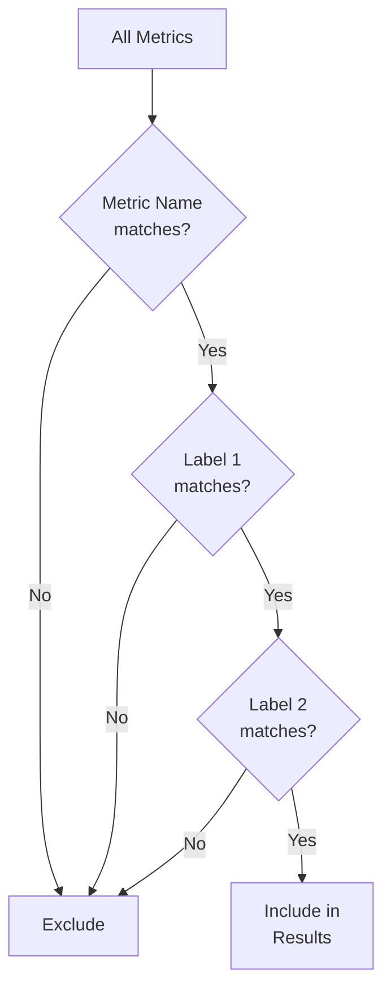

# PromQL Selectors

## Introduction

Selectors are a fundamental component of PromQL (Prometheus Query Language) that allow you to filter and identify specific time series data from your metrics. In Prometheus, every time series is uniquely identified by its metric name and a set of key-value pairs called labels. Selectors provide a powerful mechanism to pinpoint exactly which time series you want to query.

Think of selectors as the "where clause" in SQL, enabling you to choose precisely which data points you want to examine from the vast collection of metrics stored in Prometheus.

## Basic Selector Syntax

The most basic selector consists of a metric name enclosed in curly braces:

```promql
metric_name{}
```

This selects all time series with the given metric name. For example:

```promql
http_requests_total{}
```

This query returns all time series with the metric name `http_requests_total`, regardless of their labels.

## Label Matchers

To refine your selection, you can add one or more label matchers inside the curly braces. A label matcher consists of:

1. A label name
2. A matching operator
3. A label value (usually in quotes)

### Basic Label Matcher Example

```promql
http_requests_total{job="api-server", environment="production"}
```

This selects all `http_requests_total` metrics where the `job` label equals `api-server` AND the `environment` label equals `production`.

## Matching Operators

PromQL supports four types of matching operators:

| Operator | Description | Example |
|----------|-------------|---------|
| `=` | Equals | `{job="api-server"}` |
| `!=` | Not equals | `{job!="api-server"}` |
| `=~` | Regex matches | `{job=~"api-.*"}` |
| `!~` | Regex does not match | `{job!~"api-.*"}` |

### Examples of Matching Operators

#### Equals (`=`)

```promql
http_requests_total{status_code="200"}
```

Selects time series where `status_code` exactly equals `200`.

#### Not Equals (`!=`)

```promql
http_requests_total{status_code!="200"}
```

Selects time series where `status_code` is not equal to `200`.

#### Regex Matches (`=~`)

```promql
http_requests_total{path=~"/api/v[1-3]/.*"}
```

Selects time series where the `path` label matches the regular expression `/api/v[1-3]/.*` (paths starting with `/api/v1/`, `/api/v2/`, or `/api/v3/`).

#### Regex Does Not Match (`!~`)

```promql
http_requests_total{path!~"/static/.*"}
```

Selects time series where the `path` label does not match the regular expression `/static/.*` (paths not starting with `/static/`).

## Combining Multiple Label Matchers

You can combine multiple label matchers to create more specific selections:

```promql
http_requests_total{environment="production", job="api-server", method="GET", status_code=~"2.."}
```

This selects all HTTP requests where:
- The environment is "production"
- The job is "api-server"
- The HTTP method is "GET"
- The status code starts with "2" (2xx status codes)

When multiple label matchers are specified, they are combined with a logical AND operation - all conditions must be met for a time series to be selected.

## Special Empty Label Matchers

You can also use empty label matchers to select time series based on the presence or absence of a label:

```promql
http_requests_total{handler=""}
```

This selects time series where the `handler` label exists but has an empty value.

```promql
http_requests_total{handler=~".*"}
```

This selects time series where the `handler` label exists (with any value).

## Selecting by Metric Name Only

If you want to select all time series for a given metric without any label filtering, you can use:

```promql
http_requests_total
```

This is equivalent to:

```promql
http_requests_total{}
```

## Real-World Examples

Let's explore some practical examples of using selectors in real-world scenarios:

### Example 1: Monitoring Specific Services

Suppose you want to monitor the CPU usage of only your production database servers:

```promql
node_cpu_seconds_total{job="node-exporter", service="database", environment="production", mode="user"}
```

### Example 2: Filtering Error Responses

To monitor the rate of HTTP errors on your API servers:

```promql
rate(http_requests_total{job="api-server", status_code=~"5.."}[5m])
```

This query:
1. Selects HTTP request metrics for all API servers
2. Filters for status codes in the 5xx range (server errors)
3. Calculates the per-second rate over a 5-minute window

### Example 3: Excluding Development Environments

To view the total memory usage across all production and staging environments, excluding development:

```promql
sum by (environment) (
  node_memory_MemTotal_bytes{environment!="development"}
)
```

### Example 4: Multiple Service Variants

If you want to monitor latency across different versions of your payment service:

```promql
histogram_quantile(0.95, 
  sum by (le, version) (
    rate(request_duration_seconds_bucket{service="payment", version=~"v[1-3]"}[5m])
  )
)
```

This query calculates the 95th percentile latency for payment services, but only for versions v1, v2, and v3.

## Common Patterns and Best Practices

### 1. Start Broad, Then Refine

When debugging or exploring metrics, start with a broad selector and then add label matchers to narrow down your search:

```promql
# Start with all HTTP requests
http_requests_total

# Add environment
http_requests_total{environment="production"}

# Add service
http_requests_total{environment="production", service="authentication"}

# Add status code filter
http_requests_total{environment="production", service="authentication", status_code!="200"}
```

### 2. Use Regex Sparingly

Regular expressions are powerful but can be performance-intensive. When possible, use exact matching:

```promql
# Less efficient
http_requests_total{service=~"auth.*"}

# More efficient if you know the exact name
http_requests_total{service="authentication"}
```

### 3. Label Consistency

Maintain consistent label names and values across your metrics to make selectors more predictable:

```promql
# These should use the same label names
http_requests_total{environment="production", service="api"}
http_errors_total{environment="production", service="api"}
```

## Visualizing Selector Matching Logic

The following diagram illustrates how selectors filter time series data:



## Technical Details

### Internal Representation

In Prometheus, selectors are internally represented as a tuple of metric name and label matchers. The label matchers are evaluated against all stored time series with the matching metric name to determine the final result set.

### Performance Considerations

Prometheus optimizes selector evaluation by:
1. First filtering by metric name (which is indexed)
2. Then applying label matchers
3. Caching frequently used selector results

For best performance:
- Be as specific as possible with your selectors
- Put the most restrictive label matchers first when possible
- Use exact matching (`=` and `!=`) before regex matching (`=~` and `!~`)

## Common Mistakes and Troubleshooting

### 1. Empty Result Sets

If your query returns no data, your selector might be too restrictive. Try removing label matchers one by one to identify which constraint is filtering out all results.

### 2. Too Many Results

If your query returns too many time series, your selector might be too broad. Add additional label matchers to narrow down the results.

### 3. Inconsistent Label Names

Watch out for inconsistencies in label names or values:

```promql
# This won't match if the actual label is "environment" (singular)
http_requests_total{environments="production"}
```

### 4. Regex Syntax Errors

Regular expression syntax errors will cause queries to fail:

```promql
# Invalid regex (unclosed bracket)
http_requests_total{path=~"/api/v[1-3/.*"}
```

## Summary

PromQL selectors are a powerful mechanism for filtering and selecting time series data in Prometheus. By combining metric names with label matchers, you can precisely target the data you need for monitoring and alerting.

Key points to remember:
- Basic selectors consist of a metric name and optional label matchers
- Four matching operators: `=`, `!=`, `=~`, and `!~`
- Multiple label matchers are combined with logical AND
- Regular expressions provide flexible matching capabilities
- Start broad and refine your selectors as needed
- Consistent labeling makes selectors more predictable

## Exercises

1. Write a selector that matches all HTTP requests with status codes 400-499 (client errors).
2. Create a selector that targets metrics from both "api-gateway" and "auth-service" jobs.
3. Write a selector that excludes development environments but includes both staging and production.
4. Create a selector that matches metrics where the `version` label is either missing or empty.

## Additional Resources

- [Prometheus Documentation: Querying Basics](https://prometheus.io/docs/prometheus/latest/querying/basics/)
- [Prometheus Documentation: Operators](https://prometheus.io/docs/prometheus/latest/querying/operators/)
- [Regular Expression Syntax](https://github.com/google/re2/wiki/Syntax)
- [PromLabs PromQL Tutorial](https://promlabs.com/promql-tutorial/)