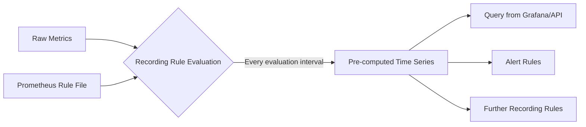

# PromQL Recording Rules

## Introduction

Recording rules are a powerful feature in Prometheus that allow you to pre-compute frequently used or computationally expensive PromQL expressions and save their results as new time series. Instead of computing the same expressions repeatedly at query time, which can be resource-intensive for complex queries, recording rules let you calculate these expressions ahead of time at a specified interval.

Recording rules serve as a form of optimization in your Prometheus monitoring setup, helping to:

- Reduce query-time latency for dashboards and alerts
- Decrease the computational load on your Prometheus server
- Simplify complex queries by breaking them down into pre-computed components
- Store historical data for expressions that would otherwise be calculated on-the-fly

## Understanding Recording Rules

A recording rule in Prometheus follows this basic structure:

```yaml
- record: <new_metric_name>
  expr: <promql_expression>
  labels:
    [ <label_name>: <label_value> ]
```

When Prometheus evaluates this rule:
1. It computes the result of the `expr` PromQL expression
2. Stores the result as a new time series with the name specified in `record`
3. Optionally applies additional labels defined in the `labels` section

Recording rules are evaluated at a regular interval (configurable in Prometheus), and the results are stored in the Prometheus database alongside your other metrics.

## Configuring Recording Rules

Recording rules are defined in YAML configuration files and loaded into Prometheus. These files are typically organized in a rules directory and referenced in your Prometheus configuration.

### Basic Setup

First, create a rule file (e.g., `recording_rules.yml`):

```yaml
groups:
  - name: example
    rules:
    - record: job:http_requests_total:rate5m
      expr: sum(rate(http_requests_total[5m])) by (job)
```

Then, reference this file in your Prometheus configuration (`prometheus.yml`):

```yaml
rule_files:
  - "rules/recording_rules.yml"
```

### Rule Groups

Rules are organized into groups, with all rules in a group being evaluated at the same interval. Each group needs a unique name:

```yaml
groups:
  - name: http_requests
    rules:
      - record: job:http_requests_total:rate5m
        expr: sum(rate(http_requests_total[5m])) by (job)
      
  - name: api_latency
    rules:
      - record: api:request_latency:p95
        expr: histogram_quantile(0.95, sum(rate(api_request_duration_seconds_bucket[5m])) by (le, service))
```

### Naming Conventions

Prometheus recommends using a specific naming convention for recording rules:

```
level:metric_name:operation
```

For example:
- `job:http_requests_total:rate5m` - Rate of HTTP requests over 5 minutes, aggregated by job
- `instance:memory_utilization:ratio` - Memory utilization ratio by instance

This convention makes it clear that the metric is derived and helps avoid naming conflicts.

## Practical Examples

Let's look at some common use cases for recording rules:

### Example 1: HTTP Error Rate

Computing the error rate for HTTP requests:

```yaml
groups:
  - name: http_errors
    rules:
      - record: job:http_errors:ratio_rate5m
        expr: sum(rate(http_requests_total{status=~"5.."}[5m])) by (job) / sum(rate(http_requests_total[5m])) by (job)
```

This rule calculates the ratio of 5xx errors to total requests over a 5-minute window, grouped by job.

### Example 2: Node Exporter CPU Usage

Pre-computing CPU usage from node exporter metrics:

```yaml
groups:
  - name: node_resources
    rules:
      - record: instance:node_cpu:usage_ratio_avg5m
        expr: 1 - avg by (instance) (rate(node_cpu_seconds_total{mode="idle"}[5m]))
```

This creates a new metric showing the average CPU usage (as a ratio) across all CPUs for each instance.

### Example 3: Request Latency Percentiles

Pre-calculating percentiles from a histogram:

```yaml
groups:
  - name: api_latency
    rules:
      - record: api:request_duration_seconds:p50
        expr: histogram_quantile(0.5, sum(rate(api_request_duration_seconds_bucket[5m])) by (le, service))
      - record: api:request_duration_seconds:p90
        expr: histogram_quantile(0.9, sum(rate(api_request_duration_seconds_bucket[5m])) by (le, service))
      - record: api:request_duration_seconds:p95
        expr: histogram_quantile(0.95, sum(rate(api_request_duration_seconds_bucket[5m])) by (le, service))
      - record: api:request_duration_seconds:p99
        expr: histogram_quantile(0.99, sum(rate(api_request_duration_seconds_bucket[5m])) by (le, service))
```

This group pre-computes 50th, 90th, 95th, and 99th percentile latencies for API requests.

### Example 4: Aggregating Metrics Across Clusters

Creating cluster-level views from instance-level metrics:

```yaml
groups:
  - name: cluster_resources
    rules:
      - record: cluster:memory_usage:ratio
        expr: sum(node_memory_MemTotal_bytes - node_memory_MemAvailable_bytes) / sum(node_memory_MemTotal_bytes)
      - record: cluster:cpu:usage_ratio_avg5m
        expr: 1 - avg(rate(node_cpu_seconds_total{mode="idle"}[5m]))
```

These rules aggregate memory and CPU usage across all nodes to provide cluster-level metrics.

## Best Practices for Recording Rules

To effectively use recording rules in your Prometheus setup:

### 1. Only Record What's Necessary

Recording rules consume storage and resources. Focus on:
- Frequently accessed queries
- Computationally expensive expressions
- Metrics needed for alerts

### 2. Follow the Naming Conventions

The recommended format is `level:metric:operations`:
- The level prefix indicates the aggregation level (e.g., `job`, `instance`, `cluster`)
- The metric name should reflect the source
- The operation suffix indicates the type of computation (e.g., `rate5m`, `ratio`)

### 3. Group Related Rules Together

Organize rules into logical groups that make sense to evaluate together:
- Rules that depend on similar raw metrics
- Rules that will be used together in dashboards
- Rules with similar evaluation needs

### 4. Add Clear Comments

Documenting complex rules helps maintenance:

```yaml
groups:
  - name: service_slos
    rules:
      # Calculate the error budget consumption rate
      # Target SLO is 99.9% availability over 30 days
      - record: service:slo:error_budget_consumption_rate
        expr: |
          sum(rate(http_requests_total{status=~"5.."}[1h]))
          / sum(rate(http_requests_total[1h]))
          / (1 - 0.999)
```

### 5. Use Labels Instead of Many Similar Rules

Instead of creating many similar rules, use labels to differentiate:

```yaml
# Less optimal - repeating similar rules
- record: api_error_rate_users
  expr: sum(rate(api_requests{path="/users", status=~"5.."}[5m])) / sum(rate(api_requests{path="/users"}[5m]))
- record: api_error_rate_products
  expr: sum(rate(api_requests{path="/products", status=~"5.."}[5m])) / sum(rate(api_requests{path="/products"}[5m]))

# Better - use labels
- record: api:error_rate:ratio_rate5m
  expr: sum(rate(api_requests{status=~"5.."}[5m])) by (path) / sum(rate(api_requests[5m])) by (path)
```

## Using Recording Rules in Queries

Once you've defined and loaded your recording rules, you can use the resulting metrics just like any other Prometheus metric:

```promql
# Original complex query
sum(rate(http_requests_total{status=~"5.."}[5m])) by (job) / sum(rate(http_requests_total[5m])) by (job) > 0.01

# With recording rule
job:http_errors:ratio_rate5m > 0.01
```

This makes your PromQL queries more concise and efficient.

## Debugging Recording Rules

You can check if your recording rules are working correctly by:

1. Visiting the `/rules` endpoint in the Prometheus UI, which shows all loaded rules
2. Querying for your new metrics directly in the Prometheus expression browser
3. Checking for any evaluation errors in the Prometheus logs

If a rule isn't working as expected, verify:
- The syntax of your rule file (must be valid YAML)
- The PromQL expression (should be valid and return data)
- That Prometheus has reloaded the rule files

## Visualizing the Results in Grafana

Here's how to use recording rules effectively in Grafana:

```
# Directly use the pre-computed metric
job:http_errors:ratio_rate5m{job="api-server"}

# Or combine with other queries
job:http_errors:ratio_rate5m{job="api-server"} > 0.05
```

The advantage of using recording rules in dashboards is that they load much faster, especially for panels that would otherwise compute complex expressions on each refresh.

## Diagram: How Recording Rules Work



## Recording Rules vs. Alerts

Recording rules and alert rules are both defined in rule files, but serve different purposes:

| Recording Rules | Alert Rules |
|-----------------|-------------|
| Pre-compute expressions and store them as new time series | Evaluate expressions and trigger alerts |
| `record:` field defines the new metric name | `alert:` field defines the alert name |
| No notifications, just data storage | Generate notifications when triggered |
| Used for optimization and simplification | Used for monitoring and incident response |

You'll often use recording rules as inputs to alert rules, creating more efficient and maintainable alerting configurations.

## Summary

Recording rules in Prometheus offer a powerful way to optimize your monitoring system by pre-computing complex or frequently used PromQL expressions. They help reduce query latency, decrease server load, and simplify your dashboards and alerts.

Key takeaways:
- Use recording rules for frequently accessed or expensive queries
- Follow naming conventions to maintain clarity
- Group related rules together for logical organization
- Add documentation for complex rules
- Use recording rules as inputs to alerts for better performance

By implementing recording rules effectively, you can build a more efficient and scalable Prometheus monitoring system that handles complex queries with ease.

## Additional Resources

- [Prometheus Recording Rules Documentation](https://prometheus.io/docs/prometheus/latest/configuration/recording_rules/)
- [PromQL Best Practices](https://prometheus.io/docs/practices/rules/)
- [Rules Configuration Documentation](https://prometheus.io/docs/prometheus/latest/configuration/configuration/#rule_files)

## Exercises

1. Create a recording rule that calculates the average memory usage percentage across all your instances.
2. Design a set of recording rules that pre-compute the 90th and 99th percentile latencies for different endpoints of your application.
3. Write a recording rule that calculates the ratio of 4xx and 5xx errors compared to total requests, broken down by service and endpoint.
4. Implement a recording rule that computes the rate of increase of disk usage and could help predict when you might run out of disk space.
5. Create a cluster-level recording rule that aggregates CPU, memory, and network usage across all nodes.