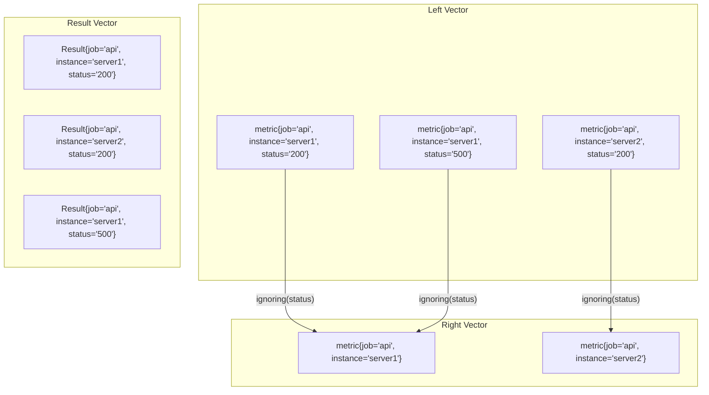

# PromQL Vector Matching

## Introduction

In Prometheus monitoring, metrics are stored as time series data consisting of a metric name and a set of key-value pairs called labels. When querying this data using PromQL (Prometheus Query Language), you'll often need to combine or compare multiple time series. This is where **vector matching** comes into play.

Vector matching allows you to combine time series data in meaningful ways, enabling powerful analytics and comparisons across your metrics. Whether you're calculating ratios, finding correlations, or performing advanced monitoring operations, understanding vector matching is essential for effective PromQL usage.

## Understanding Vectors in PromQL

Before diving into vector matching, it's important to understand what vectors are in PromQL:

### Types of Vectors

1. **Instant Vector**: A set of time series, each containing a single sample for each time series, all sharing the same timestamp. This is the most common vector type used in PromQL.

2. **Range Vector**: A set of time series containing a range of data points over time for each time series.

When you run a basic query like `http_requests_total`, you get an instant vector containing all time series with that metric name.

## Vector Matching Operators

PromQL provides several binary operators that work with vectors:

- Arithmetic operators: `+`, `-`, `*`, `/`, `%`, `^`
- Comparison operators: `==`, `!=`, `>`, `<`, `>=`, `<=`
- Logical operators: `and`, `or`, `unless`

These operators need rules to determine how to match elements from the left-hand and right-hand vectors, which is where vector matching comes in.

## Vector Matching Types

PromQL supports two primary types of vector matching:

### 1. One-to-One Matching

In one-to-one matching, PromQL matches time series from the left side vector with time series from the right side based on their labels. Only time series with exactly matching label sets are paired together.

**Syntax**:
```
<vector expr> <operator> <vector expr>
```

**Example**:

Let's say we want to calculate the ratio of HTTP errors to total HTTP requests. We might use:

```
http_requests_total{status="500"} / http_requests_total
```

However, this won't work correctly because the left vector has a `status="500"` label, but the right vector contains multiple time series with different status codes. For one-to-one matching, we need the labels to match exactly.

A better approach would be:

```
http_requests_total{status="500"} / sum(http_requests_total) without(status)
```

This aggregates the total requests across all statuses, allowing us to calculate the error ratio.

### 2. Many-to-One and One-to-Many Matching

Many-to-one and one-to-many matching allow you to match multiple time series on one side with a single time series on the other side.

**Syntax**:
```
<vector expr> <group_modifier> <operator> <group_modifier> <vector expr>
```

Where `<group_modifier>` can be:
- `on(label_list)`: Match only on the specified labels
- `ignoring(label_list)`: Match on all labels except the specified ones

**Example**:

Calculate the error rate for each service by dividing error requests by total requests:

```
sum(rate(http_requests_total{status="500"}[5m])) by (service) / 
sum(rate(http_requests_total[5m])) by (service)
```

This gives us the ratio of 5xx errors to total requests for each service.

## Vector Matching Modifiers

To have more control over the matching process, PromQL provides additional modifiers:

### The `on` Modifier

The `on` modifier specifies which labels to consider for matching:

```
<vector expr> <operator> on(<label list>) <vector expr>
```

**Example**:

```
http_requests_total{code="200"} / on(instance, job) http_requests_total{code="500"}
```

This matches time series only based on the `instance` and `job` labels, ignoring other labels like `code`.

### The `ignoring` Modifier

The `ignoring` modifier specifies which labels to ignore during matching:

```
<vector expr> <operator> ignoring(<label list>) <vector expr>
```

**Example**:

```
http_requests_total / ignoring(code) http_request_duration_seconds_count
```

This ignores the `code` label when matching, allowing comparisons between requests count and duration metrics.

### Group Modifiers: `group_left` and `group_right`

These modifiers are used with many-to-one and one-to-many matching:

- `group_left`: Specifies that multiple time series in the left vector can match with a single time series in the right vector.
- `group_right`: Specifies that multiple time series in the right vector can match with a single time series in the left vector.

**Syntax**:
```
<vector expr> <operator> on(<label list>) group_left(<additional labels>) <vector expr>
```

**Example**:

Calculate the percentage of CPU usage per core, matching CPU usage metrics with CPU info metrics:

```
100 * (
  node_cpu_seconds_total{mode="idle"}
  / on(instance, cpu) group_left
  node_cpu_info
)
```

This allows each CPU usage time series to match with the corresponding CPU info time series.

## Practical Examples

Let's explore some real-world examples to better understand vector matching:

### Example 1: Calculating Error Rates

```
# Error rate as a percentage for each service
sum(rate(http_requests_total{status=~"5.."}[5m])) by (service) 
/ 
sum(rate(http_requests_total[5m])) by (service) 
* 100
```

This query:
1. Calculates the rate of 5xx errors for each service over 5 minutes
2. Divides by the total request rate for each service
3. Multiplies by 100 to get a percentage

### Example 2: Resource Utilization Ratio

```
# Memory utilization per container as a ratio
container_memory_usage_bytes 
/ on(container_id) group_left(name)
container_spec_memory_limit_bytes
```

This query calculates the ratio of actual memory usage to memory limit for each container, using `group_left` to include the container name in the result.

### Example 3: Request Latency compared to SLO

```
# Identify endpoints exceeding the SLO
sum(rate(http_request_duration_seconds_sum[5m])) by (endpoint) 
/ 
sum(rate(http_request_duration_seconds_count[5m])) by (endpoint) 
> on(endpoint) 
group_left
slo_latency_threshold_seconds
```

This complex query:
1. Calculates the average request duration for each endpoint
2. Compares it against the SLO threshold
3. Returns endpoints that exceed their SLO

## Common Pitfalls and Best Practices

### Pitfalls to Avoid

1. **Missing labels**: If time series don't match because of label differences, your query will produce no results.

2. **Cardinality explosion**: When using `group_left` or `group_right` with high-cardinality metrics, you can generate an explosive number of time series, impacting performance.

3. **Inconsistent aggregation**: Ensure you're aggregating metrics appropriately before applying binary operations.

### Best Practices

1. **Use label inspection**: Before creating complex queries, inspect your label sets with queries like `http_requests_total{} * 0 + 1` to understand the available labels.

2. **Start simple**: Begin with basic queries and gradually add complexity.

3. **Use comments**: Document your complex queries for future reference.

4. **Test incrementally**: Build and test your queries step by step to ensure each part works as expected.

5. **Use the PromQL query visualization**: Prometheus's graph view helps understand the output of vector operations.

## Vector Matching in Alert Rules

Vector matching is particularly important when creating alert rules:

```
# Alert when error rate exceeds 5%
(
  sum(rate(http_requests_total{status=~"5.."}[5m])) by (service)
  /
  sum(rate(http_requests_total[5m])) by (service)
) > 0.05
```

This alert triggers when any service has an error rate above 5%.

## Visualizing Vector Matching

Here's a simple diagram showing how vector matching works:



## Summary

Vector matching in PromQL is a powerful concept that allows you to combine and transform metrics in sophisticated ways. Understanding the different matching types and modifiers enables you to create expressive queries that derive valuable insights from your monitoring data.

The key points to remember:

- **One-to-One matching** pairs time series with exactly matching label sets
- **Many-to-One** and **One-to-Many matching** allow multiple time series to match with a single time series
- Modifiers like `on`, `ignoring`, `group_left`, and `group_right` give you fine-grained control over the matching process
- Vector matching is essential for calculating ratios, rates, and other comparative metrics

## Additional Resources

To deepen your understanding of PromQL vector matching:

- [Official Prometheus Documentation on Operators](https://prometheus.io/docs/prometheus/latest/querying/operators/)
- [PromLabs PromQL Cheat Sheet](https://promlabs.com/promql-cheat-sheet/)
- [Robust Perception Blog: Understanding Vector Matching](https://www.robustperception.io/binary-operators-in-promql/)

## Exercises

1. Write a PromQL query to calculate the success rate (percentage of non-5xx responses) for each service.

2. Create a query that compares the CPU usage of containers to their CPU limits, showing containers using more than 80% of their allocated CPU.

3. Develop a query that calculates the ratio of memory usage between different application components, using appropriate vector matching.

4. Write a query that alerts when any service's error rate is 10x higher than the average error rate across all services.