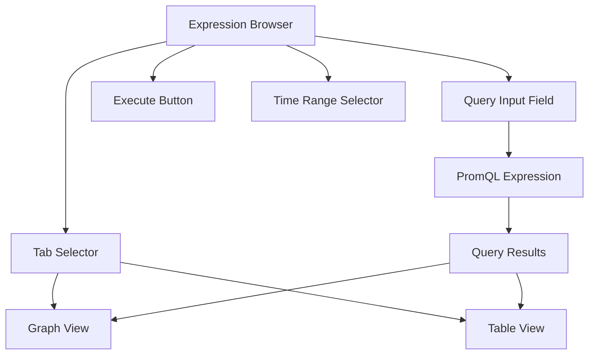

# Prometheus Expression Browser

## Introduction

The Expression Browser is a built-in web interface in Prometheus that allows you to write, execute, and visualize PromQL (Prometheus Query Language) expressions directly from your browser. It serves as a simple yet powerful tool for exploring your metrics, debugging queries, and creating ad-hoc visualizations without needing additional dashboarding tools.

Think of the Expression Browser as your metrics playground - a place where you can experiment with queries before incorporating them into dashboards or alerting rules. For beginners, it's the perfect starting point to become familiar with both your metrics and the PromQL syntax.

## Accessing the Expression Browser

The Expression Browser is available at the `/graph` endpoint of your Prometheus server. If your Prometheus instance is running on the default port on your local machine, you can access it at:

```
http://localhost:9090/graph
```

## Expression Browser Interface

When you open the Expression Browser, you'll see a simple interface with several key components:

1. **Query input field** - Where you type your PromQL expression
2. **Execute button** - To run your query
3. **Time range selector** - To specify the time period for your query
4. **Tab selector** - To switch between "Graph" and "Table" views
5. **Graph/Table view area** - Where results are displayed

Here's how the components are organized:



## Writing Your First Query

Let's start with a simple query to explore the Expression Browser. Assume you have Prometheus monitoring itself (which happens by default):

1. Type the following in the query input field:
   ```
   prometheus_http_requests_total
   ```

2. Click the "Execute" button

3. Switch between "Graph" and "Table" views to see different representations of the same data

### Graph View

In the Graph view, you'll see a line graph showing the total number of HTTP requests handled by your Prometheus server over time. The y-axis represents the count, and the x-axis represents time.

### Table View

In the Table view, you'll see the current value for each time series matching your query, along with all the labels that identify that specific time series. For example:

| Element | Value | Labels |
|---------|-------|--------|
| prometheus_http_requests_total | 342 | handler="/api/v1/query", code="200" |
| prometheus_http_requests_total | 124 | handler="/api/v1/query_range", code="200" |
| prometheus_http_requests_total | 53 | handler="/graph", code="200" |

## Understanding Query Results

When you execute a query, the results can be:

1. **Instant vector** - A set of time series, each with a single sample at the current time
2. **Range vector** - A set of time series, each with a range of samples over time
3. **Scalar** - A single numeric value
4. **String** - A text value (rare in Prometheus queries)

Most basic metrics queries like `prometheus_http_requests_total` return an instant vector, which is why you'll see multiple lines in the Graph view if the metric has multiple label combinations.

## Common PromQL Functions and Operators

Let's explore some common PromQL functions and operators using the Expression Browser:

### Counter Rates

Counters in Prometheus continuously increase. To see the rate of increase over time:

```
rate(prometheus_http_requests_total[5m])
```

This shows the per-second rate of HTTP requests over 5-minute windows.

### Aggregation

To sum all HTTP requests regardless of handler or code:

```
sum(prometheus_http_requests_total)
```

Or to count the total number of different time series:

```
count(prometheus_http_requests_total)
```

### Filtering

To show only requests with a 200 response code:

```
prometheus_http_requests_total{code="200"}
```

### Combining Operators

You can combine these concepts. For example, to see the rate of successful requests by handler:

```
sum by(handler) (rate(prometheus_http_requests_total{code="200"}[5m]))
```

## Real-World Examples

Let's explore some practical examples that you might use in real-world monitoring scenarios.

### Example 1: Monitoring CPU Usage

If you have node_exporter running to collect system metrics:

```
100 - (avg by (instance) (irate(node_cpu_seconds_total{mode="idle"}[5m])) * 100)
```

This query shows the CPU usage percentage by instance over time.

### Example 2: HTTP Error Rate

Calculate the percentage of HTTP requests that result in errors:

```
sum(rate(prometheus_http_requests_total{code=~"5.."}[5m])) / sum(rate(prometheus_http_requests_total[5m])) * 100
```

This shows what percentage of your HTTP requests are returning 5xx error codes.

### Example 3: Memory Usage Tracking

Monitor memory usage across your instances:

```
node_memory_MemTotal_bytes - node_memory_MemFree_bytes - node_memory_Buffers_bytes - node_memory_Cached_bytes
```

This shows how much "actual" memory is being used (total minus free, buffers, and cache).

## Advanced Features

The Expression Browser has several additional features worth exploring:

### Time Range Selection

You can adjust the time range of your query using the time range selector. Options include:

- Quick presets (1h, 6h, 12h, 1d, 2d, 1w)
- Custom time range selection
- Refreshing at specific intervals

### Graph Options

In the Graph view, click on the "Graph" tab itself to reveal additional options:

- Stacked mode for stacking multiple time series
- Line interpolation methods
- Y-axis scaling and formatting
- Legend formatting

## Troubleshooting Common Issues

When working with the Expression Browser, you might encounter some common issues:

### No Data Points

If your query returns no data points, check:

1. The metric name is spelled correctly
2. Label filters match existing labels
3. The time range includes data for the metric
4. The metric actually exists in your Prometheus database

You can verify metrics exist by using the Prometheus `/metrics` endpoint or checking the "Status" -> "Targets" page to ensure your exporters are working.

### Query Timeout

For complex queries over large time ranges, you might encounter timeouts. Try:

1. Reducing the time range
2. Simplifying the query
3. Adding more specific label filters

### High Cardinality Issues

If your metrics have too many unique label combinations, queries might be slow or consume excessive resources. Consider:

1. Aggregating metrics to reduce cardinality
2. Using more specific label filters
3. Redesigning your metrics collection with fewer high-cardinality labels

## Summary

The Prometheus Expression Browser is an essential tool for working with Prometheus metrics. It allows you to:

- Explore available metrics
- Test and debug PromQL expressions
- Create quick visualizations for troubleshooting
- Understand the structure and behavior of your metrics

While dedicated dashboarding tools like Grafana offer more sophisticated visualization options, the Expression Browser is perfect for quick explorations and learning PromQL.

## Practice Exercises

To enhance your understanding of the Expression Browser, try these exercises:

1. Query the `up` metric to see which targets are currently being monitored
2. Calculate the request rate for different Prometheus API endpoints using `rate()`
3. Find the 95th percentile of request duration using `histogram_quantile()`
4. Create a query that shows the ratio between two different metrics
5. Use regular expressions in label matchers to select multiple services at once

## Additional Resources

- [Prometheus Documentation on Querying Basics](https://prometheus.io/docs/prometheus/latest/querying/basics/)
- [PromQL Cheat Sheet](https://promlabs.com/promql-cheat-sheet/)
- [Prometheus Query Examples](https://prometheus.io/docs/prometheus/latest/querying/examples/)
- [Prometheus Best Practices](https://prometheus.io/docs/practices/instrumentation/)