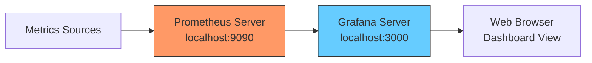

# Prometheus and Grafana Integration

## Introduction

Prometheus is a powerful monitoring and alerting system that collects and stores metrics as time-series data. While Prometheus includes a basic built-in expression browser for visualizing metrics, it's often beneficial to pair it with Grafana, a dedicated visualization tool, to create more comprehensive and customizable dashboards.

In this guide, we'll explore how to integrate Prometheus with Grafana, allowing you to create beautiful, interactive dashboards to visualize your metrics effectively. This integration combines Prometheus's robust data collection capabilities with Grafana's powerful visualization features.

## What You'll Learn

- What Grafana is and why it complements Prometheus
- How to install and configure Grafana
- Connecting Prometheus as a data source in Grafana
- Creating your first Grafana dashboard with Prometheus metrics
- Best practices for dashboard organization and visualization

## Prerequisites

Before starting, ensure you have:
- A working Prometheus installation (as covered in previous sections)
- Basic understanding of Prometheus metrics and PromQL
- A system where you can install Grafana (same system as Prometheus is fine)

## Understanding Grafana

Grafana is an open-source visualization and analytics platform that allows you to query, visualize, and alert on your metrics regardless of where they're stored. It provides a flexible and powerful interface for creating dashboards with various visualization options like graphs, tables, heatmaps, and more.

### Why Use Grafana with Prometheus?

While Prometheus has its own web UI for basic visualization, Grafana offers several advantages:

1. **Rich visualization options**: Beyond simple graphs, Grafana supports various panel types and visualization methods
2. **Dashboard organization**: Create, save, and organize multiple dashboards
3. **Data source flexibility**: Connect to multiple data sources (not just Prometheus)
4. **Annotations**: Mark events on graphs to correlate metrics with deployments or incidents
5. **Templates and variables**: Create dynamic, reusable dashboards
6. **Alerting**: Configure alerts based on metric thresholds
7. **User management**: Control access to dashboards and features

## Installing Grafana

Let's start by installing Grafana. The process varies depending on your operating system:

### Linux (Debian/Ubuntu)

```bash
# Add the GPG key
wget -q -O - https://packages.grafana.com/gpg.key | sudo apt-key add -

# Add the repository
echo "deb https://packages.grafana.com/oss/deb stable main" | sudo tee -a /etc/apt/sources.list.d/grafana.list

# Update and install
sudo apt-get update
sudo apt-get install grafana

# Start Grafana server
sudo systemctl start grafana-server
sudo systemctl enable grafana-server
```

### Using Docker

If you prefer using Docker, you can run Grafana as a container:

```bash
docker run -d -p 3000:3000 --name grafana grafana/grafana
```

After installation, Grafana should be accessible at `http://localhost:3000`. The default login credentials are:
- Username: `admin`
- Password: `admin`

You'll be prompted to change the password on first login.

## Connecting Prometheus to Grafana

Now that Grafana is installed, let's connect Prometheus as a data source:

1. Log in to Grafana
2. Navigate to Configuration → Data Sources (or go to `http://localhost:3000/datasources`)
3. Click "Add data source"
4. Select "Prometheus" from the list of data sources
5. Configure the data source:
   - Name: "Prometheus" (or any name you prefer)
   - URL: The URL of your Prometheus server (e.g., `http://localhost:9090`)
   - Access: Server (default) or Browser depending on your setup
6. Click "Save & Test" to verify the connection

If the connection is successful, you'll see a green "Data source is working" message.

Here's how the configuration typically looks:



## Creating Your First Dashboard

Now that we've connected Prometheus to Grafana, let's create a simple dashboard to monitor system metrics:

1. Click on "+" in the side menu and select "Dashboard"
2. Click "Add new panel"
3. In the query editor:
   - Select "Prometheus" as the data source
   - Enter a PromQL query, for example: `rate(node_cpu_seconds_total{mode="user"}[1m])`
4. Adjust visualization settings in the panel options
5. Click "Apply" to add the panel to your dashboard
6. Click the save icon (disk) to save your dashboard with a name, e.g., "System Monitoring"

### Basic PromQL Queries for Your Dashboard

Here are some useful PromQL queries to get started:

**CPU Usage by Core**:
```
rate(node_cpu_seconds_total{mode!="idle"}[1m])
```

**Memory Usage**:
```
node_memory_MemTotal_bytes - node_memory_MemFree_bytes - node_memory_Buffers_bytes - node_memory_Cached_bytes
```

**Disk Space Usage**:
```
100 - ((node_filesystem_avail_bytes / node_filesystem_size_bytes) * 100)
```

**Network Traffic**:
```
rate(node_network_receive_bytes_total[5m])
rate(node_network_transmit_bytes_total[5m])
```

## Advanced Grafana Features

Once you're comfortable with basic dashboards, you can explore Grafana's more advanced features:

### Dashboard Variables

Variables allow you to create more dynamic dashboards. For example, you could create a variable for selecting different servers or services:

1. On your dashboard, click the gear icon to open dashboard settings
2. Select "Variables" and click "Add variable"
3. Configure a new variable:
   - Name: `instance`
   - Type: Query
   - Data source: Prometheus
   - Query: `label_values(node_exporter_build_info, instance)`
4. Click "Update" and "Save"

Now you can use this variable in your queries like:
```
rate(node_cpu_seconds_total{instance="$instance", mode="user"}[1m])
```

### Templating with Repeated Panels

You can create repeated panels for each value of a variable:

1. Create a dashboard variable as shown above
2. Create a panel with a query using that variable
3. In the panel settings, go to the "General" tab
4. Enable "Repeat options" and select your variable

This will create a separate panel for each value of your variable.

### Annotations

Annotations allow you to mark significant events on your graphs:

1. In dashboard settings, go to "Annotations"
2. Click "Add Annotation Query"
3. Configure an annotation query, for example using Prometheus Alertmanager events

## Creating a Comprehensive Monitoring Dashboard

Let's put everything together to create a more comprehensive dashboard:

### Step 1: Create a New Dashboard

1. Click "+" → "Dashboard"
2. Add dashboard variables for flexibility:
   - `instance` for selecting different servers
   - `job` for selecting different exporters

### Step 2: Add System Overview Panels

Add panels for key system metrics:

**System Load Panel**:
- Query: `node_load1{instance="$instance"}`
- Panel title: "System Load (1m)"
- Visualization: Stat or Graph

**Memory Usage Panel**:
- Query: `100 * (1 - ((node_memory_MemFree_bytes + node_memory_Cached_bytes + node_memory_Buffers_bytes) / node_memory_MemTotal_bytes))`
- Panel title: "Memory Usage (%)"
- Visualization: Gauge

**Disk Space Panel**:
- Query: `100 - ((node_filesystem_avail_bytes{mountpoint="/", instance="$instance"} / node_filesystem_size_bytes{mountpoint="/", instance="$instance"}) * 100)`
- Panel title: "Disk Usage (%)"
- Visualization: Gauge

### Step 3: Add CPU Panels

**CPU Usage Overview**:
- Query: `sum by(mode)(rate(node_cpu_seconds_total{instance="$instance"}[1m]))`
- Panel title: "CPU Usage by Mode"
- Visualization: Stacked Graph

**CPU Usage per Core**:
- Query: `avg by (cpu)(rate(node_cpu_seconds_total{instance="$instance", mode!="idle"}[1m])) * 100`
- Panel title: "CPU Usage per Core (%)"
- Visualization: Graph or Heatmap

### Step 4: Add Network Panels

**Network Traffic**:
- Query 1: `rate(node_network_receive_bytes_total{instance="$instance", device!="lo"}[5m])`
- Query 2: `rate(node_network_transmit_bytes_total{instance="$instance", device!="lo"}[5m])`
- Panel title: "Network Traffic"
- Visualization: Graph (with units set to bytes/sec or data rate)

**Network Errors**:
- Query: `sum(rate(node_network_transmit_errs_total{instance="$instance"}[5m]) + rate(node_network_receive_errs_total{instance="$instance"}[5m]))`
- Panel title: "Network Errors"
- Visualization: Graph

### Step 5: Organize and Save

1. Arrange panels in a logical order
2. Group related panels in rows
3. Add text panels for documentation if needed
4. Save your dashboard with a descriptive name

## Example: Application Monitoring Dashboard

Beyond system metrics, you can create dashboards for monitoring your applications. Here's an example for a web service:

**HTTP Request Rate**:
```
sum(rate(http_requests_total[5m])) by (route)
```

**HTTP Error Rate**:
```
sum(rate(http_requests_total{status=~"5.."}[5m])) / sum(rate(http_requests_total[5m]))
```

**Response Time**:
```
histogram_quantile(0.95, sum(rate(http_request_duration_seconds_bucket[5m])) by (le))
```

## Best Practices for Grafana Dashboards

To create effective dashboards, consider these best practices:

1. **Start with a purpose**: Define what questions your dashboard should answer
2. **Use consistent naming**: Apply consistent naming for panels and dashboards
3. **Group related metrics**: Organize panels in logical groups
4. **Use appropriate visualizations**: Choose the right visualization for each metric
5. **Set appropriate time ranges**: Configure default time ranges that make sense
6. **Add documentation**: Use text panels to explain complex metrics
7. **Use variables**: Make dashboards reusable with template variables
8. **Set thresholds**: Add thresholds to visually indicate when values are problematic
9. **Keep it simple**: Avoid cluttering dashboards with too many panels
10. **Test with different data**: Ensure dashboards work with various data scenarios

## Sharing and Exporting Dashboards

Grafana allows you to share and export dashboards in several ways:

**Sharing a Dashboard Link**:
1. Click the share icon in the dashboard
2. Copy the direct link or generate a snapshot

**Exporting a Dashboard**:
1. Go to dashboard settings
2. Select "JSON Model"
3. Copy the JSON or save it to a file

**Importing a Dashboard**:
1. Click "+" → "Import"
2. Paste the JSON or upload the file
3. Configure data sources and variables

## Common Troubleshooting Tips

**No Data Shown in Panels**:
- Verify Prometheus data source connection
- Check PromQL syntax for errors
- Ensure time range is appropriate
- Verify metrics exist in Prometheus

**Dashboard Loads Slowly**:
- Simplify complex queries
- Increase query intervals
- Reduce the number of panels
- Check Prometheus performance

**Error: "Template variables could not be initialized"**:
- Check variable query syntax
- Ensure Prometheus has the queried data
- Verify access permissions

## Summary

In this guide, we've explored how to integrate Prometheus with Grafana to create powerful visualizations of your metrics. We've covered:

- Installing and configuring Grafana
- Connecting Prometheus as a data source
- Creating basic and advanced dashboards
- Using Grafana's features like variables and annotations
- Best practices for effective visualization

This integration combines Prometheus's powerful data collection with Grafana's flexible visualization capabilities, giving you comprehensive insights into your systems and applications.

## Next Steps

Now that you've set up Grafana with Prometheus, consider:

1. Importing pre-built dashboards from the Grafana community
2. Exploring Grafana Alerting to get notified when metrics cross thresholds
3. Setting up additional exporters to collect more metrics
4. Creating dashboards specific to your applications

## Exercises

1. Create a dashboard that monitors both system and application metrics
2. Set up a dashboard with variables for selecting different environments (production, staging, etc.)
3. Create a dashboard that visualizes Prometheus's own metrics
4. Configure annotations to mark deployment events on your graphs
5. Export your dashboard to JSON and share it with a colleague

## Additional Resources

- [Official Grafana Documentation](https://grafana.com/docs/)
- [Prometheus Data Source for Grafana](https://grafana.com/docs/grafana/latest/datasources/prometheus/)
- [Grafana Community Dashboards](https://grafana.com/grafana/dashboards/)
- [PromQL for Humans](https://prometheus.io/docs/prometheus/latest/querying/basics/)