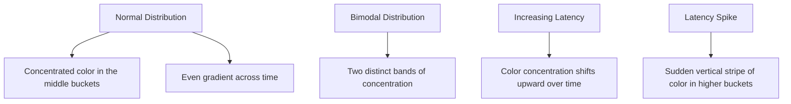

# Heatmaps and Graphs

## Introduction

Visualizing metrics is a crucial skill when working with monitoring systems like Prometheus. While simple line graphs can help you track individual metrics over time, more complex visualizations like heatmaps allow you to understand the distribution of your data and identify patterns that might otherwise remain hidden.

In this guide, we'll explore how to create effective visualizations with Prometheus, focusing on both standard graphs and heatmaps. You'll learn not only the technical aspects of creating these visualizations but also how to interpret them to make data-driven decisions for your applications and infrastructure.

## Understanding Prometheus Graphs

### Basic Graph Types

Prometheus offers several types of visualizations through its web UI and through Grafana (a popular visualization tool that works well with Prometheus):

1. **Line Graphs**: Display metric values over time with each line representing a different time series
2. **Area Graphs**: Similar to line graphs but with the area under the line filled in
3. **Bar Graphs**: Represent discrete data points as vertical bars
4. **Heatmaps**: Show the distribution of values across a range, with colors representing frequency or intensity
5. **Histograms**: Display the distribution of values in buckets

### Creating Basic Graphs in Prometheus UI

Let's start with creating a simple graph in the Prometheus web interface:

```
rate(http_requests_total[5m])
```

This query calculates the rate of HTTP requests over 5-minute windows. In the Prometheus UI, after entering this query:

1. Click on the "Graph" tab
2. Adjust the time range using the time picker in the top right
3. Hover over points in the graph to see specific values

For more complex queries, you might use functions like `sum` to aggregate data:

```
sum by (instance) (rate(http_requests_total[5m]))
```

This groups the request rates by instance, giving you a per-server view of traffic.

## Working with Heatmaps

### What are Heatmaps?

Heatmaps are particularly useful for visualizing the distribution of values within your metrics. Unlike line graphs that show a single value per timestamp, heatmaps show how values are distributed across a range.

The most common use case for heatmaps in Prometheus is visualizing histogram metrics, which record observations in configurable buckets.

### Understanding Histogram Metrics

Before creating heatmaps, let's understand histogram metrics in Prometheus:

```
# Example histogram metric
http_request_duration_seconds_bucket{le="0.1"} 12345
http_request_duration_seconds_bucket{le="0.5"} 34567
http_request_duration_seconds_bucket{le="1.0"} 45678
http_request_duration_seconds_bucket{le="2.5"} 56789
http_request_duration_seconds_bucket{le="+Inf"} 60000
http_request_duration_seconds_sum 98765.4
http_request_duration_seconds_count 60000
```

This histogram tells us:
- 12,345 requests completed in 0.1 seconds or less
- 34,567 requests completed in 0.5 seconds or less (including those in the previous bucket)
- And so on...

### Creating Heatmaps in Grafana

While the native Prometheus UI doesn't support heatmaps directly, Grafana provides excellent heatmap visualization. Here's how to create a heatmap for request durations:

1. In Grafana, create a new panel and select "Heatmap" as the visualization type
2. Use a query like:

```
sum(increase(http_request_duration_seconds_bucket[5m])) by (le)
```

3. In the Heatmap settings:
   - Set "Format" to "Heatmap"
   - Enable "Legend"
   - Adjust color scheme as needed (for example, green to red for good to bad performance)

The resulting heatmap will show the distribution of request durations over time, with colors indicating the frequency of requests in each duration bucket.

### Interpreting Heatmaps

Let's look at a practical example of interpreting a heatmap:



In a request duration heatmap:
- **Normal operation**: Most values concentrated in lower buckets with consistent coloring over time
- **Performance degradation**: Gradual shift of concentration toward higher value buckets
- **Service outage or issue**: Sudden appearance of values in much higher buckets, creating a vertical "hot" stripe

## Practical Example: Monitoring API Response Times

Let's walk through a complete example of setting up and visualizing API response times:

### 1. Instrumenting Your Code

First, you need to instrument your application to expose histogram metrics:

```python
from prometheus_client import Histogram, start_http_server
import time
import random

# Create a histogram metric
REQUEST_TIME = Histogram(
    'http_request_duration_seconds',
    'HTTP request duration in seconds',
    buckets=[0.01, 0.025, 0.05, 0.1, 0.25, 0.5, 1, 2.5, 5, 10]
)

# Function that simulates an HTTP request
@REQUEST_TIME.time()
def process_request():
    # Simulate processing time with a random delay
    time.sleep(random.uniform(0.001, 3))

# Start the metrics server
start_http_server(8000)

# Simulate traffic
while True:
    process_request()
    time.sleep(random.uniform(0.01, 0.2))
```

### 2. Configuring Prometheus

Add this target to your Prometheus configuration:

```yaml
scrape_configs:
  - job_name: 'api-service'
    scrape_interval: 5s
    static_configs:
      - targets: ['localhost:8000']
```

### 3. Creating Visualizations

Create these visualizations in Grafana:

#### Response Time Distribution (Heatmap)

Query:
```
sum(increase(http_request_duration_seconds_bucket[1m])) by (le)
```

#### 95th Percentile Response Time (Line Graph)

Query:
```
histogram_quantile(0.95, sum(rate(http_request_duration_seconds_bucket[5m])) by (le))
```

#### Request Rate (Line Graph)

Query:
```
rate(http_request_duration_seconds_count[5m])
```

### 4. Analyzing the Results

With these visualizations, you can:

- **Identify slow endpoints**: Look for shifts in the heatmap distribution toward higher duration buckets
- **Monitor SLOs**: Track the 95th percentile to ensure you're meeting service level objectives
- **Detect anomalies**: Watch for unusual patterns in the distribution, like sudden bimodal distributions indicating two different types of behavior

## Troubleshooting with Heatmaps

Heatmaps excel at helping troubleshoot performance issues. Here are some common patterns to watch for:

1. **Gradual Degradation**: Colors shift toward higher values over time, indicating growing latency
2. **Memory Leaks**: Periodic cycles of increased latency that correspond to garbage collection events
3. **Capacity Issues**: Steady increase in latency correlated with traffic increases
4. **Database Problems**: Sudden appearance of long-tail latencies across many endpoints

## Advanced Visualization Techniques

### Combining Multiple Visualizations

For comprehensive monitoring, combine different visualization types:

- **Overview Dashboard**: Use simple line graphs for key metrics (request rate, error rate, 95th percentile latency)
- **Detailed Dashboard**: Include heatmaps for distributions, plus related metrics
- **Alert Dashboard**: Focus on metrics approaching or exceeding thresholds

### Using PromQL for Advanced Graphs

PromQL (Prometheus Query Language) enables powerful visualizations:

```
# Rate of error responses by endpoint
sum by (endpoint) (rate(http_requests_total{status_code=~"5.."}[5m]))
```

```
# Apdex score (satisfaction metric)
(
  sum(rate(http_request_duration_seconds_bucket{le="0.3"}[5m])) by (job)
  +
  sum(rate(http_request_duration_seconds_bucket{le="1.2"}[5m])) by (job) / 2
) / sum(rate(http_request_duration_seconds_count[5m])) by (job)
```

## Summary

Effective visualization is crucial for understanding the behavior of your systems. In this guide, we've covered:

- Creating basic graphs in Prometheus for monitoring metrics over time
- Using heatmaps to visualize the distribution of values, particularly for latency metrics
- Interpreting different patterns in heatmaps to identify system issues
- Building practical dashboards that combine multiple visualization types
- Using advanced PromQL queries to create more meaningful visualizations

By mastering these visualization techniques, you'll be better equipped to understand your system's performance, identify issues before they affect users, and make data-driven decisions about scaling and optimization.

## Exercises

1. Create a dashboard showing request rates, error rates, and latency distributions for a service.
2. Configure histogram buckets that make sense for your application's expected performance characteristics.
3. Set up alerts based on changes in the distribution of values rather than just threshold breaches.
4. Compare heatmaps of the same metric across different service versions to identify performance improvements or regressions.

## Additional Resources

- [Prometheus Querying Basics](https://prometheus.io/docs/prometheus/latest/querying/basics/)
- [Grafana Heatmap Documentation](https://grafana.com/docs/grafana/latest/panels/visualizations/heatmap/)
- [Histogram and Summaries in Prometheus](https://prometheus.io/docs/practices/histograms/)
- [SRE Book: Monitoring Distributed Systems](https://sre.google/sre-book/monitoring-distributed-systems/)