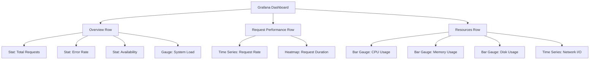

# Grafana Panel Types

## Introduction

Grafana provides a rich set of visualization options through its panel system, which serves as the fundamental building block for creating informative dashboards. Each panel type is designed to present data in a specific way, allowing you to choose the most effective visualization for your Prometheus metrics. In this guide, we'll explore the various panel types available in Grafana and learn how to use them effectively to visualize Prometheus data.

## Understanding Grafana Panels

Panels in Grafana are individual visualization units that can be arranged on a dashboard. Each panel connects to a data source (in our case, Prometheus) and renders the queried data in a specific format. The power of Grafana lies in selecting the right panel type to convey your metrics clearly and meaningfully.

## Common Grafana Panel Types for Prometheus Data

### Time Series Panel

The Time Series panel is the most commonly used visualization in Grafana, perfect for showing how metrics change over time.

#### Example: CPU Usage Visualization

1. Create a new dashboard and add a Time Series panel
2. Configure a Prometheus query:

```
100 - (avg by (instance) (irate(node_cpu_seconds_total{mode="idle"}[5m])) * 100)
```

3. Panel settings:
   - Title: "CPU Usage (%)"
   - Unit: Percent (0-100)
   - Min: 0
   - Max: 100

This panel will show CPU usage percentage over time, making it easy to spot spikes or trends.


### Gauge Panel

Gauge panels are ideal for displaying single-value metrics that have a defined range, such as percentages or levels.

#### Example: Memory Usage Gauge

```
100 * (1 - ((node_memory_MemFree_bytes + node_memory_Cached_bytes + node_memory_Buffers_bytes) / node_memory_MemTotal_bytes))
```

Configure the gauge with:
- Min: 0
- Max: 100
- Thresholds:
  - 0-70: green
  - 70-85: orange
  - 85-100: red

### Stat Panel

The Stat panel shows a large statistic value, perfect for key performance indicators (KPIs) or metrics that need immediate attention.

#### Example: Number of Running Containers

Query:
```
count(container_last_seen{name!=""})
```

Settings:
- Title: "Running Containers"
- Value mapping: Map null to "No Data"
- Threshold: Enable color background

### Bar Gauge Panel

Bar gauges are excellent for comparing multiple metrics side by side or displaying a single value with thresholds.

#### Example: Disk Usage by Mount Point

Query:
```
100 - ((node_filesystem_avail_bytes{fstype!="tmpfs"} * 100) / node_filesystem_size_bytes{fstype!="tmpfs"})
```

Settings:
- Display: Gradient
- Orientation: Horizontal
- Show threshold labels: true
- Value mappings: Map null values to "No Data"

### Pie Chart Panel

Pie charts are useful for showing proportions and percentage distributions of metrics.

#### Example: HTTP Status Code Distribution

Query:
```
sum by (status_code) (increase(http_requests_total[1h]))
```

Settings:
- Legend: Show percentage values
- Tooltip: Show all values

### Heatmap Panel

Heatmaps excel at showing the distribution of data points over time, highlighting patterns and anomalies.

#### Example: Request Duration Heatmap

Query:
```
sum(increase(http_request_duration_seconds_bucket[1m])) by (le)
```

Settings:
- Format: Heatmap
- Color scheme: Spectrum
- Y-axis: logarithmic scale

### Table Panel

Tables display raw data in a structured format, useful for detailed analysis or when numerical precision is important.

#### Example: Top 5 Processes by CPU Usage

Query:
```
topk(5, sum by (name) (rate(process_cpu_seconds_total[5m])))
```

Settings:
- Column styles: 
  - Value: Unit as "Percent (0-100)"
  - Add color background based on thresholds

### Graph Flow (Node Graph) Panel

The Node Graph panel visualizes directed graphs and relationships between entities, useful for service maps or dependency diagrams.

#### Example: Service Dependencies

This requires specific metrics that model relationships between services. Often used with service mesh technologies like Istio.

### Logs Panel

While primarily used with logging data sources, the Logs panel can also be useful with Prometheus metrics that represent events.

#### Example: Error Rate Events

Query:
```
increase(http_requests_total{status=~"5.."}[1m])
```

Settings:
- Visualization: Logs
- Configure to show time and value columns

## Creating Multi-Panel Dashboards

Let's create a comprehensive dashboard for monitoring a web application using different panel types:

1. **Overview Row**:
   - Stat panels showing total requests, error rate, and availability
   - Gauge showing system load
   
2. **Request Performance Row**:
   - Time Series panel showing request rate over time
   - Heatmap showing request duration distribution
   
3. **Resources Row**:
   - Bar gauges showing CPU, memory, and disk usage
   - Time Series panel showing network I/O

Let's visualize this dashboard structure:



## Advanced Panel Features

### Transformations

Grafana allows you to transform your data before visualization. Common transformations for Prometheus data include:

- **Reduce**: Convert time series to single values
- **Filter by name**: Remove unwanted series
- **Join by field**: Combine multiple queries
- **Group by**: Aggregate data by a specific field

#### Example: Top 5 CPU Consumers using Transformations

1. Query all processes:
   ```
   process_cpu_seconds_total
   ```

2. Apply transformations:
   - Add "Reduce" transformation with "Last" calculation
   - Add "Sort by" transformation on the value field (descending)
   - Add "Limit" transformation to show only top 5 rows

### Thresholds and Alerts

Most panel types support thresholds that change colors based on value ranges. These can be configured to align with alert conditions:

```javascript
// Example threshold configuration
{
  "thresholds": {
    "mode": "absolute",
    "steps": [
      { "color": "green", "value": null },
      { "color": "yellow", "value": 70 },
      { "color": "red", "value": 85 }
    ]
  }
}
```

### Variables and Templates

Make your panels dynamic with Grafana variables:

```
// Variable query example for instance selection
label_values(node_exporter_build_info, instance)
```

Then use in your queries:
```
rate(node_cpu_seconds_total{mode="idle",instance="$instance"}[5m])
```

## Panel-Specific PromQL Tips

Different panel types work best with specific PromQL query patterns:

### For Time Series
- Use `rate()` or `irate()` for counter metrics
- Apply `avg`, `max`, `min` or other aggregation functions

### For Gauges and Stats
- Use `max()` or `last()` to get current values
- Consider instant queries for faster response

### For Bar Gauges (Multiple Values)
- Use `by (label)` to group metrics
- Apply `topk()` to limit the number of bars

### For Pie Charts
- Ensure your query returns a distribution that sums to a meaningful whole
- Use `sum by (label)` to group data properly

## Practical Exercises

Try these exercises to practice using different panel types:

1. Create a Time Series panel showing the rate of HTTP requests by status code
2. Build a Gauge panel showing the current memory usage percentage
3. Design a Bar Gauge panel displaying disk usage for all mount points
4. Construct a Stat panel showing the total number of errors in the last hour
5. Develop a Heatmap showing the distribution of request durations

## Summary

Grafana's diverse panel types provide powerful visualization options for Prometheus metrics. By selecting the appropriate panel type for each metric, you can create informative and actionable dashboards that help you understand system behavior and identify issues quickly.

The key to effective dashboards is matching the right visualization to the data and the story you want to tell:
- Time Series for trends over time
- Gauges and Stats for current states and KPIs
- Bar Gauges for comparisons
- Pie Charts for distributions
- Heatmaps for frequency patterns
- Tables for precise values and detailed analysis

## Additional Resources

- [Grafana Documentation on Panels](https://grafana.com/docs/grafana/latest/panels-visualizations/)
- [PromQL for Beginners](https://prometheus.io/docs/prometheus/latest/querying/basics/)
- [Grafana Play](https://play.grafana.org/) - Try different panel types in a sandbox environment
- [Awesome Grafana Dashboards](https://grafana.com/grafana/dashboards/) - Explore community dashboards for inspiration