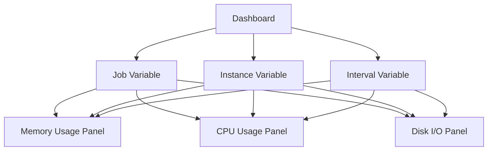

# Grafana Variables

## Introduction

Grafana variables are powerful features that allow you to create dynamic and interactive dashboards. They enable you to change the data being displayed in your visualizations without having to modify the queries or create new panels. In the context of Prometheus monitoring, variables are particularly useful for filtering metrics by different labels, servers, or time ranges.

By the end of this tutorial, you'll understand what Grafana variables are, the different types available, and how to implement them in your Prometheus dashboards to make your visualizations more flexible and interactive.

## What Are Grafana Variables?

Variables in Grafana act as placeholders for values that can be changed through dropdown menus in your dashboard. When you change a variable's value, all panels using that variable update automatically to reflect the new selection.

Think of variables as parameters you can adjust on the fly to focus on specific aspects of your metrics without having to create separate dashboards for each view.

## Types of Grafana Variables

Grafana offers several types of variables, each serving different purposes:

1. **Query variables**: Populate options from the result of a data source query
2. **Custom variables**: Define a list of values manually
3. **Text box variables**: Allow free-form text input
4. **Constant variables**: Define hidden constants for reuse in queries
5. **Data source variables**: Switch between different data sources
6. **Interval variables**: Define time intervals (e.g., 1m, 5m, 1h)
7. **Ad hoc filters**: Create key/value filters on the fly (Prometheus-specific)
8. **Global variables**: Special variables provided by Grafana (like `$__interval`)

## Creating and Using Variables with Prometheus

Let's explore how to create and use different types of variables with Prometheus data.

### Query Variables for Prometheus Labels

One of the most common use cases is to create a variable that lists all values for a specific Prometheus label.

#### Step 1: Create a new variable

1. Navigate to your dashboard
2. Click the gear icon (⚙️) to open dashboard settings
3. Select "Variables" in the left sidebar
4. Click "New variable"

#### Step 2: Configure the variable

```
Name: instance
Label: Server Instance
Type: Query
Data source: Prometheus
Query: label_values(node_exporter_up, instance)
Sort: Alphabetical (asc)
```

This query will fetch all unique values of the `instance` label from the `node_exporter_up` metric.

#### Step 3: Use the variable in your queries

Now you can use the variable in your Prometheus queries like this:

```
node_memory_MemFree_bytes{instance="$instance"}
```

When used in a panel, this query will use the currently selected instance from the dropdown.

### Example: Dashboard with Multiple Variables

Let's create a more complex dashboard that uses multiple variables to filter metrics:



#### Step 1: Create job variable

```
Name: job
Label: Job
Type: Query
Data source: Prometheus
Query: label_values(job)
```

#### Step 2: Create dependent instance variable

```
Name: instance
Label: Instance
Type: Query
Data source: Prometheus
Query: label_values(up{job="$job"}, instance)
Include All option: yes
```

This creates a dependency - the instance options will update based on the selected job.

#### Step 3: Create interval variable

```
Name: interval
Label: Interval
Type: Interval
Values: 1m,5m,10m,30m,1h,6h,12h,1d
```

#### Step 4: Create dashboard panels using these variables

For a memory usage panel, you could use:

```
rate(node_memory_MemFree_bytes{job="$job", instance="$instance"}[$interval])
```

## Advanced Variable Techniques

### Multi-Value Selection

Grafana variables support selecting multiple values. To use this in Prometheus queries, you need special syntax:

```
node_cpu_seconds_total{instance=~"$instance"}
```

The `=~` operator means "matches regex" in PromQL, and Grafana will replace `$instance` with a regex like `(instance1|instance2)` when multiple values are selected.

### Variable Format Options

You can control how variables are formatted using the following syntaxes:

- `${variable}` - Default formatting
- `${variable:raw}` - No escaping
- `${variable:regex}` - Regex escaping
- `${variable:lucene}` - Lucene formatting
- `${variable:glob}` - Glob formatting
- `${variable:json}` - JSON string formatting
- `${variable:csv}` - Comma-separated values
- `${variable:html}` - HTML escaping
- `${variable:urlraw}` - URL encoding without +
- `${variable:url}` - URL encoding

### Chained Variables

You can create variables that depend on other variables, creating a hierarchical filter system:

1. Create a variable for environments:
```
Name: environment
Type: Custom
Values: production, staging, development
```

2. Create a dependent service variable:
```
Name: service
Type: Query
Query: label_values(up{environment="$environment"}, service)
```

3. Create a dependent instance variable:
```
Name: instance
Type: Query
Query: label_values(up{environment="$environment", service="$service"}, instance)
```

## Global Variables

Grafana provides several built-in variables you can use in your queries:

- `$__interval`: Represents the time grain appropriate for the current time range
- `$__rate_interval`: Best interval for rate() functions based on current time range
- `$__range`: Current dashboard time range (e.g., `2h`, `7d`)
- `$__from` and `$__to`: Current dashboard time range as epoch timestamps
- `$__name`: Name of the current time series
- `$timeFilter`: Current dashboard time range as a filter expression

Example with `$__rate_interval`:

```
rate(node_cpu_seconds_total{instance="$instance", mode="idle"}[$__rate_interval])
```

## Practical Example: Server Monitoring Dashboard

Let's put everything together to create a comprehensive server monitoring dashboard:

1. Create these variables:
   - `job`: Query variable for Prometheus job
   - `instance`: Dependent variable for server instances
   - `interval`: Interval variable (1m,5m,15m,1h,6h,24h)

2. Create a CPU Usage panel:

```
100 - (avg by(instance) (rate(node_cpu_seconds_total{job="$job", instance="$instance", mode="idle"}[$interval])) * 100)
```

3. Create a Memory Usage panel:

```
100 * (1 - ((node_memory_MemAvailable_bytes{job="$job", instance="$instance"} or node_memory_MemFree_bytes{job="$job", instance="$instance"}) / node_memory_MemTotal_bytes{job="$job", instance="$instance"}))
```

4. Create a Disk Usage panel:

```
100 - ((node_filesystem_avail_bytes{job="$job", instance="$instance", mountpoint="/"} * 100) / node_filesystem_size_bytes{job="$job", instance="$instance", mountpoint="/"})
```

## Using Ad Hoc Filters with Prometheus

Ad hoc filters allow users to add key/value filters on the fly:

1. Create an ad hoc filter variable:
```
Name: filters
Type: Ad hoc filters
Data source: Prometheus
```

2. In your panels, no special syntax is needed - the filters will be automatically applied to all Prometheus queries.

## Template Variables in Panel Titles

Make your panels more informative by using variables in their titles:

```
CPU Usage - $instance - $interval
```

This will display the current selections in the panel title, making it clear what data is being shown.

## Summary

Grafana variables transform static dashboards into dynamic, interactive monitoring tools. They make it easier to analyze data across different dimensions without cluttering your interface with duplicate panels.

For Prometheus monitoring specifically, variables enable:
- Switching between different servers and environments
- Adjusting time intervals for rate functions
- Creating dependent filters to drill down into metrics
- Adding ad hoc filters for on-the-fly analysis

By mastering Grafana variables, you'll build more useful and flexible dashboards that help identify issues faster and gain deeper insights into your systems.

## Additional Resources

- [Grafana Variables Documentation](https://grafana.com/docs/grafana/latest/variables/)
- [Prometheus Query Language (PromQL) Reference](https://prometheus.io/docs/prometheus/latest/querying/basics/)

## Exercises

1. Create a dashboard with variables for job, instance, and environment that allows you to monitor CPU, memory, and disk usage.

2. Implement a templated dashboard that uses chained variables to filter metrics by datacenter, rack, and server.

3. Create a dashboard with an interval variable that allows you to adjust the time range for rate() functions on network traffic metrics.

4. Build a service-level monitoring dashboard that uses multi-value selection to compare metrics across multiple instances simultaneously.