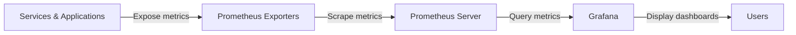

# Grafana Data Sources

## Introduction

Data sources are the foundation of any Grafana deployment, serving as the connection between your Grafana instance and the systems where your metrics, logs, and other observability data reside. Grafana supports numerous data sources, but in this guide, we'll focus primarily on configuring and using Prometheus as a data source, while briefly covering other popular options.

Understanding how to properly configure and query data sources is essential for creating effective dashboards and visualizations in Grafana. By the end of this guide, you'll be comfortable adding, configuring, and using Prometheus and other data sources in your Grafana installation.

## What Are Grafana Data Sources?

A data source in Grafana is simply a connection to a database or service that stores your metrics, logs, or other types of data. Grafana supports over 30 different data sources out of the box, including:

- **Time Series Databases**: Prometheus, InfluxDB, Graphite, OpenTSDB
- **Logging Systems**: Loki, Elasticsearch 
- **Cloud Providers**: AWS CloudWatch, Google Cloud Monitoring, Azure Monitor
- **SQL Databases**: MySQL, PostgreSQL, Microsoft SQL Server
- **Other**: Jaeger, Zipkin, Tempo (for tracing), JSON APIs, CSV files

Each data source type has its own query language and capabilities, which Grafana abstracts through its unified interface.

## Adding Prometheus as a Data Source

Prometheus is one of the most popular data sources for Grafana, especially for Kubernetes and cloud-native monitoring. Here's how to add Prometheus as a data source in Grafana:

### Step 1: Access the Data Sources Configuration

1. Log in to your Grafana instance
2. Navigate to the Configuration menu (gear icon) in the left sidebar
3. Select "Data Sources"
4. Click "Add data source"

### Step 2: Select and Configure Prometheus

1. Search for "Prometheus" in the list of available data sources
2. Click on the Prometheus option
3. Configure the connection:

```
Name: Prometheus                   # A name for this data source instance
URL: http://prometheus:9090        # The URL where your Prometheus server is accessible
Access: Server (default)           # How Grafana accesses the data source
```

### Step 3: Additional Configuration Options

You can configure several additional options:

- **Scrape interval**: Set this to match your Prometheus scrape interval (usually 15s)
- **Query timeout**: How long Grafana should wait for query responses
- **HTTP settings**: Including headers, authentication, etc.
- **Alert settings**: For Grafana alerting with Prometheus data
- **Custom query parameters**: Advanced use cases

### Step 4: Test and Save

1. Click the "Test" button at the bottom of the page to verify connectivity
2. If the test is successful, click "Save & Test" to save the configuration

## Exploring Prometheus Data with Explore

Once you've connected Prometheus, you can start exploring your metrics:

1. Click on the "Explore" icon in the left sidebar
2. Select your Prometheus data source from the dropdown
3. Start typing a metric name in the query field to use autocomplete

Basic Prometheus query example:

```
node_cpu_seconds_total{mode="idle"}
```

This will return the total CPU idle time for all instances in your Prometheus.

### Using PromQL Functions

Prometheus Query Language (PromQL) offers powerful functions for data manipulation:

```
# Calculate the rate of CPU usage over 5 minutes
rate(node_cpu_seconds_total{mode="user"}[5m])

# Calculate the percentage of CPU in use
100 - (avg by(instance) (rate(node_cpu_seconds_total{mode="idle"}[5m])) * 100)
```

## Creating a Basic Dashboard with Prometheus Data

Let's create a simple dashboard panel with Prometheus data:

1. Create a new dashboard (+ icon → Dashboard)
2. Add a new panel (Add panel button)
3. Select your Prometheus data source
4. Enter a PromQL query: 

```
sum(rate(node_cpu_seconds_total{mode!="idle"}[1m])) by (instance) / 
sum(rate(node_cpu_seconds_total[1m])) by (instance) * 100
```

5. This query shows CPU utilization percentage by instance
6. Format the panel:
   - Title: "CPU Usage by Instance"
   - Unit: Percent (0-100)
   - Visualization: Time series graph
7. Save the panel and dashboard

## Real-World Example: Monitoring a Web Application

Let's create a more comprehensive dashboard for monitoring a web application using Prometheus metrics:

### Step 1: Configure the Data Source

Ensure your Prometheus instance is scraping metrics from your web application. Common exporters include:
- Node Exporter for server metrics
- Blackbox Exporter for endpoint monitoring
- Application-specific exporters or instrumentation

### Step 2: Create a Dashboard with Multiple Panels

Create a new dashboard with these panels:

**Panel 1: Request Rate**
```
sum(rate(http_requests_total[5m])) by (service, endpoint)
```

**Panel 2: Error Rate**
```
sum(rate(http_requests_total{status_code=~"5.."}[5m])) by (service) / 
sum(rate(http_requests_total[5m])) by (service) * 100
```

**Panel 3: Response Time (95th Percentile)**
```
histogram_quantile(0.95, sum(rate(http_request_duration_seconds_bucket[5m])) by (le, service))
```

**Panel 4: System Load Average**
```
node_load1{instance=~"$instance"}
```

### Step 3: Add Variables for Interactive Filtering

1. Navigate to Dashboard Settings → Variables
2. Add a variable:
   - Name: `instance`
   - Label: Instance
   - Query: `label_values(node_cpu_seconds_total, instance)`
   - Type: Multi-value
3. Use this variable in your queries with `{instance=~"$instance"}`

## Using Multiple Data Sources

Grafana truly shines when combining data from multiple sources. Here's how to work with additional data sources:

### Adding Another Data Source

Follow the same steps as with Prometheus to add additional data sources. Some popular combinations:

1. **Prometheus + Loki**: Metrics + Logs
2. **Prometheus + Tempo**: Metrics + Traces
3. **Prometheus + MySQL**: Metrics + Business data

### Creating Mixed Dashboards

You can use different data sources for different panels within the same dashboard. When creating a panel, simply select the appropriate data source from the dropdown.

## Advanced Grafana Data Source Features

### Data Source Provisioning

For production environments, you can provision data sources using configuration files:

1. Create a YAML configuration in Grafana's provisioning directory:

```yaml
apiVersion: 1

datasources:
  - name: Prometheus
    type: prometheus
    access: proxy
    url: http://prometheus:9090
    isDefault: true
```

2. Restart Grafana or apply the changes

### Alerting with Prometheus Data

With Grafana alerts:

1. Edit a panel that uses Prometheus data
2. Navigate to the "Alert" tab
3. Configure:
   - Rule name: "High CPU Usage"
   - Evaluate every: 1m
   - For: 5m
   - Conditions: `WHEN last() OF query(A, 5m, now) IS ABOVE 80`
4. Add notifications

### Using Transformations

Grafana 7.0+ includes powerful transformations:

1. In panel edit mode, go to the "Transform" tab
2. Try operations like:
   - Reduce: Calculate sums/averages across series
   - Join: Combine queries from different data sources
   - Group By: Restructure your data on the fly

## Visualizing Prometheus Metrics Flow

Here's a diagram showing how metrics flow from services to Prometheus and then to Grafana:



## Common Troubleshooting

### Data Source Connection Issues

If you're having trouble connecting to Prometheus:

1. Verify the URL is correct and Prometheus is running
2. Check network connectivity (firewalls, routing)
3. Verify Grafana has permission to access Prometheus
4. Check browser console for CORS errors
5. Examine Grafana server logs

### Query Performance Issues

If queries are slow:

1. Use `rate()` instead of `irate()` for long time ranges
2. Apply specific label filters to reduce data volume
3. Use recording rules in Prometheus for complex calculations
4. Increase browser memory limits for large result sets

## Summary

Grafana data sources are the vital connections that bring your observability data to life through visualizations and dashboards. In this guide, we've focused on:

- Understanding what data sources are in Grafana
- Adding and configuring Prometheus as a primary data source
- Writing effective PromQL queries for visualization
- Creating dashboards with real-world monitoring examples
- Working with multiple data sources
- Advanced features like provisioning and alerts

By mastering Grafana data sources, especially Prometheus, you'll be able to build comprehensive monitoring solutions that provide valuable insights into your systems and applications.

## Additional Resources

To deepen your knowledge:

- Practice creating different types of visualizations with Prometheus data
- Experiment with the Explore view to better understand your metrics
- Try these exercises:

  **Exercise 1**: Create a dashboard showing system resources (CPU, memory, disk, network) for a set of servers.
  
  **Exercise 2**: Set up a multi-datasource dashboard that combines Prometheus metrics with another data source.
  
  **Exercise 3**: Create a Grafana dashboard variable that allows filtering by application or service name.

Official documentation:
- Grafana Data Sources: [https://grafana.com/docs/grafana/latest/datasources/](https://grafana.com/docs/grafana/latest/datasources/)
- Prometheus: [https://prometheus.io/docs/introduction/overview/](https://prometheus.io/docs/introduction/overview/)
- PromQL: [https://prometheus.io/docs/prometheus/latest/querying/basics/](https://prometheus.io/docs/prometheus/latest/querying/basics/)