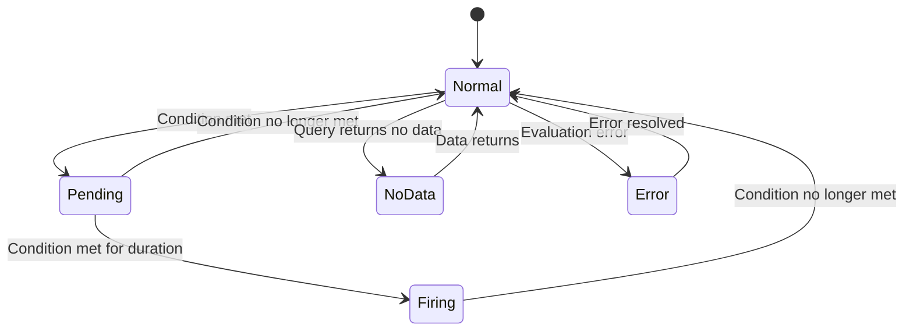

# Grafana Alerts

## Introduction

Alerting is a critical component of any monitoring system. While Prometheus has its own alerting capabilities through AlertManager, Grafana provides a powerful and user-friendly alerting system that can work with Prometheus data sources. Grafana Alerts allow you to detect critical conditions in your monitoring data and notify the appropriate teams when these conditions are met.

In this guide, we'll explore how to create, manage, and troubleshoot Grafana Alerts when using Prometheus as a data source. By the end, you'll be able to set up effective alerting rules that help you respond quickly to potential issues in your systems.

## Understanding Grafana Alerts

Grafana Alerts work by evaluating query expressions at specified intervals. When the conditions defined in these expressions are met, the alert transitions from a normal state to a "pending" state. If the condition persists for the defined duration, the alert becomes "firing" and notifications are sent through the configured notification channels.

### Alert States

Grafana alerts can be in one of the following states:

- **Normal**: The alert condition is not met
- **Pending**: The alert condition is met, but hasn't been met for long enough to trigger
- **Firing**: The alert condition has been met for the specified duration
- **No Data**: The alert query returned no data
- **Error**: There was an error evaluating the alert rule



## Setting Up Grafana Alerts with Prometheus

Let's walk through the process of creating alerts in Grafana using Prometheus data.

### Prerequisites

Before setting up alerts, ensure you have:

1. A working Grafana installation (version 8.0 or later recommended)
2. Prometheus configured as a data source in Grafana
3. Some metrics being collected by Prometheus

### Creating Your First Alert Rule

#### Step 1: Create a Dashboard Panel

First, create a panel that visualizes the metric you want to alert on:

1. Create a new dashboard or edit an existing one
2. Add a new panel
3. Configure your Prometheus query

For example, to monitor high CPU usage, your PromQL query might look like:

```
100 - (avg by(instance) (rate(node_cpu_seconds_total{mode="idle"}[5m])) * 100)
```

#### Step 2: Define Alert Conditions

Once your panel is set up:

1. Click on the panel title and select "Edit"
2. In the panel editor, click on the "Alert" tab
3. Click "Create Alert"

You'll see a form where you can configure your alert:

```
Name: High CPU Usage Alert
Evaluate every: 1m
For: 5m
```

The "Evaluate every" field determines how often Grafana evaluates the alert condition. The "For" field specifies how long the condition must be true before the alert transitions to the "Firing" state.

#### Step 3: Define the Alert Condition

Under "Conditions", configure when the alert should trigger:

```
WHEN avg() OF query(A, 5m, now) IS ABOVE 80
```

This means the alert will trigger when the average value of your query over the last 5 minutes exceeds 80% CPU usage.

#### Step 4: Add Alert Details

Add a descriptive message that will be sent with the notification:

```
Message: High CPU usage detected on {{$labels.instance}}
Current value: {{$value}}%
```

The variables `{{$labels.instance}}` and `{{$value}}` will be replaced with the actual instance name and metric value when the alert fires.

#### Step 5: Configure Notification Channels

Finally, set up notification channels to determine where alerts will be sent:

1. Go to Alerting → Notification channels
2. Add channels like Email, Slack, PagerDuty, etc.
3. Configure the channel with necessary details (e.g., Slack webhook URL)
4. Return to your alert configuration and select the notification channel

### Example: Setting Up a Memory Usage Alert

Let's create a practical example for alerting on high memory usage:

1. Create a new dashboard panel with this PromQL query:

```
100 - ((node_memory_MemAvailable_bytes / node_memory_MemTotal_bytes) * 100)
```

2. Set up an alert with these settings:

```
Name: High Memory Usage Alert
Evaluate every: 1m
For: 10m
Condition: WHEN avg() OF query(A, 5m, now) IS ABOVE 90
Message: High memory usage detected on {{$labels.instance}}
Current memory usage: {{$value}}%
```

3. Select your notification channel and save the alert

When memory usage exceeds 90% for 10 minutes or more, you'll receive a notification through your configured channels.

## Advanced Alert Configuration

### Using Math and Functions

You can apply mathematical operations and functions to your alert queries:

```
sum(rate(http_requests_total{status=~"5.."}[5m])) / sum(rate(http_requests_total[5m])) * 100
```

This query calculates the percentage of HTTP 5xx errors, which you could use to alert when error rates exceed a threshold.

### Multi-condition Alerts

For complex scenarios, you can create alerts with multiple conditions:

```
WHEN min() OF query(A, 5m, now) IS BELOW 10
AND max() OF query(B, 5m, now) IS ABOVE 100
```

### Alert Annotations and Labels

Enhance your alerts with additional context using annotations and labels:

```
Annotations:
  description: "High CPU usage of {{$value}}% detected on {{$labels.instance}}"
  summary: "Instance {{$labels.instance}} under high load"
  
Labels:
  severity: warning
  category: performance
```

## Troubleshooting Grafana Alerts

When your alerts aren't working as expected, check these common issues:

### 1. Alert Never Fires

- Verify that your query is returning data
- Check if the condition thresholds are appropriate
- Confirm the "For" duration isn't too long

### 2. False Positives

- Adjust thresholds based on normal patterns
- Consider using longer evaluation periods
- Implement hysteresis by having different thresholds for triggering and resolving

### 3. No Notifications

- Check that notification channels are configured correctly
- Verify network connectivity to notification services
- Review Grafana logs for errors related to notifications

## Integrating with Prometheus AlertManager

While Grafana has its own alerting system, you can also integrate with Prometheus AlertManager:

1. Configure Prometheus AlertManager as an alerting channel in Grafana
2. Forward Grafana alerts to AlertManager for centralized alert management

```
Alerting > Notification channels > New channel
Type: Prometheus Alertmanager
URL: http://your-alertmanager:9093
```

This allows you to leverage AlertManager's powerful features like alert grouping, silencing, and inhibition.

## Best Practices for Grafana Alerts

### 1. Alert on Symptoms, Not Causes

Focus on alerting on user-impacting issues rather than internal system metrics. For example, alert on high error rates or slow response times rather than just CPU or memory usage.

### 2. Use Appropriate Thresholds

Set thresholds based on historical data and business requirements. Avoid setting arbitrary thresholds that may lead to alert fatigue.

### 3. Implement Alert Severity Levels

Categorize alerts by severity to help teams prioritize their response:

- **Critical**: Immediate action required, service impacted
- **Warning**: Potential issue, needs investigation
- **Info**: Noteworthy event, no immediate action needed

### 4. Document Alert Remediation Steps

Include links to runbooks or documentation in your alert messages to help responders resolve issues quickly.

### 5. Regularly Review and Refine Alerts

Periodically review your alerting rules to:

- Remove alerts that no longer serve a purpose
- Adjust thresholds based on system changes
- Add new alerts for emerging failure modes

## Summary

Grafana Alerts provide a powerful way to monitor your systems and get notified when things go wrong. By leveraging Prometheus as a data source, you can create sophisticated alerting rules based on time-series metrics.

Key takeaways:

- Grafana Alerts evaluate query expressions at specified intervals
- Alerts transition through states: Normal → Pending → Firing
- You can create complex conditions using PromQL and Grafana functions
- Notifications can be sent through various channels like email, Slack, etc.
- Best practices include alerting on symptoms, using appropriate thresholds, and documenting remediation steps

## Exercises and Next Steps

To solidify your understanding of Grafana Alerts, try these exercises:

1. Create an alert for high HTTP error rates (>5% of total requests)
2. Set up a multi-condition alert that triggers when a service is both slow and experiencing errors
3. Configure different notification channels for different types of alerts
4. Create a dashboard that shows the history of your alert states

## Additional Resources

For more information about Grafana Alerts, check out:

- Grafana documentation on alerting
- Prometheus documentation on PromQL
- Communities and forums where you can ask questions and share experiences with other Grafana users

Remember that effective alerting is an iterative process. Start simple, learn from experience, and continuously refine your alerting strategy to reduce false positives and ensure you're notified about genuine issues that require attention.