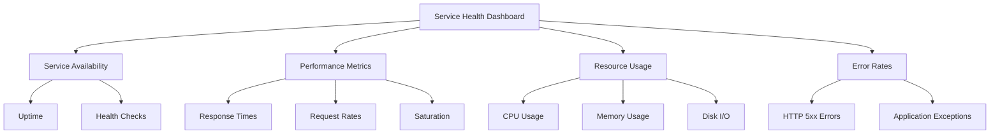

# Dashboard Design Best Practices

## Introduction

Effective dashboard design is critical when working with Prometheus. A well-designed dashboard transforms complex monitoring data into actionable insights, allowing you to identify patterns, spot anomalies, and make informed decisions quickly. Poor dashboard design, on the other hand, can lead to confusion, missing critical alerts, and slower incident response times.

This guide covers best practices for designing Prometheus dashboards that are clear, informative, and useful for both everyday monitoring and troubleshooting scenarios.

## Core Dashboard Design Principles

### 1. Start with Clear Objectives

Before creating a dashboard, define its purpose:

- **What questions should this dashboard answer?**
- **Who is the intended audience?** (Developers, SREs, management)
- **What decisions will users make based on this dashboard?**

Example objectives:

```
- Monitor application health and performance
- Track system resource utilization
- Visualize user behavior patterns
- Support incident investigation
```

### 2. Follow a Logical Information Hierarchy

Organize metrics by importance and relationship:

- **Important metrics first** - Place critical metrics at the top left (where eyes naturally look first)
- **Group related metrics** - Keep related visualizations together
- **Create a narrative flow** - Arrange panels to tell a story from high-level to detailed information

## Effective Panel Design

### Choose the Right Visualization Type

Select visualization types based on what you're trying to communicate:

| Data Type | Recommended Visualization |
| --------- | ------------------------- |
| Time series data | Line graphs |
| Comparisons between categories | Bar charts |
| Part-to-whole relationships | Pie charts (use sparingly) |
| Single value metrics | Stat panels, Gauge panels |
| Status information | State timeline, Status history |
| Logs and events | Logs panel, annotations |

### Best Practices for Common Prometheus Visualizations

#### Line Graphs (Time Series)

```promql
# Example: HTTP request rate by status code
sum by(status_code) (rate(http_requests_total[5m]))
```

Best practices:
- Use consistent time ranges for comparison
- Limit the number of lines (3-7 maximum for readability)
- Use clear color coding (e.g., red for errors, green for success)
- Add thresholds to indicate acceptable ranges

#### Gauge and Stat Panels

```promql
# Example: Current CPU usage
100 - (avg by(instance) (rate(node_cpu_seconds_total{mode="idle"}[5m])) * 100)
```

Best practices:
- Include units (%, MB, req/sec)
- Add thresholds with color coding
- Show trends with sparklines where applicable
- Keep precision appropriate (avoid excessive decimal places)

## Color and Layout Considerations

### Color Usage

- **Use color purposefully** - Colors should convey meaning, not just look pretty
- **Be consistent** - Use the same colors for the same metrics across dashboards
- **Consider accessibility** - Ensure your dashboard is readable for colorblind users
- **Use color sparingly** - Too many colors create visual noise

Recommended color patterns:

- **Green**: Normal/healthy state
- **Yellow/Orange**: Warning/attention needed
- **Red**: Critical/error state
- **Blue/Purple**: Informational/neutral metrics

### Layout Best Practices

- **Use a grid layout** - Align panels to a consistent grid
- **Maintain whitespace** - Don't overcrowd; leave breathing room between panels
- **Consistent panel sizes** - Similar information should use similar-sized panels
- **Group related panels** - Use row collapsible containers to organize related metrics

## Creating a Unified Dashboard System

### Dashboard Naming and Organization

Follow a consistent naming convention:

```
[Team/Service] - [Purpose] - [Environment]
```

Examples:
- `API - Performance - Production`
- `Frontend - User Experience - Staging`
- `Database - Resource Usage - Development`

### Template Variables for Flexibility

Use template variables to create dynamic, reusable dashboards:

```
$instance: Node instance selector
$job: Service job selector
$environment: Environment selector (prod, staging, dev)
```

Example implementation in Grafana:

```yaml
Variables:
  - name: instance
    type: query
    query: label_values(node_uname_info, instance)
    
  - name: environment
    type: custom
    options: [production, staging, development]
```

Then in your PromQL queries:

```promql
rate(http_request_duration_seconds_count{instance=~"$instance", environment="$environment"}[5m])
```

## Practical Example: Creating a Service Health Dashboard

Let's build a complete service health dashboard with key metrics:



### Example Dashboard Layout

1. **Top Row: Service Status Overview**
   - Service uptime (stat panel)
   - Request success rate (gauge)
   - Error budget consumption (gauge)
   - Current request rate (stat with sparkline)

2. **Second Row: Performance Metrics**
   - Request latency percentiles (line graph)
   - Request rate by endpoint (line graph)
   - Apdex score (gauge panel)

3. **Third Row: Resource Utilization**
   - CPU usage (line graph)
   - Memory usage (line graph)
   - Disk I/O (line graph)
   - Network traffic (line graph)

4. **Fourth Row: Error Analysis**
   - Error rate by type (line graph)
   - Recent error log (logs panel)
   - Top error sources (bar chart)

### Example PromQL Queries for This Dashboard

Request success rate:
```promql
sum(rate(http_requests_total{status_code=~"2..|3.."}[5m])) / sum(rate(http_requests_total[5m])) * 100
```

95th percentile latency:
```promql
histogram_quantile(0.95, sum(rate(http_request_duration_seconds_bucket[5m])) by (le))
```

Error rate:
```promql
sum(rate(http_requests_total{status_code=~"5.."}[5m])) / sum(rate(http_requests_total[5m])) * 100
```

## Dashboard Optimization Tips

### Performance Considerations

- **Avoid excessive queries** - Each panel generates load on Prometheus
- **Use appropriate time intervals** - Match resolution to the display size
- **Limit high-cardinality metrics** - Avoid queries that generate too many time series
- **Use recording rules** for complex, frequently-used queries:

```yaml
groups:
  - name: example
    rules:
      - record: job:http_inprogress_requests:sum
        expr: sum by (job) (http_inprogress_requests)
```

### Readability Improvements

- **Add clear titles and descriptions** to each panel
- **Include units of measurement**
- **Add documentation links** where appropriate
- **Use annotations** to mark deployments and events:

```promql
# Adding deployment markers
changes(kube_deployment_status_replicas_updated[1h]) > 0
```

## Implementation Example in Grafana

Here's how to create a basic service dashboard in Grafana with Prometheus:

1. Create a new dashboard
2. Add template variables:

```
$service: label_values(http_requests_total, service)
$instance: label_values(http_requests_total{service="$service"}, instance)
```

3. Add panels with these example queries:

Request Rate panel:
```promql
sum by(status_code) (rate(http_requests_total{service="$service"}[5m]))
```

Latency panel:
```promql
histogram_quantile(0.95, sum by(le) (rate(http_request_duration_seconds_bucket{service="$service"}[5m])))
```

Error Rate panel:
```promql
sum(rate(http_requests_total{service="$service", status_code=~"5.."}[5m])) / sum(rate(http_requests_total{service="$service"}[5m])) * 100
```

## Common Dashboard Design Mistakes to Avoid

1. **Information overload** - Too many metrics on one dashboard
2. **Poor visual hierarchy** - No clear indication of what's important
3. **Inconsistent formatting** - Different units or scales for similar metrics
4. **Misleading visualizations** - Using inappropriate chart types for the data
5. **Missing context** - Values without baselines or historical comparison
6. **No alerting integration** - Failure to link alerts to dashboard panels

## Summary

Effective Prometheus dashboard design is both an art and a science. By following these best practices, you can create dashboards that:

- Communicate complex information clearly
- Enable faster problem detection and troubleshooting
- Provide actionable insights for decision-making
- Scale with your monitoring needs

Remember that dashboard design is iterative - start with the essentials, get feedback from users, and refine over time.

## Additional Resources

- The Grafana documentation for [best practices](https://grafana.com/docs/grafana/latest/best-practices/)
- The book "Information Dashboard Design" by Stephen Few
- Prometheus [query examples](https://prometheus.io/docs/prometheus/latest/querying/examples/)

## Exercises

1. Create a dashboard showing the four golden signals (latency, traffic, errors, saturation) for a service of your choice.
2. Improve an existing dashboard by applying the layout and color best practices from this guide.
3. Design a dashboard that answers a specific question about your system's performance, focusing on clarity and actionability.
4. Create a template dashboard that can be reused across multiple services using variables.