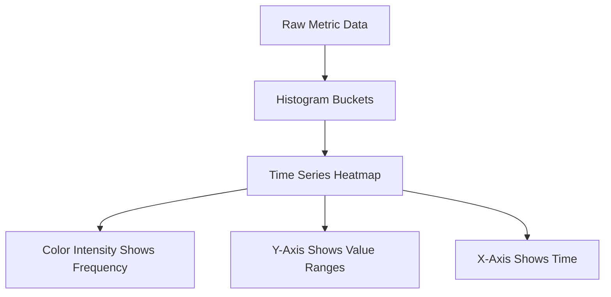

# Data Visualization Techniques

## Introduction

Data visualization is the graphical representation of information and data. By using visual elements like charts, graphs, and maps, data visualization tools provide an accessible way to see and understand trends, outliers, and patterns in data. In the context of Prometheus, a powerful open-source monitoring and alerting toolkit, effective data visualization is crucial for interpreting metrics and making informed decisions.

This guide will walk you through various data visualization techniques specific to Prometheus, helping you transform raw metrics into meaningful visual insights. Whether you're monitoring system performance, application behavior, or business metrics, these visualization techniques will enable you to spot patterns, identify anomalies, and communicate findings effectively.

## Understanding Prometheus Data Model

Before diving into visualization techniques, it's important to understand how Prometheus stores data.

Prometheus uses a time-series data model where each time series is identified by:
- A **metric name** describing the measured feature
- **Labels** (key-value pairs) that differentiate specific instances of that feature

For example:
```
http_requests_total{method="POST", endpoint="/api/users", status="200"}
```

This structure allows for flexible querying and visualization of your metrics.

## Basic Visualization Techniques

### Line Graphs

Line graphs are one of the most common visualization types in Prometheus, perfect for showing how metrics change over time.

#### Example: CPU Usage Over Time

```
avg by (instance) (rate(node_cpu_seconds_total{mode!="idle"}[5m])) * 100
```

This PromQL query shows the average CPU usage percentage across instances.

Line graphs help you:
- Identify trends and patterns
- Spot anomalies or spikes
- Compare related metrics on the same graph

### Bar Charts

Bar charts are useful for comparing discrete categories or showing distributions.

#### Example: HTTP Error Rates by Endpoint

```
sum by (endpoint) (rate(http_requests_total{status=~"5.."}[5m]))
```

This query visualizes the rate of HTTP 5xx errors across different endpoints.

Bar charts are great for:
- Comparing values across categories
- Showing distributions
- Highlighting the largest/smallest values

### Heatmaps

Heatmaps display three dimensions of data: two axes and color intensity. They're particularly useful for visualizing distributions over time.

#### Example: Request Duration Distribution

```
sum(increase(http_request_duration_seconds_bucket[5m])) by (le)
```

Heatmaps help you:
- Visualize data distributions
- Identify concentrations of values
- Spot patterns that might be missed in other visualizations

### Gauges and Single Stats

Sometimes the simplest visualization is the most effective. Gauges and single-value displays provide at-a-glance information about current states.

#### Example: Current Memory Usage

```
100 * (1 - node_memory_MemAvailable_bytes / node_memory_MemTotal_bytes)
```

These visualizations are perfect for:
- Key performance indicators (KPIs)
- Current status information
- Metrics that need immediate attention

## Advanced Visualization Techniques

### Multi-Graph Panels

Combining multiple graphs in a single panel allows for powerful comparative analysis.

#### Example: Frontend vs. Backend Latency

```
# Frontend latency
histogram_quantile(0.95, sum(rate(http_request_duration_seconds_bucket{service="frontend"}[5m])) by (le))

# Backend latency
histogram_quantile(0.95, sum(rate(http_request_duration_seconds_bucket{service="backend"}[5m])) by (le))
```

Multi-graph panels enable you to:
- Compare related metrics
- Identify correlations
- Tell a more complete story with your data

### Stacked Graphs

Stacked graphs show how different components contribute to a total.

#### Example: Disk Usage by Mount Point

```
sum by (mountpoint) (node_filesystem_size_bytes - node_filesystem_free_bytes)
```

Stacked graphs are useful for:
- Showing composition of a total
- Tracking multiple related metrics
- Identifying which components are most significant

### Histograms and Percentiles

Histograms are crucial for understanding distributions, especially in performance monitoring.

#### Example: Response Time Distribution

```
histogram_quantile(0.95, sum(rate(http_request_duration_seconds_bucket[5m])) by (le))
histogram_quantile(0.50, sum(rate(http_request_duration_seconds_bucket[5m])) by (le))
```

Histograms help you:
- Understand the distribution of values
- Monitor service level objectives (SLOs)
- Identify performance bottlenecks

### Time Series Heatmap

A specialized visualization that shows the distribution of values over time.



## Building Effective Dashboards

Great visualizations are most powerful when combined into thoughtful dashboards.

### Dashboard Organization Principles

1. **Hierarchy of information**: Place most critical metrics at the top
2. **Logical grouping**: Organize related metrics together
3. **Context provision**: Include enough information to make the metrics meaningful
4. **Consistency**: Use similar scales and visualizations for comparable metrics

### Example Dashboard Layout

```
┌───────────────────┬───────────────────┬───────────────────┐
│                   │                   │                   │
│  Service Status   │   Error Rates     │   Active Users    │
│  (Single stats)   │   (Line graph)    │   (Gauge)         │
│                   │                   │                   │
├───────────────────┴───────────────────┴───────────────────┤
│                                                           │
│  Request Latency Over Time                                │
│  (Line graph with p50, p95, p99 percentiles)             │
│                                                           │
├───────────────────────────┬───────────────────────────────┤
│                           │                               │
│  CPU Usage by Instance    │  Memory Usage by Instance     │
│  (Stacked graph)          │  (Stacked graph)              │
│                           │                               │
├───────────────────────────┴───────────────────────────────┤
│                                                           │
│  Request Duration Distribution                            │
│  (Heatmap)                                               │
│                                                           │
└───────────────────────────────────────────────────────────┘
```

## Practical Example: Creating a Web Service Dashboard

Let's build a complete dashboard for monitoring a web service using Prometheus and Grafana.

### Step 1: Define Key Metrics

For a web service, we typically want to track:
- Request throughput
- Error rates
- Response times
- Resource utilization

### Step 2: Create PromQL Queries

#### Request Rate
```
sum(rate(http_requests_total[5m])) by (service)
```

#### Error Rate
```
sum(rate(http_requests_total{status=~"5.."}[5m])) by (service) / sum(rate(http_requests_total[5m])) by (service)
```

#### 95th Percentile Response Time
```
histogram_quantile(0.95, sum(rate(http_request_duration_seconds_bucket[5m])) by (le, service))
```

#### CPU Usage
```
sum(rate(process_cpu_seconds_total[5m])) by (service) * 100
```

### Step 3: Choose Appropriate Visualizations

- **Request Rate**: Line graph showing trends over time
- **Error Rate**: Line graph with alert thresholds
- **Response Time**: Line graph showing multiple percentiles (50th, 95th, 99th)
- **CPU Usage**: Area graph showing utilization percentage

### Step 4: Organize Dashboard Layout

Arrange visualizations in a logical flow:
1. Service health metrics at the top (status, uptime)
2. User-facing metrics next (throughput, errors, latency)
3. Resource utilization at the bottom (CPU, memory, network)

## Best Practices for Data Visualization

### Do's:
- **Keep it simple**: Focus on what's important
- **Provide context**: Include enough information to make metrics meaningful
- **Use consistent scales**: When comparing similar metrics
- **Label clearly**: Ensure axes, legends, and titles are descriptive
- **Choose appropriate time ranges**: Show enough history to establish patterns

### Don'ts:
- **Overload with information**: Too many lines on a graph become unreadable
- **Mix unrelated metrics**: Keep visualizations focused
- **Use misleading scales**: Starting y-axis at non-zero can exaggerate differences
- **Ignore outliers**: They often contain valuable information

## Advanced Techniques for Specific Use Cases

### Anomaly Detection Visualization

Combining current metrics with historical ranges to highlight anomalies:

```
# Current value
rate(http_requests_total[5m])

# Historical range (1 week ago)
rate(http_requests_total[5m] offset 1w)
```

### Service Level Objective (SLO) Tracking

Visualizing compliance with SLOs:

```
# Error budget consumption
1 - (
  sum(rate(http_requests_total{status=~"2.."}[1h]))
  /
  sum(rate(http_requests_total[1h]))
)
```

### Capacity Planning

Projecting resource needs based on growth trends:

```
# Linear prediction of disk usage
predict_linear(node_filesystem_free_bytes[1d], 7 * 24 * 3600)
```

## Summary

Data visualization transforms raw Prometheus metrics into actionable insights. By applying the right visualization techniques, you can:

- Quickly identify issues before they impact users
- Understand performance patterns and trends
- Communicate system status effectively
- Make data-driven decisions for optimization

Remember that effective visualization is both an art and a science—it requires technical knowledge of the tools, an understanding of the data, and a sense of how to present information clearly and effectively.

## Exercises and Further Learning

### Practice Exercises

1. Create a dashboard showing the "Four Golden Signals" (latency, traffic, errors, saturation) for a service of your choice.
2. Build a visualization that helps identify the correlation between CPU usage and request latency.
3. Design a heatmap visualization for request durations, and use it to identify patterns throughout the day.

### Additional Resources

- [Prometheus Query Language Documentation](https://prometheus.io/docs/prometheus/latest/querying/basics/)
- [Grafana Documentation](https://grafana.com/docs/grafana/latest/)
- [Google's SRE Book Chapter on Monitoring](https://sre.google/sre-book/monitoring-distributed-systems/)
- [The Art of Dashboard Design](https://grafana.com/blog/2020/06/23/the-art-of-dashboard-design/)

By mastering these data visualization techniques, you'll be able to extract maximum value from your Prometheus metrics and create dashboards that provide genuine insight into your systems.