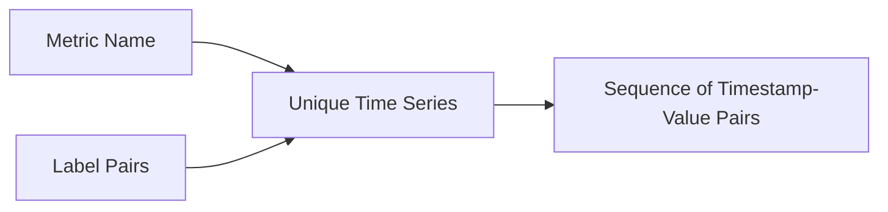

# Time Series Visualization in Prometheus

## Introduction

Time series visualization is a fundamental aspect of working with Prometheus, a powerful open-source monitoring and alerting toolkit. As monitoring data is inherently time-based, understanding how to effectively visualize this data is crucial for identifying patterns, spotting anomalies, and making data-driven decisions.

In this guide, we'll explore how Prometheus handles time series data visualization, the different types of visualizations available, and how to create meaningful dashboards that provide insights into your systems' performance.

## Understanding Time Series Data

Before diving into visualization, let's understand what time series data actually is:

A time series is a sequence of data points collected at successive time intervals. In Prometheus, each time series is uniquely identified by:

1. A **metric name** (e.g., `http_requests_total`)
2. A set of **label pairs** (e.g., `{method="GET", endpoint="/api/users"}`)

Together, these create a unique time series that Prometheus tracks over time.



## Prometheus Expression Browser

The simplest way to visualize time series data in Prometheus is through its built-in Expression Browser. This interface allows you to:

1. Query metrics using PromQL
2. Visualize the results in different formats
3. Adjust time ranges and resolution

To access the Expression Browser:

1. Open your Prometheus instance (typically at `http://your-prometheus-server:9090`)
2. Navigate to the "Graph" tab

Let's see how to use it with a basic example:

### Example: Visualizing CPU Usage

```
100 - (avg by (instance) (irate(node_cpu_seconds_total{mode="idle"}[5m])) * 100)
```

This PromQL query:
- Takes the CPU idle time percentage
- Subtracts it from 100 to get CPU usage percentage
- Uses `irate` to calculate the per-second rate of change
- Averages the results by instance

## Types of Visualizations in Prometheus

Prometheus offers several visualization types for time series data:

### 1. Line Graphs

Line graphs are the most common visualization type for time series data. They excel at showing:
- Trends over time
- Patterns and seasonality 
- Relationships between multiple metrics

**Example: Visualizing Request Latency**

```
histogram_quantile(0.95, sum(rate(http_request_duration_seconds_bucket[5m])) by (le))
```

This shows the 95th percentile of HTTP request latency over time.

### 2. Stacked Graphs

Stacked graphs show the cumulative contribution of different components:

**Example: Visualizing HTTP Status Codes**

```
sum(rate(http_requests_total[5m])) by (status_code)
```

This stacks the rates of different HTTP status codes, helping you visualize the distribution.

### 3. Heatmaps

Heatmaps are particularly useful for visualizing distribution data like histograms:

**Example: Request Duration Distribution**

```
rate(http_request_duration_seconds_bucket[5m])
```

When visualized as a heatmap, this shows the distribution of request durations over time, with darker colors indicating higher frequencies.

## Creating Effective Time Series Visualizations

To make your visualizations more meaningful, follow these principles:

### 1. Choose the Right Time Range

The time range can dramatically change what your data reveals:
- **Short ranges** (minutes to hours): Good for detailed operational analysis and incident investigation
- **Medium ranges** (days to weeks): Useful for identifying patterns and trends
- **Long ranges** (months to years): Valuable for strategic planning and capacity forecasting

**Example: Adjusting Time Range**

In the Prometheus UI, you can use predefined ranges or specify a custom range:
- Last 5 minutes
- Last 1 hour
- Last 6 hours
- Last 12 hours
- Last 1 day
- Last 2 days
- Last 1 week

### 2. Apply Rate and Aggregation Functions

Raw counter metrics often need to be transformed to be meaningful:

**Example: Using Rate Function**

```
# Raw counter (less useful for visualization)
node_network_transmit_bytes_total{device="eth0"}

# Rate over time (more useful)
rate(node_network_transmit_bytes_total{device="eth0"}[5m])
```

### 3. Use Label Filters and Grouping

Labels allow you to filter and group data:

**Example: Filtering and Grouping**

```
# Filter by specific service
sum(rate(http_requests_total{service="payment-api"}[5m])) by (endpoint)

# Compare across environments
sum(rate(http_requests_total[5m])) by (environment, service)
```

## Grafana Integration

While Prometheus provides basic visualization capabilities, Grafana offers a more powerful platform for creating dashboards:

### Setting Up Grafana with Prometheus

1. Install and configure Grafana
2. Add your Prometheus server as a data source:
   - Name: Prometheus
   - Type: Prometheus
   - URL: http://your-prometheus-server:9090
   - Access: Server (default)

### Creating Your First Dashboard

A basic dashboard for monitoring a web service might include:

1. **Service Health Panel**
   ```
   up{job="web-service"}
   ```

2. **Request Rate Panel**
   ```
   sum(rate(http_requests_total[5m])) by (handler)
   ```

3. **Error Rate Panel**
   ```
   sum(rate(http_requests_total{status_code=~"5.."}[5m])) / sum(rate(http_requests_total[5m]))
   ```

4. **Latency Panel**
   ```
   histogram_quantile(0.95, sum(rate(http_request_duration_seconds_bucket[5m])) by (le))
   ```

### Advanced Visualization Techniques

Grafana extends Prometheus visualization capabilities with:

1. **Multi-Y Axis Graphs**
   - Compare metrics with different units on the same graph
   - Example: CPU usage (%) vs. Request Rate (req/s)

2. **Annotations**
   - Mark important events on graphs
   - Example: Deployment events, configuration changes

3. **Threshold Alerts**
   - Visually indicate when metrics cross important thresholds
   - Example: Colorize latency graph when above SLO thresholds

## Real-World Example: Monitoring a Web Application

Let's put everything together in a real-world scenario:

### Step 1: Define Key Metrics

For a web application, these might include:
- Request rate and errors
- Response time
- Resource usage (CPU, memory)
- Business metrics (logins, transactions)

### Step 2: Create PromQL Queries

```
# Request Rate
sum(rate(http_requests_total[5m])) by (route)

# Error Percentage
sum(rate(http_requests_total{status_code=~"5.."}[5m])) / sum(rate(http_requests_total[5m])) * 100

# 95th Percentile Latency
histogram_quantile(0.95, sum(rate(http_request_duration_seconds_bucket[5m])) by (le, route))

# Memory Usage
process_resident_memory_bytes{job="web-app"}
```

### Step 3: Build a Dashboard

Organize your visualizations into logical sections:
- **Overview**: High-level system health
- **User Experience**: Request rates, errors, latency
- **Resources**: CPU, memory, network, disk
- **Business Metrics**: User activity, conversions

### Step 4: Add Context

Enhance your visualizations with:
- Clear titles and descriptions
- Consistent units and scales
- Useful legends
- Annotations for key events

## Best Practices for Time Series Visualization

1. **Focus on what matters**
   - Show the most critical metrics prominently
   - Filter out noise and irrelevant data

2. **Use consistent patterns**
   - Standard color schemes (e.g., red for errors)
   - Consistent naming conventions
   - Similar scales where appropriate

3. **Design for different audiences**
   - Executives: High-level KPIs
   - Operations: Detailed technical metrics
   - Developers: Service-specific metrics

4. **Optimize for readability**
   - Don't overcrowd dashboards
   - Group related metrics together
   - Use visualization types appropriate for each metric

## Common Pitfalls and How to Avoid Them

1. **Misleading scales**
   - Problem: Y-axis that doesn't start at zero can exaggerate changes
   - Solution: Be intentional about Y-axis configuration, add context

2. **Too much data**
   - Problem: Too many lines on a graph becomes unreadable
   - Solution: Use aggregation, filtering, and multiple panels

3. **Misinterpreting correlation**
   - Problem: Assuming causation from correlation
   - Solution: Use related metrics and context to validate theories

4. **Ignoring seasonality**
   - Problem: Missing regular patterns in the data
   - Solution: Compare to previous time periods (day/week/month)

## Practical Exercises

### Exercise 1: Basic Line Graph

Create a line graph showing the request rate for your application:

1. Write a PromQL query using `rate(http_requests_total[5m])`
2. Group by `method` and `status_code`
3. Experiment with different time ranges

### Exercise 2: Error Budget Dashboard

Create a dashboard that tracks your service's error budget:

1. Define an SLO (e.g., 99.9% availability)
2. Create a success ratio query:
   ```
   sum(rate(http_requests_total{status_code=~"2.."}[1h])) / sum(rate(http_requests_total[1h]))
   ```
3. Visualize both the current ratio and the budget remaining

### Exercise 3: Multi-Service Comparison

Create a dashboard comparing metrics across multiple services:

1. Select key metrics (request rate, error rate, latency)
2. Create queries that aggregate by service
3. Use consistent visualization types for each metric

## Summary

Time series visualization in Prometheus is a powerful tool for understanding system behavior. By mastering PromQL queries and visualization techniques, you can create dashboards that provide valuable insights into your applications and infrastructure.

Remember these key points:
- Choose appropriate time ranges for your analysis
- Transform raw counters into rates for meaningful visualization
- Use aggregation and filtering to focus on what matters
- Consider your audience when designing dashboards
- Integrate with Grafana for more advanced visualizations

## Additional Resources

- [Prometheus Documentation: Querying](https://prometheus.io/docs/prometheus/latest/querying/basics/)
- [Grafana Documentation: Prometheus Data Source](https://grafana.com/docs/grafana/latest/datasources/prometheus/)
- [PromQL Cheat Sheet](https://promlabs.com/promql-cheat-sheet/)
- [SRE Workbook: Implementing SLOs](https://sre.google/workbook/implementing-slos/)

Happy monitoring!