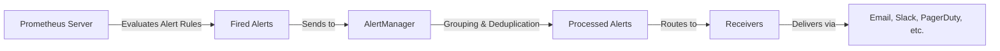

# Prometheus Alerting Overview

## Introduction

Alerting is a critical component of any monitoring system. While metrics collection and visualization help you understand your systems, alerts actively notify you when something requires attention. Prometheus provides a powerful and flexible alerting system that integrates seamlessly with its monitoring capabilities.

In this guide, you'll learn the fundamentals of Prometheus alerting, including how alert rules are defined, how AlertManager processes alerts, and how to configure notifications across various channels. Whether you're monitoring a small application or a complex distributed system, understanding Prometheus alerting will help you respond quickly to issues before they impact your users.

## Alerting Components in Prometheus

Prometheus alerting consists of two main components that work together:

1. **Prometheus Server**: Evaluates alert rules and generates alerts
2. **AlertManager**: Handles alert grouping, deduplication, silencing, inhibition, and sending notifications

Let's visualize how these components work together:



### Prometheus Server's Role

The Prometheus server is responsible for:
- Storing alert rule definitions
- Periodically evaluating metrics against these rules
- Generating alerts when conditions are met
- Sending fired alerts to the AlertManager

### AlertManager's Role

The AlertManager handles:
- Receiving alerts from one or more Prometheus servers
- Grouping similar alerts together
- Eliminating duplicate alerts
- Silencing alerts during maintenance windows
- Inhibiting lower-priority alerts when higher-priority alerts are active
- Routing alerts to appropriate notification channels

## Defining Alert Rules

In Prometheus, alert rules are defined using PromQL (Prometheus Query Language) and are typically stored in YAML files. Each rule has a name, a condition, and optional labels and annotations.

Here's a basic structure of an alert rule:

```yaml
groups:
  - name: example
    rules:
      - alert: HighCPULoad
        expr: 100 - (avg by(instance) (irate(node_cpu_seconds_total{mode="idle"}[5m])) * 100) > 80
        for: 5m
        labels:
          severity: warning
        annotations:
          summary: "High CPU Load (instance {{ $labels.instance }})"
          description: "CPU load is > 80%
  VALUE = {{ $value }}
  LABELS: {{ $labels }}"
```

Let's break down the key components:

- **alert**: The name of the alert, used in notifications and the Prometheus UI
- **expr**: A PromQL expression that determines when the alert should fire
- **for**: The duration the condition must be true before firing (prevents flapping)
- **labels**: Key-value pairs used for routing and classification
- **annotations**: Human-readable information to provide context about the alert

## Example Alert Rules

Let's look at some common alert rules for different scenarios:

### 1. Service Availability Alert

```yaml
- alert: ServiceDown
  expr: up{job="my-service"} == 0
  for: 2m
  labels:
    severity: critical
  annotations:
    summary: "Service {{ $labels.job }} is down"
    description: "Service {{ $labels.job }} on {{ $labels.instance }} has been down for more than 2 minutes."
```

This alert fires when a service being monitored (with job="my-service") reports as down for more than 2 minutes.

### 2. High Latency Alert

```yaml
- alert: HighRequestLatency
  expr: http_request_duration_seconds{quantile="0.9"} > 1
  for: 10m
  labels:
    severity: warning
  annotations:
    summary: "High request latency on {{ $labels.instance }}"
    description: "{{ $labels.instance }} has a 90th percentile latency of {{ $value }} seconds for the past 10 minutes."
```

This alerts when the 90th percentile of HTTP request durations exceeds 1 second for 10 minutes.

### 3. Disk Space Alert

```yaml
- alert: LowDiskSpace
  expr: (node_filesystem_avail_bytes / node_filesystem_size_bytes) * 100 < 10
  for: 5m
  labels:
    severity: warning
  annotations:
    summary: "Low disk space on {{ $labels.instance }}"
    description: "Disk usage is above 90% on {{ $labels.instance }} mounted at {{ $labels.mountpoint }}."
```

This rule triggers when available disk space falls below 10% for 5 minutes.

## Configuring AlertManager

The AlertManager is configured through a YAML file, typically named `alertmanager.yml`. The configuration defines how alerts should be processed and routed to receivers.

Here's a basic AlertManager configuration:

```yaml
global:
  resolve_timeout: 5m
  smtp_smarthost: 'smtp.example.org:587'
  smtp_from: 'alertmanager@example.org'
  smtp_auth_username: 'alertmanager'
  smtp_auth_password: 'password'

route:
  group_by: ['alertname', 'job']
  group_wait: 30s
  group_interval: 5m
  repeat_interval: 3h
  receiver: 'team-emails'
  routes:
  - match:
      severity: critical
    receiver: 'pager-duty'
    continue: true

receivers:
- name: 'team-emails'
  email_configs:
  - to: 'team@example.org'

- name: 'pager-duty'
  pagerduty_configs:
  - service_key: '<pagerduty-service-key>'
```

Let's break down the key sections:

### Global Configuration

The `global` section defines parameters that apply to all alerts, such as SMTP settings for email notifications and the timeout for resolving alerts.

### Routing Configuration

The `route` section defines how alerts are routed to receivers:

- **group_by**: Specifies how alerts should be grouped together
- **group_wait**: How long to wait to buffer alerts of the same group before sending
- **group_interval**: How long to wait before sending a batch of new alerts for a group
- **repeat_interval**: How long to wait before resending an alert
- **receiver**: The default receiver for all alerts
- **routes**: Sub-routes for specialized routing based on alert labels

### Receivers Configuration

The `receivers` section defines notification channels:

- Email
- Slack
- PagerDuty
- Webhook
- OpsGenie
- VictorOps
- And many others via integrations

## Practical Example: Complete Alerting Setup

Let's walk through a practical example of setting up alerting for a web application:

1. First, create an alert rules file (`prometheus-rules.yml`):

```yaml
groups:
- name: webapp-alerts
  rules:
  - alert: WebAppDown
    expr: up{job="webapp"} == 0
    for: 1m
    labels:
      severity: critical
    annotations:
      summary: "Web application is down"
      description: "The web application has been down for more than 1 minute."
  
  - alert: HighErrorRate
    expr: sum(rate(http_requests_total{job="webapp", status=~"5.."}[5m])) / sum(rate(http_requests_total{job="webapp"}[5m])) > 0.05
    for: 2m
    labels:
      severity: warning
    annotations:
      summary: "High error rate detected"
      description: "Error rate is above 5% ({{ $value | printf "%.2f" }}%) for the past 2 minutes."
      
  - alert: SlowResponses
    expr: histogram_quantile(0.95, sum(rate(http_request_duration_seconds_bucket{job="webapp"}[5m])) by (le)) > 2
    for: 5m
    labels:
      severity: warning
    annotations:
      summary: "Slow response times detected"
      description: "95th percentile of response times is above 2 seconds for the past 5 minutes."
```

2. Configure your Prometheus server to load these rules (`prometheus.yml`):

```yaml
global:
  scrape_interval: 15s
  evaluation_interval: 15s

rule_files:
  - "prometheus-rules.yml"

alerting:
  alertmanagers:
  - static_configs:
    - targets:
      - alertmanager:9093

scrape_configs:
  - job_name: 'prometheus'
    static_configs:
      - targets: ['localhost:9090']
  
  - job_name: 'webapp'
    static_configs:
      - targets: ['webapp:8080']
```

3. Configure AlertManager (`alertmanager.yml`):

```yaml
global:
  resolve_timeout: 5m
  slack_api_url: 'https://hooks.slack.com/services/YOUR/SLACK/WEBHOOK'

route:
  group_by: ['alertname', 'job']
  group_wait: 30s
  group_interval: 5m
  repeat_interval: 4h
  receiver: 'slack-notifications'
  routes:
  - match:
      severity: critical
    receiver: 'pager-duty-critical'
    continue: true

receivers:
- name: 'slack-notifications'
  slack_configs:
  - channel: '#alerts'
    send_resolved: true
    title: '{{ .CommonAnnotations.summary }}'
    text: '{{ .CommonAnnotations.description }}'
    
- name: 'pager-duty-critical'
  pagerduty_configs:
  - service_key: '<your-pagerduty-key>'
    send_resolved: true
```

4. Start all services (using Docker Compose for example):

```yaml
version: '3'
services:
  prometheus:
    image: prom/prometheus
    volumes:
      - ./prometheus.yml:/etc/prometheus/prometheus.yml
      - ./prometheus-rules.yml:/etc/prometheus/prometheus-rules.yml
    command:
      - '--config.file=/etc/prometheus/prometheus.yml'
    ports:
      - '9090:9090'
    
  alertmanager:
    image: prom/alertmanager
    volumes:
      - ./alertmanager.yml:/etc/alertmanager/alertmanager.yml
    command:
      - '--config.file=/etc/alertmanager/alertmanager.yml'
    ports:
      - '9093:9093'
    
  webapp:
    image: your-webapp-image
    ports:
      - '8080:8080'
```

## Alert States in Prometheus

Alerts in Prometheus have three possible states:

1. **Inactive**: The alert condition is not met
2. **Pending**: The alert condition is met, but hasn't been true for the duration specified in the `for` field
3. **Firing**: The alert condition has been true for the duration specified in the `for` field and is actively firing

You can view the current state of all alerts in the Prometheus UI under the "Alerts" tab:

```
http://your-prometheus-server:9090/alerts
```

## Best Practices for Prometheus Alerting

### 1. Follow the Three Alert Levels

Structure your alerts into three severity levels:

- **Critical**: Requires immediate human attention (pages someone)
- **Warning**: Requires attention soon but not immediately
- **Info**: Informational alerts that don't require immediate action

### 2. Use Meaningful Alert Names

Make alert names descriptive and specific:

```yaml
# Bad
- alert: HighCPU

# Good
- alert: InstanceHighCPUUsage
```

### 3. Add Useful Context in Annotations

Include actionable information in your alert annotations:

```yaml
annotations:
  summary: "High memory usage on {{ $labels.instance }}"
  description: "Memory usage is at {{ $value | printf '%.2f' }}%. Consider checking for memory leaks or increasing capacity."
  dashboard: "https://grafana.example.com/d/memory-dashboard"
  runbook: "https://wiki.example.com/runbooks/high-memory"
```

### 4. Set Appropriate Thresholds

Avoid alert fatigue by setting thresholds that balance sensitivity and specificity:

```yaml
# Too sensitive, might cause alert fatigue
- expr: cpu_usage_percent > 50

# Better balance
- expr: cpu_usage_percent > 80
  for: 15m
```

### 5. Use the 'for' Clause Appropriately

The `for` clause helps reduce noise from transient spikes:

```yaml
# Without 'for' - will trigger on brief spikes
- alert: HighErrorRate
  expr: error_rate > 0.01

# With 'for' - only triggers if sustained
- alert: HighErrorRate
  expr: error_rate > 0.01
  for: 5m
```

## Troubleshooting Alerts

If your alerts aren't working as expected, check the following:

1. **Alert Rules**: Verify your alert expressions in the Prometheus UI
2. **Alert States**: Check the "Alerts" section in the Prometheus UI
3. **AlertManager Status**: Check the "Status" > "AlertManager" section in Prometheus
4. **Connectivity**: Ensure Prometheus can connect to AlertManager
5. **Configuration Syntax**: Validate your YAML files with a YAML linter
6. **Logs**: Check logs from both Prometheus and AlertManager

## Summary

Prometheus alerting provides a powerful system for detecting issues in your infrastructure and applications. By defining PromQL-based alert rules in Prometheus and configuring routing and notification in AlertManager, you can create a comprehensive alerting strategy.

Key takeaways:
- Prometheus evaluates alert rules while AlertManager handles notification delivery
- Alert rules consist of a name, expression, duration, labels, and annotations
- AlertManager supports grouping, routing, and multiple notification channels
- Well-designed alerts should be actionable and avoid alert fatigue

## Additional Resources

- [Prometheus Alerting Documentation](https://prometheus.io/docs/alerting/latest/overview/)
- [AlertManager Documentation](https://prometheus.io/docs/alerting/latest/alertmanager/)
- [PromQL Documentation](https://prometheus.io/docs/prometheus/latest/querying/basics/)

## Exercises

1. **Basic Alert**: Create an alert rule that fires when a service is down for more than 1 minute.
2. **Advanced Expression**: Create an alert rule that detects when your application's error rate exceeds 5% over a 5-minute period.
3. **Routing Configuration**: Configure AlertManager to send critical alerts to PagerDuty and warning alerts to Slack.
4. **Alert Templates**: Create custom notification templates for different alert severity levels.
5. **Test Your Alerts**: Simulate conditions that would trigger your alerts to verify they work correctly.

By mastering Prometheus alerting, you'll be able to detect and respond to issues quickly, ensuring better reliability and performance for your systems.