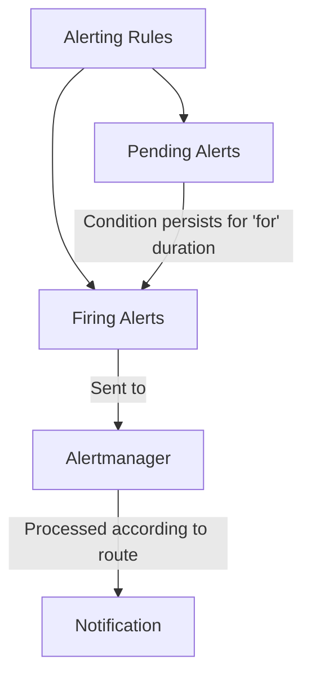

# Prometheus Alerting Rules

## Introduction

Alerting rules are a critical component of the Prometheus monitoring ecosystem. They allow you to define conditions that, when met, trigger alerts to notify you about potential issues in your systems. Unlike recording rules which pre-compute expressions, alerting rules are specifically designed to identify problematic situations and initiate notifications through Alertmanager.

In this guide, we'll explore how to create effective alerting rules in Prometheus, understand their syntax, and implement them in real-world scenarios. By the end, you'll be able to set up comprehensive alerting for your infrastructure.

## Understanding Alerting Rules

Alerting rules in Prometheus follow a declarative approach, where you define:

1. The condition to evaluate (a PromQL expression)
2. The duration the condition must be true before firing an alert
3. Labels to classify the alert
4. Annotations to provide human-readable details

When an alerting rule's condition is true for the specified duration, it transitions from a "pending" state to a "firing" state, at which point the alert is sent to Alertmanager.

## Basic Structure of Alerting Rules

Alerting rules are defined in YAML files with the following structure:

```yaml
groups:
  - name: example
    rules:
    - alert: HighCPULoad
      expr: node_cpu_seconds_total{mode="idle"} < 10
      for: 5m
      labels:
        severity: warning
      annotations:
        summary: "High CPU load detected"
        description: "CPU load is above 90% for more than 5 minutes."
```

Let's break down the components:

- `groups`: Rules are organized into named groups
- `rules`: List of individual alerting rules
- `alert`: The name of the alert
- `expr`: The PromQL expression that determines when the alert should fire
- `for`: Optional duration the condition must be true before firing
- `labels`: Additional labels for routing and classification
- `annotations`: Human-readable information about the alert

## Creating Your First Alerting Rule

Let's create a simple alerting rule that fires when an instance is down:

```yaml
groups:
  - name: instance_availability
    rules:
    - alert: InstanceDown
      expr: up == 0
      for: 1m
      labels:
        severity: critical
      annotations:
        summary: "Instance {{ $labels.instance }} down"
        description: "Instance {{ $labels.instance }} of job {{ $labels.job }} has been down for more than 1 minute."
```

This rule checks if the `up` metric (which Prometheus automatically generates for each target) equals 0, indicating the target is down. If this condition persists for 1 minute, an alert fires.

Notice the use of template variables like `{{ $labels.instance }}` in the annotations. These reference labels from the alert's time series and allow you to create dynamic alert messages.

## Configuring Prometheus to Load Alerting Rules

To use alerting rules, you need to configure Prometheus to load them. Add this to your `prometheus.yml`:

```yaml
rule_files:
  - "alert_rules.yml"
```

This tells Prometheus to load rules from the file `alert_rules.yml`.

## Advanced Alerting Rule Techniques

### Using Template Variables

Templates make your alerts more informative by including details from the alert context:

```yaml
annotations:
  summary: "High CPU on {{ $labels.instance }}"
  description: "CPU usage is {{ $value | printf \"%.2f\" }}% for 5 minutes."
```

Available variables:
- `$labels`: Labels from the alert's time series
- `$value`: The value that triggered the alert
- `$externalURL`: The external URL of Prometheus

### Multi-condition Alerts

For more complex scenarios, you can use PromQL to create sophisticated conditions:

```yaml
expr: (node_memory_MemFree_bytes + node_memory_Cached_bytes) / node_memory_MemTotal_bytes * 100 < 10
```

This expression alerts when free memory (including cache) falls below 10% of total memory.

### Alert Grouping and Inhibition

You can define relationships between alerts using labels:

```yaml
groups:
  - name: node_alerts
    rules:
    - alert: InstanceDown
      expr: up == 0
      for: 1m
      labels:
        severity: critical
        service: "{{ $labels.job }}"
      # ...

    - alert: HighCPULoad
      expr: 100 - (avg by(instance) (rate(node_cpu_seconds_total{mode="idle"}[5m])) * 100) > 95
      for: 5m
      labels:
        severity: warning
        service: "{{ $labels.job }}"
      # ...
```

By using consistent labels like `service`, Alertmanager can group related alerts together.

## Best Practices for Alerting Rules

### 1. Alert on Symptoms, Not Causes

Focus alerts on user-visible symptoms:

```yaml
# Better: Alert on high error rate (a symptom)
- alert: APIHighErrorRate
  expr: sum(rate(http_requests_total{status=~"5.."}[5m])) / sum(rate(http_requests_total[5m])) > 0.1
  for: 5m

# Avoid: Alert on specific causes
- alert: DatabaseConnectionPoolExhausted
  expr: db_connections_current / db_connections_max > 0.9
  for: 5m
```

### 2. Use Appropriate Thresholds

Set thresholds that balance between false positives and missed issues:

```yaml
# Multiple severity levels with different thresholds
- alert: HighCPUUsage
  expr: 100 - (avg by(instance) (rate(node_cpu_seconds_total{mode="idle"}[5m])) * 100) > 80
  for: 5m
  labels:
    severity: warning
  # ...

- alert: CriticalCPUUsage
  expr: 100 - (avg by(instance) (rate(node_cpu_seconds_total{mode="idle"}[5m])) * 100) > 95
  for: 5m
  labels:
    severity: critical
  # ...
```

### 3. Include Meaningful Context

Add useful information to help troubleshoot issues:

```yaml
annotations:
  summary: "Memory usage critical on {{ $labels.instance }}"
  description: "Memory usage is at {{ $value | printf \"%.2f\" }}%. Top memory consumers: {{ with printf \"sort_desc(topk(3, process_resident_memory_bytes{instance=\\\"%s\\\"}))\" $labels.instance | query }}{{ range . }}{{ .Labels.process_name }}: {{ .Value | printf \"%.2f\" }}MB, {{ end }}{{ end }}"
  dashboard: "https://grafana.example.com/d/abc123/node-metrics?var-instance={{ $labels.instance }}"
```

### 4. Apply Rate and Aggregation Functions Correctly

When alerting on counters, use rate() to handle resets:

```yaml
# Good: Using rate() to handle counter resets
- alert: HighErrorRate
  expr: rate(http_requests_total{status=~"5.."}[5m]) / rate(http_requests_total[5m]) > 0.1
  for: 5m

# Avoid: Direct comparison of counter values
- alert: TooManyErrors
  expr: http_requests_total{status=~"5.."} > 100
  for: 5m
```

## Real-world Examples

Let's explore some practical alerting rules for common scenarios:

### Service Availability Monitoring

```yaml
groups:
  - name: availability
    rules:
    - alert: ServiceDown
      expr: up == 0
      for: 1m
      labels:
        severity: critical
      annotations:
        summary: "Service {{ $labels.job }} is down"
        description: "{{ $labels.job }} on {{ $labels.instance }} has been down for more than 1 minute."

    - alert: HighLatency
      expr: histogram_quantile(0.95, sum(rate(http_request_duration_seconds_bucket[5m])) by (le, service)) > 1
      for: 5m
      labels:
        severity: warning
      annotations:
        summary: "High latency on {{ $labels.service }}"
        description: "Service {{ $labels.service }} has 95th percentile latency above 1s for 5 minutes."
```

### Resource Utilization Alerts

```yaml
groups:
  - name: resources
    rules:
    - alert: HostOutOfMemory
      expr: node_memory_MemAvailable_bytes / node_memory_MemTotal_bytes * 100 < 10
      for: 5m
      labels:
        severity: warning
      annotations:
        summary: "Host {{ $labels.instance }} is low on memory"
        description: "Node memory is filling up (< 10% left: {{ $value | printf \"%.2f\" }}%)."

    - alert: HostOutOfDiskSpace
      expr: (node_filesystem_avail_bytes{mountpoint="/"} / node_filesystem_size_bytes{mountpoint="/"}) * 100 < 10
      for: 5m
      labels:
        severity: warning
      annotations:
        summary: "Host {{ $labels.instance }} is low on disk space"
        description: "Disk space is filling up (< 10% left on {{ $labels.device }}, {{ $value | printf \"%.2f\" }}%)."

    - alert: HostHighCPULoad
      expr: 100 - (avg by(instance) (rate(node_cpu_seconds_total{mode="idle"}[5m])) * 100) > 80
      for: 5m
      labels:
        severity: warning
      annotations:
        summary: "Host {{ $labels.instance }} has high CPU load"
        description: "CPU load is > 80% for 5 minutes (current value: {{ $value | printf \"%.2f\" }}%)."
```

### Application-specific Alerts

For a web application:

```yaml
groups:
  - name: application
    rules:
    - alert: HighErrorRate
      expr: sum(rate(http_requests_total{status=~"5.."}[5m])) by (service) / sum(rate(http_requests_total[5m])) by (service) > 0.05
      for: 5m
      labels:
        severity: warning
      annotations:
        summary: "High error rate on {{ $labels.service }}"
        description: "Service {{ $labels.service }} has error rate above 5% ({{ $value | printf \"%.2f\" }}%)."

    - alert: ApplicationLatency
      expr: histogram_quantile(0.95, sum(rate(application_request_duration_seconds_bucket[5m])) by (le, endpoint)) > 2
      for: 5m
      labels:
        severity: warning
      annotations:
        summary: "Slow response time on {{ $labels.endpoint }}"
        description: "Endpoint {{ $labels.endpoint }} has 95th percentile latency above 2s."
```

## Visualizing Alerts

Prometheus provides a built-in UI to view the status of your alerting rules. You can access it at `/alerts` on your Prometheus server (e.g., `http://localhost:9090/alerts`).

Here's what you might see:



## Testing Alerting Rules

You can test alerting rules before deploying them using the `promtool` utility:

```bash
promtool check rules alert_rules.yml
```

This validates the syntax of your rules file.

To test if specific metrics would trigger an alert:

```bash
promtool test rules alert_test.yml
```

Where `alert_test.yml` contains test cases:

```yaml
rule_files:
  - alert_rules.yml

evaluation_interval: 1m

tests:
  - interval: 1m
    input_series:
      - series: 'up{job="api", instance="instance-1"}'
        values: '1 1 1 0 0 0'
    alert_rule_test:
      - eval_time: 4m
        alertname: InstanceDown
        exp_alerts:
          - exp_labels:
              job: api
              instance: instance-1
              severity: critical
```

## Summary

Alerting rules are a powerful feature in Prometheus that help you detect and respond to issues in your systems. By defining appropriate conditions, thresholds, and annotations, you can create an effective alerting strategy that balances between catching real problems and avoiding alert fatigue.

Key takeaways:

1. Alerting rules define conditions that, when met for a specified duration, trigger alerts
2. Rules include conditions (expressions), duration, labels, and annotations
3. Use template variables to create dynamic, informative alerts
4. Follow best practices like alerting on symptoms, setting appropriate thresholds, and including context
5. Test your rules before deploying them to production

## Exercises

1. Create an alerting rule that fires when a service's error rate exceeds 10% for 5 minutes.
2. Design alerts with multiple severity levels (warning, critical) for disk usage.
3. Create an alert that combines multiple metrics (e.g., high CPU and memory usage together).
4. Set up alerting for slow database queries in your application.

## Additional Resources

- [Prometheus Alerting Documentation](https://prometheus.io/docs/prometheus/latest/configuration/alerting_rules/)
- [Alertmanager Documentation](https://prometheus.io/docs/alerting/latest/alertmanager/)
- [PromQL Query Examples](https://prometheus.io/docs/prometheus/latest/querying/examples/)
- [Metric Types and Best Practices](https://prometheus.io/docs/practices/instrumentation/)