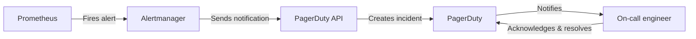

# PagerDuty Integration

## Introduction

In a production environment, promptly responding to critical issues is essential. While Prometheus excels at monitoring and detecting anomalies, you need a reliable way to notify on-call engineers about these issues. This is where PagerDuty comes in.

PagerDuty is an incident management platform that helps teams detect and respond to critical infrastructure problems quickly. When integrated with Prometheus, it enables you to:

- Route alerts to the right team members based on schedules and escalation policies
- Track incident acknowledgment and resolution
- Coordinate response efforts among team members
- Analyze incident patterns to improve system reliability

This guide will walk you through setting up a Prometheus integration with PagerDuty to streamline your incident response process.

## Prerequisites

Before starting this integration, you should have:

- A running Prometheus instance
- Alertmanager configured and connected to Prometheus
- A PagerDuty account (free trial or paid)
- Basic understanding of Prometheus alerting rules

## How PagerDuty Works with Prometheus

When integrating Prometheus with PagerDuty, the workflow typically follows this pattern:



## Setting Up the Integration

### Step 1: Create a Service in PagerDuty

1. Log in to your PagerDuty account
2. Navigate to **Services** and click **+ New Service**
3. Enter a name for your service (e.g., "Prometheus Alerts")
4. Select an escalation policy (or create a new one)
5. Under **Integration Settings**, select **Prometheus** as the integration type
6. Click **Add Service**
7. After creating the service, you'll receive an **Integration Key** - save this key as we'll need it for Alertmanager configuration

### Step 2: Configure Alertmanager for PagerDuty

Update your Alertmanager configuration file (`alertmanager.yml`) to include PagerDuty as a receiver:

```yaml
global:
  resolve_timeout: 5m

route:
  group_by: ['alertname', 'job']
  group_wait: 30s
  group_interval: 5m
  repeat_interval: 4h
  receiver: 'pagerduty-notifications'

receivers:
- name: 'pagerduty-notifications'
  pagerduty_configs:
  - service_key: '<YOUR_PAGERDUTY_INTEGRATION_KEY>'
    send_resolved: true
    details:
      custom_details: '{{ template "pagerduty.default.description" . }}'
```

Replace `<YOUR_PAGERDUTY_INTEGRATION_KEY>` with the integration key you received from PagerDuty.

### Step 3: Create Custom Templates (Optional)

For more detailed notifications, you can create custom templates in Alertmanager. Create a `templates.tmpl` file:

```
{{ define "pagerduty.default.description" }}
{{ range .Alerts }}
Alert: {{ .Labels.alertname }}
Severity: {{ .Labels.severity }}
Summary: {{ .Annotations.summary }}
Description: {{ .Annotations.description }}
{{ if .Labels.instance }}Instance: {{ .Labels.instance }}{{ end }}
{{ end }}
{{ end }}
```

Then reference this file in your Alertmanager configuration:

```yaml
global:
  resolve_timeout: 5m
  templates:
  - '/etc/alertmanager/templates.tmpl'

# Rest of the configuration...
```

### Step 4: Define Prometheus Alert Rules

Create alert rules in Prometheus that will trigger notifications to PagerDuty. Here's an example of a high CPU usage alert:

```yaml
groups:
- name: cpu-alerts
  rules:
  - alert: HighCPUUsage
    expr: 100 - (avg by(instance) (irate(node_cpu_seconds_total{mode="idle"}[5m])) * 100) > 85
    for: 5m
    labels:
      severity: critical
    annotations:
      summary: "High CPU usage on {{ $labels.instance }}"
      description: "CPU usage is above 85% for more than 5 minutes on {{ $labels.instance }}"
```

### Step 5: Reload Configurations

Reload your Alertmanager and Prometheus configurations:

```bash
curl -X POST http://localhost:9090/-/reload  # Prometheus
curl -X POST http://localhost:9093/-/reload  # Alertmanager
```

## Testing the Integration

To test if your integration is working correctly:

1. Trigger a test alert in Prometheus:

```bash
curl -X POST "http://localhost:9090/api/v1/admin/tsdb/snapshot"
```

2. Or, you can temporarily modify an alert rule to trigger on normal conditions

3. Verify in the PagerDuty dashboard that the incident was created

## Real-World Example: High-Latency API Monitoring

Let's create a practical example of monitoring API response times and alerting when they exceed acceptable thresholds:

1. First, set up Prometheus to scrape your API endpoint metrics:

```yaml
scrape_configs:
  - job_name: 'api-monitoring'
    metrics_path: '/metrics'
    scrape_interval: 15s
    static_configs:
      - targets: ['api.example.com:9090']
```

2. Define alert rules for high API latency:

```yaml
groups:
- name: api-alerts
  rules:
  - alert: APIHighLatency
    expr: histogram_quantile(0.95, sum(rate(http_request_duration_seconds_bucket{job="api-monitoring"}[5m])) by (le, endpoint)) > 0.5
    for: 10m
    labels:
      severity: warning
      team: api
    annotations:
      summary: "High API latency detected"
      description: "95th percentile of API response time is above 500ms for endpoint {{ $labels.endpoint }}"

  - alert: APICriticalLatency
    expr: histogram_quantile(0.95, sum(rate(http_request_duration_seconds_bucket{job="api-monitoring"}[5m])) by (le, endpoint)) > 1
    for: 5m
    labels:
      severity: critical
      team: api
    annotations:
      summary: "Critical API latency detected"
      description: "95th percentile of API response time is above 1s for endpoint {{ $labels.endpoint }}"
```

3. Configure routing in Alertmanager to send only critical alerts to PagerDuty:

```yaml
route:
  group_by: ['alertname', 'job']
  group_wait: 30s
  group_interval: 5m
  repeat_interval: 4h
  receiver: 'email-notifications'
  routes:
  - match:
      severity: critical
    receiver: 'pagerduty-notifications'

receivers:
- name: 'email-notifications'
  email_configs:
  - to: 'team@example.com'
    
- name: 'pagerduty-notifications'
  pagerduty_configs:
  - service_key: '<YOUR_PAGERDUTY_INTEGRATION_KEY>'
    send_resolved: true
```

This configuration ensures that only critical issues wake up your on-call engineers, while less severe problems are handled during business hours.

## Customizing PagerDuty Incidents

You can customize how PagerDuty incidents are created by including additional information in your Alertmanager configuration:

```yaml
receivers:
- name: 'pagerduty-notifications'
  pagerduty_configs:
  - service_key: '<YOUR_PAGERDUTY_INTEGRATION_KEY>'
    send_resolved: true
    description: '{{ .CommonLabels.alertname }}'
    client: 'Prometheus Alertmanager'
    client_url: 'https://alertmanager.example.com'
    details:
      firing: '{{ .Alerts.Firing | len }}'
      resolved: '{{ .Alerts.Resolved | len }}'
      summary: '{{ .CommonAnnotations.summary }}'
      description: '{{ .CommonAnnotations.description }}'
```

## Advanced: Using Event Transformers

PagerDuty supports Event Transformers that can modify the content of incoming alerts. This is useful for:

- Consolidating similar alerts
- Adding custom fields
- Changing severity based on time of day
- Filtering out certain types of alerts

You can configure Event Transformers in the PagerDuty web interface under your service settings.

## Troubleshooting

Common issues and their solutions:

1. **Alerts not reaching PagerDuty**
   - Verify the integration key is correct
   - Check Alertmanager logs for errors
   - Ensure your network allows outbound connections to PagerDuty's API

2. **Duplicate alerts in PagerDuty**
   - Review your `group_by` settings in Alertmanager
   - Check `repeat_interval` configuration

3. **Resolved alerts not clearing in PagerDuty**
   - Ensure `send_resolved: true` is set in your configuration

## Summary

Integrating Prometheus with PagerDuty creates a powerful incident management pipeline that helps your team respond quickly to critical issues. The key benefits include:

- Automated alert routing based on severity and type
- Structured on-call schedules and escalation policies
- Incident tracking and coordination
- Historical analysis of incidents for continuous improvement

By following this guide, you've learned how to:
- Set up a PagerDuty service for Prometheus alerts
- Configure Alertmanager to send notifications to PagerDuty
- Create meaningful alert rules that trigger appropriate responses
- Test and troubleshoot the integration

## Additional Resources

- [PagerDuty's official Prometheus integration guide](https://www.pagerduty.com/docs/guides/prometheus-integration-guide/)
- [Prometheus Alertmanager documentation](https://prometheus.io/docs/alerting/latest/alertmanager/)
- [PagerDuty API documentation](https://developer.pagerduty.com/docs/ZG9jOjExMDI5NTgx-overview)

## Exercises

1. Set up a test environment with Prometheus and Alertmanager
2. Create a free PagerDuty account and integrate it with your test environment
3. Define custom alert rules for metrics that matter to your application
4. Configure different routing rules based on alert severity
5. Test the end-to-end flow by triggering test alerts