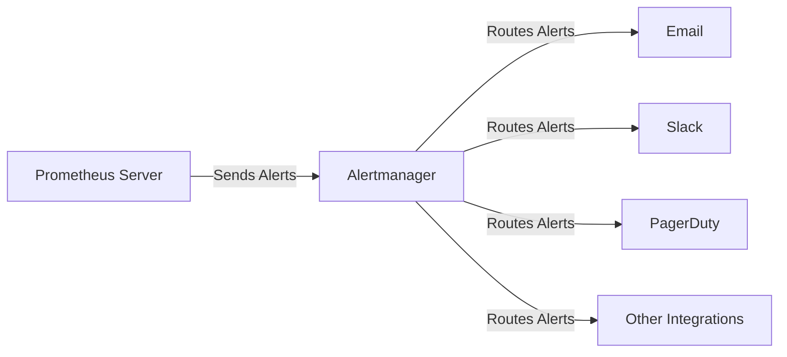

# Alert Manager Configuration

## Introduction

Alertmanager is a critical component in the Prometheus ecosystem that handles alerts sent by client applications such as the Prometheus server. It takes care of deduplicating, grouping, and routing alerts to the correct receiver integration such as email, Slack, or PagerDuty. Additionally, it handles silencing and inhibition of alerts to reduce noise and alert fatigue.

In this guide, we'll explore how to configure Alertmanager effectively to ensure your team receives the right alerts at the right time through the right channels.

## Understanding Alertmanager's Role

Before diving into configuration, let's understand where Alertmanager fits in the Prometheus ecosystem:



When an alert rule is triggered in Prometheus, it sends the alert to Alertmanager, which then processes it according to its configuration to determine:

- How to group similar alerts
- Where to send the notification
- When to silence or inhibit certain alerts
- How to handle repeated notifications

## Basic Configuration Structure

Alertmanager's configuration is defined in a YAML file, typically named `alertmanager.yml`. Let's look at the basic structure:

```yaml
global:
  # Global configuration parameters that apply to all other sections
  
templates:
  # Templates for notifications
  
route:
  # The routing tree for notifications
  
receivers:
  # The different receiving endpoints
  
inhibit_rules:
  # Rules for inhibiting certain alerts when others are firing
  
time_intervals:
  # Time intervals that can be used in routes
```

## Global Configuration

The `global` section defines parameters that apply as defaults across the entire configuration:

```yaml
global:
  resolve_timeout: 5m
  smtp_from: 'alertmanager@example.org'
  smtp_smarthost: 'smtp.example.org:587'
  smtp_auth_username: 'alertmanager'
  smtp_auth_password: 'password'
  slack_api_url: 'https://hooks.slack.com/services/XXXXXXXXX/XXXXXXXXX/XXXXXXXXXXXXXXXXXXXXXXXX'
  pagerduty_url: 'https://events.pagerduty.com/v2/enqueue'
```

Key parameters include:

- `resolve_timeout`: How long to wait before resolving an alert when it's no longer firing
- Integration-specific settings like SMTP for email or API URLs for services like Slack

## Configuring Routes

The routing tree is the heart of Alertmanager configuration. It determines how alerts are grouped and which receiver should get which alerts.

```yaml
route:
  # The root route with common parameters
  group_by: ['alertname', 'cluster', 'service']
  group_wait: 30s
  group_interval: 5m
  repeat_interval: 4h
  receiver: 'team-emails'
  
  # Child routes for specific cases
  routes:
  - match:
      severity: critical
    receiver: 'team-pagers'
    continue: true
    
  - match:
      service: database
    receiver: 'database-team'
    
  - match_re:
      service: ^(frontend|backend)$
    receiver: 'web-team'
```

Let's break down these parameters:

- `group_by`: Groups alerts with matching labels, reducing notification noise
- `group_wait`: How long to wait to buffer alerts of the same group before sending
- `group_interval`: How long to wait before sending a notification about new alerts added to a group
- `repeat_interval`: How long to wait before resending an alert notification if it's still firing
- `receiver`: The default receiver for this route
- `routes`: Child routes with specific matching criteria
- `match`/`match_re`: Match labels exactly or with regular expressions
- `continue`: If true, continue matching sibling routes even after this one matches

## Setting Up Receivers

Receivers define where notifications are sent:

```yaml
receivers:
- name: 'team-emails'
  email_configs:
  - to: 'team@example.org'
    send_resolved: true
    
- name: 'team-pagers'
  pagerduty_configs:
  - service_key: '<pagerduty-service-key>'
    send_resolved: true
  
- name: 'web-team'
  slack_configs:
  - channel: '#web-alerts'
    send_resolved: true
    title: '{{ template "slack.title" . }}'
    text: '{{ template "slack.text" . }}'
```

Each receiver can have multiple configurations of the same type or mix different types. Common receiver types include:

- `email_configs`: For email notifications
- `slack_configs`: For Slack notifications
- `pagerduty_configs`: For PagerDuty notifications
- `webhook_configs`: For custom webhook integrations
- `victorops_configs`: For VictorOps notifications
- `pushover_configs`: For Pushover notifications

## Inhibition Rules

Inhibition rules allow you to suppress notifications for certain alerts when other alerts are already firing, which helps reduce alert fatigue:

```yaml
inhibit_rules:
- source_match:
    severity: 'critical'
  target_match:
    severity: 'warning'
  equal: ['alertname', 'cluster', 'service']
```

This example inhibits all warning alerts that have the same `alertname`, `cluster`, and `service` labels as critical alerts that are already firing.

## Time-Based Routing with Time Intervals

Time intervals let you define specific time periods that can be used in routing:

```yaml
time_intervals:
- name: workdays
  time_intervals:
  - weekdays: ['monday:friday']
    location: 'America/New_York'
    
- name: workhours
  time_intervals:
  - times:
    - start_time: '09:00'
      end_time: '17:00'
    weekdays: ['monday:friday']
    location: 'America/New_York'
```

You can then use these in your routes:

```yaml
route:
  # ...other configuration...
  routes:
  - match:
      severity: critical
    receiver: 'team-pagers'
    
  - match:
      severity: warning
    receiver: 'team-emails'
    active_time_intervals:
    - workhours
```

This ensures warning alerts only trigger the 'team-emails' receiver during work hours.

## Templates for Notification Customization

Templates allow you to customize the format of your notifications:

```yaml
templates:
- '/etc/alertmanager/templates/*.tmpl'
```

A simple template file (`email.tmpl`) might look like:

```
{{ define "email.subject" }}
[{{ .Status | toUpper }}{{ if eq .Status "firing" }}:{{ .Alerts.Firing | len }}{{ end }}] {{ .GroupLabels.SortedPairs.Values | join " " }}
{{ end }}

{{ define "email.text" }}
{{ if gt (len .Alerts.Firing) 0 }}
Firing Alerts:
{{ range .Alerts.Firing }}
- {{ .Labels.alertname }}: {{ .Annotations.description }}
{{ end }}
{{ end }}
{{ if gt (len .Alerts.Resolved) 0 }}
Resolved Alerts:
{{ range .Alerts.Resolved }}
- {{ .Labels.alertname }}: {{ .Annotations.description }}
{{ end }}
{{ end }}
{{ end }}
```

## Complete Example Configuration

Here's a more complete example configuration that ties everything together:

```yaml
global:
  resolve_timeout: 5m
  smtp_from: 'alertmanager@example.org'
  smtp_smarthost: 'smtp.example.org:587'
  smtp_auth_username: 'alertmanager'
  smtp_auth_password: 'password'
  slack_api_url: 'https://hooks.slack.com/services/XXXXXXXXX/XXXXXXXXX/XXXXXXXXXXXXXXXXXXXXXXXX'

templates:
- '/etc/alertmanager/templates/*.tmpl'

route:
  group_by: ['alertname', 'cluster', 'service']
  group_wait: 30s
  group_interval: 5m
  repeat_interval: 4h
  receiver: 'team-emails'
  
  routes:
  - match:
      severity: critical
    receiver: 'team-pagers'
    group_wait: 10s
    repeat_interval: 1h
    
  - match:
      service: database
    receiver: 'database-team'
    group_by: ['alertname', 'instance', 'cluster']
    
  - match_re:
      service: ^(frontend|backend)$
    receiver: 'web-team'
    active_time_intervals:
    - workhours

receivers:
- name: 'team-emails'
  email_configs:
  - to: 'team@example.org'
    send_resolved: true
    
- name: 'team-pagers'
  pagerduty_configs:
  - service_key: '<pagerduty-service-key>'
    send_resolved: true
  slack_configs:
  - channel: '#alerts-critical'
    send_resolved: true
  
- name: 'database-team'
  email_configs:
  - to: 'database-team@example.org'
    send_resolved: true
  slack_configs:
  - channel: '#db-alerts'
    send_resolved: true
    
- name: 'web-team'
  slack_configs:
  - channel: '#web-alerts'
    send_resolved: true

inhibit_rules:
- source_match:
    severity: 'critical'
  target_match:
    severity: 'warning'
  equal: ['alertname', 'cluster', 'service']

time_intervals:
- name: workhours
  time_intervals:
  - times:
    - start_time: '09:00'
      end_time: '17:00'
    weekdays: ['monday:friday']
    location: 'America/New_York'
```

## Running and Verifying Alertmanager

To run Alertmanager with your configuration:

```bash
alertmanager --config.file=/path/to/alertmanager.yml
```

You can verify your configuration without starting Alertmanager using:

```bash
amtool check-config /path/to/alertmanager.yml
```

This will validate your configuration file and report any errors.

## Best Practices for Alertmanager Configuration

When setting up your Alertmanager, consider these best practices:

1. **Group related alerts**: Use meaningful `group_by` parameters to reduce notification noise
2. **Set appropriate timing parameters**:
   - Use shorter `group_wait` for critical alerts
   - Use longer `repeat_interval` for non-critical alerts
3. **Route based on severity**: Route critical alerts to high-priority channels like pagers
4. **Use inhibition rules**: Suppress less important alerts when critical alerts are active
5. **Implement time-based routing**: Don't wake people up for non-critical issues
6. **Test your configuration**: Use `amtool` to verify configuration and test alert routing

## Practical Example: Multi-Team Setup

Let's look at a practical example for an organization with multiple teams:

```yaml
route:
  receiver: 'default-receiver'
  group_by: ['alertname', 'job']
  routes:
  - match:
      team: infrastructure
    receiver: 'infrastructure-team'
    routes:
    - match:
        severity: critical
      receiver: 'infrastructure-pager'
  
  - match:
      team: application
    receiver: 'application-team'
    routes:
    - match:
        severity: critical
      receiver: 'application-pager'
      
  - match:
      team: database
    receiver: 'database-team'
    routes:
    - match:
        severity: critical
      receiver: 'database-pager'
```

This configuration:
1. Groups alerts by `alertname` and `job`
2. Routes alerts to teams based on the `team` label
3. For each team, routes critical alerts to a pager receiver

## Summary

Alertmanager is a powerful tool for managing alerts in your monitoring system. By configuring it properly, you can ensure the right people receive the right notifications at the right time, reducing alert fatigue and improving response times to critical issues.

In this guide, we've covered:
- The basic structure of Alertmanager configuration
- How to configure routing trees for alert notification
- Setting up different types of receivers
- Using inhibition rules to reduce notification noise
- Implementing time-based routing
- Customizing notification templates
- Best practices for effective alerting

With these tools, you can build an alerting system that balances the need for timely notifications with the importance of not overwhelming your team with unnecessary alerts.

## Additional Resources

- [Official Alertmanager Documentation](https://prometheus.io/docs/alerting/latest/alertmanager/)
- [Alertmanager Configuration](https://prometheus.io/docs/alerting/latest/configuration/)
- [amtool Documentation](https://github.com/prometheus/alertmanager#amtool)

## Exercises

1. **Basic Configuration**: Create a simple Alertmanager configuration that sends all alerts to your email address.
2. **Advanced Routing**: Set up a routing tree that sends critical alerts to a Slack channel during work hours and to PagerDuty after hours.
3. **Template Customization**: Create a custom template for Slack notifications that includes alert details and links to your dashboards.
4. **Inhibition Rules**: Configure inhibition rules that suppress warning alerts when related critical alerts are firing.
5. **Time-Based Routing**: Set up different routing behaviors for weekdays versus weekends.