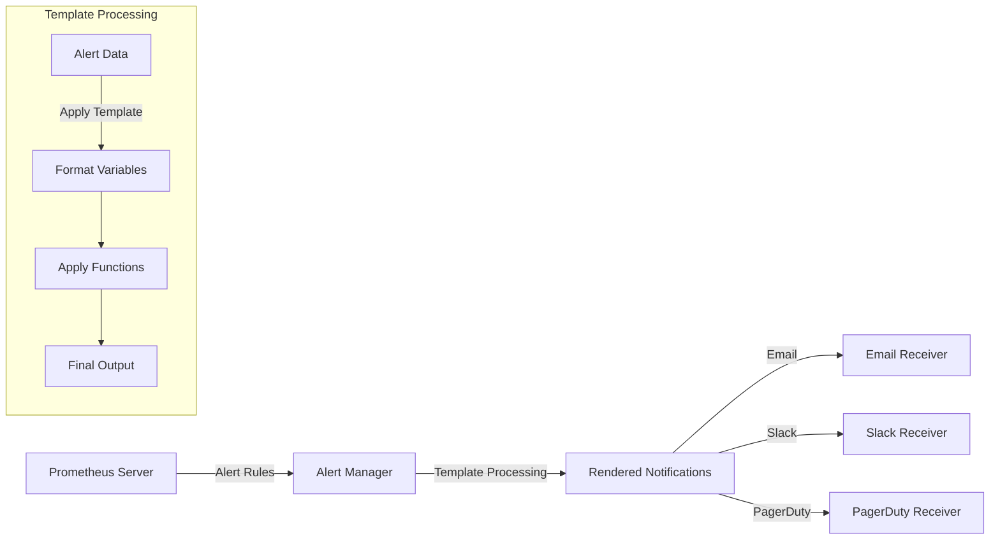

# Alert Templates

## Introduction

Alert templates are a powerful feature in Prometheus that allow you to customize the format and content of your alert notifications. By defining templates, you can include relevant information, context, and even troubleshooting guidance directly in your alerts. Well-designed alert templates help operators quickly understand and respond to issues, reducing mean time to resolution (MTTR) and improving system reliability.

In this guide, we'll explore how to create effective alert templates in Prometheus, understand their syntax, and see examples of templates in action.

## Understanding Alert Templates

Alert templates in Prometheus use the Go templating language to format alert notifications. These templates can access various data from the alert, including labels, annotations, and values, allowing you to create rich, informative notifications.

### Template Basics

Prometheus alert templates use the following basic syntax:

```yaml
annotations:
  summary: "{{ .Labels.instance }} is down"
  description: "Instance {{ .Labels.instance }} has been down for more than 5 minutes."
```

In this example:
- `{{ .Labels.instance }}` is a template expression that will be replaced with the actual instance label value
- The template is defined within alert rule annotations

## Key Template Variables

When creating alert templates, you have access to several variables:

| Variable       | Description                                  |
|----------------|----------------------------------------------|
| `.Labels`      | All labels attached to the alert             |
| `.Annotations` | All annotations defined for the alert        |
| `.StartsAt`    | Timestamp when the alert started firing      |
| `.EndsAt`      | Timestamp when the alert will end (if known) |
| `.Value`       | The value of the alert expression            |
| `.Fingerprint` | A unique identifier for the alert            |

## Creating Basic Alert Templates

Let's create a basic alert template for a high CPU usage alert:

```yaml
groups:
- name: cpu-alerts
  rules:
  - alert: HighCPUUsage
    expr: 100 - (avg by(instance) (irate(node_cpu_seconds_total{mode="idle"}[5m])) * 100) > 80
    for: 5m
    labels:
      severity: warning
    annotations:
      summary: "High CPU usage on {{ $labels.instance }}"
      description: "CPU usage is above 80% for 5 minutes (current value: {{ printf \"%.2f\" $value }}%)"
```

When this alert fires, the template expressions will be evaluated and replaced with actual values:

```
[WARNING] High CPU usage on web-server-01
CPU usage is above 80% for 5 minutes (current value: 92.45%)
```

## Advanced Template Techniques

### Conditional Content

You can include conditional content in your templates using Go template conditionals:

```yaml
description: >-
  {{ if gt $value 90.0 -}}
    CRITICAL: CPU usage is extremely high!
  {{- else -}}
    WARNING: CPU usage is elevated.
  {{- end }}
  Current value: {{ printf "%.2f" $value }}%
```

### Formatting Numbers

For better readability, you can format numerical values using printf:

```yaml
summary: "Disk space {{ printf \"%.1f\" $value }}% full on {{ $labels.instance }}"
```

### Including Links to Dashboards

Templates can include links to dashboards or documentation:

```yaml
description: >-
  Memory usage is high on {{ $labels.instance }}.
  View dashboard: https://grafana.example.com/d/memory?var-instance={{ $labels.instance }}
```

## Template Functions

Prometheus provides several built-in functions for templates:

| Function       | Description               | Example                                                                |
|----------------|---------------------------|------------------------------------------------------------------------|
| `printf`       | Format strings and values | `{{ printf "%.2f" $value }}`                                           |
| `query`        | Execute PromQL queries    | `{{ query "up{instance='web-01'}"                \| first \| value }}` |
| `reReplaceAll` | Regexp replacement        | `{{ reReplaceAll ".*_(.+)" "$1" $labels.name }}`                       |
| `toUpper`      | Convert to uppercase      | `{{ $labels.severity                             \| toUpper }}`        |
| `toLower`      | Convert to lowercase      | `{{ $labels.severity                             \| toLower }}`        |
| `join`         | Join string slices        | `{{ join $labels.tags "," }}`                                          |

## Practical Examples

### Network Monitoring Alert

```yaml
- alert: NetworkPacketLoss
  expr: rate(node_network_receive_drop_total[5m]) > 100
  for: 2m
  labels:
    severity: critical
    team: network
  annotations:
    summary: "Network packet loss detected on {{ $labels.instance }}"
    description: >-
      Interface {{ $labels.device }} on {{ $labels.instance }} is dropping packets.
      Current drop rate: {{ printf "%.0f" $value }} packets/sec.
      
      Possible causes:
      - Network interface saturation
      - Hardware issues
      - Driver problems
      
      Suggested actions:
      - Check network traffic on the interface
      - Verify interface errors with `ip -s link show {{ $labels.device }}`
      - Inspect network hardware
```

### Service Health Check

```yaml
- alert: ServiceDown
  expr: up{job="api-service"} == 0
  for: 1m
  labels:
    severity: critical
    service: api
  annotations:
    summary: "API service down on {{ $labels.instance }}"
    description: >-
      The API service on {{ $labels.instance }} has been down for more than 1 minute.
      
      Last checked: {{ $labels.timestamp }}
      
      Impact: Customer API requests will fail
      
      Recovery steps:
      1. Check service logs: `journalctl -u api-service`
      2. Verify dependencies: database, cache, external services
      3. Restart if needed: `systemctl restart api-service`
      4. Escalate to on-call developer if service fails to recover
```

## Alert Template Best Practices

1. **Be specific and clear**: Include the exact service/component affected and the nature of the problem.

2. **Include context**: Add relevant metrics, thresholds, and duration information.

3. **Add actionable information**: Include specific commands or links that can help resolve the issue.

4. **Prioritize information**: Put the most critical information at the beginning of the template.

5. **Use consistent formatting**: Adopt a standard format across all alerts for easy readability.

6. **Avoid alert fatigue**: Don't include excessive information that might overwhelm responders.

7. **Test templates**: Verify that templates render correctly before deploying to production.

## Alert Template Testing

You can test your alert templates using the Alertmanager API endpoint:

```bash
curl -XPOST -H "Content-Type: application/json" -d '{
  "receiver": "team-infra",
  "status": "firing",
  "alerts": [
    {
      "status": "firing",
      "labels": {
        "instance": "test-server-01",
        "job": "node",
        "severity": "critical"
      },
      "annotations": {
        "summary": "Test alert",
        "description": "This is a test alert"
      },
      "startsAt": "2023-01-10T10:00:00Z",
      "endsAt": "2023-01-10T11:00:00Z",
      "generatorURL": "http://prometheus.example.com"
    }
  ]
}' http://alertmanager:9093/api/v1/alerts
```

## Visualizing Alert Template Data Flow

Below is a diagram showing how alert templates are processed in the Prometheus ecosystem:



## Complete Example: Full Alerting Configuration

Here's a complete example of a Prometheus alerting configuration with templates:

```yaml
groups:
- name: example
  rules:
  - alert: InstanceDown
    expr: up == 0
    for: 5m
    labels:
      severity: critical
    annotations:
      summary: "Instance {{ $labels.instance }} down"
      description: >-
        Instance {{ $labels.instance }} of job {{ $labels.job }} has been down for more than 5 minutes.
        
        Impact: Services dependent on this instance may be affected.
        
        Environment: {{ $labels.env }}
        Region: {{ $labels.region }}
        
        Troubleshooting:
        - Check instance status in cloud provider console
        - Verify network connectivity
        - Check for recent deployments or changes
        
        Escalation: If unable to recover within 15 minutes, contact the on-call engineer.

  - alert: HighMemoryUsage
    expr: (node_memory_MemTotal_bytes - (node_memory_MemFree_bytes + node_memory_Cached_bytes + node_memory_Buffers_bytes)) / node_memory_MemTotal_bytes * 100 > 90
    for: 15m
    labels:
      severity: warning
      team: infrastructure
    annotations:
      summary: "High memory usage on {{ $labels.instance }}"
      description: >-
        Memory usage on {{ $labels.instance }} is above 90% for 15 minutes.
        Current usage: {{ printf "%.1f" $value }}%
        
        Top memory consuming processes:
        {{ with printf "node_top_processes{instance=\"%s\",sort=\"rss\"}" $labels.instance | query }}
          {{ range . }}
            - {{ .Labels.process }}: {{ .Value }} MB
          {{ end }}
        {{ end }}
```

## Summary

Alert templates are a crucial part of effective monitoring with Prometheus. They allow you to transform raw alerts into informative, actionable notifications that help responders quickly understand and resolve issues. By customizing your templates with relevant context, metrics, and troubleshooting guidance, you can significantly improve your team's incident response process.

Key takeaways:

- Alert templates use Go templating syntax to format notifications
- Templates can access alert labels, annotations, and values
- Well-designed templates include specific information about the issue, context, and actionable steps
- Templates can be customized for different alert severity levels and types
- Consistent template formatting across your alerting rules improves readability and response time

## Additional Resources

- [Official Prometheus Documentation on Alerting](https://prometheus.io/docs/alerting/latest/configuration/)
- [Go Template Documentation](https://golang.org/pkg/text/template/)
- [Alertmanager Documentation](https://prometheus.io/docs/alerting/latest/alertmanager/)

## Exercises

1. Create an alert template for a service that includes links to relevant dashboards and runbooks.

2. Design a template that formats different information based on the alert severity level.

3. Develop a template that includes querying additional metrics to provide context about the alert.

4. Create a template that includes a graph URL showing the problematic metric over time.

5. Design a comprehensive template system for a multi-service application that maintains consistency while providing service-specific details.