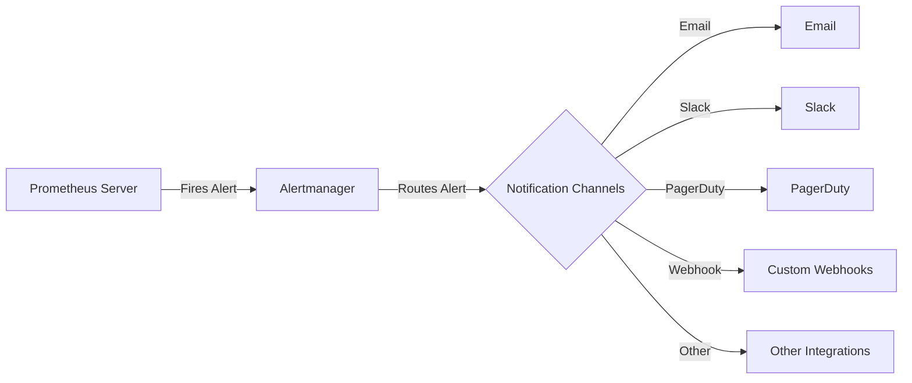

# Alert Notification Channels

## Introduction

Alert notification channels are the pathways through which Prometheus and Alertmanager deliver alert notifications to end-users or systems. When an alert is triggered, Alertmanager processes it and sends notifications through configured channels to ensure the right people or systems are informed about the issue.

In this guide, we'll explore different notification channels available in Alertmanager, how to configure them, and best practices for implementing an effective notification strategy.

## Understanding Alert Notification Flow

Before diving into specific channels, let's understand how alerts flow through the Prometheus ecosystem:



1. Prometheus evaluates alert rules against collected metrics
2. When alert conditions are met, Prometheus fires an alert to Alertmanager
3. Alertmanager processes the alert according to its configuration
4. Alertmanager routes the alert to appropriate notification channels
5. The notification is delivered to end-users or systems

## Configuring Alertmanager

Alertmanager configuration is done through a YAML file. Here's a basic structure that includes notification channels:

```yaml
global:
  resolve_timeout: 5m
  # Default notification channel configurations

route:
  group_by: ['alertname', 'job']
  group_wait: 30s
  group_interval: 5m
  repeat_interval: 4h
  receiver: 'default-receiver'
  
  routes:
    - matchers:
        - severity="critical"
      receiver: 'team-critical'
      continue: true

receivers:
  - name: 'default-receiver'
    email_configs:
      - to: 'alerts@example.com'
  
  - name: 'team-critical'
    slack_configs:
      - channel: '#critical-alerts'
        api_url: 'https://hooks.slack.com/services/XXXXX/YYYYY/ZZZZZ'
```

## Common Notification Channels

### Email Notifications

Email is one of the most basic notification channels. It's easy to set up and widely accessible.

```yaml
receivers:
  - name: 'email-notifications'
    email_configs:
      - to: 'team@example.com'
        from: 'alertmanager@example.com'
        smarthost: 'smtp.example.com:587'
        auth_username: 'alertmanager'
        auth_password: 'password'
        auth_identity: 'alertmanager@example.com'
        auth_secret: 'password'
        send_resolved: true
        html: '{{ template "email.default.html" . }}'
        headers:
          subject: '{{ template "email.default.subject" . }}'
```

### Slack Integration

Slack is popular for team-based alert notifications due to its real-time communication capabilities.

```yaml
receivers:
  - name: 'slack-notifications'
    slack_configs:
      - channel: '#alerts'
        api_url: 'https://hooks.slack.com/services/XXXXX/YYYYY/ZZZZZ'
        send_resolved: true
        icon_url: 'https://avatars3.githubusercontent.com/u/3380462'
        title: '{{ template "slack.default.title" . }}'
        text: '{{ template "slack.default.text" . }}'
        actions:
          - type: 'button'
            text: 'Runbook 📚'
            url: '{{ (index .Alerts 0).Annotations.runbook }}'
```

### PagerDuty

PagerDuty is ideal for critical alerts that require immediate attention and on-call management.

```yaml
receivers:
  - name: 'pagerduty-notifications'
    pagerduty_configs:
      - service_key: 'your_pagerduty_service_key'
        send_resolved: true
        description: '{{ template "pagerduty.default.description" . }}'
        details:
          severity: '{{ .CommonLabels.severity }}'
          summary: '{{ .CommonAnnotations.summary }}'
          runbook_url: '{{ .CommonAnnotations.runbook }}'
```

### Webhook

Webhooks allow for custom integrations with other systems or services.

```yaml
receivers:
  - name: 'webhook-notifications'
    webhook_configs:
      - url: 'http://example.com/webhook'
        send_resolved: true
        http_config:
          bearer_token: 'token'
```

### OpsGenie

OpsGenie provides advanced alert management with escalation policies and on-call scheduling.

```yaml
receivers:
  - name: 'opsgenie-notifications'
    opsgenie_configs:
      - api_key: 'your_opsgenie_api_key'
        message: '{{ template "opsgenie.default.message" . }}'
        description: '{{ template "opsgenie.default.description" . }}'
        source: 'prometheus'
        tags: '{{ range .CommonLabels.SortedPairs }}{{ .Name }}={{ .Value }} {{ end }}'
        note: 'Alert triggered by Prometheus'
```

## Advanced Configuration

### Templating Notifications

Alertmanager supports templating to customize the content of notifications:

```yaml
templates:
  - '/etc/alertmanager/templates/*.tmpl'
```

Example template file (`/etc/alertmanager/templates/custom.tmpl`):

```
{{ define "slack.custom.title" }}
[{{ .Status | toUpper }}{{ if eq .Status "firing" }}:{{ .Alerts.Firing | len }}{{ end }}] {{ .CommonLabels.alertname }}
{{ end }}

{{ define "slack.custom.text" }}
{{ range .Alerts }}
*Alert:* {{ .Annotations.summary }}
*Description:* {{ .Annotations.description }}
*Severity:* {{ .Labels.severity }}
*Started:* {{ .StartsAt | since }}
{{ end }}
{{ end }}
```

Usage in configuration:

```yaml
receivers:
  - name: 'slack-custom'
    slack_configs:
      - channel: '#alerts'
        api_url: 'https://hooks.slack.com/services/XXXXX/YYYYY/ZZZZZ'
        title: '{{ template "slack.custom.title" . }}'
        text: '{{ template "slack.custom.text" . }}'
```

### Routing and Grouping

Routing ensures alerts reach the right teams, while grouping prevents notification storms:

```yaml
route:
  group_by: ['alertname', 'cluster', 'service']
  group_wait: 30s        # Wait time to buffer alerts of same group
  group_interval: 5m     # Wait time before sending a new alert for group
  repeat_interval: 4h    # Minimum time between re-sending 
  receiver: 'default-receiver'
  
  routes:
    - matchers:
        - severity="critical"
      receiver: 'team-sre'
      routes:
        - matchers:
            - service="database"
          receiver: 'database-team'
    
    - matchers:
        - severity="warning"
      receiver: 'team-devs'
```

## Implementing Notification Channels: Step-by-Step Example

Let's walk through setting up a complete notification system:

1. First, create an Alertmanager configuration file:

```yaml
global:
  resolve_timeout: 5m
  smtp_smarthost: 'smtp.gmail.com:587'
  smtp_from: 'alertmanager@example.com'
  smtp_auth_username: 'alertmanager@example.com'
  smtp_auth_password: 'password'
  slack_api_url: 'https://hooks.slack.com/services/XXXXX/YYYYY/ZZZZZ'

templates:
  - '/etc/alertmanager/templates/*.tmpl'

route:
  group_by: ['alertname', 'job', 'severity']
  group_wait: 30s
  group_interval: 5m
  repeat_interval: 4h
  receiver: 'email-team'
  
  routes:
    - matchers:
        - severity="critical"
      receiver: 'slack-sre'
      continue: true
    
    - matchers:
        - service=~"api|frontend"
      receiver: 'team-app'
    
    - matchers:
        - service="database"
      receiver: 'team-db'

inhibit_rules:
  - source_matchers:
      - severity="critical"
    target_matchers:
      - severity="warning"
    equal: ['alertname', 'cluster', 'service']

receivers:
  - name: 'email-team'
    email_configs:
      - to: 'team@example.com'
        send_resolved: true
  
  - name: 'slack-sre'
    slack_configs:
      - channel: '#sre-alerts'
        send_resolved: true
        title: '{{ template "slack.default.title" . }}'
        text: '{{ template "slack.default.text" . }}'
  
  - name: 'team-app'
    slack_configs:
      - channel: '#app-alerts'
        send_resolved: true
    email_configs:
      - to: 'app-team@example.com'
        send_resolved: true
  
  - name: 'team-db'
    pagerduty_configs:
      - service_key: 'db_team_pagerduty_key'
        send_resolved: true
    email_configs:
      - to: 'db-team@example.com'
        send_resolved: true
```

2. Create a template file for customized notifications:

```
# /etc/alertmanager/templates/custom.tmpl

{{ define "slack.custom.title" }}
[{{ .Status | toUpper }}] {{ .CommonLabels.alertname }}
{{ end }}

{{ define "slack.custom.text" }}
{{ range .Alerts }}
*Alert:* {{ .Annotations.summary }}
*Description:* {{ .Annotations.description }}
*Severity:* {{ .Labels.severity }}
*Service:* {{ .Labels.service }}
*Started:* {{ .StartsAt.Format "2006-01-02 15:04:05" }}
*Metrics:* `{{ .GeneratorURL }}`
{{ end }}
{{ end }}
```

3. Start Alertmanager with this configuration:

```bash
alertmanager --config.file=/etc/alertmanager/alertmanager.yml
```

## Real-World Examples

### Notification Channel for Different Environments

```yaml
route:
  receiver: 'default'
  routes:
    - matchers:
        - environment="production"
      receiver: 'production-alerts'
    - matchers:
        - environment="staging"
      receiver: 'staging-alerts'
    - matchers:
        - environment="development"
      receiver: 'development-alerts'

receivers:
  - name: 'default'
    email_configs:
      - to: 'alerts@example.com'
  
  - name: 'production-alerts'
    pagerduty_configs:
      - service_key: 'prod_pagerduty_key'
    slack_configs:
      - channel: '#prod-alerts'
        api_url: 'https://hooks.slack.com/services/XXXXX/YYYYY/ZZZZZ'
  
  - name: 'staging-alerts'
    slack_configs:
      - channel: '#staging-alerts'
        api_url: 'https://hooks.slack.com/services/XXXXX/YYYYY/ZZZZZ'
  
  - name: 'development-alerts'
    email_configs:
      - to: 'dev-team@example.com'
```

### Escalation-Based Notification System

```yaml
route:
  receiver: 'default'
  routes:
    - matchers:
        - severity="critical"
      receiver: 'critical-alerts'
      continue: true
      routes:
        - matchers:
            - service="database"
          receiver: 'database-critical'
    
    - matchers:
        - severity="warning"
      receiver: 'warning-alerts'

receivers:
  - name: 'default'
    email_configs:
      - to: 'alerts@example.com'
  
  - name: 'critical-alerts'
    pagerduty_configs:
      - service_key: 'critical_pagerduty_key'
    slack_configs:
      - channel: '#critical-alerts'
  
  - name: 'warning-alerts'
    slack_configs:
      - channel: '#warning-alerts'
  
  - name: 'database-critical'
    pagerduty_configs:
      - service_key: 'db_pagerduty_key'
    slack_configs:
      - channel: '#db-alerts'
    email_configs:
      - to: 'dba@example.com'
```

## Best Practices

1. **Use Multiple Channels**: Combine different notification methods for critical alerts to ensure they don't go unnoticed.

2. **Implement Proper Grouping**: Group related alerts to prevent notification storms during large-scale incidents.

3. **Set Appropriate Timing**:
   - `group_wait`: Initial wait time to buffer alerts (30s-1m is common)
   - `group_interval`: Time before sending updated notifications (5m-10m)
   - `repeat_interval`: Time before resending an unresolved alert (1h-4h)

4. **Provide Context**: Include relevant information in alerts such as severity, affected service, and runbook links.

5. **Use Templates**: Customize notifications for different channels to include the most relevant information.

6. **Design Escalation Paths**: Create routes that escalate alerts based on severity or response time.

7. **Test Your Configuration**: Regularly test your notification channels to ensure they work as expected.

8. **Document Your Setup**: Keep documentation on your alert channels, routes, and expected behaviors.

## Summary

Alert notification channels are a crucial component of an effective monitoring system. They ensure that the right people are notified about issues at the right time, through the right medium.

In this guide, we've covered:

- The alert notification flow in Prometheus and Alertmanager
- Common notification channels like Email, Slack, PagerDuty, and Webhooks
- How to configure Alertmanager for routing and grouping alerts
- Templates for customizing notification content
- Real-world examples of notification configurations
- Best practices for implementing notification strategies

By properly configuring notification channels, you can build a robust alerting system that balances prompt notification with preventing alert fatigue.

## Additional Resources

- [Alertmanager Official Documentation](https://prometheus.io/docs/alerting/latest/alertmanager/)
- [Prometheus Alerting Rules](https://prometheus.io/docs/prometheus/latest/configuration/alerting_rules/)
- [Notification Template Reference](https://prometheus.io/docs/alerting/latest/notification_examples/)

## Exercises

1. Set up a basic Alertmanager configuration with email and Slack notification channels.
2. Create a template that customizes alert notifications for different severity levels.
3. Implement a routing configuration that sends different types of alerts to different teams.
4. Configure a notification channel that integrates with your current ticketing system using webhooks.
5. Design an escalation-based notification system for critical production alerts.