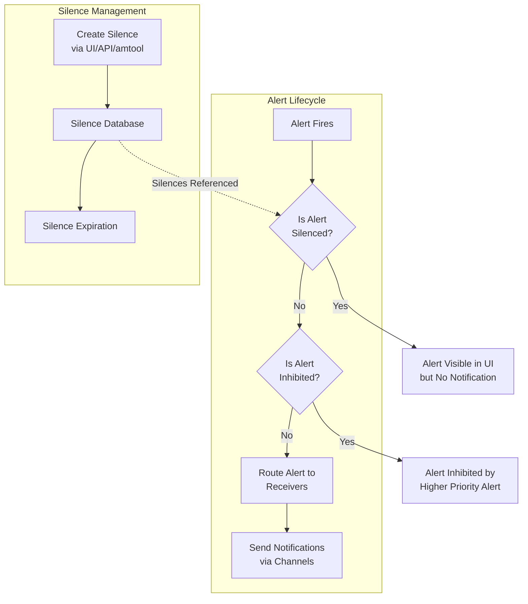

# Alert Silencing in Prometheus Alerting

## Introduction

Alert silencing is a critical feature in Prometheus Alertmanager that allows you to temporarily suppress notifications for specific alerts while maintaining the alert's active state. This is particularly useful during planned maintenance windows, known outages, or when you need time to address an issue without being bombarded by notifications.

Unlike completely disabling alerts, silencing preserves the alert information in the monitoring system while preventing notification channels (like email, Slack, or PagerDuty) from triggering. This helps reduce alert fatigue and ensures that your team only receives relevant notifications.

## Understanding Alert Silencing vs. Inhibition

Before diving deeper, it's important to distinguish between two related concepts:

- **Silencing**: Temporarily suppresses notifications for alerts matching specific criteria
- **Inhibition**: Allows certain alerts to automatically suppress notifications for other alerts based on dependency relationships

This guide focuses specifically on silencing mechanisms.

## Silencing Alerts in Alertmanager

Alertmanager provides several methods to silence alerts:

1. Using the Alertmanager UI
2. Using the Alertmanager API
3. Configuring silences through amtool (Alertmanager command-line tool)

Let's explore each method in detail.

### Method 1: Using the Alertmanager UI

The most straightforward way to create silences is through the Alertmanager web interface.

#### Steps:

1. Navigate to your Alertmanager UI (typically at `http://<alertmanager-host>:9093`)
2. Click on the "Silences" tab in the top navigation bar
3. Click "New Silence" to create a new silence entry
4. Define the matching criteria using matchers
5. Set the silence duration and add a comment explaining the reason
6. Click "Create" to activate the silence

![Alertmanager UI Silence Creation]

#### Example UI Matching Criteria:

To silence all alerts for a specific service in the production environment:

- Matcher 1: `service=payment-gateway`
- Matcher 2: `environment=production`

### Method 2: Using the Alertmanager API

For programmatic or automated silencing, you can use the Alertmanager API.

```bash
# Create a silence via the API
curl -X POST -H "Content-Type: application/json" \
  -d '{
    "matchers": [
      {
        "name": "service",
        "value": "payment-gateway",
        "isRegex": false
      },
      {
        "name": "environment",
        "value": "production",
        "isRegex": false
      }
    ],
    "startsAt": "2023-06-15T15:00:00Z",
    "endsAt": "2023-06-15T17:00:00Z",
    "createdBy": "maintenance-team",
    "comment": "Scheduled database maintenance"
  }' \
  http://alertmanager:9093/api/v2/silences
```

The API will respond with a silence ID that can be used to reference or manage the silence later:

```json
{
  "silenceID": "d67c9a37-5a27-4e1b-b6f4-3d5c5e123456"
}
```

### Method 3: Using amtool

Alertmanager's command-line tool, `amtool`, provides a convenient way to manage silences from the terminal.

```bash
# Install amtool if not already installed
# For Debian/Ubuntu:
# apt-get install prometheus-alertmanager

# Create a silence
amtool silence add \
  service=payment-gateway environment=production \
  --comment="Scheduled database maintenance" \
  --duration=2h \
  --alertmanager.url=http://alertmanager:9093
```

The output will confirm the silence creation:

```
Successfully created silence d67c9a37-5a27-4e1b-b6f4-3d5c5e123456
```

To view all active silences:

```bash
amtool silence query --alertmanager.url=http://alertmanager:9093
```

To expire a silence prematurely:

```bash
amtool silence expire d67c9a37-5a27-4e1b-b6f4-3d5c5e123456 --alertmanager.url=http://alertmanager:9093
```

## Silence Matching Syntax

Silences use matchers to determine which alerts to silence. Understanding these matchers is crucial for effective silence management.

### Basic Matchers

A basic matcher consists of:
- Label name
- Operation (=, !=, =~, !~)
- Value

### Examples of Matchers:

```
# Exact match
service=payment-gateway

# Negative match (silence everything except)
service!=payment-gateway

# Regex match
instance=~"prod-app-[0-9]+"

# Negative regex match
instance!~"dev-.*"
```

### Combining Matchers

Multiple matchers are combined with AND logic. All matchers must be satisfied for an alert to be silenced.

```
# Silence alerts for payment service in production environment
service=payment-gateway environment=production

# Silence alerts for any production database with high severity
component=database environment=production severity=high
```

## Best Practices for Alert Silencing

Effective use of silencing mechanisms helps maintain a healthy alerting system. Here are some recommended practices:

### 1. Always Include Comments

Always add clear, descriptive comments to your silences:

```bash
amtool silence add instance=app-server-01 \
  --comment="Server being rebooted after kernel update. Ticket: MAINT-2345" \
  --duration=30m
```

### 2. Set Appropriate Durations

Set realistic silence durations based on the expected maintenance or issue resolution time. Avoid indefinite silences.

### 3. Use Time-Bound Silences

For planned maintenance, create silences that:
- Start shortly before the maintenance window
- End shortly after the expected completion time

```bash
amtool silence add service=payment-gateway \
  --start="2023-06-15T15:00:00Z" \
  --end="2023-06-15T17:00:00Z" \
  --comment="Database migration maintenance window"
```

### 4. Regular Silence Auditing

Implement a process to regularly review active silences:

```bash
# List silences that will be active for more than 24 hours
amtool silence query --extended
```

### 5. Integrate with Change Management

For teams with formal change management processes, link silences to change tickets:

```bash
amtool silence add cluster=production job=kubernetes-nodes \
  --comment="Node upgrades in progress. Change: CHG0012345" \
  --duration=4h
```

## Implementing Alert Silencing at Scale

For larger environments, manual silence management can become cumbersome. Here are approaches for scaling silence management:

### Silence Templates

Create reusable silence templates for common scenarios:

```bash
#!/bin/bash
# db-maintenance-silence.sh

DB_SERVER=$1
DURATION=$2  # in hours
TICKET=$3

amtool silence add \
  instance=$DB_SERVER \
  job=mysql-exporter \
  --comment="Database maintenance. Ticket: $TICKET" \
  --duration=${DURATION}h
```

Usage:

```bash
./db-maintenance-silence.sh db-prod-03 2 MAINT-1234
```

### Automating Silences with CI/CD

Integrate silence management with your CI/CD pipeline to automatically silence alerts during deployments:

```yaml
# Example GitLab CI job
silence-alerts:
  stage: pre-deployment
  script:
    - |
      amtool silence add \
        service=${SERVICE_NAME} \
        environment=${DEPLOY_ENV} \
        --comment="Automated silence for deployment of ${SERVICE_NAME}. Pipeline: ${CI_PIPELINE_ID}" \
        --duration=30m \
        --alertmanager.url=${ALERTMANAGER_URL}
  # Store the silence ID for later expiration if needed
  artifacts:
    paths:
      - silence_id.txt
```

## Visualizing Alert Silencing Flow

The following diagram illustrates how alert silencing fits into the Prometheus alerting workflow:



## Practical Example: Maintenance Window

Let's walk through a complete example of silencing alerts during a planned maintenance window.

### Scenario

You need to perform database maintenance on your production payment system. The work is expected to last 2 hours, and you want to silence relevant alerts during this time.

### Step 1: Identify Affected Components

First, determine which alerts need silencing:

```bash
# List active alerts that will be affected
amtool alert query \
  service=payment-gateway \
  environment=production \
  --alertmanager.url=http://alertmanager:9093
```

### Step 2: Create Silence Before Maintenance

```bash
# Create silence 10 minutes before maintenance starts
amtool silence add \
  service=payment-gateway \
  environment=production \
  --comment="Scheduled database maintenance. Ticket: MAINT-5678" \
  --start=$(date -d "10 minutes" +%FT%T%:z) \
  --duration=2h30m \
  --alertmanager.url=http://alertmanager:9093
```

This creates a silence that:
- Starts in 10 minutes
- Lasts for 2 hours and 30 minutes (adding buffer time)
- Includes a reference to the maintenance ticket

### Step 3: Monitor and Adjust if Needed

If maintenance completes early:

```bash
# End the silence early
amtool silence expire ${SILENCE_ID} --alertmanager.url=http://alertmanager:9093
```

If maintenance takes longer than expected:

```bash
# Create a new silence with additional time
amtool silence add \
  service=payment-gateway \
  environment=production \
  --comment="Extended database maintenance. Ticket: MAINT-5678" \
  --duration=1h \
  --alertmanager.url=http://alertmanager:9093
```

## Troubleshooting Silences

Common issues with alert silencing and how to address them:

### 1. Silences Not Working as Expected

If alerts continue to trigger notifications despite silence rules:

```bash
# Check if silence is active
amtool silence query ${SILENCE_ID} --alertmanager.url=http://alertmanager:9093

# Verify that matchers correctly match the alert
amtool alert query --alertmanager.url=http://alertmanager:9093 | grep ${ALERT_NAME}

# Check if silence matchers exactly match alert labels
amtool silence query --match='{job="api-server"}' --alertmanager.url=http://alertmanager:9093
```

### 2. Expired Silences

Silences that expired unexpectedly:

```bash
# List recently expired silences
amtool silence query --expired --alertmanager.url=http://alertmanager:9093
```

Verify that time zones are correctly configured when creating time-bound silences.

## Summary

Alert silencing is an essential feature of the Prometheus Alertmanager that helps teams manage notification flow during planned maintenance or known issues. By properly implementing silencing strategies, you can:

- Reduce alert fatigue
- Maintain visibility of alert status while preventing notification spam
- Better manage planned maintenance windows
- Improve the overall effectiveness of your alerting system

When used in conjunction with well-designed alert rules and proper inhibition strategies, silencing helps create a more effective monitoring system that promotes faster incident response and better operational awareness.

## Additional Resources

- **Prometheus Alertmanager Documentation**: Comprehensive reference for all Alertmanager features
- **amtool**: Command-line tool for managing Alertmanager
- **Alert Fatigue**: Research papers on reducing alert fatigue in operational environments
- **SRE Books**: Site Reliability Engineering practices for effective alerting

## Exercises

1. Create a silence for a specific service that will last for 1 hour using the Alertmanager UI.
2. Write a bash script that creates a silence for a list of servers stored in a text file.
3. Design a silence strategy for a complex microservice deployment that minimizes alert noise while ensuring critical issues are still notified.
4. Create a silence using regular expressions to match multiple services following a naming pattern.
5. Build an automated process to expire silences early when maintenance completes ahead of schedule.