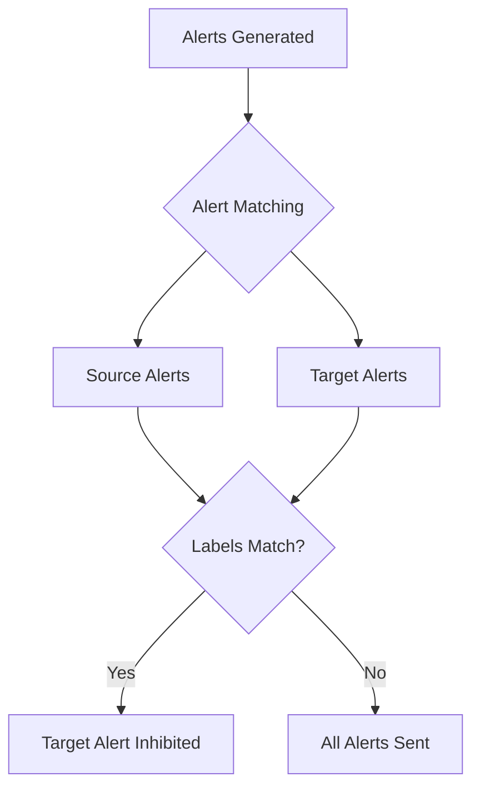

# Alert Inhibition

## Introduction

Alert fatigue is a common problem in monitoring systems - when too many alerts fire simultaneously, important notifications can get lost in the noise. Prometheus Alertmanager provides a powerful feature called **Alert Inhibition** that helps solve this problem by preventing less important alerts from firing when more critical alerts are already active.

Alert inhibition works on a simple principle: if a critical issue is already known, you don't need to be notified about related minor issues that are likely consequences of the main problem. For example, if a server is completely down (critical alert), you don't need separate alerts about high CPU usage or memory issues on the same server.

## Understanding Alert Inhibition

Alert inhibition in Prometheus allows you to define rules where the presence of one alert (the source) suppresses the notification of other alerts (the targets). This helps streamline your alert workflow and reduces alert fatigue.

### Key Concepts

1. **Source alerts**: The more important alerts that, when active, will suppress other less important alerts
2. **Target alerts**: The less important alerts that will be inhibited when the source alert is firing
3. **Equal labels**: Labels that must match between the source and target alerts for inhibition to occur

## Configuring Alert Inhibition

Alert inhibition is configured in the Alertmanager configuration file. Here's the basic structure:

```yaml
inhibit_rules:
  - source_match:
      severity: 'critical'
    target_match:
      severity: 'warning'
    equal: ['alertname', 'cluster', 'service']
```

In this example:
- Alerts with `severity: critical` will inhibit alerts with `severity: warning`
- Inhibition only occurs if both alerts share the same values for `alertname`, `cluster`, and `service` labels

## Practical Examples

Let's look at some real-world examples to understand how alert inhibition can be used effectively.

### Example 1: Server Down Inhibition

When a server is completely down, you don't need to receive multiple alerts about individual services on that server.

```yaml
inhibit_rules:
  - source_match:
      alertname: 'InstanceDown'
      severity: 'critical'
    target_match_re:
      alertname: '.*HighUsage|.*Unavailable'
    equal: ['instance']
```

This rule inhibits any alerts about high resource usage or service unavailability on an instance that is already known to be down.

### Example 2: Network Partition Inhibition

When a network partition is detected, suppress alerts from affected zones.

```yaml
inhibit_rules:
  - source_match:
      alertname: 'NetworkPartition'
      severity: 'critical'
    target_match:
      severity: 'warning'
    equal: ['datacenter']
```

### Example 3: Application Hierarchy

For applications with dependencies, inhibit alerts from dependent services when the main service is down.

```yaml
inhibit_rules:
  - source_match:
      alertname: 'DatabaseDown'
      severity: 'critical'
    target_match:
      alertname: 'APIHighLatency'
    equal: ['env', 'cluster']
```

## Alert Inhibition Workflow

The following diagram illustrates how alert inhibition works in practice:



## Best Practices for Alert Inhibition

1. **Start simple**: Begin with a few clear inhibition rules and expand gradually
2. **Focus on severity levels**: Most commonly, critical alerts inhibit warning alerts
3. **Choose equal labels carefully**: Pick labels that logically group related components
4. **Avoid over-inhibition**: Don't silence too many alerts or you might miss important information
5. **Test your rules**: Verify that inhibition rules work as expected before implementing in production
6. **Document your inhibition rules**: Make sure your team understands which alerts can be inhibited

## Common Pitfalls

1. **Too broad inhibition**: If your equal labels are too general, you might inhibit unrelated alerts
2. **Missing important alerts**: Over-zealous inhibition can hide important information
3. **Complex rule interactions**: Multiple inhibition rules can interact in unexpected ways
4. **Inconsistent labeling**: Inhibition requires consistent alert labeling practices

## Implementation Example

Let's see a complete example of implementing alert inhibition in Alertmanager. Below is a sample configuration file:

```yaml
global:
  resolve_timeout: 5m

route:
  group_by: ['alertname', 'job']
  group_wait: 30s
  group_interval: 5m
  repeat_interval: 12h
  receiver: 'team-emails'

receivers:
- name: 'team-emails'
  email_configs:
  - to: 'team@example.com'

inhibit_rules:
  # Critical infrastructure alerts inhibit dependent service warnings
  - source_match:
      severity: 'critical'
      tier: 'infrastructure'
    target_match:
      severity: 'warning'
      tier: 'service'
    equal: ['cluster', 'environment']
  
  # Database outages inhibit API performance alerts
  - source_match:
      alertname: 'DatabaseOutage'
    target_match:
      alertname: 'APIHighLatency'
    equal: ['application', 'environment']
  
  # Instance down inhibits all other alerts for that instance
  - source_match:
      alertname: 'InstanceDown'
    target_match_re:
      alertname: '.*'
    equal: ['instance']
```

## Testing Inhibition Rules

To test your inhibition rules, you can use the Alertmanager API. Here's how to check if your rules are working:

1. Create test alerts for both source and target conditions
2. Use `amtool` or the Alertmanager UI to verify which alerts are being inhibited

Example using amtool:

```bash
# Check active alerts
amtool --alertmanager.url=http://alertmanager:9093 alert

# Check which alerts are inhibited
amtool --alertmanager.url=http://alertmanager:9093 silence
```

## Integration with Alert Routing

Alert inhibition works alongside alert routing. When setting up your alerting system, consider:

1. First, group related alerts (using `group_by` in route configuration)
2. Then, set up inhibition rules to prevent alert spam during major outages
3. Finally, route alerts to appropriate receivers

This layered approach ensures efficient alert handling and minimal alert fatigue.

## Summary

Alert inhibition is a powerful feature in Prometheus Alertmanager that helps reduce alert fatigue by suppressing less important alerts when more critical ones are firing. By defining clear source and target relationships with appropriate label matching, you can create a more effective alerting system that helps your team focus on what matters most.

Remember these key points:
- Use inhibition to reduce noise during major incidents
- Configure source alerts (more critical) to inhibit target alerts (less critical)
- Use the `equal` field to specify which labels must match for inhibition to occur
- Test your inhibition rules thoroughly before deploying to production

## Additional Resources

- [Prometheus Alertmanager Documentation](https://prometheus.io/docs/alerting/latest/alertmanager/)
- [Alertmanager Configuration](https://prometheus.io/docs/alerting/latest/configuration/)
- [Prometheus Alerting Best Practices](https://prometheus.io/docs/practices/alerting/)

## Exercises

1. Create an inhibition rule where a datacenter power outage alert inhibits all other alerts from that datacenter.
2. Design an inhibition structure for a three-tier application (database, API, frontend).
3. Implement and test an inhibition rule where network issues inhibit connectivity-related alerts.
4. Review your existing alerts and identify candidates for inhibition to reduce alert fatigue.