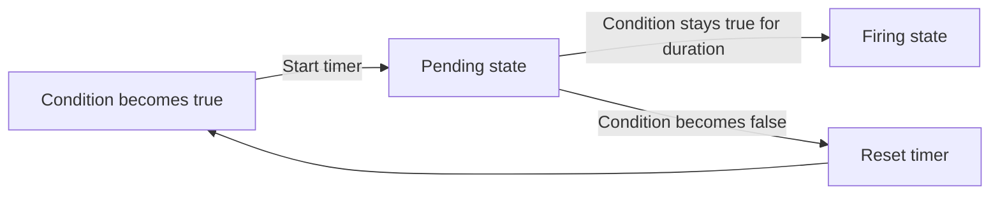
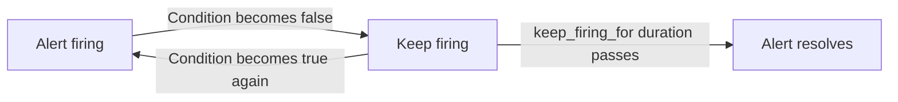

# Alert Time Windows

## Introduction

When setting up alerting in Prometheus, one challenge you'll quickly encounter is balancing between detecting genuine issues and avoiding alert fatigue. **Alert Time Windows** are a powerful feature in Prometheus's alerting system that helps you control _when_ alerts should fire based on how long a problem condition persists.

In this guide, we'll explore how time windows work in Prometheus alerting rules, why they're crucial for building robust monitoring systems, and how to configure them effectively for your specific needs.

## Understanding Alert Time Windows

### The Basics

Alert time windows in Prometheus are primarily controlled through two parameters in your alerting rules:

- `for` - Specifies how long a condition must be true before the alert fires
- `keep_firing_for` - Determines how long an alert continues firing after the condition is no longer true

These parameters help you manage the timing aspects of your alerts, making them more resistant to temporary spikes or brief issues that might resolve themselves.

### The Problem with Instant Alerting

Let's first understand why we need time windows. Consider this simple alerting rule without any time window:

```yaml
groups:
  - name: example
    rules:
      - alert: HighCPUUsage
        expr: cpu_usage_percent > 90
        labels:
          severity: warning
        annotations:
          summary: "High CPU usage detected"
          description: "CPU usage is above 90%"
```

The issue with this rule is that any momentary spike in CPU above 90% will trigger an alert, even if it lasts for just a few seconds. This can lead to:

1. Alert noise and fatigue for your team
2. Wasted time investigating transient issues
3. Decreased trust in your alerting system

## Using the `for` Parameter

The `for` parameter solves this problem by requiring the condition to be true continuously for a specified duration before firing the alert.

### Basic Syntax

```yaml
groups:
  - name: example
    rules:
      - alert: HighCPUUsage
        expr: cpu_usage_percent > 90
        for: 5m
        labels:
          severity: warning
        annotations:
          summary: "High CPU usage detected"
          description: "CPU usage has been above 90% for 5 minutes"
```

In this example, the CPU must consistently exceed 90% for 5 minutes before an alert is triggered. This significantly reduces false alarms from brief spikes.

### How It Works

Let's visualize how the `for` parameter works:



1. When the condition first becomes true, Prometheus puts the alert in a "pending" state
2. If the condition stays true for the entire `for` duration, the alert transitions to "firing"
3. If the condition becomes false at any point during the `for` period, the timer resets

### Practical Example: Memory Usage Alert

Here's a practical example for monitoring memory usage:

```yaml
groups:
  - name: memory_alerts
    rules:
      - alert: HighMemoryUsage
        expr: (node_memory_MemTotal_bytes - node_memory_MemAvailable_bytes) / node_memory_MemTotal_bytes * 100 > 85
        for: 10m
        labels:
          severity: warning
        annotations:
          summary: "High memory usage on {{ $labels.instance }}"
          description: "Memory usage has been above 85% for 10 minutes on {{ $labels.instance }}"
```

This alert will fire only if memory usage remains above 85% continuously for 10 minutes, which helps filter out temporary memory spikes that might occur during normal operations.

## The `keep_firing_for` Parameter

While `for` helps prevent false positives from brief spikes, `keep_firing_for` (introduced in Prometheus 2.42.0) addresses the opposite problem: alerts that rapidly flip between firing and resolved states.

### Basic Syntax

```yaml
groups:
  - name: example
    rules:
      - alert: HighCPUUsage
        expr: cpu_usage_percent > 90
        for: 5m
        keep_firing_for: 2m
        labels:
          severity: warning
        annotations:
          summary: "High CPU usage detected"
          description: "CPU usage has been above 90% for 5 minutes"
```

With this configuration, even if CPU usage drops below 90%, the alert will continue firing for 2 more minutes before resolving.

### How It Works



This parameter is particularly useful for:
- Preventing "flapping" alerts that rapidly toggle between firing and resolved
- Ensuring alerts remain visible long enough for humans to notice them
- Giving transient recoveries time to fail again without generating multiple alerts

## Designing Effective Alert Time Windows

### Factors to Consider

When setting time windows for your alerts, consider:

1. **Service Level Objectives (SLOs)**: How quickly do you need to respond to issues?
2. **Impact of the issue**: High-impact problems might warrant quicker alerts
3. **False positive cost**: What's the cost of investigating false alarms?
4. **Recovery patterns**: How does your service typically recover from issues?

### Common Time Window Patterns

| Alert Type | Recommended `for` | Recommended `keep_firing_for` | Rationale |
|------------|-------------------|-------------------------------|-----------|
| Critical service outage | 1m-2m | 1m | Quick response needed, minimal delay acceptable |
| High error rates | 5m | 2m | Filter brief error spikes, allow for quick recovery |
| Resource usage warnings | 10m-15m | 5m | Give time for automated scaling, reduce noise |
| Slow queries/latency | 5m-10m | 3m | Accommodate traffic variations and brief slowdowns |

### Example: Multi-level CPU Alerts

```yaml
groups:
  - name: cpu_alerts
    rules:
      - alert: CPUUsageWarning
        expr: cpu_usage_percent > 80
        for: 15m
        labels:
          severity: warning
        annotations:
          summary: "High CPU usage warning"
          description: "CPU usage has been above 80% for 15 minutes on {{ $labels.instance }}"

      - alert: CPUUsageCritical
        expr: cpu_usage_percent > 95
        for: 5m
        labels:
          severity: critical
        annotations:
          summary: "Critical CPU usage"
          description: "CPU usage has been above 95% for 5 minutes on {{ $labels.instance }}"
```

This example creates a two-tier alerting system:
- A warning alert for sustained moderate CPU usage (80%+ for 15 minutes)
- A critical alert for extreme CPU usage (95%+ for 5 minutes)

## Advanced Techniques

### Combining with Percentile-based Alerts

For metrics with significant variability, combine time windows with percentile-based expressions:

```yaml
groups:
  - name: latency_alerts
    rules:
      - alert: HighLatency
        expr: histogram_quantile(0.95, http_request_duration_seconds_bucket) > 2
        for: 10m
        labels:
          severity: warning
        annotations:
          summary: "High API latency"
          description: "95th percentile latency has been above 2 seconds for 10 minutes"
```

This alerts only when the 95th percentile of request latency exceeds 2 seconds for 10 minutes, making it robust against individual slow requests.

### Rate-based Alerts with Time Windows

For error rate monitoring, combine `rate()` functions with appropriate time windows:

```yaml
groups:
  - name: error_rate_alerts
    rules:
      - alert: HighErrorRate
        expr: sum(rate(http_requests_total{status=~"5.."}[5m])) / sum(rate(http_requests_total[5m])) > 0.05
        for: 5m
        keep_firing_for: 2m
        labels:
          severity: warning
        annotations:
          summary: "High error rate detected"
          description: "Error rate has been above 5% for 5 minutes"
```

This alerts when the error rate exceeds 5% for 5 minutes, using a 5-minute rate calculation window and keeping the alert firing for 2 minutes after recovery.

## Common Pitfalls and Best Practices

### Pitfalls to Avoid

1. **Setting windows too short**: Can lead to noisy alerts and fatigue
2. **Setting windows too long**: Might delay critical notifications too much
3. **Ignoring service patterns**: Not considering how your service normally behaves
4. **One-size-fits-all approach**: Using the same time windows for all alerts

### Best Practices

1. **Start conservative**: Begin with longer windows and adjust based on experience
2. **Document your reasoning**: Explain why you chose specific time windows
3. **Review regularly**: Analyze alert patterns and adjust time windows accordingly
4. **Test different scenarios**: Simulate spikes and outages to validate your settings
5. **Consider business hours**: You might want different windows during work hours vs. off-hours

## Implementing Alert Time Windows in Prometheus Rules Files

Here's a complete example of a Prometheus rules file with various alerts and appropriate time windows:

```yaml
groups:
- name: service_alerts
  rules:
  - alert: ServiceDown
    expr: up{job="my-service"} == 0
    for: 1m
    labels:
      severity: critical
    annotations:
      summary: "Service {{ $labels.instance }} is down"
      description: "{{ $labels.instance }} of job {{ $labels.job }} has been down for more than 1 minute."

  - alert: HighErrorRate
    expr: sum(rate(http_requests_total{job="my-service", status=~"5.."}[5m])) by (instance) / sum(rate(http_requests_total{job="my-service"}[5m])) by (instance) > 0.05
    for: 5m
    keep_firing_for: 2m
    labels:
      severity: warning
    annotations:
      summary: "High error rate on {{ $labels.instance }}"
      description: "Error rate has been above 5% for 5 minutes on {{ $labels.instance }}."

  - alert: SlowResponses
    expr: histogram_quantile(0.95, sum(rate(http_request_duration_seconds_bucket{job="my-service"}[5m])) by (le, instance)) > 1
    for: 10m
    labels:
      severity: warning
    annotations:
      summary: "Slow responses on {{ $labels.instance }}"
      description: "95th percentile of response time has been above 1 second for 10 minutes on {{ $labels.instance }}."

  - alert: HighCPUUsage
    expr: avg by(instance) (rate(process_cpu_seconds_total{job="my-service"}[3m])) * 100 > 80
    for: 15m
    labels:
      severity: warning
    annotations:
      summary: "High CPU usage on {{ $labels.instance }}"
      description: "CPU usage has been above 80% for 15 minutes on {{ $labels.instance }}."

  - alert: MemoryNearExhaustion
    expr: process_resident_memory_bytes{job="my-service"} / node_memory_MemTotal_bytes * 100 > 80
    for: 10m
    labels:
      severity: warning
    annotations:
      summary: "Memory usage high on {{ $labels.instance }}"
      description: "Memory usage has been above 80% for 10 minutes on {{ $labels.instance }}."
```

## Summary

Alert time windows are a crucial feature for building a reliable and actionable alerting system with Prometheus. By carefully configuring the `for` and `keep_firing_for` parameters, you can:

- Reduce alert noise and fatigue
- Filter out transient issues
- Prevent alert flapping
- Ensure timely notification of genuine problems

Remember these key points:
- Use the `for` parameter to specify how long a condition must be true before alerting
- Use the `keep_firing_for` parameter to prevent alerts from resolving too quickly
- Adjust time windows based on the criticality and behavior of what you're monitoring
- Regularly review and refine your time windows based on experience

## Additional Resources

- [Prometheus Alerting Documentation](https://prometheus.io/docs/prometheus/latest/configuration/alerting_rules/)
- [AlertManager Documentation](https://prometheus.io/docs/alerting/latest/alertmanager/)
- [SRE Book: Practical Alerting from Google](https://sre.google/sre-book/practical-alerting/)

## Exercises

1. **Exercise 1**: Review your existing alerting rules and identify candidates for adding or adjusting time windows.
2. **Exercise 2**: Create a multi-level alerting rule (warning/critical) for a service metric with appropriate time windows.
3. **Exercise 3**: Analyze your alert history to identify alerts that fire too frequently or not frequently enough, and adjust their time windows accordingly.
4. **Exercise 4**: Design an error rate alerting rule that uses both `for` and `keep_firing_for` parameters.