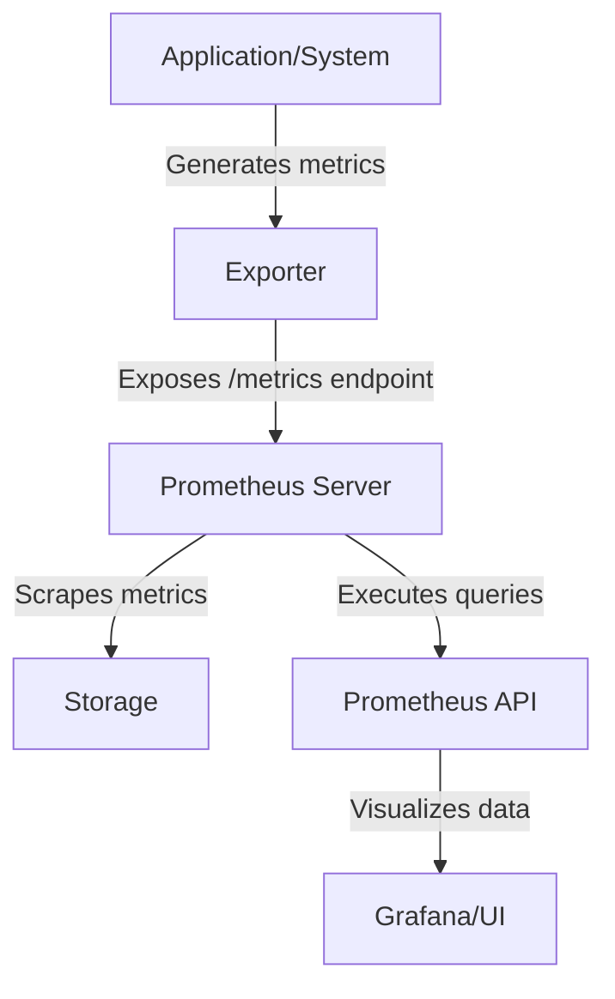

# Prometheus Exporter Basics

## Introduction

In the world of monitoring and observability, Prometheus has emerged as one of the leading solutions. A critical component of the Prometheus ecosystem is the **exporter**. But what exactly is an exporter, and why is it so important?

A Prometheus exporter is essentially a translator - it converts metrics from various systems and applications into a format that Prometheus can understand and scrape. Think of exporters as bridges connecting your diverse infrastructure to your Prometheus monitoring system.

In this guide, we'll cover:
- What Prometheus exporters are and why they're needed
- The architecture and working principles of exporters
- How to use existing exporters
- Creating a simple custom exporter
- Best practices for working with exporters

## What is a Prometheus Exporter?

### Definition and Purpose

A Prometheus exporter is a piece of software that:
1. Collects metrics from a system or application
2. Translates those metrics into Prometheus' data model
3. Exposes the metrics via an HTTP endpoint for Prometheus to scrape

Exporters solve a fundamental problem: many systems weren't built with Prometheus-compatible metrics in mind. Exporters bridge this gap by converting proprietary metrics or status information into Prometheus' time-series data format.

### The Exporter Ecosystem

The Prometheus community has developed exporters for a wide range of systems:

- **Infrastructure:** Node exporter (system metrics), cAdvisor (container metrics)
- **Databases:** MySQL exporter, PostgreSQL exporter, MongoDB exporter
- **Web servers:** NGINX exporter, Apache exporter
- **Message queues:** RabbitMQ exporter, Kafka exporter
- **Cloud services:** AWS exporter, Google Cloud exporter
- **And many more...**

## How Exporters Work

### Architecture

The typical architecture of a Prometheus monitoring setup with exporters looks like this:



### The Metrics Endpoint

All Prometheus exporters expose metrics via an HTTP endpoint, typically `/metrics`. When accessed, this endpoint returns a text-based representation of all metrics in the Prometheus exposition format.

Here's a sample of what the `/metrics` endpoint output might look like:

```
# HELP process_cpu_seconds_total Total user and system CPU time spent in seconds.
# TYPE process_cpu_seconds_total counter
process_cpu_seconds_total 1234.5
# HELP process_memory_usage_bytes Memory usage in bytes.
# TYPE process_memory_usage_bytes gauge
process_memory_usage_bytes 54321
```

This format includes:
- Comments (`#`) providing help text and type information
- Metric names (e.g., `process_cpu_seconds_total`)
- Metric values (e.g., `1234.5`)

### Metric Types

Prometheus supports four core metric types, which exporters use to represent different kinds of data:

1. **Counter:** A cumulative metric that only increases (e.g., number of requests processed)
2. **Gauge:** A metric that can go up and down (e.g., memory usage)
3. **Histogram:** Samples observations and counts them in configurable buckets (e.g., request durations)
4. **Summary:** Similar to histogram, but provides quantiles directly

## Using Existing Exporters

Most systems already have exporters available. Let's look at how to use one of the most common ones: the Node Exporter, which provides system metrics.

### Example: Installing and Using Node Exporter

1. **Download and extract the Node Exporter:**

```bash
wget https://github.com/prometheus/node_exporter/releases/download/v1.3.1/node_exporter-1.3.1.linux-amd64.tar.gz
tar xvfz node_exporter-1.3.1.linux-amd64.tar.gz
cd node_exporter-1.3.1.linux-amd64
```

2. **Start the Node Exporter:**

```bash
./node_exporter
```

3. **Verify it's working by accessing the metrics endpoint:**

```bash
curl http://localhost:9100/metrics
```

4. **Configure Prometheus to scrape these metrics by adding to `prometheus.yml`:**

```yaml
scrape_configs:
  - job_name: 'node'
    static_configs:
      - targets: ['localhost:9100']
```

5. **Restart Prometheus to apply the configuration.**

Now Prometheus will scrape and store metrics from Node Exporter, which you can query and visualize.

## Creating a Simple Custom Exporter

Sometimes you'll need to monitor a system that doesn't have an existing exporter. Let's create a simple custom exporter in Python using the `prometheus_client` library.

### Example: File System Usage Exporter

Let's build a simple exporter that reports disk usage statistics:

1. **Install the required library:**

```bash
pip install prometheus_client
```

2. **Create a Python script called `disk_exporter.py`:**

```python
import os
import time
from prometheus_client import start_http_server, Gauge

# Create metrics
DISK_USAGE = Gauge('disk_usage_percent', 
                  'Disk usage in percent', 
                  ['path'])

def update_metrics():
    """Update disk usage metrics."""
    paths = ["/", "/home", "/var"]
    for path in paths:
        if os.path.exists(path):
            stat = os.statvfs(path)
            # Calculate disk usage percentage
            free = stat.f_bavail * stat.f_frsize
            total = stat.f_blocks * stat.f_frsize
            used_percent = 100 * (1 - free / total)
            DISK_USAGE.labels(path=path).set(used_percent)

if __name__ == '__main__':
    # Start up the server to expose the metrics
    start_http_server(8000)
    print("Exporter started on port 8000")
    
    # Update metrics every 30 seconds
    while True:
        update_metrics()
        time.sleep(30)
```

3. **Run the exporter:**

```bash
python disk_exporter.py
```

4. **Test the metrics endpoint:**

```bash
curl http://localhost:8000/metrics
```

You should see output that includes the disk usage metrics:

```
# HELP disk_usage_percent Disk usage in percent
# TYPE disk_usage_percent gauge
disk_usage_percent{path="/"} 34.2
disk_usage_percent{path="/home"} 56.8
disk_usage_percent{path="/var"} 42.1
```

5. **Add to Prometheus configuration:**

```yaml
scrape_configs:
  - job_name: 'disk_usage'
    static_configs:
      - targets: ['localhost:8000']
```

### Anatomy of a Custom Exporter

Our simple exporter demonstrates the key components all exporters share:

1. **Metric definitions** - Creating appropriate metrics with descriptive names
2. **Labels** - Adding dimensions to metrics for better filtering and aggregation
3. **Collection logic** - Code that gathers the actual metric values
4. **HTTP server** - Exposing the metrics endpoint for Prometheus to scrape
5. **Update cycle** - Refreshing metrics at appropriate intervals

## Best Practices for Working with Exporters

### Naming Conventions

Follow these conventions for metric names:

- Use lowercase with underscores (`process_cpu_seconds`) 
- Include units in the name (`process_cpu_seconds_total` not `process_cpu_total`)
- Use a consistent prefix for related metrics (`http_requests_total`, `http_request_duration_seconds`)

### Choosing Metric Types

- Use **counters** for values that only increase (requests, errors)
- Use **gauges** for values that go up and down (memory usage, connection count)
- Use **histograms** for measurements where distribution matters (request durations)

### Labels

Labels add dimensions to your metrics for better querying:

```python
# Good use of labels
http_requests_total = Counter('http_requests_total', 'Total HTTP requests', 
                              ['method', 'endpoint', 'status'])

# Now you can set different values for different label combinations
http_requests_total.labels(method='GET', endpoint='/api/users', status='200').inc()
```

But be careful:
- **Cardinality explosion:** Avoid labels with high cardinality (e.g., user IDs, IP addresses)
- **Changing labels:** Don't modify labels of existing metrics during runtime

### Resource Usage

- Exporters should be lightweight and not impact the system they monitor
- Cache data when possible to reduce load
- Consider sampling for high-volume metrics

## Common Exporters and Their Use Cases

Here's a quick overview of some popular exporters:

1. **Node Exporter**
   - **Purpose:** System metrics (CPU, memory, disk, network)
   - **Use case:** Monitor server health

2. **Blackbox Exporter**
   - **Purpose:** Probes endpoints over HTTP, HTTPS, DNS, TCP and ICMP
   - **Use case:** Monitor availability and response time

3. **MySQL Exporter**
   - **Purpose:** MySQL server metrics
   - **Use case:** Monitor database performance

4. **cAdvisor**
   - **Purpose:** Container metrics
   - **Use case:** Monitor Docker containers

5. **JMX Exporter**
   - **Purpose:** Metrics from JVM applications
   - **Use case:** Monitor Java applications

## Troubleshooting Exporters

If you're having trouble with an exporter:

1. **Check the metrics endpoint manually:**
   ```bash
   curl http://exporter-host:port/metrics
   ```

2. **Verify Prometheus scrape configuration:**
   ```yaml
   scrape_configs:
     - job_name: 'my_exporter'
       static_configs:
         - targets: ['exporter-host:port']
   ```

3. **Check exporter logs for errors**

4. **Verify network connectivity from Prometheus to exporter**

5. **Use Prometheus' targets page to see scrape status**

## Summary

Prometheus exporters are essential components that:
- Bridge the gap between various systems and Prometheus
- Convert metrics into Prometheus' format
- Expose metrics via HTTP endpoints for scraping

By using existing exporters or creating custom ones, you can monitor virtually any system with Prometheus. Remember to follow best practices for metric naming, label usage, and resource efficiency.

## Additional Resources

- [Prometheus Documentation on Exporters](https://prometheus.io/docs/instrumenting/exporters/)
- [Writing Exporters Guide](https://prometheus.io/docs/instrumenting/writing_exporters/)
- [Client Libraries](https://prometheus.io/docs/instrumenting/clientlibs/)

## Exercises

1. Install the Node Exporter and configure Prometheus to scrape it.
2. Extend the disk usage exporter to include additional metrics like inode usage.
3. Create a simple exporter for a service you use (e.g., monitor a local web server).
4. Explore the metrics exposed by an existing exporter and try writing PromQL queries against them.
5. Configure alerts based on metrics from an exporter.