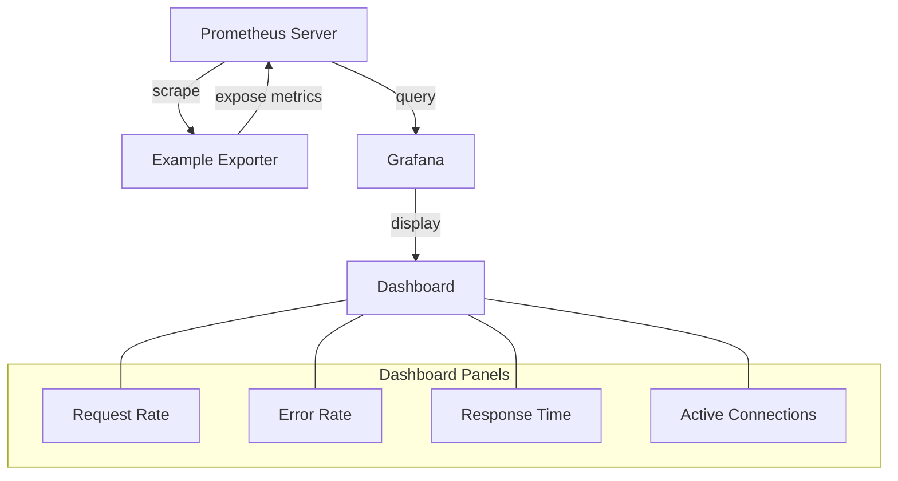

# Exporter Best Practices

## Introduction

Prometheus exporters are specialized applications that collect metrics from existing systems and expose them in a format that Prometheus can scrape. While creating an exporter might seem straightforward, following established best practices ensures your exporters are reliable, maintainable, and provide valuable metrics. This guide covers essential best practices for developing and deploying Prometheus exporters, helping you avoid common pitfalls and optimize your monitoring infrastructure.

## Naming Conventions

### Metric Naming

Consistent metric naming is crucial for clarity and usability:

- Use a format of `namespace_subsystem_name` (e.g., `http_requests_total`)
- Choose a relevant namespace that represents the monitored system (e.g., `node`, `mysql`, `http`)
- Use snake_case for metric names
- Include units in the metric name (e.g., `http_request_duration_seconds`)
- Use suffixes like `_total`, `_count`, `_sum`, `_bucket` for appropriate metric types

```go
// Good example
prometheus.NewCounter(prometheus.CounterOpts{
    Name: "http_requests_total",
    Help: "Total number of HTTP requests processed",
})

// Poor example - inconsistent naming
prometheus.NewCounter(prometheus.CounterOpts{
    Name: "HTTPReq-Count",
    Help: "Requests",
})
```

### Label Naming

Labels allow you to add dimensions to your metrics, but should follow these conventions:

- Use snake_case for label names
- Keep label names short but descriptive
- Avoid high-cardinality labels (those with unlimited or very high numbers of potential values)
- Common label names: `environment`, `instance`, `job`, `service`, `endpoint`

```go
// Good example
prometheus.NewCounterVec(
    prometheus.CounterOpts{
        Name: "http_requests_total",
        Help: "Total number of HTTP requests processed",
    },
    []string{"method", "endpoint", "status_code"},
)

// Poor example - high cardinality
prometheus.NewCounterVec(
    prometheus.CounterOpts{
        Name: "http_requests_total",
        Help: "Total number of HTTP requests processed",
    },
    []string{"user_id", "precise_timestamp", "session_id"},
)
```

## Metric Types

Choose the appropriate metric type based on what you're measuring:

### Counter

- Use for metrics that only increase over time (e.g., total requests, errors)
- Never decrease a counter (except during restart)
- Name them with suffixes like `_total`

```go
requestsTotal := prometheus.NewCounter(prometheus.CounterOpts{
    Name: "http_requests_total",
    Help: "Total number of HTTP requests processed",
})

// Increment counter when handling a request
requestsTotal.Inc()
```

### Gauge

- Use for metrics that can go up and down (e.g., current memory usage, connection pool size)
- Represent a snapshot of current state

```go
activeConnections := prometheus.NewGauge(prometheus.CounterOpts{
    Name: "http_active_connections",
    Help: "Current number of active HTTP connections",
})

// Set or adjust gauge based on current state
activeConnections.Set(float64(connectionPool.Size()))
activeConnections.Inc() // Increment by 1
activeConnections.Dec() // Decrement by 1
```

### Histogram

- Use for measuring distributions of values (e.g., request duration, response size)
- Creates multiple time series: count, sum, and buckets
- Define appropriate buckets for your use case

```go
requestDuration := prometheus.NewHistogram(prometheus.HistogramOpts{
    Name:    "http_request_duration_seconds",
    Help:    "HTTP request duration distribution",
    Buckets: prometheus.DefBuckets, // Default: [.005, .01, .025, .05, .1, .25, .5, 1, 2.5, 5, 10]
})

// Record the duration of a request
func handleRequest() {
    start := time.Now()
    // ... handle request ...
    duration := time.Since(start).Seconds()
    requestDuration.Observe(duration)
}
```

### Summary

- Similar to histograms but calculates quantiles directly
- Use when exact quantile values are needed
- More expensive to compute than histograms

```go
requestDuration := prometheus.NewSummary(prometheus.SummaryOpts{
    Name:       "http_request_duration_seconds",
    Help:       "HTTP request duration distribution",
    Objectives: map[float64]float64{0.5: 0.05, 0.9: 0.01, 0.99: 0.001},
})

// Record the duration of a request
func handleRequest() {
    start := time.Now()
    // ... handle request ...
    duration := time.Since(start).Seconds()
    requestDuration.Observe(duration)
}
```

## Performance Considerations

### Resource Usage

Exporters should be lightweight and efficient:

- Minimize CPU and memory usage
- Use caching when appropriate
- Consider the frequency of metrics collection

```go
// Inefficient - collects metrics on every scrape
http.HandleFunc("/metrics", func(w http.ResponseWriter, r *http.Request) {
    collectExpensiveMetrics()
    // ...
})

// Better - uses caching
var (
    metricsMutex     sync.RWMutex
    lastCollectTime  time.Time
    cachedMetrics    []byte
    cacheValidPeriod = 30 * time.Second
)

http.HandleFunc("/metrics", func(w http.ResponseWriter, r *http.Request) {
    metricsMutex.RLock()
    if time.Since(lastCollectTime) < cacheValidPeriod {
        w.Write(cachedMetrics)
        metricsMutex.RUnlock()
        return
    }
    metricsMutex.RUnlock()
    
    metricsMutex.Lock()
    defer metricsMutex.Unlock()
    
    // Double-check after acquiring write lock
    if time.Since(lastCollectTime) < cacheValidPeriod {
        w.Write(cachedMetrics)
        return
    }
    
    // Collect and cache metrics
    metrics := collectExpensiveMetrics()
    cachedMetrics = metrics
    lastCollectTime = time.Now()
    
    w.Write(metrics)
})
```

### Cardinality

High cardinality can cause performance issues in Prometheus:

- Limit the number of label combinations
- Avoid using unique identifiers as label values
- Consider aggregating high-cardinality metrics at the exporter level

```go
// Bad - high cardinality
prometheus.NewCounterVec(
    prometheus.CounterOpts{
        Name: "user_login_total",
        Help: "User login attempts",
    },
    []string{"username", "ip_address", "session_id"}, // Can generate millions of time series!
)

// Better - lower cardinality
prometheus.NewCounterVec(
    prometheus.CounterOpts{
        Name: "user_login_total",
        Help: "User login attempts",
    },
    []string{"success", "authentication_method"}, // Much more manageable
)
```

## Reliability and Availability

### Error Handling

Exporters should be robust against errors:

- Handle connection failures gracefully
- Log errors without crashing
- Return partial metrics when possible
- Set default or fallback values when metrics collection fails

```go
func collectDatabaseMetrics() {
    var dbConn *sql.DB
    var err error
    
    // Try to connect with timeout
    connectChan := make(chan bool)
    go func() {
        dbConn, err = sql.Open("mysql", "user:password@/dbname")
        connectChan <- true
    }()
    
    select {
    case <-connectChan:
        if err != nil {
            log.Printf("Failed to connect to database: %v", err)
            databaseUp.Set(0) // Indicate database is down
            return
        }
    case <-time.After(5 * time.Second):
        log.Printf("Database connection timeout")
        databaseUp.Set(0)
        return
    }
    
    defer dbConn.Close()
    databaseUp.Set(1) // Indicate database is up
    
    // Continue collecting metrics...
}
```

### Timeouts

Implement timeouts to prevent hanging:

- Set connection timeouts
- Add request timeouts
- Use context for cancellation

```go
func collectMetricsWithTimeout(ctx context.Context) ([]byte, error) {
    resultChan := make(chan []byte)
    errChan := make(chan error)
    
    go func() {
        metrics, err := collectMetrics()
        if err != nil {
            errChan <- err
            return
        }
        resultChan <- metrics
    }()
    
    select {
    case result := <-resultChan:
        return result, nil
    case err := <-errChan:
        return nil, err
    case <-ctx.Done():
        return nil, fmt.Errorf("metrics collection timed out")
    }
}

http.HandleFunc("/metrics", func(w http.ResponseWriter, r *http.Request) {
    ctx, cancel := context.WithTimeout(r.Context(), 5*time.Second)
    defer cancel()
    
    metrics, err := collectMetricsWithTimeout(ctx)
    if err != nil {
        http.Error(w, fmt.Sprintf("Metrics collection failed: %v", err), http.StatusInternalServerError)
        return
    }
    
    w.Write(metrics)
})
```

## Operational Considerations

### Self-Monitoring

Exporters should expose their own operational metrics:

- Process metrics (memory, CPU usage)
- Collection duration and errors
- Scrape counts and durations

```go
var (
    scrapeDuration = prometheus.NewSummary(prometheus.SummaryOpts{
        Name: "exporter_scrape_duration_seconds",
        Help: "Duration of metrics collection",
    })
    
    scrapeErrors = prometheus.NewCounter(prometheus.CounterOpts{
        Name: "exporter_scrape_errors_total",
        Help: "Total number of errors during metrics collection",
    })
    
    lastScrapeTime = prometheus.NewGauge(prometheus.GaugeOpts{
        Name: "exporter_last_scrape_timestamp_seconds",
        Help: "Unix timestamp of the last successful scrape",
    })
)

func init() {
    // Register self-monitoring metrics
    prometheus.MustRegister(scrapeDuration)
    prometheus.MustRegister(scrapeErrors)
    prometheus.MustRegister(lastScrapeTime)
}

func collectAndExposeMetrics(w http.ResponseWriter) {
    start := time.Now()
    
    err := collectMetrics()
    if err != nil {
        scrapeErrors.Inc()
        http.Error(w, fmt.Sprintf("Error collecting metrics: %v", err), http.StatusInternalServerError)
        return
    }
    
    duration := time.Since(start).Seconds()
    scrapeDuration.Observe(duration)
    lastScrapeTime.Set(float64(time.Now().Unix()))
    
    promhttp.Handler().ServeHTTP(w, r)
}
```

### Configuration

Design exporters to be easily configurable:

- Support configuration via flags, environment variables, and configuration files
- Provide reasonable defaults
- Document all configuration options
- Allow runtime reconfiguration when possible

```go
// Example of flag-based configuration
package main

import (
    "flag"
    "fmt"
    "net/http"
    "os"
    "time"
    
    "github.com/prometheus/client_golang/prometheus"
    "github.com/prometheus/client_golang/prometheus/promhttp"
)

var (
    listenAddress     = flag.String("web.listen-address", ":9100", "Address to listen on for web interface and telemetry")
    metricsPath       = flag.String("web.telemetry-path", "/metrics", "Path under which to expose metrics")
    collectInterval   = flag.Duration("collector.interval", 15*time.Second, "Interval for cached metric collection")
    timeoutDuration   = flag.Duration("collector.timeout", 5*time.Second, "Timeout for metrics collection")
    logLevel          = flag.String("log.level", "info", "Log level: debug, info, warn, error")
)

func main() {
    flag.Parse()
    
    // Use environment variables as overrides
    if envAddress := os.Getenv("EXPORTER_WEB_LISTEN_ADDRESS"); envAddress != "" {
        *listenAddress = envAddress
    }
    
    // ... set up metrics and collectors ...
    
    http.Handle(*metricsPath, promhttp.Handler())
    http.HandleFunc("/", func(w http.ResponseWriter, r *http.Request) {
        w.Write([]byte(`<html>
            <head><title>Example Exporter</title></head>
            <body>
            <h1>Example Exporter</h1>
            <p><a href="` + *metricsPath + `">Metrics</a></p>
            </body>
            </html>`))
    })
    
    fmt.Printf("Starting exporter on %s
", *listenAddress)
    if err := http.ListenAndServe(*listenAddress, nil); err != nil {
        fmt.Printf("Error starting exporter: %s
", err)
        os.Exit(1)
    }
}
```

## Documentation

### Metric Documentation

Provide clear documentation for all metrics:

- Include descriptive help strings for all metrics
- Document units in both the metric name and help text
- Explain what each metric represents and how to interpret it
- Provide example Prometheus queries for common use cases

```go
// Good metric documentation
prometheus.NewCounter(prometheus.CounterOpts{
    Name: "http_requests_total",
    Help: "Total number of HTTP requests processed, regardless of outcome",
})

prometheus.NewGauge(prometheus.GaugeOpts{
    Name: "node_memory_usage_bytes",
    Help: "Current memory usage in bytes, including buffers/cache",
})

prometheus.NewHistogram(prometheus.HistogramOpts{
    Name: "http_request_duration_seconds",
    Help: "HTTP request latency distribution in seconds. Includes time spent waiting for response from backend.",
    Buckets: prometheus.ExponentialBuckets(0.001, 2, 10),
})
```

### README

Create a comprehensive README for your exporter:

- Describe the purpose of the exporter
- List all exposed metrics with explanations
- Document all configuration options
- Include installation and usage instructions
- Provide example Prometheus configuration
- Show example dashboards or alerts

## Security Considerations

### Authentication and Authorization

Consider security when exposing metrics:

- Add basic authentication for sensitive metrics
- Use TLS for encrypting metrics traffic
- Implement IP-based access control when necessary

```go
// Simple basic auth example
func basicAuthMiddleware(handler http.Handler, username, password string) http.Handler {
    return http.HandlerFunc(func(w http.ResponseWriter, r *http.Request) {
        user, pass, ok := r.BasicAuth()
        
        if !ok || user != username || pass != password {
            w.Header().Set("WWW-Authenticate", `Basic realm="Restricted"`)
            http.Error(w, "Unauthorized", http.StatusUnauthorized)
            return
        }
        
        handler.ServeHTTP(w, r)
    })
}

func main() {
    // ... setup metrics and collectors ...
    
    metricsHandler := promhttp.Handler()
    
    // Apply basic auth if credentials are configured
    if *authUsername != "" && *authPassword != "" {
        metricsHandler = basicAuthMiddleware(metricsHandler, *authUsername, *authPassword)
    }
    
    http.Handle("/metrics", metricsHandler)
    // ... start server ...
}
```

### Sensitive Information

Be careful with sensitive data:

- Never expose credentials, tokens, or personal data in metrics
- Avoid including sensitive information in labels
- Consider hashing or obfuscating potentially sensitive identifiers

```go
// Bad - exposing sensitive data
userActivity := prometheus.NewCounterVec(
    prometheus.CounterOpts{
        Name: "user_activity_total",
        Help: "User activity by user",
    },
    []string{"user_email", "credit_card_last_four"},
)

// Better - anonymized approach
userActivity := prometheus.NewCounterVec(
    prometheus.CounterOpts{
        Name: "user_activity_total",
        Help: "User activity by user",
    },
    []string{"user_id_hash", "payment_method_type"},
)
```

## Real-World Examples

Let's look at a complete exporter example that follows best practices:

```go
package main

import (
    "context"
    "flag"
    "fmt"
    "log"
    "net/http"
    "os"
    "os/signal"
    "sync"
    "syscall"
    "time"

    "github.com/prometheus/client_golang/prometheus"
    "github.com/prometheus/client_golang/prometheus/promhttp"
)

// Exporter configuration
var (
    listenAddress = flag.String("web.listen-address", ":9100", "Address to listen on for web interface and telemetry")
    metricsPath   = flag.String("web.telemetry-path", "/metrics", "Path under which to expose metrics")
    collectTimeout = flag.Duration("collector.timeout", 5*time.Second, "Timeout for metrics collection")
)

// Exporter metrics
var (
    // Application metrics
    requestsTotal = prometheus.NewCounterVec(
        prometheus.CounterOpts{
            Name: "app_requests_total",
            Help: "Total number of requests by status code and method",
        },
        []string{"status_code", "method"},
    )

    requestDuration = prometheus.NewHistogramVec(
        prometheus.HistogramOpts{
            Name:    "app_request_duration_seconds",
            Help:    "Request duration distribution in seconds",
            Buckets: prometheus.DefBuckets,
        },
        []string{"method", "endpoint"},
    )

    activeConnections = prometheus.NewGauge(
        prometheus.GaugeOpts{
            Name: "app_active_connections",
            Help: "Current number of active connections",
        },
    )

    // Self-monitoring metrics
    scrapeDuration = prometheus.NewSummary(
        prometheus.SummaryOpts{
            Name: "exporter_scrape_duration_seconds",
            Help: "Duration of metrics collection",
        },
    )

    scrapeErrors = prometheus.NewCounter(
        prometheus.CounterOpts{
            Name: "exporter_scrape_errors_total",
            Help: "Total number of errors during metrics collection",
        },
    )
)

func init() {
    // Register application metrics
    prometheus.MustRegister(requestsTotal)
    prometheus.MustRegister(requestDuration)
    prometheus.MustRegister(activeConnections)

    // Register self-monitoring metrics
    prometheus.MustRegister(scrapeDuration)
    prometheus.MustRegister(scrapeErrors)
}

// collectMetrics gathers all metrics from the application
func collectMetrics(ctx context.Context) error {
    start := time.Now()
    defer func() {
        scrapeDuration.Observe(time.Since(start).Seconds())
    }()

    // Simulate collecting metrics from an application
    var collectErr error
    errChan := make(chan error, 1)
    
    go func() {
        // Connect to the application and collect metrics
        time.Sleep(100 * time.Millisecond) // Simulate work
        
        // Record active connections
        activeConnections.Set(42)
        
        // Record request counts
        requestsTotal.WithLabelValues("200", "GET").Add(30)
        requestsTotal.WithLabelValues("404", "GET").Add(5)
        requestsTotal.WithLabelValues("500", "POST").Add(2)
        
        // Record request durations
        requestDuration.WithLabelValues("GET", "/api/users").Observe(0.05)
        requestDuration.WithLabelValues("POST", "/api/users").Observe(0.3)
        
        errChan <- nil
    }()
    
    select {
    case collectErr = <-errChan:
        // Collection completed
    case <-ctx.Done():
        collectErr = fmt.Errorf("metrics collection timed out")
    }
    
    if collectErr != nil {
        scrapeErrors.Inc()
    }
    
    return collectErr
}

func main() {
    flag.Parse()
    
    // Create a context that will be canceled on SIGTERM/SIGINT
    ctx, cancel := context.WithCancel(context.Background())
    defer cancel()
    
    // Handle graceful shutdown
    go func() {
        sigChan := make(chan os.Signal, 1)
        signal.Notify(sigChan, syscall.SIGTERM, syscall.SIGINT)
        <-sigChan
        log.Println("Received shutdown signal, exiting...")
        cancel()
    }()
    
    // Set up HTTP server
    mux := http.NewServeMux()
    
    // Landing page
    mux.HandleFunc("/", func(w http.ResponseWriter, r *http.Request) {
        if r.URL.Path != "/" {
            http.NotFound(w, r)
            return
        }
        w.Write([]byte(`<html>
            <head><title>Example Exporter</title></head>
            <body>
            <h1>Example Exporter</h1>
            <p><a href="` + *metricsPath + `">Metrics</a></p>
            </body>
            </html>`))
    })
    
    // Metrics endpoint with collection
    mux.HandleFunc(*metricsPath, func(w http.ResponseWriter, r *http.Request) {
        // Create a new context with timeout for metrics collection
        timeoutCtx, cancel := context.WithTimeout(ctx, *collectTimeout)
        defer cancel()
        
        // Collect metrics
        err := collectMetrics(timeoutCtx)
        if err != nil {
            log.Printf("Error collecting metrics: %v", err)
            // Continue with partial metrics
        }
        
        // Expose all registered metrics
        promhttp.Handler().ServeHTTP(w, r)
    })
    
    // Start HTTP server
    server := &http.Server{
        Addr:    *listenAddress,
        Handler: mux,
    }
    
    // Start server in a goroutine
    go func() {
        log.Printf("Starting exporter on %s", *listenAddress)
        if err := server.ListenAndServe(); err != http.ErrServerClosed {
            log.Fatalf("Error starting HTTP server: %v", err)
        }
    }()
    
    // Wait for context cancellation (shutdown signal)
    <-ctx.Done()
    
    // Shut down HTTP server with a timeout
    shutdownCtx, shutdownCancel := context.WithTimeout(context.Background(), 5*time.Second)
    defer shutdownCancel()
    
    if err := server.Shutdown(shutdownCtx); err != nil {
        log.Fatalf("Error shutting down HTTP server: %v", err)
    }
    
    log.Println("Exporter stopped")
}
```

## Example Prometheus Configuration

To scrape the exporter we just built, the Prometheus configuration would look like this:

```yaml
scrape_configs:
  - job_name: 'example_exporter'
    scrape_interval: 15s
    scrape_timeout: 10s
    static_configs:
      - targets: ['localhost:9100']
    relabel_configs:
      - source_labels: [__address__]
        target_label: instance
        replacement: 'example-app'
```

## Visualization

Here's how you might visualize the metrics in Grafana with a sample dashboard:



The corresponding Grafana dashboard would use PromQL queries like:

1. Request Rate:
   ```
   sum(rate(app_requests_total[5m])) by (method)
   ```

2. Error Rate:
   ```
   sum(rate(app_requests_total{status_code=~"5.."}[5m])) / sum(rate(app_requests_total[5m]))
   ```

3. Response Time (90th percentile):
   ```
   histogram_quantile(0.9, sum(rate(app_request_duration_seconds_bucket[5m])) by (le, endpoint))
   ```

4. Active Connections:
   ```
   app_active_connections
   ```

## Summary

Developing Prometheus exporters following best practices ensures your monitoring system is robust, scalable, and provides valuable insights. Key takeaways include:

1. **Consistent naming** - Use clear, consistent naming conventions for metrics and labels
2. **Appropriate metric types** - Choose counter, gauge, histogram, or summary based on what you're measuring
3. **Performance optimization** - Minimize resource usage and cardinality
4. **Reliability** - Handle errors gracefully and implement timeouts
5. **Self-monitoring** - Expose metrics about your exporter's operation
6. **Documentation** - Provide clear documentation for all metrics
7. **Security** - Protect sensitive data and implement authentication when needed

By following these best practices, you'll create exporters that seamlessly integrate with your Prometheus monitoring ecosystem and provide valuable insights into your systems.

## Additional Resources

- [Official Prometheus Documentation on Writing Exporters](https://prometheus.io/docs/instrumenting/writing_exporters/)
- [Prometheus Best Practices Guide](https://prometheus.io/docs/practices/naming/)
- [Prometheus Client Libraries](https://prometheus.io/docs/instrumenting/clientlibs/)
- [Common Prometheus Metric Types Explained](https://prometheus.io/docs/concepts/metric_types/)

## Exercises

1. Create a simple exporter that exposes system metrics (CPU, memory, disk) following the best practices outlined in this guide.

2. Review an existing exporter and identify areas where it could be improved based on these best practices.

3. Design a set of metrics for a web application that would provide comprehensive monitoring while avoiding high cardinality issues.

4. Implement self-monitoring for an existing exporter to track its performance and reliability.

5. Create a Grafana dashboard that effectively visualizes the metrics from your exporter, with useful panels and alerts.