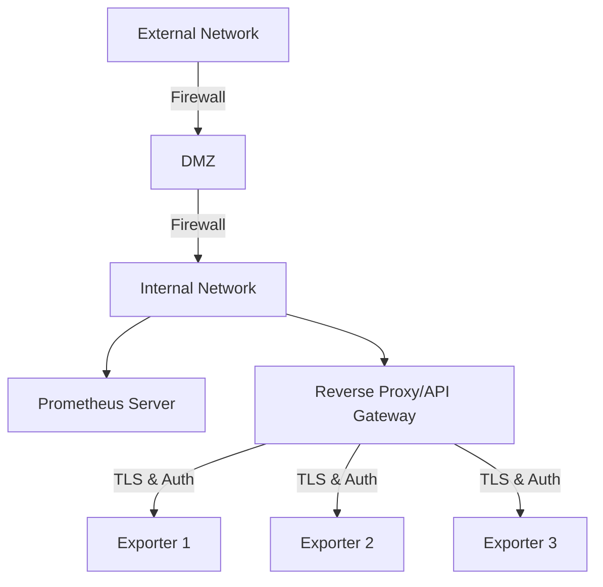

# Exporter Security Considerations

## Introduction

When implementing Prometheus exporters, security should be a top priority. Exporters serve as the bridge between your systems and Prometheus, exposing critical metrics about your infrastructure and applications. While this visibility is essential for monitoring, it also introduces potential security risks if not properly managed.

This guide explores the essential security considerations when implementing Prometheus exporters, helping you balance effective monitoring with robust security practices.

## Why Exporter Security Matters

Exporters can potentially expose sensitive information about your systems and services. Without proper security measures, this could lead to:

1. **Information Disclosure** - Metrics might reveal internal infrastructure details
2. **Unauthorized Access** - Weak authentication could allow unauthorized metric collection
3. **Denial of Service** - Unprotected exporters might be vulnerable to resource exhaustion
4. **Lateral Movement** - Compromised exporters could serve as entry points to other systems

## Authentication & Authorization

### Basic Authentication

Most Prometheus exporters support HTTP basic authentication. This is a simple but effective first layer of security.

```yaml
# prometheus.yml configuration with basic auth
scrape_configs:
  - job_name: 'node'
    basic_auth:
      username: 'prometheus'
      password: 'secure_password'
    static_configs:
      - targets: ['node-exporter:9100']
```

### Implementation Example

Here's how to enable basic authentication in a custom exporter using Go:

```go
package main

import (
	"crypto/subtle"
	"flag"
	"log"
	"net/http"

	"github.com/prometheus/client_golang/prometheus/promhttp"
)

func basicAuth(handler http.Handler, username, password string) http.Handler {
	return http.HandlerFunc(func(w http.ResponseWriter, r *http.Request) {
		user, pass, ok := r.BasicAuth()

		// Compare credentials using constant-time comparison
		userMatch := subtle.ConstantTimeCompare([]byte(user), []byte(username)) == 1
		passMatch := subtle.ConstantTimeCompare([]byte(pass), []byte(password)) == 1

		if !ok || !userMatch || !passMatch {
			w.Header().Set("WWW-Authenticate", `Basic realm="metrics"`)
			w.WriteHeader(http.StatusUnauthorized)
			w.Write([]byte("Unauthorized.
"))
			return
		}
		handler.ServeHTTP(w, r)
	})
}

func main() {
	var (
		listenAddress = flag.String("web.listen-address", ":9100", "Address to listen on for web interface and telemetry.")
		metricsPath   = flag.String("web.telemetry-path", "/metrics", "Path under which to expose metrics.")
		authUsername  = flag.String("web.auth.username", "", "Username for basic auth.")
		authPassword  = flag.String("web.auth.password", "", "Password for basic auth.")
	)
	flag.Parse()

	http.Handle(*metricsPath, promhttp.Handler())
	http.Handle("/", http.HandlerFunc(func(w http.ResponseWriter, r *http.Request) {
		w.Write([]byte(`<html>
			<head><title>Custom Exporter</title></head>
			<body>
			<h1>Custom Exporter</h1>
			<p><a href="` + *metricsPath + `">Metrics</a></p>
			</body>
			</html>`))
	}))

	handler := http.DefaultServeMux
	// If authentication credentials are provided, wrap with basic auth
	if *authUsername != "" && *authPassword != "" {
		handler = basicAuth(handler, *authUsername, *authPassword)
		log.Println("Basic authentication enabled")
	}

	log.Printf("Starting custom exporter on %s", *listenAddress)
	log.Fatal(http.ListenAndServe(*listenAddress, handler))
}
```

### TLS Client Authentication

For more sensitive environments, consider implementing TLS client authentication (mutual TLS):

```yaml
# prometheus.yml with TLS client authentication
scrape_configs:
  - job_name: 'secure-exporter'
    scheme: https
    tls_config:
      cert_file: /path/to/client.crt
      key_file: /path/to/client.key
      ca_file: /path/to/ca.crt
    static_configs:
      - targets: ['secure-exporter:9100']
```

## Network Security

### Firewall Rules

Always restrict access to your exporters using firewall rules. Only allow connections from your Prometheus servers.

Example using `iptables`:

```bash
# Allow access only from Prometheus server (192.168.1.10)
iptables -A INPUT -p tcp --dport 9100 -s 192.168.1.10 -j ACCEPT
# Drop all other connections to this port
iptables -A INPUT -p tcp --dport 9100 -j DROP
```

### Private Network Exposure

When possible, expose exporters only on private networks, not directly to the internet.

```yaml
# Configuration to bind only to internal interface
--web.listen-address=10.0.0.5:9100  # Internal IP only
```

### Using a Reverse Proxy

For additional security, consider placing exporters behind a reverse proxy like Nginx:

```nginx
# /etc/nginx/sites-available/exporter-proxy
server {
    listen 443 ssl;
    server_name metrics.example.com;

    ssl_certificate /etc/nginx/ssl/server.crt;
    ssl_certificate_key /etc/nginx/ssl/server.key;

    location / {
        auth_basic "Restricted";
        auth_basic_user_file /etc/nginx/.htpasswd;
        
        proxy_pass http://localhost:9100;
        proxy_set_header Host $host;
        proxy_set_header X-Real-IP $remote_addr;
    }
}
```

## Information Exposure

### Metric Filtering

Not all metrics are equal - some might contain sensitive information. Consider filtering metrics at the exporter level.

For node_exporter, you can use flags to control which collectors are enabled:

```bash
# Disable potentially sensitive collectors
./node_exporter --no-collector.processes --no-collector.filesystem
```

### Custom Exporters

When writing custom exporters, be careful about what information you expose:

```go
// GOOD: Exposing aggregate metrics
prometheus.MustRegister(prometheus.NewGaugeFunc(
    prometheus.GaugeOpts{
        Name: "users_total",
        Help: "Total number of users in the system",
    },
    func() float64 {
        return float64(getTotalUserCount())
    },
))

// BAD: Exposing sensitive user details
// Avoid exposing individual user data, especially PII
```

## Secure Deployment Architecture

A proper architecture for secure Prometheus exporters involves defense in depth:



## Vulnerability Management

### Regular Updates

Keep your exporters updated with the latest security patches:

```bash
# For exporters installed via package manager
apt update && apt upgrade prometheus-node-exporter

# For binary deployments, download the latest releases
curl -LO https://github.com/prometheus/node_exporter/releases/download/v1.5.0/node_exporter-1.5.0.linux-amd64.tar.gz
```

### Security Scanning

Regularly scan your exporters for vulnerabilities:

```bash
# Example using Trivy to scan a Docker image
trivy image prom/node-exporter:latest
```

## Least Privilege Principle

### Running as Non-Root

Exporters should run with the minimum privileges required:

```bash
# Create a dedicated user
useradd -rs /bin/false prometheus

# Run exporter as this user
sudo -u prometheus ./node_exporter
```

### Using Systemd

Secure your exporter services with systemd:

```ini
# /etc/systemd/system/node_exporter.service
[Unit]
Description=Prometheus Node Exporter
After=network.target

[Service]
User=prometheus
Group=prometheus
Type=simple
ExecStart=/usr/local/bin/node_exporter
Restart=on-failure
RestartSec=5

# Security hardening
ProtectSystem=full
ProtectHome=true
PrivateTmp=true
NoNewPrivileges=true

[Install]
WantedBy=multi-user.target
```

## Container Security

When running exporters in containers, apply additional security practices:

```yaml
# docker-compose.yml with security best practices
version: '3'
services:
  node-exporter:
    image: prom/node-exporter:latest
    container_name: node-exporter
    restart: unless-stopped
    user: "nobody:nogroup"  # Run as non-root
    read_only: true  # Read-only filesystem
    security_opt:
      - no-new-privileges:true
    ports:
      - "127.0.0.1:9100:9100"  # Only expose locally
    volumes:
      - /proc:/host/proc:ro
      - /sys:/host/sys:ro
      - /:/rootfs:ro
    command:
      - '--path.procfs=/host/proc'
      - '--path.sysfs=/host/sys'
      - '--path.rootfs=/rootfs'
      - '--web.listen-address=:9100'
```

## Auditing and Monitoring

### Enable Access Logs

Configure your exporters to log access attempts:

```bash
# Node exporter with logging
./node_exporter --web.log-level=info
```

### Monitor the Monitors

Set up alerts for suspicious behavior in your monitoring system:

```yaml
# prometheus-rules.yml
groups:
- name: exporter-security
  rules:
  - alert: ExporterHighRequestRate
    expr: rate(http_requests_total{handler="/metrics"}[5m]) > 10
    for: 5m
    labels:
      severity: warning
    annotations:
      summary: "High request rate to exporter metrics"
      description: "Exporter {{ $labels.instance }} is receiving an unusually high number of requests."
```

## Common Security Pitfalls

### Misconfiguration Examples

Here are common security mistakes to avoid:

1. **Public Internet Exposure**
   ```bash
   # DON'T: Expose to all interfaces without authentication
   ./node_exporter --web.listen-address=0.0.0.0:9100
   ```

2. **Hardcoded Credentials**
   ```go
   // DON'T: Hardcode credentials in your exporter code
   const username = "admin"
   const password = "password123"
   ```

3. **Running as Root**
   ```bash
   # DON'T: Run exporters with excessive privileges
   sudo ./node_exporter
   ```

4. **Insecure Defaults**
   ```bash
   # DON'T: Rely on default configurations without reviewing security implications
   ./custom_exporter
   ```

## Best Practices Summary

1. **Authentication** - Implement basic auth or mTLS for all exporters
2. **Network Protection** - Use firewalls and private networks
3. **TLS Encryption** - Enable HTTPS for all exporter endpoints
4. **Least Privilege** - Run exporters as non-root users with minimal permissions
5. **Information Control** - Filter sensitive metrics
6. **Regular Updates** - Keep exporters and dependencies patched
7. **Monitoring** - Log and alert on suspicious access patterns
8. **Defense in Depth** - Implement multiple security layers

## Practical Exercise: Securing a Node Exporter

Let's walk through securing a typical node_exporter installation:

1. **Create a dedicated user**
   ```bash
   sudo useradd -rs /bin/false node_exporter
   ```

2. **Install the exporter with proper permissions**
   ```bash
   sudo tar -xzf node_exporter-1.5.0.linux-amd64.tar.gz
   sudo cp node_exporter-1.5.0.linux-amd64/node_exporter /usr/local/bin/
   sudo chown node_exporter:node_exporter /usr/local/bin/node_exporter
   ```

3. **Create a systemd service with security constraints**
   ```bash
   sudo vim /etc/systemd/system/node_exporter.service
   # Add the configuration shown in the Systemd section above
   sudo systemctl daemon-reload
   sudo systemctl enable --now node_exporter
   ```

4. **Configure firewall rules**
   ```bash
   sudo ufw allow from 10.0.0.5 to any port 9100 proto tcp
   ```

5. **Set up a reverse proxy with TLS**
   ```bash
   # Install Nginx
   sudo apt install nginx
   
   # Generate certificates (or use Let's Encrypt)
   sudo openssl req -x509 -nodes -days 365 -newkey rsa:2048 \
     -keyout /etc/nginx/ssl/exporter.key \
     -out /etc/nginx/ssl/exporter.crt
   
   # Configure Nginx as shown in the reverse proxy section
   sudo systemctl restart nginx
   ```

6. **Configure Prometheus to use secure scraping**
   ```yaml
   # In prometheus.yml
   scrape_configs:
     - job_name: 'node'
       scheme: https
       basic_auth:
         username: 'prometheus'
         password: 'secure_password'
       tls_config:
         ca_file: /etc/prometheus/certs/ca.crt
         server_name: metrics.example.com
       static_configs:
         - targets: ['metrics.example.com']
   ```

## Additional Resources

- [Prometheus Security Documentation](https://prometheus.io/docs/operating/security/)
- [OWASP Secure Configuration Guide](https://owasp.org/www-project-secure-configuration-guide/)
- [CIS Benchmarks](https://www.cisecurity.org/cis-benchmarks/)
- [Node Exporter GitHub Repository](https://github.com/prometheus/node_exporter)

## Summary

Security for Prometheus exporters requires a multi-layered approach. By implementing proper authentication, encryption, network controls, and following the principle of least privilege, you can significantly reduce the risk of security incidents while maintaining effective monitoring.

Remember that security is not a one-time task but an ongoing process. Regularly review your exporter configurations, keep your software updated, and stay informed about new security best practices and vulnerabilities.